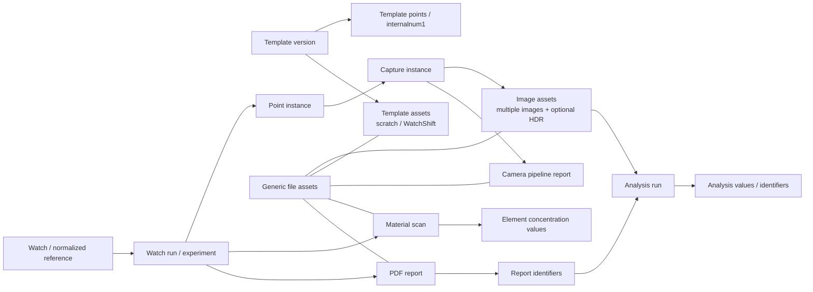
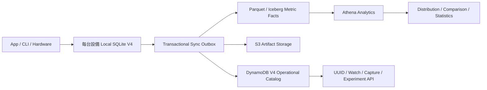

|                                   |     |
| --------------------------------- | --- |
| [[#### 整理all files 連結 Database]]  |     |
| [[#### 整理all files 連結 Database2]] |     |
| [[#### database支援上萬watch?]]       |     |
|                                   |     |

#### 整理all files 連結 Database
```
**

之前有整理了這個App main.py如果有儲存images or 其他files有包括1. 正式拍攝影像, 2. 分析結果, 3. Camera pipeline TXT 報告, 4. Template 建立影像, 5. WatchShift 參考影像, 6. Material／XRF 檔案, 7. PDF 與報告檔, 8. SQLite 資料庫, 9. Log 與稽核檔案, 10. 其他零散輸出與快取, 及yaml files.

請幫我整理這些檔案的data or index等有哪些會存入local DB方便我們管理所有的files跟後續的分析譬如:

尋找某個uuid的image file是屬於哪個watchid, 是屬於哪個template, 是甚麼時候拍的, 是哪個watchpoint, 以及跟這個uuid相關的analysis結果是存在哪裡哪個experiment? 跟這個uuid相關的analysis結果的某個結果數值value? 跟這個uuid相關的pdf report的identifier是哪一個? 有哪個另外的uuid跟這個同屬於同一次拍照, 有哪個另外的uuid跟這個同屬於同個watchpoint?, 有哪個另外的uuid跟這個同屬於同個reference number? 跟這個uuid相關的watchpoint不同capture的uuid是? 找到所有屬於同個reference number的所有這個watchpoint的uuid, 找到所有屬於同個watchpoint的所有的uuid, 找到找到所有屬於同個reference number的所有這個watchpoint且authentication是真品的uuid

Analysis\Exp_YYYYMMDD_HHMMSS_<8字元ID>有包含哪些analysis results, analysis結果的某個結果數值value? 跟這個uuid相關的pdf report的某個analysis的identifier是哪一個? 這個experiment是從哪一次watchid來的? 是從哪個template? 這個watchid還有沒有其他experiments, 找到所有屬於同個reference number的所有這個watchpoint的uuid, 找到所有屬於同個analysis result的所有的uuid, 找到找到所有屬於同個reference number的所有這個analysis result且authentication是真品的values, 要對這個experiment裡面某個analysis找到所有相關values的distribution.

要怎麼找到Camera pipeline TXT 報告是屬於哪次拍照, 是屬於哪個template建立的, 其中的某個數值譬如拍照的exposure

尋找某個template是屬於哪個reference number, 以及用在哪個watchid, 是甚麼時候建立的, 跟哪些watchpoint有關, 以及跟這個template相關的analysis結果是存在哪裡哪個experiment? 跟這個template相關的analysis結果的某個結果數值value? 有哪個另外的template跟這個同屬於同個reference number? 找到所有屬於同個template的所有這個watch scan

是否有儲存WatchShift 參考影像相關index在database裡面

關於material data是屬於哪一次scan? 是屬於哪個reference number? 跟同個reference number的material values是否能比較不同的成分組成%? 跟同個reference number的material values是否能比較分析特定成分%?

能否找到pdf file是從哪次watch scan? 這個pdf file是屬於哪種reference number? pdf file裡面的某個數值是甚麼? pdf file裡面某數值跟另外一份pdf file數值的比較

local DB能否查詢裡面有哪些種類跟內容? 譬如有哪些template? 有哪些watch scan?

以及還有甚麼是local DB有儲存的

**
```

## 結論

我檢查了實際的 [watchDB.db](/D:/Provenance Laboratories projects/ImagingLibWatch/DB/watchDB.db)、DB schema、App 拍攝流程、analysis、WatchShift、material、PDF 與 template 程式碼。

目前 Local DB 已經有不錯的拍攝階層：

```
watch_runs
  → point_instances
    → capture_instances
      → image_assets
```

所以「影像屬於哪個 WatchID、哪個 template、哪次 run、哪個 watchpoint、哪個 capture」大致可查。

但以下關聯目前尚未完整資料庫化：

- image UUID → analysis result
- analysis result → experiment
- analysis value 的結構化查詢與 distribution
- image／analysis → PDF report identifier
- material/XRF 的 scan 與 element values
- Camera Pipeline TXT 作為獨立 file asset
- Template 建立影像
- WatchShift reference image 的完整 file index
- log、YAML、cache、零散輸出的通用 file registry
- reference number／authentication 的可靠索引

因此答案是：目前可以做「部分追溯」，但還不能可靠管理所有 files 與後續跨 scan 分析。

## 實際 Local DB 內容

目前 DB 約 359 MB，資料量如下：

|Table|筆數|用途|
|---|---|---|
|`watch_runs`|1,371|每次 watch scan／run、WatchID、template|
|`point_instances`|4,861|該 run 執行過的 watchpoint|
|`capture_instances`|3,471|watchpoint 下的 standard/HDR capture|
|`image_assets`|3,471|新版影像 asset|
|`raw_images`|7,182|舊版影像紀錄／S3 sync queue|
|`experiment_results`|9,813|舊版 analysis、PDF、Final Report|
|`analysis_results_v2`|0|新版 image→analysis 關聯表，目前沒有實際資料|
|`ui_asset_registry`|6,215|App UI 顯示用的最新 image/result path|
|`local_templates`|21|Template 完整 JSON|
|`watch_metadata`|113|WatchID、Brand、Model、Reference、完整 WatchEntry JSON|
|`watch_registry`|0|目前未實際使用|
|`users`|5|Local login cache|

Schema 定義在 [db_manager.py (line 54)](/D:/Provenance Laboratories projects/ImagingLibWatch/DB/db_manager.py:54)。

另外有幾個重要資料品質現況：

- 1,371 個 `watch_runs` 全部仍是 `running`。
- 3,471 個 `capture_instances` 全部仍是 `processing`。
- 3,471 個 capture 每個都只有一筆 `image_assets`。
- `image_assets` 包含：
    - `raw_single`：3,237
    - `hdr_fused`：234
    - `raw_bracket`：0
- 目前實際上還沒有做到一個 capture 對多張 bracket image。
- 140 個有 run 的 WatchID 中，只有 110 個能 join 到 `watch_metadata`。
- 只有 7 個 run WatchID 有非空的 Reference。
- 只有 405／1,371 個 run 能精確對上相同 TemplateID＋version。

App 拍攝流程目前只註冊一個 `raw_single` 或 `hdr_fused`，而且固定 `asset_index=0`，見 [main.py (line 27242)](/D:/Provenance Laboratories projects/ImagingLibWatch/App/main.py:27242)。

## 十類檔案目前是否有 DB index

|檔案類型|目前 DB 狀態|結論|
|---|---|---|
|1. 正式拍攝影像|`image_assets`＋`raw_images`|有，但存在雙寫與兩種 ID|
|2. Analysis 結果|`experiment_results`|有 path/task/data，但 image 關聯多數缺失|
|3. Camera Pipeline TXT|path 藏在 `image_assets.metadata`|部分有，TXT 本身不是 asset row|
|4. Template 建立影像|`TemplateScratch` filesystem|沒有正式 DB index|
|5. WatchShift reference|Template JSON 的 flags＋manifest|部分有，沒有獨立 asset table|
|6. Material／XRF|WatchEntry JSON／`material_records.json`|沒有 dedicated DB table|
|7. PDF／報告|`experiment_results` 的 `Auto_PDF_Report`|有 PDF path，但缺 report lineage|
|8. SQLite DB|`DB/watchDB.db`|本體|
|9. Log／稽核|`Local_Data/audit_logs/*.jsonl`|不在 DB|
|10. 其他輸出／快取|filesystem|沒有 generic file catalog|
|YAML|部分 analysis API 支援，template process YAML 不入 DB|實際 DB 目前沒有 `data_yaml` rows|

Audit log 是獨立 JSONL hash chain，不寫 SQLite，見 [audit_logger.py (line 98)](/D:/Provenance Laboratories projects/ImagingLibWatch/logging_system/audit_logger.py:98)。

## Image UUID 的實際問題

正式 image filename 使用 32 字元 UUID，例如：

```
1b71bfcc4f604c51b35d081fb2c0e4d9.png
```

這個 UUID 由 [local_storage.py (line 263)](/D:/Provenance Laboratories projects/ImagingLibWatch/data_manager/local_storage.py:263) 產生，並放在：

```
image_assets.metadata["asset_id"]
```

但 `image_assets.asset_id` 本身卻是另一個 ID：

```
ast_504d394de793
```

所以現在同一張 image 有至少三種識別方式：

- file UUID：`1b71bf...`
- DB asset ID：`ast_504d...`
- legacy `raw_images.id`：SQLite integer

此外，同一張 image 會先寫一次 `raw_images`，註冊 `image_assets` 時又雙寫一次 `raw_images`。目前：

- `raw_images`：7,182 rows
- 實際不同 path：3,711
- 有 3,471 個 path 各出現兩次

雙寫邏輯位於 [db_manager.py (line 144)](/D:/Provenance Laboratories projects/ImagingLibWatch/DB/db_manager.py:144)。

### 目前由 UUID 查 image lineage

可以使用：

```
WITH target AS (
    SELECT
        a.*,
        LOWER(json_extract(a.metadata, '$.asset_id')) AS file_uuid
    FROM image_assets a
    WHERE LOWER(json_extract(a.metadata, '$.asset_id')) = LOWER(:uuid)
)
SELECT
    t.file_uuid,
    t.asset_id,
    t.local_path,
    t.s3_key,
    t.watchid,
    t.run_id,
    r.template_id,
    r.template_version,
    datetime(t.created_at, 'unixepoch', 'localtime') AS captured_at,
    p.view_name,
    p.point_name,
    p.internalnum1,
    c.capture_id,
    c.internalnum2,
    c.capture_type,
    m.Reference
FROM target t
LEFT JOIN capture_instances c
       ON c.capture_instance_id = t.capture_instance_id
LEFT JOIN point_instances p
       ON p.point_instance_id = c.point_instance_id
LEFT JOIN watch_runs r
       ON r.run_id = t.run_id
LEFT JOIN watch_metadata m
       ON m.WatchID = t.watchid;
```

這可以回答：

- 哪個 WatchID
- 哪個 TemplateID/version
- 拍攝時間
- view／watchpoint
- standard 或 HDR
- capture ID
- Reference，如果 `watch_metadata.Reference` 有值

## 同一次拍照、同一 watchpoint、同 Reference 的 UUID

### 同一次 capture

結構上可以：

```
SELECT peer.*
FROM image_assets target
JOIN image_assets peer
  ON peer.capture_instance_id = target.capture_instance_id
WHERE LOWER(json_extract(target.metadata, '$.asset_id')) = LOWER(:uuid);
```

但目前每個 capture 都只有一個 `image_assets`，因此通常找不到「另外的 UUID」。

未來 HDR 應該是：

```
capture_instance_id
  ├─ raw_bracket index 0
  ├─ raw_bracket index 1
  ├─ raw_bracket index 2
  └─ hdr_fused
```

### 同一個 watchpoint

建議優先用：

```
watchid + internalnum1
```

次要 fallback 才是：

```
watchid + view_name + point_name
```

但目前只有 81／3,471 個 image asset 有非空 `internalnum1`，所以大多只能依靠 view/point 名稱。

### 同 Reference 的同一 watchpoint

可以 join：

```
image_assets.watchid
→ watch_metadata.WatchID
→ watch_metadata.Reference
```

但目前 Reference coverage 很低，而且存在 `16613T`、`16613 T` 等格式差異，因此正式查詢前應增加 `reference_normalized`。

### Authentication＝真品

Authentication 現在藏在：

```
watch_metadata.Full_JSON
  → watchauthenticity.EntireWatch
  → watchauthenticity.<component>
```

但實際 113 筆 watch metadata 中，沒有任何非空 `EntireWatch`。所以目前不能可靠執行：

> 同 Reference＋同 watchpoint＋authentication 為真品的 UUID

Authentication 結構定義在 [watchauthenticity_structure.py (line 8)](/D:/Provenance Laboratories projects/ImagingLibWatch/DB/templates/watchauthenticity_structure.py:8)，但需要真正存入 DB 並改成標準 enum，例如：

```
AUTHENTIC
NOT_AUTHENTIC
INCONCLUSIVE
NOT_EVALUATED
```

而不是自由文字 `"Authentic"`、`"Full authenticity confirmed"` 等。

## Image UUID 與 Analysis 的關係

這是目前最大的斷點。

`experiment_results` 有 9,813 rows，但：

- `raw_image_id` 非 NULL：425
- `raw_image_id` 為 NULL：9,388
- 425 筆只對應 31 個 raw image ID
- 新版 `analysis_results_v2`：0 rows

App 主分析流程明確把 `raw_image_id=None` 寫入，見 [main.py (line 22571)](/D:/Provenance Laboratories projects/ImagingLibWatch/App/main.py:22571)。

雖然 3,409 個 analysis rows 的 JSON blob 中可搜尋到 raw UUID，但那是文字推導，不是可索引 foreign key。

因此：

|問題|目前能力|
|---|---|
|UUID 相關的 analysis 在哪個 experiment|部分可從 JSON/path 推導，不可靠|
|UUID 相關的某個 analysis value|JSON 有值時可抽，但沒有可靠 image FK|
|所有屬於同 analysis result 的 UUID|無法可靠完成|
|對某 analysis value 做 distribution|可以離線解析，但 DB SQL 會重複計數|
|image → analysis_results_v2|理論上可以，實際 table 為空|

另一個問題是 analysis report data 的放置方式：

- 大部分 `data_json` row 的 `data` 是 `{}`。
- 完整 analysis JSON 反而重複存放在數個 `image_mask` rows。
- 相同 payload 會因為多個輸出圖而重複。

因此直接對 `experiment_results.data` 做 distribution 會產生重複樣本。

## Experiment 關係

實際 analysis path 中找到 119 個：

```
Exp_YYYYMMDD_HHMMSS_<8-char>
```

其中：

- 114 個可對上 `watch_runs.run_id`
- 5 個沒有相對應的 `watch_runs`

當可以對上時，能得到：

```
experiment/run
→ WatchID
→ TemplateID/version
→ point/capture/image
```

但 `experiment_results` 本身沒有 `experiment_id` 或 `run_id` 欄位，只能由 `local_path` 解析。

目前可暫時查：

```
SELECT
    er.*,
    wr.watchid,
    wr.template_id,
    wr.template_version,
    wm.Reference
FROM experiment_results er
LEFT JOIN watch_runs wr
       ON wr.run_id = :experiment_id
LEFT JOIN watch_metadata wm
       ON wm.WatchID = wr.watchid
WHERE instr(
    replace(er.local_path, '/', '\'),
    '\Analysis\' || :experiment_id || '\'
) > 0;
```

某個 value 可以用：

```
SELECT DISTINCT
    watchid,
    json_extract(data, '$.metrics.bump_density') AS value
FROM experiment_results
WHERE task_name = :analysis_name
  AND data <> '{}'
  AND json_extract(data, '$.metrics.bump_density') IS NOT NULL;
```

但目前只能算「探索性查詢」，不適合正式統計，因為缺少 `analysis_run_id` 與 `source_asset_uuid`，且 payload 有重複。

程式已有各 analysis identifier/value path mapping，例如 `metrics.bump_density`、`metrics.feature_area`、OCR、lume、crown 等，見 [report_identifiers.py (line 4)](/D:/Provenance Laboratories projects/ImagingLibWatch/core/report_identifiers.py:4)。這些 mapping 很適合拿來建立 normalized `analysis_values` table。

## Camera Pipeline TXT

Camera Pipeline TXT 內容包含：

- watchpoint
- capture parameters
- exposure
- gain/light settings
- autofocus/HDR config
- output image path
- raw image ID
- S3 key
- run ID／experiment ID

Payload 定義在 [camera_pipeline_report.py (line 91)](/D:/Provenance Laboratories projects/ImagingLibWatch/core/camera_pipeline_report.py:91)。

目前 TXT path 存在：

```
image_assets.metadata.camera_pipeline_report_path
```

實際 coverage：

- 568／3,471 image assets 有 TXT path
- exposure 則 3,471／3,471 都已存在 `image_assets.metadata.exposure`
- 同時也可從 `point_instances.hardware_cfg.exposure` 查 template/hardware 原始設定

查詢：

```
SELECT
    json_extract(metadata, '$.asset_id') AS file_uuid,
    watchid,
    run_id,
    view_name,
    point_name,
    capture_id,
    json_extract(metadata, '$.camera_pipeline_report_path') AS txt_path,
    json_extract(metadata, '$.exposure') AS actual_exposure
FROM image_assets
WHERE LOWER(json_extract(metadata, '$.asset_id')) = LOWER(:uuid);
```

缺點是 TXT 沒有自己的 UUID、hash、size、S3 key 或獨立 asset row。

## Template

`local_templates` 已保存：

- TemplateID
- version
- Reference
- Brand/Model
- watchView/watchpoints
- hardware/capture conditions
- material scan point設定
- WatchShift flags/manifest
- updated_at

Template model 見 [template_structure.py (line 21)](/D:/Provenance Laboratories projects/ImagingLibWatch/DB/templates/template_structure.py:21)。

可以查 template 用在哪些 scans：

```
SELECT
    t.TemplateID,
    t.version,
    json_extract(t.data, '$.Reference') AS Reference,
    datetime(t.updated_at, 'unixepoch', 'localtime') AS updated_at,
    r.run_id,
    r.watchid,
    datetime(r.started_at, 'unixepoch', 'localtime') AS scan_started_at
FROM local_templates t
LEFT JOIN watch_runs r
       ON r.template_id = t.TemplateID
WHERE t.TemplateID = :template_id;
```

限制：

- 只有 `updated_at`，沒有可靠 `created_at`。
- App 建立 run 時常未傳正確 template version，因此預設成 `v1`。
- TemplateScratch images 沒有 dedicated index。
- Template → analysis 仍需經過 run，再由 analysis path 推導 experiment。

Template 建立影像目前寫到：

```
Local_Data/<TemplateID>/TemplateScratch/
```

見 [main.py (line 5224)](/D:/Provenance Laboratories projects/ImagingLibWatch/App/main.py:5224)，但不會註冊到 SQLite。

## WatchShift reference

目前有部分 index：

```
local_templates.data.watchshift_images
local_templates.data.watchshift_image_manifest
```

21 個 templates 中：

- 8 個有 WatchShift flags
- 8 個有非空 manifest

Manifest 包含：

- template_id
- view_name
- S3 key
- bucket
- etag
- version ID（如果 S3 有）
- updated_at

Manifest 定義在 [internalnum_config.py (line 1725)](/D:/Provenance Laboratories projects/ImagingLibWatch/DB/templates/internalnum_config.py:1725)。

但 reference image 沒有獨立 DB asset；local path 是依規則推導：

```
DB/watchshift/<TemplateID>/<View>.toppoint1.png
```

每次 scan 的 WatchShift 計算結果則寫成：

```
Analysis/<ExpID>/watchshift_<View>.json
```

見 [main.py (line 3511)](/D:/Provenance Laboratories projects/ImagingLibWatch/App/main.py:3511)，通常沒有註冊進 `experiment_results`。

所以答案是：有 template-level manifest，但沒有完整的 WatchShift file/run-level index。

## Material／XRF

目前 Material CSV 解析內容很完整，包括：

- source file/path
- scan part
- scan mode
- instrument metadata
- alloy
- gold plated／karat
- element
- concentration %
- error %
- raw values

結構見 [material_structure.py (line 78)](/D:/Provenance Laboratories projects/ImagingLibWatch/DB/templates/material_structure.py:78)。

Material session JSON 也會記：

- WatchID
- ExpID
- material CSV folder
- records
- element values

但它只寫到：

```
Analysis/<ExpID>/material_records.json
```

見 [main.py (line 23665)](/D:/Provenance Laboratories projects/ImagingLibWatch/App/main.py:23665)，沒有 dedicated DB insert。

資料也會暫時放到 `current_watchentry.watchmaterial` 與 `material_results_by_internalnum`，見 [material_reader.py (line 576)](/D:/Provenance Laboratories projects/ImagingLibWatch/algorithms/material_reader.py:576)；只有後續成功存 Final Report 時才可能進 JSON blob。

實際 DB 現況：

- 113 個 `watch_metadata` 沒有任何已填 material data
- 139 個 Final Report 沒有任何非空 `material_results_by_internalnum`
- 沒有 `material_scans` 或 `material_values` table

因此目前無法直接用 SQL：

- 比較同 Reference 的組成 %
- 比較不同 scan 的 Au、Fe、Ni 等成分
- 取得某元素的 distribution

## PDF 與 report identifier

目前 DB 有 15 個 PDF rows：

```
task_name = Auto_PDF_Report
result_type = data_pdf
```

保存：

- WatchID
- PDF path
- generated_at
- source

註冊程式見 [main.py (line 24438)](/D:/Provenance Laboratories projects/ImagingLibWatch/App/main.py:24438)。

問題是：

- 沒有 `report_id` 欄位
- 沒有 experiment ID
- 沒有 template ID
- 沒有 source image/analysis link
- PDF 裡的數值沒有寫成 DB values
- report identifier JSON 檔沒有註冊到 DB
- PDF 顯示的 `report_id` 目前是 hard-coded `"5473454756"`，見 [main.py (line 28248)](/D:/Provenance Laboratories projects/ImagingLibWatch/App/main.py:28248)

PDF filename 的 8 字元 suffix 雖然可以暫時當 file identifier，但不是正式 report ID。

因此：

- PDF → WatchID：可以
- PDF → Reference：需再 join `watch_metadata`，而 Reference coverage 很低
- PDF → experiment/image/analysis：目前不可靠
- 比較兩份 PDF 裡的數值：必須重讀 PDF 或 `report_identifiers_*.json`，不能直接由 DB 查

## 建議的目標資料模型

應保留現有表以維持 App／CLI／cloud 相容，再 add-only 增加以下結構：

````

````

最少需要新增：

1. `file_assets`
    
    - `file_uuid`
    - `file_type`
    - `local_path`
    - `s3_key`
    - `sha256`
    - `mime_type`
    - `byte_size`
    - `created_at`
    - `metadata_json`
2. `experiments`
    
    - `experiment_id`
    - `run_id`
    - `analysis_dir`
    - `started_at`
    - `completed_at`
    - `status`
3. `analysis_runs`
    
    - `analysis_run_id`
    - `experiment_id`
    - `source_asset_uuid`
    - `algorithm_name`
    - `algorithm_version`
    - `result_document_asset_uuid`
    - `created_at`
4. `analysis_values`
    
    - `analysis_run_id`
    - `identifier_key`
    - `value_path`
    - `value_numeric`
    - `value_text`
    - `unit`
    - `ordinal`
    - `passed`
5. `reports`＋`report_analysis_links`
    
    - 正式 `report_id`
    - PDF file UUID
    - run/experiment/template/reference snapshot
    - 關聯 analysis run／identifier
6. `material_scans`＋`material_values`
    
    - scan ID
    - run／watchpoint／internalnum1
    - source CSV asset
    - element
    - concentration %
    - error %
    - unit
7. `template_assets`
    
    - TemplateID/version
    - view/point
    - asset type：scratch、WatchShift reference、calibration
8. `authenticity_assessments`
    
    - scope：watch/component/point/analysis
    - normalized status
    - source analysis/report
    - evaluated_at

## 必要 indexes

建議至少增加：

```
file_assets(file_uuid) UNIQUE
file_assets(local_path) UNIQUE
file_assets(sha256)

watch_runs(watchid, started_at)
watch_runs(template_id, template_version, started_at)

point_instances(run_id, internalnum1)
point_instances(watchid, view_name, point_name)

capture_instances(point_instance_id, internalnum2)
capture_instances(run_id, capture_id)

image_assets(file_uuid) UNIQUE
image_assets(capture_instance_id, asset_role, asset_index)
image_assets(watchid, internalnum1, internalnum2)

experiments(run_id, experiment_id)
analysis_runs(source_asset_uuid, algorithm_name)
analysis_runs(experiment_id, algorithm_name)
analysis_values(identifier_key, value_numeric)
analysis_values(analysis_run_id, identifier_key)

watch_metadata(reference_normalized)
material_scans(run_id, internalnum1)
material_values(element, concentration_percent)

reports(run_id, report_id)
report_analysis_links(report_id, analysis_run_id)
```

並應啟用真正的 foreign keys；目前現有 schema 沒有任何 FK constraint。

## 建議實作順序

為維持舊 App、CLI、DB、S3、DynamoDB 與報告相容，建議：

1. 先統一 `file_uuid`，保留原 `asset_id` 和 legacy integer ID。
2. 新增 `file_assets`，回填正式 image、analysis、PDF、TXT、WatchShift、material、template files。
3. 新增 explicit `experiment_id` 與 `analysis_run_id`。
4. 將 analysis identifiers/value mappings 寫入 `analysis_values`。
5. 新增 material/report tables。
6. 建立 compatibility views，讓舊 `raw_images`／`experiment_results` 繼續可用。
7. 修改 dual-write，避免同一 image path 重複兩筆 `raw_images`。


#### 整理all files 連結 Database2
```
之前有整理了這個App main.py如果有儲存images or 其他files有包括1. 正式拍攝影像, 2. 分析結果, 3. Camera pipeline TXT 報告, 4. Template 建立影像, 5. WatchShift 參考影像, 6. Material／XRF 檔案, 7. PDF 與報告檔, 8. SQLite 資料庫, 9. Log 與稽核檔案, 10. 其他零散輸出與快取, 及yaml files.

請幫我整理這些檔案的data or index等有哪些會存入local DB方便我們管理所有的files跟後續的分析譬如:

尋找某個uuid的image file是屬於哪個watchid, 是屬於哪個template, 是甚麼時候拍的, 是哪個watchpoint, 以及跟這個uuid相關的analysis結果是存在哪裡哪個experiment? 跟這個uuid相關的analysis結果的某個結果數值value? 跟這個uuid相關的pdf report的identifier是哪一個? 有哪個另外的uuid跟這個同屬於同一次拍照, 有哪個另外的uuid跟這個同屬於同個watchpoint?, 有哪個另外的uuid跟這個同屬於同個reference number? 跟這個uuid相關的watchpoint不同capture的uuid是? 找到所有屬於同個reference number的所有這個watchpoint的uuid, 找到所有屬於同個watchpoint的所有的uuid, 找到找到所有屬於同個reference number的所有這個watchpoint且authentication是真品的uuid

Analysis\Exp_YYYYMMDD_HHMMSS_<8字元ID>有包含哪些analysis results, analysis結果的某個結果數值value? 跟這個uuid相關的pdf report的某個analysis的identifier是哪一個? 這個experiment是從哪一次watchid來的? 是從哪個template? 這個watchid還有沒有其他experiments, 找到所有屬於同個reference number的所有這個watchpoint的uuid, 找到所有屬於同個analysis result的所有的uuid, 找到找到所有屬於同個reference number的所有這個analysis result且authentication是真品的values, 要對這個experiment裡面某個analysis找到所有相關values的distribution.

要怎麼找到Camera pipeline TXT 報告是屬於哪次拍照, 是屬於哪個template建立的, 其中的某個數值譬如拍照的exposure

尋找某個template是屬於哪個reference number, 以及用在哪個watchid, 是甚麼時候建立的, 跟哪些watchpoint有關, 以及跟這個template相關的analysis結果是存在哪裡哪個experiment? 跟這個template相關的analysis結果的某個結果數值value? 有哪個另外的template跟這個同屬於同個reference number? 找到所有屬於同個template的所有這個watch scan

是否有儲存WatchShift 參考影像相關index在database裡面

關於material data是屬於哪一次scan? 是屬於哪個reference number? 跟同個reference number的material values是否能比較不同的成分組成%? 跟同個reference number的material values是否能比較分析特定成分%?

能否找到pdf file是從哪次watch scan? 這個pdf file是屬於哪種reference number? pdf file裡面的某個數值是甚麼? pdf file裡面某數值跟另外一份pdf file數值的比較

local DB能否查詢裡面有哪些種類跟內容? 譬如有哪些template? 有哪些watch scan? 以及還有甚麼是local DB有儲存的. 請幫我設計提供建議先不要改code 及修改database能夠有以上功能性可以進行那些查詢跟分析, 這database也要跟AWS D做同步
```
目前 local SQLite **只能部分支援**你列出的查詢。近期正式拍攝的「watch → run → watchpoint → capture → image」已有雛形，但還不能可靠地從任意 UUID 一路追到 analysis、experiment、PDF、material、authentication 與 AWS。

本次只做唯讀盤點，**沒有修改任何 code 或 database**；目前 Git working tree 也沒有新增變更。

### 最重要的現況問題

1. 檔案 UUID 與 DB `asset_id` 是兩套 ID  
    3,472 筆 `image_assets.asset_id` 都是 `ast_xxx`，沒有一筆等於影像檔名 UUID。真正的檔名 UUID 藏在 `metadata.asset_id` JSON 裡，且沒有索引。
    
2. 新 analysis 關聯表完全沒有資料  
    `analysis_results_v2 = 0`；9,813 筆結果仍在舊 `experiment_results`。
    
3. 9,813 筆分析結果中，9,388 筆沒有 `raw_image_id`  
    只有 425 筆 `sidepoint_service` 有直接 source-image 關聯。因此多數「UUID → analysis」只能靠路徑、檔名或 JSON 猜測。
    
4. 沒有正式的 `experiments` table  
    `Exp_YYYYMMDD...` 目前主要只是資料夾名稱。App 某條路徑會讓 `run_id = exp_id`，另一條 workflow 路徑則把兩者分開，所以不能視為穩定 contract。[App/main.py (line 34376)](/D:/Provenance Laboratories projects/ImagingLibWatch/App/main.py:34376)、[core/workflow_manager.py (line 479)](/D:/Provenance Laboratories projects/ImagingLibWatch/core/workflow_manager.py:479)
    
5. 狀態沒有結束  
    1,372 筆 `watch_runs` 全是 `running`；3,472 筆 `capture_instances` 全是 `processing`。
    
6. `reference number`、authentication 與 internalnum 覆蓋率很低  
    只有 82/3,472 個 image assets 有 `internalnum1/2`；只有 232 個 image assets 能 join 到有 Reference 的 watch metadata。113 個 `watch_metadata` 中只有 8 筆有 Reference，且目前沒有實際 authentication identifier snapshot。
    
7. 很多檔案完全沒有進 DB  
    TemplateScratch、material JSON、WatchShift reference file、identifier JSON、camera TXT 本身、audit/runtime logs、run YAML、部分 PDF 都沒有統一 asset row。
    
8. AWS 同步不是通用同步  
    worker 只直接輪詢舊 `raw_images`、`experiment_results`；`add_to_queue()` 本身是 no-op。[DB/db_manager.py (line 412)](/D:/Provenance Laboratories projects/ImagingLibWatch/DB/db_manager.py:412)、[data_manager/cloud_sync.py (line 74)](/D:/Provenance Laboratories projects/ImagingLibWatch/data_manager/cloud_sync.py:74)
    
9. 設定檔內有明文 AWS 長期憑證  
    建議立即撤銷、輪替，改用 IAM role／environment／Secrets Manager，並清除 Git 歷史中的舊值。此項優先級高於 DB refactor。
    

---

## 實際 SQLite 盤點

目前 [watchDB.db](/D:/Provenance Laboratories projects/ImagingLibWatch/DB/watchDB.db) 約 343 MiB，`integrity_check=ok`，但：

- `PRAGMA user_version = 0`
- 沒有 migration version
- 沒有宣告任何 foreign key
- `foreign_keys=OFF`
- journal mode 為 `DELETE`

|Table|筆數|現況|
|---|---|---|
|`raw_images`|7,185|舊影像 index；包含雙寫重複|
|`experiment_results`|9,813|主要分析、entry、PDF 資料|
|`watch_runs`|1,372|run/template 關聯，但全為 running|
|`point_instances`|4,862|run 中的 watchpoint|
|`capture_instances`|3,472|capture group，但全為 processing|
|`image_assets`|3,472|新影像表|
|`analysis_results_v2`|0|schema 存在但沒有實際資料|
|`local_templates`|23|template JSON cache|
|`watch_metadata`|113|watch 基本資料及完整 JSON|
|`ui_asset_registry`|6,218|UI 最新顯示檔案，會覆蓋歷史|
|`users`|8|local account cache|
|`watch_registry`|0|未實際使用|

建表與雙寫邏輯在 [DB/db_manager.py (line 54)](/D:/Provenance Laboratories projects/ImagingLibWatch/DB/db_manager.py:54)。

另外，3,472 個 V3 image path 在 `raw_images` 都被再登錄一次，因此舊表出現一份 capture 兩筆相同路徑的情況。

---

## 目前各類檔案能否查詢

|類別|現況|
|---|---|
|正式拍攝影像|部分可查。可經 `image_assets` 找 watch/run/view/point/capture/time，但檔名 UUID 藏在 JSON|
|Analysis results|不完整。結果在舊表，95.7% 沒有 source raw FK；V2 表為空|
|Camera pipeline TXT|TXT 內容完整，含 template、watchpoint、exposure、capture/run context；但 TXT 沒有獨立 DB asset row。569 個 image metadata 曾存其 path|
|Template 建立影像|`TemplateScratch` 直接寫檔，未進 DB。現有檔案樹抽查到 70 個未登錄檔案。[App/main.py (line 6762)](/D:/Provenance Laboratories projects/ImagingLibWatch/App/main.py:6762)|
|WatchShift reference|23 個 template 都有 flags，8 個有非空 manifest；檔案本身沒有 asset row。目前檔案樹有 3 個 reference images。[App/main.py (line 4436)](/D:/Provenance Laboratories projects/ImagingLibWatch/App/main.py:4436)|
|Material/XRF|parser model 很完整，但目前實際 DB 沒有 source file 或 element measurements；只找到未登錄的 `material_records.json`。[App/main.py (line 31225)](/D:/Provenance Laboratories projects/ImagingLibWatch/App/main.py:31225)|
|PDF/report|只有 15 筆 auto PDF row，全部沒有 S3 key；manual PDF 不一定登錄。PDF 內 `report_id` 目前還是固定常數，不是唯一 ID。[App/main.py (line 32023)](/D:/Provenance Laboratories projects/ImagingLibWatch/App/main.py:32023)、[App/main.py (line 36261)](/D:/Provenance Laboratories projects/ImagingLibWatch/App/main.py:36261)|
|SQLite DB|可列 table，但 active DB 不應把自己登錄在自己裡；應登錄 DB backup|
|Log/audit|audit、runtime JSONL 都沒有 DB index。audit rotation 的 cloud enqueue 實際不工作|
|YAML/run manifests|多數直接寫檔，沒有 DB asset row|
|Cache/temp/debug|沒有統一 retention/index policy|

Camera TXT 本身的資料結構足以提取 exposure 等欄位，見 [core/camera_pipeline_report.py (line 42)](/D:/Provenance Laboratories projects/ImagingLibWatch/core/camera_pipeline_report.py:42)。

---

## 你列出的查詢，目前能做到什麼

### UUID 查詢

目前可部分回答：

- 哪個 WatchID
- view／watchpoint
- capture ID
- run ID
- 拍攝時間
- 同一 `capture_instance_id` 的其他 image
- 同一 watchpoint 的其他 image
- 使用哪個 template：經 `image_assets.run_id → watch_runs.template_id`

但必須先解決 UUID：

```
filename UUID
  ≠ image_assets.asset_id
  = image_assets.metadata.asset_id
```

所以目前需要未索引的 `json_extract(metadata, '$.asset_id')`，不適合作為正式管理 API。

以下目前不能可靠回答：

- 該 UUID 的所有 analysis result
- analysis 所屬 experiment
- PDF report identifier
- 同 reference 且 authenticity=真品的 UUID
- multi-image/stitch analysis 的所有 input UUID

### Experiment 查詢

可以從 `experiment_results.local_path` 推測 `Exp_...` 並列出內容，但 DB 沒有：

- experiment row
- experiment → scan/run FK
- experiment → template FK
- experiment → input assets 多對多表
- experiment status/version/config snapshot

Analysis value 目前在 `data` JSON 中。已發現 2,161 筆含 `metrics`、805 筆含 `identifiers`，可以針對已知 JSON path 查，但無法穩定列出所有 metric、單位或做高效率 distribution。

### Template

目前可查：

- 23 個 template
- 17 個 template 有非空 Reference
- template JSON 裡的 watchpoints
- `watch_runs.template_id` 可查曾用在哪些 run
- `updated_at`

不足之處：

- 沒有可靠 `created_at`
- template image 沒有 DB index
- 沒有 immutable revision/content hash
- 1,372 個 run 中只有 1,234 個能對到目前 local template cache

### Material／PDF

Material parser 已能保存元素名稱、濃度%、error、unit 等結構，[material_structure.py (line 50)](/D:/Provenance Laboratories projects/ImagingLibWatch/DB/templates/material_structure.py:50)；問題是這些值沒有正規化寫進 DB。

PDF 可生成 identifier JSON，但該 JSON 及 identifier values 沒有進統一 DB catalog。[App/main.py (line 35577)](/D:/Provenance Laboratories projects/ImagingLibWatch/App/main.py:35577)

---

# 建議的 V4 database 設計

不要刪除或直接修改舊表。建議新增 V4 tables、views 與 dual-write，舊 App/CLI 先繼續讀舊表。

核心階層應固定為：

```
Reference / Watch Item
  → Scan Session
    → Point Visit
      → Capture Event
        → 多個 Artifacts（standard、HDR brackets、HDR fused）
          → Analysis Run
            → 多個 Analysis Inputs / Outputs / Metric Values
              → Report
```

這樣 point-level metadata 與 image-level metadata可以保持分離。

## 核心 tables

|Table|主要用途|
|---|---|
|`watch_items`|實體手錶／reference／serial identity|
|`scan_sessions`|一次完整 watch scan；保存 reference、template、authentication snapshot|
|`template_revisions`|immutable template version、Reference、content hash、created_at|
|`watchpoint_definitions`|template 中穩定的 point identity/internalnum1|
|`point_visits`|某次 scan 實際拜訪該 point|
|`capture_events`|一次 standard/HDR acquisition；internalnum2、曝光、狀態|
|`artifacts`|所有 image、TXT、JSON、YAML、PDF、material、log、DB backup|
|`artifact_aliases`|filename UUID、`ast_xxx`、legacy raw ID、舊 S3 key 對到 canonical UUID|
|`artifact_relations`|`source_of`、`derived_from`、`hdr_member_of`、`report_includes`|
|`experiments`|明確登錄 `Exp_...`、scan、run、template、folder、status|
|`analysis_runs`|algorithm/config/model version、experiment、started/completed|
|`analysis_inputs`|analysis 與多個 source asset 的 many-to-many 關聯|
|`analysis_results`|一次 task result、JSON artifact、status|
|`metric_definitions`|穩定 metric key、label、type、unit、version|
|`metric_values`|numeric/text/bool/json value；連回 result、asset、point|
|`reports`|唯一 report UUID、PDF artifact、scan/experiment/template|
|`report_metric_snapshots`|PDF 當時實際渲染的 identifier/value/page/section|
|`material_scans`|XRF source file、scan、point、instrument、method|
|`material_values`|element、concentration%、error%、unit|
|`auth_evaluations`|scan/component/point 的 authentic/not_authentic/unknown|
|`config_snapshots`|該次 scan/analysis 使用過的 YAML hash 與 snapshot artifact|
|`sync_outbox`|通用 AWS sync queue、retry/error/idempotency|

`artifacts` 建議至少包含：

```
artifact_uuid PK
artifact_kind
asset_role
scan_id
point_visit_id
capture_event_id
experiment_id
local_path
s3_bucket
s3_key
mime_type
size_bytes
sha256
created_at
retention_class
local_status
cloud_status
metadata_json
```

最重要規則是：

> 新資料的 `artifact_uuid` 必須等於檔名 UUID，並同時成為 local DB、S3 metadata 與 DynamoDB identity。

舊 `ast_xxx`、numeric `raw_image_id` 全部放到 `artifact_aliases`，不要再產生第三套 ID。

## 必要 indexes

```
UNIQUE artifacts(artifact_uuid);
UNIQUE artifacts(local_path);
UNIQUE artifacts(s3_bucket, s3_key);

INDEX artifacts(capture_event_id, asset_role);
INDEX artifacts(scan_id, created_at);
INDEX point_visits(scan_id, watchpoint_id);
INDEX scan_sessions(reference_number, started_at);
INDEX scan_sessions(template_revision_id, started_at);

INDEX analysis_inputs(artifact_uuid, analysis_run_id);
INDEX analysis_results(analysis_run_id, result_type);
INDEX metric_values(metric_definition_id, numeric_value);
INDEX metric_values(artifact_uuid, metric_definition_id);

INDEX material_values(element_symbol, concentration_percent);
INDEX auth_evaluations(scan_id, status);
INDEX sync_outbox(status, next_retry_at);
```

另建四個 read views：

- `v_asset_context`
- `v_analysis_metric_fact`
- `v_report_context`
- `v_material_fact`

---

## 新 schema 可直接支援的查詢

同一次拍照的全部 UUID：

```
SELECT artifact_uuid, asset_role
FROM artifacts
WHERE capture_event_id = (
    SELECT capture_event_id
    FROM artifacts
    WHERE artifact_uuid = ?
);
```

同 reference、同 watchpoint、authentication 為真品：

```
SELECT a.artifact_uuid, s.scan_id, s.started_at
FROM artifacts a
JOIN point_visits pv ON pv.point_visit_id = a.point_visit_id
JOIN scan_sessions s ON s.scan_id = a.scan_id
JOIN auth_evaluations ae ON ae.scan_id = s.scan_id
WHERE s.reference_number = ?
  AND pv.watchpoint_id = ?
  AND ae.status = 'authentic';
```

Experiment 某 analysis metric 的 distribution：

```
SELECT mv.numeric_value
FROM metric_values mv
JOIN analysis_results ar ON ar.analysis_result_id = mv.analysis_result_id
JOIN analysis_runs run ON run.analysis_run_id = ar.analysis_run_id
WHERE run.experiment_id = ?
  AND mv.metric_definition_id = ?;
```

Camera pipeline exposure：

```
SELECT ce.exposure_us, ce.camera_id, ce.gain,
       a.local_path AS camera_report_path
FROM capture_events ce
LEFT JOIN artifacts a
  ON a.capture_event_id = ce.capture_event_id
 AND a.artifact_kind = 'camera_pipeline_report'
WHERE ce.capture_event_id = ?;
```

同 reference 的 XRF 元素比較：

```
SELECT s.started_at, ms.scan_part, mv.element_symbol,
       mv.concentration_percent, mv.error_percent
FROM material_values mv
JOIN material_scans ms ON ms.material_scan_id = mv.material_scan_id
JOIN scan_sessions s ON s.scan_id = ms.scan_id
WHERE s.reference_number = ?
  AND mv.element_symbol = ?
ORDER BY s.started_at;
```

PDF 中使用的 identifier/value：

```
SELECT r.report_uuid, rms.identifier_key,
       rms.rendered_value, rms.page_number
FROM reports r
JOIN report_metric_snapshots rms ON rms.report_id = r.report_id
WHERE r.report_uuid = ?;
```

---

# AWS 同步建議

## S3

S3 保存檔案 bytes，建議新 key：

```
artifacts/v2/
  reference=<reference>/
  scan=<scan_uuid>/
  capture=<capture_uuid>/
  <artifact_uuid>.<ext>
```

舊 `Raw/<uuid>`、`Analysis/<uuid>` 保留，不需搬動；在 `artifact_aliases` 保存 legacy key。

## DynamoDB

DynamoDB 用於 operational lookup，不應塞大型 analysis JSON 或做整表 distribution scan。

建議 catalog access patterns：

```
PK=ASSET#<uuid>                  SK=META
PK=SCAN#<scan_id>               SK=POINT#...#CAPTURE#...#ASSET#...
PK=EXP#<experiment_id>          SK=RESULT#<analysis_run_id>#...
PK=REPORT#<report_uuid>         SK=METRIC#...
```

GSIs：

- `SCAN#scan_id → captured_at/asset`
- `REFPOINT#reference#watchpoint → captured_at/asset`
- `TEMPLATE#template#version → scan`
- `ASSET#uuid → experiment/result/report`

大量 metric distribution 建議同步成 S3 Parquet，由 Athena 查詢；DynamoDB保留單一 UUID、scan、experiment、report 的快速查找。

## 同步可靠性

不要再只用 `synced INTEGER`。每次 local transaction 同時新增 `sync_outbox`：

```
entity_type
entity_id
operation
revision
payload_hash
status
retry_count
next_retry_at
last_error
```

AWS write 必須使用 deterministic idempotency key；成功後記錄 DynamoDB version、S3 ETag/version ID。另做每日 reconciliation：

- DB 有、local file 無
- local file 有、DB 無
- DB 有、S3 無
- S3 有、DynamoDB 無
- checksum 不一致

---

# 建議導入順序

1. **先輪替明文 AWS credentials，備份 SQLite。**
2. 新增 migration framework、`schema_version`、foreign keys 與 V4 tables；不碰舊表資料。
3. 回填 canonical UUID 與 `artifact_aliases`：
    - `metadata.asset_id`
    - 檔名 UUID
    - `ast_xxx`
    - numeric `raw_image_id`
4. 由 `watch_runs/point_instances/capture_instances` 回填 scan lineage。
5. 從 `Exp_...` path 建立 experiments；無法確定的 row 標記 `lineage_confidence='inferred'`，不要假裝精確。
6. 新 capture 流程 dual-write 舊表與 V4，並正確完成 run/capture status。
7. Analysis adapter 統一登錄 inputs、outputs、metric values；stitch/multi-image analysis 必須用 junction table。
8. 接入 Camera TXT、TemplateScratch、WatchShift、Material、PDF、identifier JSON、YAML、audit/log。
9. 改成 universal outbox → S3/DynamoDB，完成後再考慮逐步停用舊表。

## 人工驗證重點

- 同一 watchpoint 拍 2 張 standard 加 1 組 HDR，確認 capture siblings、brackets、fused lineage。
- 同 reference 用不同 template 做兩次 scan，確認查詢不互相覆蓋。
- 一次 multi-image stitch analysis，確認所有 input UUID 可回溯。
- 產生 PDF，確認唯一 report UUID、identifier snapshot 與來源 metric。
- 匯入兩次 XRF，確認同 reference／同元素可比較 concentration distribution。
- offline capture 後恢復網路，確認 outbox 可重試且不重複上傳。
- 驗證 App、CLI、report、S3、DynamoDB 舊流程仍可運作。
- 對目前大量 stale DB paths 做 dry-run reconciliation；在人工確認前不要刪資料。


#### database支援上萬watch?
```
所以新的database不但要能夠執行以上提到的查詢跟分析, 而且我們可能有上千個watch系列, 十萬了watch. 跟你你設計的新database是否能否順暢的運行support這些功能性
```
可以順暢支援，但必須採用「分層式 database architecture」。如果把十萬支 watch、數千萬 image assets 和數億筆 analysis values 全塞在單一 `watchDB.db`，最後一定會遇到檔案過大、寫入鎖、備份緩慢及 distribution 查詢過慢。

## 建議的正式架構

````

````

各層職責：

|儲存層|保存內容|主要查詢|
|---|---|---|
|Local SQLite V4|本機最近資料、未同步資料、capture lineage|即時拍攝、UUID、watchpoint、experiment|
|DynamoDB|所有 entity／artifact 的精簡 index|UUID、scan、capture、template、report 快速查找|
|S3|image、TXT、JSON、YAML、PDF、XRF、log 原始檔|檔案保存與下載|
|S3 Parquet/Iceberg + Athena|正規化 analysis metrics、material values|distribution、reference 比較、authentication 統計|

DynamoDB 單一 item 上限是 400 KB，因此完整 analysis JSON、PDF、影像不能直接放入 item；AWS 也建議大型資料存 S3，在 DynamoDB 保存 object identifier。[AWS DynamoDB constraints](https://docs.aws.amazon.com/amazondynamodb/latest/developerguide/Constraints.html)、[AWS large-item guidance](https://docs.aws.amazon.com/amazondynamodb/latest/developerguide/bp-use-s3-too.html)

---

## 十萬支 watch 的大致資料量

假設：

- 100,000 次 watch scan
- 每次 50 個 watchpoints
- 每個 watchpoint 平均 2 個 capture events
- 每個 capture 平均 2 個 artifacts，含 standard/HDR brackets/fused
- 每個 point 跑 5 個 analysis
- 每個 analysis 平均 20 個 metric values

大約會得到：

|資料|預估筆數|
|---|---|
|`scan_sessions`|100,000|
|`point_visits`|5,000,000|
|`capture_events`|10,000,000|
|`artifacts`|約 20,000,000|
|`analysis_results`|約 25,000,000|
|`metric_values`|約 500,000,000|

100,000 個 watch 和幾千個 template 本身很小；真正造成壓力的是數千萬 artifacts 與數億 metric values。

因此：

- `scan_sessions/templates/watch metadata`：SQLite、DynamoDB 都很輕鬆。
- `artifacts/capture lineage`：DynamoDB適合，local SQLite 只保留 station 所需資料。
- 500 million metrics：不適合全部留在每台設備的 SQLite，也不適合為 distribution 直接掃 DynamoDB；應進 Parquet/Iceberg/Athena。

---

## 各類查詢會走哪一層

### 即時 UUID 查詢

例如：

> 這個 UUID 屬於哪個 WatchID、template、watchpoint、capture、experiment、PDF？

走 Local SQLite 或 DynamoDB：

```
PK = ASSET#<uuid>
```

這是直接 key lookup，不需要 scan。正確建立 key 與 index 後，100,000 watches 和 20 million assets 不會構成問題。

### 同一次 capture 的其他 UUID

使用：

```
GSI1PK = CAPTURE#<capture_event_id>
GSI1SK = ROLE#<asset_role>#ASSET#<uuid>
```

可以一次取得：

- raw standard
- HDR brackets
- HDR fused
- camera TXT
- derived preview

### 同 reference、同 watchpoint 的全部 UUID

使用：

```
GSI2PK = REFPOINT#<reference>#<watchpoint_id>#<shard>
GSI2SK = <captured_at>#<scan_id>#<uuid>
```

必須分頁，不能一次傳回數十萬筆。

如果某個熱門 reference 特別大，可以用 16 或 32 個 hash shards，避免所有 request 集中在同一 DynamoDB partition。AWS 建議 partition key 應讓讀寫均勻分散；單一 partition 有固定 throughput 上限。[AWS partition-key guidance](https://docs.aws.amazon.com/amazondynamodb/latest/developerguide/bp-partition-key-design.html)

### Authentication 為真品的 UUID

不要在查詢時解析巨大 `watchentry.Full_JSON`，應把 authentication 正規化：

```
scan_sessions.authentication_status
auth_evaluations.component
auth_evaluations.watchpoint_id
auth_evaluations.status
```

DynamoDB GSI 可設：

```
GSI3PK = REFAUTH#<reference>#AUTHENTIC
GSI3SK = POINT#<watchpoint>#<captured_at>#<uuid>
```

### Analysis value 與 distribution

單一 UUID 的 analysis value：

- Local SQLite `metric_values`
- DynamoDB `ASSET#uuid / METRIC#metric_key`

大量 distribution，例如：

> 同 reference、同 analysis result、authentication=真品的 value distribution

應走 Athena：

```
SELECT
    approx_percentile(numeric_value, 0.5) AS median,
    avg(numeric_value),
    stddev_pop(numeric_value),
    min(numeric_value),
    max(numeric_value)
FROM analysis_metric_facts
WHERE reference_number = ?
  AND watchpoint_id = ?
  AND metric_key = ?
  AND authentication_status = 'authentic';
```

Athena 應使用 Parquet/Iceberg，依月份或資料類型 partition，並對高 cardinality 的 reference／watchpoint 使用 bucketing。AWS 官方建議 columnar format、適當 partition、壓縮及避免大量 small files。[Athena optimization](https://docs.aws.amazon.com/athena/latest/ug/performance-tuning-data-optimization-techniques.html)、[Athena Iceberg optimization](https://docs.aws.amazon.com/athena/latest/ug/querying-iceberg-data-optimization.html)

---

## Local SQLite 能保留多少資料

SQLite 可以管理數百萬到數千萬個有索引的 metadata rows，但不建議每個 station 永久保存全公司的完整 metrics。

建議 local retention：

- 所有未同步資料
- 最近 6–12 個月的完整 scan metadata
- 最近一段期間的 analysis metrics
- 歷史 artifact catalog 的必要摘要
- 使用者指定 pin 的 watches
- template cache

已成功同步且超過 retention 的：

- 原始檔留在 S3
- metric facts 留在 Iceberg
- DynamoDB保留永久 operational index
- local 將大型 analysis JSON／cache 清理，但保留 UUID、S3 key、checksum、基本 lineage

如果某台 station 必須離線查詢全部十萬 watches，可另外下載 Parquet snapshot 並使用 local analytical engine；不應讓 GUI 直接掃 500 million-row SQLite table。

---

## SQLite 必須做的效能調整

新的 local DB 至少需要：

- `WAL` journal mode
- `foreign_keys=ON`
- 單一 writer queue，多個 read-only connections
- capture／assets／outbox 使用短 transaction
- business fields 正規化，不把 UUID、Reference、metric key 藏在 JSON
- 所有 UI list 強制 pagination
- `ANALYZE`／`PRAGMA optimize`
- migration `user_version`
- partial index，例如只索引未同步資料

關鍵 indexes：

```
CREATE UNIQUE INDEX ux_artifacts_uuid
ON artifacts(artifact_uuid);

CREATE INDEX ix_artifacts_capture
ON artifacts(capture_event_id, asset_role);

CREATE INDEX ix_artifacts_scan_time
ON artifacts(scan_id, created_at);

CREATE INDEX ix_scans_reference_time
ON scan_sessions(reference_number, started_at);

CREATE INDEX ix_point_visits_scan_point
ON point_visits(scan_id, watchpoint_id);

CREATE INDEX ix_analysis_input_asset
ON analysis_inputs(artifact_uuid, analysis_run_id);

CREATE INDEX ix_metrics_asset_key
ON metric_values(artifact_uuid, metric_definition_id);

CREATE INDEX ix_metrics_result_key
ON metric_values(analysis_result_id, metric_definition_id);

CREATE INDEX ix_outbox_pending
ON sync_outbox(status, next_retry_at)
WHERE status IN ('pending', 'retry');
```

目前 [watchDB.db](/D:/Provenance Laboratories projects/ImagingLibWatch/DB/watchDB.db) 使用 `DELETE` journal、沒有 foreign keys、沒有 schema version；正式擴充前必須先補齊。

---

## DynamoDB 不可以這樣設計

不建議：

```
PK = Reference
SK = Asset UUID
```

因為熱門系列可能有數十萬至數百萬 assets，容易形成 hot partition。

也不能：

- 把整個 watchentry 與所有 image/results 塞成一個 item
- 使用 DynamoDB `Scan` 尋找 UUID
- 使用隨機 UUID 當 chronology sort key
- 把所有 metrics 存成一個巨大 list
- 每個 value 寫一個獨立 S3 JSON small file

建議一個 entity 一個小 item，通常控制在數 KB 到數十 KB；大型 JSON 放 S3。

---

## 是否需要 Aurora PostgreSQL

以目前已經使用 DynamoDB 的系統來說，十萬 watches 可以先使用：

> SQLite V4 + DynamoDB Catalog + S3 + Iceberg/Athena

這套足以完成你列出的全部查詢。

但如果未來要求：

- 任意拖拉組合條件
- 大量 relational joins
- 使用者自訂 SQL
- 跨 reference/template/partner/material/report 的即時複合查詢
- 每個查詢都希望低於一秒

那麼中央 metadata database 建議增加 Aurora PostgreSQL，而 DynamoDB保留 UUID/capture 的 operational lookup。這不是十萬 watches 一定需要，而是「任意互動式 relational analytics」才需要。

---

## 建議效能目標

在正式 benchmark 時可以設定：

|查詢|目標|
|---|---|
|UUID → 完整 context|local p95 < 50 ms|
|UUID → DynamoDB context|p95 < 100 ms|
|同 capture assets|p95 < 100 ms|
|同 watchpoint 最近 100 筆|p95 < 200 ms|
|Experiment 全部內容|p95 < 500 ms|
|單一 metric 歷史值|p95 < 300 ms|
|數億 values distribution|Athena 約數秒至數十秒|
|Capture local DB transaction|< 50 ms，不等待 AWS|

Distribution 查詢可以預先產生 daily/monthly summary：

- count
- mean
- standard deviation
- min/max
- p05/p25/p50/p75/p95
- histogram bins

App 先顯示 cached summary，需要細節時才觸發 Athena。

## 最終判斷

**新的 V4 data model 本身可以支援數千 watch 系列及十萬 watches。**  
但 production architecture 應明確限制為：

- SQLite：station-local operational DB
- DynamoDB：global asset/entity catalog
- S3：所有檔案的 authoritative storage
- Iceberg/Athena：大型 metric/material distribution analytics
- Outbox：可靠且可重試的同步層

只要不把十萬 watches 的全部影像 metadata、完整 JSON 和數億 metrics 永久塞進單一 local SQLite，這個規模不會是架構瓶頸。
