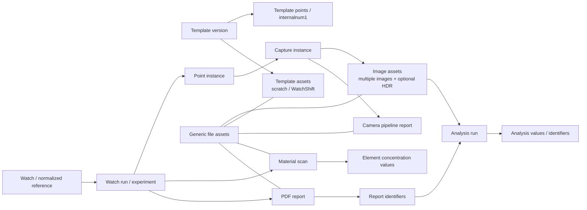

|     |     |
| --- | --- |
|     |     |
|     |     |
|     |     |
|     |     |


```
**

之前有整理了這個App main.py如果有儲存images or 其他files有包括1. 正式拍攝影像, 2. 分析結果, 3. Camera pipeline TXT 報告, 4. Template 建立影像, 5. WatchShift 參考影像, 6. Material／XRF 檔案, 7. PDF 與報告檔, 8. SQLite 資料庫, 9. Log 與稽核檔案, 10. 其他零散輸出與快取, 及yaml files.

請幫我整理這些檔案的data or index等有哪些會存入local DB方便我們管理所有的files跟後續的分析譬如:

尋找某個uuid的image file是屬於哪個watchid, 是屬於哪個template, 是甚麼時候拍的, 是哪個watchpoint, 以及跟這個uuid相關的analysis結果是存在哪裡哪個experiment? 跟這個uuid相關的analysis結果的某個結果數值value? 跟這個uuid相關的pdf report的identifier是哪一個? 有哪個另外的uuid跟這個同屬於同一次拍照, 有哪個另外的uuid跟這個同屬於同個watchpoint?, 有哪個另外的uuid跟這個同屬於同個reference number? 跟這個uuid相關的watchpoint不同capture的uuid是? 找到所有屬於同個reference number的所有這個watchpoint的uuid, 找到所有屬於同個watchpoint的所有的uuid, 找到找到所有屬於同個reference number的所有這個watchpoint且authentication是真品的uuid

Analysis\Exp_YYYYMMDD_HHMMSS_<8字元ID>有包含哪些analysis results, analysis結果的某個結果數值value? 跟這個uuid相關的pdf report的某個analysis的identifier是哪一個? 這個experiment是從哪一次watchid來的? 是從哪個template? 這個watchid還有沒有其他experiments, 找到所有屬於同個reference number的所有這個watchpoint的uuid, 找到所有屬於同個analysis result的所有的uuid, 找到找到所有屬於同個reference number的所有這個analysis result且authentication是真品的values, 要對這個experiment裡面某個analysis找到所有相關values的distribution.

要怎麼找到Camera pipeline TXT 報告是屬於哪次拍照, 是屬於哪個template建立的, 其中的某個數值譬如拍照的exposure

尋找某個template是屬於哪個reference number, 以及用在哪個watchid, 是甚麼時候建立的, 跟哪些watchpoint有關, 以及跟這個template相關的analysis結果是存在哪裡哪個experiment? 跟這個template相關的analysis結果的某個結果數值value? 有哪個另外的template跟這個同屬於同個reference number? 找到所有屬於同個template的所有這個watch scan

是否有儲存WatchShift 參考影像相關index在database裡面

關於material data是屬於哪一次scan? 是屬於哪個reference number? 跟同個reference number的material values是否能比較不同的成分組成%? 跟同個reference number的material values是否能比較分析特定成分%?

能否找到pdf file是從哪次watch scan? 這個pdf file是屬於哪種reference number? pdf file裡面的某個數值是甚麼? pdf file裡面某數值跟另外一份pdf file數值的比較

local DB能否查詢裡面有哪些種類跟內容? 譬如有哪些template? 有哪些watch scan?

以及還有甚麼是local DB有儲存的

**
```

## 結論

我檢查了實際的 [watchDB.db](/D:/Provenance Laboratories projects/ImagingLibWatch/DB/watchDB.db)、DB schema、App 拍攝流程、analysis、WatchShift、material、PDF 與 template 程式碼。

目前 Local DB 已經有不錯的拍攝階層：

```
watch_runs
  → point_instances
    → capture_instances
      → image_assets
```

所以「影像屬於哪個 WatchID、哪個 template、哪次 run、哪個 watchpoint、哪個 capture」大致可查。

但以下關聯目前尚未完整資料庫化：

- image UUID → analysis result
- analysis result → experiment
- analysis value 的結構化查詢與 distribution
- image／analysis → PDF report identifier
- material/XRF 的 scan 與 element values
- Camera Pipeline TXT 作為獨立 file asset
- Template 建立影像
- WatchShift reference image 的完整 file index
- log、YAML、cache、零散輸出的通用 file registry
- reference number／authentication 的可靠索引

因此答案是：目前可以做「部分追溯」，但還不能可靠管理所有 files 與後續跨 scan 分析。

## 實際 Local DB 內容

目前 DB 約 359 MB，資料量如下：

|Table|筆數|用途|
|---|---|---|
|`watch_runs`|1,371|每次 watch scan／run、WatchID、template|
|`point_instances`|4,861|該 run 執行過的 watchpoint|
|`capture_instances`|3,471|watchpoint 下的 standard/HDR capture|
|`image_assets`|3,471|新版影像 asset|
|`raw_images`|7,182|舊版影像紀錄／S3 sync queue|
|`experiment_results`|9,813|舊版 analysis、PDF、Final Report|
|`analysis_results_v2`|0|新版 image→analysis 關聯表，目前沒有實際資料|
|`ui_asset_registry`|6,215|App UI 顯示用的最新 image/result path|
|`local_templates`|21|Template 完整 JSON|
|`watch_metadata`|113|WatchID、Brand、Model、Reference、完整 WatchEntry JSON|
|`watch_registry`|0|目前未實際使用|
|`users`|5|Local login cache|

Schema 定義在 [db_manager.py (line 54)](/D:/Provenance Laboratories projects/ImagingLibWatch/DB/db_manager.py:54)。

另外有幾個重要資料品質現況：

- 1,371 個 `watch_runs` 全部仍是 `running`。
- 3,471 個 `capture_instances` 全部仍是 `processing`。
- 3,471 個 capture 每個都只有一筆 `image_assets`。
- `image_assets` 包含：
    - `raw_single`：3,237
    - `hdr_fused`：234
    - `raw_bracket`：0
- 目前實際上還沒有做到一個 capture 對多張 bracket image。
- 140 個有 run 的 WatchID 中，只有 110 個能 join 到 `watch_metadata`。
- 只有 7 個 run WatchID 有非空的 Reference。
- 只有 405／1,371 個 run 能精確對上相同 TemplateID＋version。

App 拍攝流程目前只註冊一個 `raw_single` 或 `hdr_fused`，而且固定 `asset_index=0`，見 [main.py (line 27242)](/D:/Provenance Laboratories projects/ImagingLibWatch/App/main.py:27242)。

## 十類檔案目前是否有 DB index

|檔案類型|目前 DB 狀態|結論|
|---|---|---|
|1. 正式拍攝影像|`image_assets`＋`raw_images`|有，但存在雙寫與兩種 ID|
|2. Analysis 結果|`experiment_results`|有 path/task/data，但 image 關聯多數缺失|
|3. Camera Pipeline TXT|path 藏在 `image_assets.metadata`|部分有，TXT 本身不是 asset row|
|4. Template 建立影像|`TemplateScratch` filesystem|沒有正式 DB index|
|5. WatchShift reference|Template JSON 的 flags＋manifest|部分有，沒有獨立 asset table|
|6. Material／XRF|WatchEntry JSON／`material_records.json`|沒有 dedicated DB table|
|7. PDF／報告|`experiment_results` 的 `Auto_PDF_Report`|有 PDF path，但缺 report lineage|
|8. SQLite DB|`DB/watchDB.db`|本體|
|9. Log／稽核|`Local_Data/audit_logs/*.jsonl`|不在 DB|
|10. 其他輸出／快取|filesystem|沒有 generic file catalog|
|YAML|部分 analysis API 支援，template process YAML 不入 DB|實際 DB 目前沒有 `data_yaml` rows|

Audit log 是獨立 JSONL hash chain，不寫 SQLite，見 [audit_logger.py (line 98)](/D:/Provenance Laboratories projects/ImagingLibWatch/logging_system/audit_logger.py:98)。

## Image UUID 的實際問題

正式 image filename 使用 32 字元 UUID，例如：

```
1b71bfcc4f604c51b35d081fb2c0e4d9.png
```

這個 UUID 由 [local_storage.py (line 263)](/D:/Provenance Laboratories projects/ImagingLibWatch/data_manager/local_storage.py:263) 產生，並放在：

```
image_assets.metadata["asset_id"]
```

但 `image_assets.asset_id` 本身卻是另一個 ID：

```
ast_504d394de793
```

所以現在同一張 image 有至少三種識別方式：

- file UUID：`1b71bf...`
- DB asset ID：`ast_504d...`
- legacy `raw_images.id`：SQLite integer

此外，同一張 image 會先寫一次 `raw_images`，註冊 `image_assets` 時又雙寫一次 `raw_images`。目前：

- `raw_images`：7,182 rows
- 實際不同 path：3,711
- 有 3,471 個 path 各出現兩次

雙寫邏輯位於 [db_manager.py (line 144)](/D:/Provenance Laboratories projects/ImagingLibWatch/DB/db_manager.py:144)。

### 目前由 UUID 查 image lineage

可以使用：

```
WITH target AS (
    SELECT
        a.*,
        LOWER(json_extract(a.metadata, '$.asset_id')) AS file_uuid
    FROM image_assets a
    WHERE LOWER(json_extract(a.metadata, '$.asset_id')) = LOWER(:uuid)
)
SELECT
    t.file_uuid,
    t.asset_id,
    t.local_path,
    t.s3_key,
    t.watchid,
    t.run_id,
    r.template_id,
    r.template_version,
    datetime(t.created_at, 'unixepoch', 'localtime') AS captured_at,
    p.view_name,
    p.point_name,
    p.internalnum1,
    c.capture_id,
    c.internalnum2,
    c.capture_type,
    m.Reference
FROM target t
LEFT JOIN capture_instances c
       ON c.capture_instance_id = t.capture_instance_id
LEFT JOIN point_instances p
       ON p.point_instance_id = c.point_instance_id
LEFT JOIN watch_runs r
       ON r.run_id = t.run_id
LEFT JOIN watch_metadata m
       ON m.WatchID = t.watchid;
```

這可以回答：

- 哪個 WatchID
- 哪個 TemplateID/version
- 拍攝時間
- view／watchpoint
- standard 或 HDR
- capture ID
- Reference，如果 `watch_metadata.Reference` 有值

## 同一次拍照、同一 watchpoint、同 Reference 的 UUID

### 同一次 capture

結構上可以：

```
SELECT peer.*
FROM image_assets target
JOIN image_assets peer
  ON peer.capture_instance_id = target.capture_instance_id
WHERE LOWER(json_extract(target.metadata, '$.asset_id')) = LOWER(:uuid);
```

但目前每個 capture 都只有一個 `image_assets`，因此通常找不到「另外的 UUID」。

未來 HDR 應該是：

```
capture_instance_id
  ├─ raw_bracket index 0
  ├─ raw_bracket index 1
  ├─ raw_bracket index 2
  └─ hdr_fused
```

### 同一個 watchpoint

建議優先用：

```
watchid + internalnum1
```

次要 fallback 才是：

```
watchid + view_name + point_name
```

但目前只有 81／3,471 個 image asset 有非空 `internalnum1`，所以大多只能依靠 view/point 名稱。

### 同 Reference 的同一 watchpoint

可以 join：

```
image_assets.watchid
→ watch_metadata.WatchID
→ watch_metadata.Reference
```

但目前 Reference coverage 很低，而且存在 `16613T`、`16613 T` 等格式差異，因此正式查詢前應增加 `reference_normalized`。

### Authentication＝真品

Authentication 現在藏在：

```
watch_metadata.Full_JSON
  → watchauthenticity.EntireWatch
  → watchauthenticity.<component>
```

但實際 113 筆 watch metadata 中，沒有任何非空 `EntireWatch`。所以目前不能可靠執行：

> 同 Reference＋同 watchpoint＋authentication 為真品的 UUID

Authentication 結構定義在 [watchauthenticity_structure.py (line 8)](/D:/Provenance Laboratories projects/ImagingLibWatch/DB/templates/watchauthenticity_structure.py:8)，但需要真正存入 DB 並改成標準 enum，例如：

```
AUTHENTIC
NOT_AUTHENTIC
INCONCLUSIVE
NOT_EVALUATED
```

而不是自由文字 `"Authentic"`、`"Full authenticity confirmed"` 等。

## Image UUID 與 Analysis 的關係

這是目前最大的斷點。

`experiment_results` 有 9,813 rows，但：

- `raw_image_id` 非 NULL：425
- `raw_image_id` 為 NULL：9,388
- 425 筆只對應 31 個 raw image ID
- 新版 `analysis_results_v2`：0 rows

App 主分析流程明確把 `raw_image_id=None` 寫入，見 [main.py (line 22571)](/D:/Provenance Laboratories projects/ImagingLibWatch/App/main.py:22571)。

雖然 3,409 個 analysis rows 的 JSON blob 中可搜尋到 raw UUID，但那是文字推導，不是可索引 foreign key。

因此：

|問題|目前能力|
|---|---|
|UUID 相關的 analysis 在哪個 experiment|部分可從 JSON/path 推導，不可靠|
|UUID 相關的某個 analysis value|JSON 有值時可抽，但沒有可靠 image FK|
|所有屬於同 analysis result 的 UUID|無法可靠完成|
|對某 analysis value 做 distribution|可以離線解析，但 DB SQL 會重複計數|
|image → analysis_results_v2|理論上可以，實際 table 為空|

另一個問題是 analysis report data 的放置方式：

- 大部分 `data_json` row 的 `data` 是 `{}`。
- 完整 analysis JSON 反而重複存放在數個 `image_mask` rows。
- 相同 payload 會因為多個輸出圖而重複。

因此直接對 `experiment_results.data` 做 distribution 會產生重複樣本。

## Experiment 關係

實際 analysis path 中找到 119 個：

```
Exp_YYYYMMDD_HHMMSS_<8-char>
```

其中：

- 114 個可對上 `watch_runs.run_id`
- 5 個沒有相對應的 `watch_runs`

當可以對上時，能得到：

```
experiment/run
→ WatchID
→ TemplateID/version
→ point/capture/image
```

但 `experiment_results` 本身沒有 `experiment_id` 或 `run_id` 欄位，只能由 `local_path` 解析。

目前可暫時查：

```
SELECT
    er.*,
    wr.watchid,
    wr.template_id,
    wr.template_version,
    wm.Reference
FROM experiment_results er
LEFT JOIN watch_runs wr
       ON wr.run_id = :experiment_id
LEFT JOIN watch_metadata wm
       ON wm.WatchID = wr.watchid
WHERE instr(
    replace(er.local_path, '/', '\'),
    '\Analysis\' || :experiment_id || '\'
) > 0;
```

某個 value 可以用：

```
SELECT DISTINCT
    watchid,
    json_extract(data, '$.metrics.bump_density') AS value
FROM experiment_results
WHERE task_name = :analysis_name
  AND data <> '{}'
  AND json_extract(data, '$.metrics.bump_density') IS NOT NULL;
```

但目前只能算「探索性查詢」，不適合正式統計，因為缺少 `analysis_run_id` 與 `source_asset_uuid`，且 payload 有重複。

程式已有各 analysis identifier/value path mapping，例如 `metrics.bump_density`、`metrics.feature_area`、OCR、lume、crown 等，見 [report_identifiers.py (line 4)](/D:/Provenance Laboratories projects/ImagingLibWatch/core/report_identifiers.py:4)。這些 mapping 很適合拿來建立 normalized `analysis_values` table。

## Camera Pipeline TXT

Camera Pipeline TXT 內容包含：

- watchpoint
- capture parameters
- exposure
- gain/light settings
- autofocus/HDR config
- output image path
- raw image ID
- S3 key
- run ID／experiment ID

Payload 定義在 [camera_pipeline_report.py (line 91)](/D:/Provenance Laboratories projects/ImagingLibWatch/core/camera_pipeline_report.py:91)。

目前 TXT path 存在：

```
image_assets.metadata.camera_pipeline_report_path
```

實際 coverage：

- 568／3,471 image assets 有 TXT path
- exposure 則 3,471／3,471 都已存在 `image_assets.metadata.exposure`
- 同時也可從 `point_instances.hardware_cfg.exposure` 查 template/hardware 原始設定

查詢：

```
SELECT
    json_extract(metadata, '$.asset_id') AS file_uuid,
    watchid,
    run_id,
    view_name,
    point_name,
    capture_id,
    json_extract(metadata, '$.camera_pipeline_report_path') AS txt_path,
    json_extract(metadata, '$.exposure') AS actual_exposure
FROM image_assets
WHERE LOWER(json_extract(metadata, '$.asset_id')) = LOWER(:uuid);
```

缺點是 TXT 沒有自己的 UUID、hash、size、S3 key 或獨立 asset row。

## Template

`local_templates` 已保存：

- TemplateID
- version
- Reference
- Brand/Model
- watchView/watchpoints
- hardware/capture conditions
- material scan point設定
- WatchShift flags/manifest
- updated_at

Template model 見 [template_structure.py (line 21)](/D:/Provenance Laboratories projects/ImagingLibWatch/DB/templates/template_structure.py:21)。

可以查 template 用在哪些 scans：

```
SELECT
    t.TemplateID,
    t.version,
    json_extract(t.data, '$.Reference') AS Reference,
    datetime(t.updated_at, 'unixepoch', 'localtime') AS updated_at,
    r.run_id,
    r.watchid,
    datetime(r.started_at, 'unixepoch', 'localtime') AS scan_started_at
FROM local_templates t
LEFT JOIN watch_runs r
       ON r.template_id = t.TemplateID
WHERE t.TemplateID = :template_id;
```

限制：

- 只有 `updated_at`，沒有可靠 `created_at`。
- App 建立 run 時常未傳正確 template version，因此預設成 `v1`。
- TemplateScratch images 沒有 dedicated index。
- Template → analysis 仍需經過 run，再由 analysis path 推導 experiment。

Template 建立影像目前寫到：

```
Local_Data/<TemplateID>/TemplateScratch/
```

見 [main.py (line 5224)](/D:/Provenance Laboratories projects/ImagingLibWatch/App/main.py:5224)，但不會註冊到 SQLite。

## WatchShift reference

目前有部分 index：

```
local_templates.data.watchshift_images
local_templates.data.watchshift_image_manifest
```

21 個 templates 中：

- 8 個有 WatchShift flags
- 8 個有非空 manifest

Manifest 包含：

- template_id
- view_name
- S3 key
- bucket
- etag
- version ID（如果 S3 有）
- updated_at

Manifest 定義在 [internalnum_config.py (line 1725)](/D:/Provenance Laboratories projects/ImagingLibWatch/DB/templates/internalnum_config.py:1725)。

但 reference image 沒有獨立 DB asset；local path 是依規則推導：

```
DB/watchshift/<TemplateID>/<View>.toppoint1.png
```

每次 scan 的 WatchShift 計算結果則寫成：

```
Analysis/<ExpID>/watchshift_<View>.json
```

見 [main.py (line 3511)](/D:/Provenance Laboratories projects/ImagingLibWatch/App/main.py:3511)，通常沒有註冊進 `experiment_results`。

所以答案是：有 template-level manifest，但沒有完整的 WatchShift file/run-level index。

## Material／XRF

目前 Material CSV 解析內容很完整，包括：

- source file/path
- scan part
- scan mode
- instrument metadata
- alloy
- gold plated／karat
- element
- concentration %
- error %
- raw values

結構見 [material_structure.py (line 78)](/D:/Provenance Laboratories projects/ImagingLibWatch/DB/templates/material_structure.py:78)。

Material session JSON 也會記：

- WatchID
- ExpID
- material CSV folder
- records
- element values

但它只寫到：

```
Analysis/<ExpID>/material_records.json
```

見 [main.py (line 23665)](/D:/Provenance Laboratories projects/ImagingLibWatch/App/main.py:23665)，沒有 dedicated DB insert。

資料也會暫時放到 `current_watchentry.watchmaterial` 與 `material_results_by_internalnum`，見 [material_reader.py (line 576)](/D:/Provenance Laboratories projects/ImagingLibWatch/algorithms/material_reader.py:576)；只有後續成功存 Final Report 時才可能進 JSON blob。

實際 DB 現況：

- 113 個 `watch_metadata` 沒有任何已填 material data
- 139 個 Final Report 沒有任何非空 `material_results_by_internalnum`
- 沒有 `material_scans` 或 `material_values` table

因此目前無法直接用 SQL：

- 比較同 Reference 的組成 %
- 比較不同 scan 的 Au、Fe、Ni 等成分
- 取得某元素的 distribution

## PDF 與 report identifier

目前 DB 有 15 個 PDF rows：

```
task_name = Auto_PDF_Report
result_type = data_pdf
```

保存：

- WatchID
- PDF path
- generated_at
- source

註冊程式見 [main.py (line 24438)](/D:/Provenance Laboratories projects/ImagingLibWatch/App/main.py:24438)。

問題是：

- 沒有 `report_id` 欄位
- 沒有 experiment ID
- 沒有 template ID
- 沒有 source image/analysis link
- PDF 裡的數值沒有寫成 DB values
- report identifier JSON 檔沒有註冊到 DB
- PDF 顯示的 `report_id` 目前是 hard-coded `"5473454756"`，見 [main.py (line 28248)](/D:/Provenance Laboratories projects/ImagingLibWatch/App/main.py:28248)

PDF filename 的 8 字元 suffix 雖然可以暫時當 file identifier，但不是正式 report ID。

因此：

- PDF → WatchID：可以
- PDF → Reference：需再 join `watch_metadata`，而 Reference coverage 很低
- PDF → experiment/image/analysis：目前不可靠
- 比較兩份 PDF 裡的數值：必須重讀 PDF 或 `report_identifiers_*.json`，不能直接由 DB 查

## 建議的目標資料模型

應保留現有表以維持 App／CLI／cloud 相容，再 add-only 增加以下結構：

````

````

最少需要新增：

1. `file_assets`
    
    - `file_uuid`
    - `file_type`
    - `local_path`
    - `s3_key`
    - `sha256`
    - `mime_type`
    - `byte_size`
    - `created_at`
    - `metadata_json`
2. `experiments`
    
    - `experiment_id`
    - `run_id`
    - `analysis_dir`
    - `started_at`
    - `completed_at`
    - `status`
3. `analysis_runs`
    
    - `analysis_run_id`
    - `experiment_id`
    - `source_asset_uuid`
    - `algorithm_name`
    - `algorithm_version`
    - `result_document_asset_uuid`
    - `created_at`
4. `analysis_values`
    
    - `analysis_run_id`
    - `identifier_key`
    - `value_path`
    - `value_numeric`
    - `value_text`
    - `unit`
    - `ordinal`
    - `passed`
5. `reports`＋`report_analysis_links`
    
    - 正式 `report_id`
    - PDF file UUID
    - run/experiment/template/reference snapshot
    - 關聯 analysis run／identifier
6. `material_scans`＋`material_values`
    
    - scan ID
    - run／watchpoint／internalnum1
    - source CSV asset
    - element
    - concentration %
    - error %
    - unit
7. `template_assets`
    
    - TemplateID/version
    - view/point
    - asset type：scratch、WatchShift reference、calibration
8. `authenticity_assessments`
    
    - scope：watch/component/point/analysis
    - normalized status
    - source analysis/report
    - evaluated_at

## 必要 indexes

建議至少增加：

```
file_assets(file_uuid) UNIQUE
file_assets(local_path) UNIQUE
file_assets(sha256)

watch_runs(watchid, started_at)
watch_runs(template_id, template_version, started_at)

point_instances(run_id, internalnum1)
point_instances(watchid, view_name, point_name)

capture_instances(point_instance_id, internalnum2)
capture_instances(run_id, capture_id)

image_assets(file_uuid) UNIQUE
image_assets(capture_instance_id, asset_role, asset_index)
image_assets(watchid, internalnum1, internalnum2)

experiments(run_id, experiment_id)
analysis_runs(source_asset_uuid, algorithm_name)
analysis_runs(experiment_id, algorithm_name)
analysis_values(identifier_key, value_numeric)
analysis_values(analysis_run_id, identifier_key)

watch_metadata(reference_normalized)
material_scans(run_id, internalnum1)
material_values(element, concentration_percent)

reports(run_id, report_id)
report_analysis_links(report_id, analysis_run_id)
```

並應啟用真正的 foreign keys；目前現有 schema 沒有任何 FK constraint。

## 建議實作順序

為維持舊 App、CLI、DB、S3、DynamoDB 與報告相容，建議：

1. 先統一 `file_uuid`，保留原 `asset_id` 和 legacy integer ID。
2. 新增 `file_assets`，回填正式 image、analysis、PDF、TXT、WatchShift、material、template files。
3. 新增 explicit `experiment_id` 與 `analysis_run_id`。
4. 將 analysis identifiers/value mappings 寫入 `analysis_values`。
5. 新增 material/report tables。
6. 建立 compatibility views，讓舊 `raw_images`／`experiment_results` 繼續可用。
7. 修改 dual-write，避免同一 image path 重複兩筆 `raw_images`。