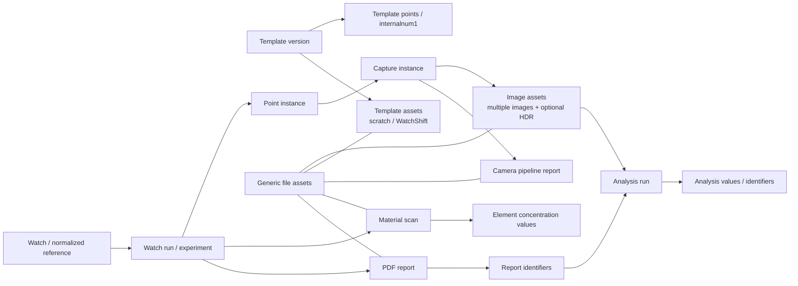
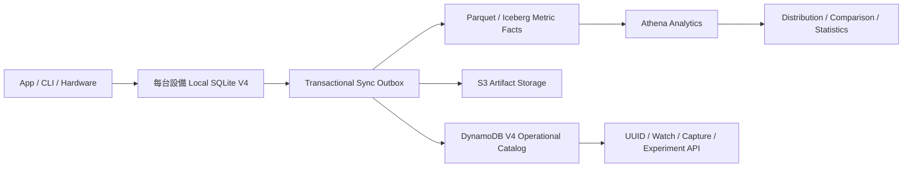
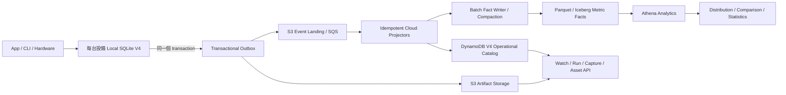
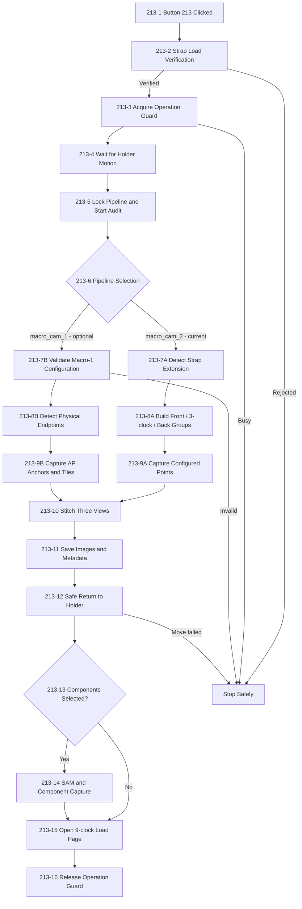
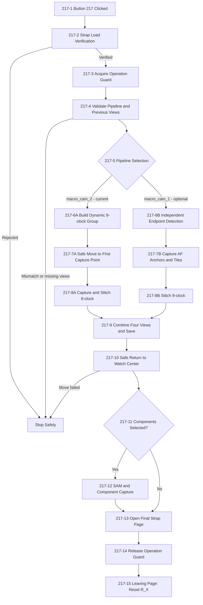
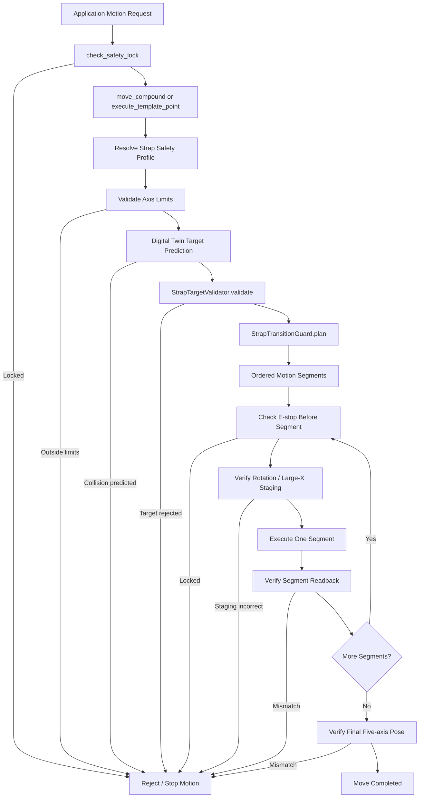
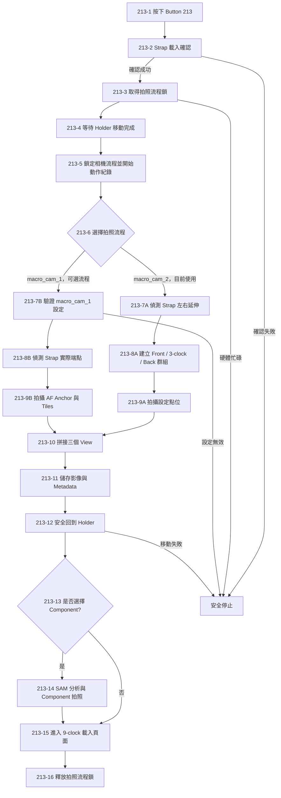
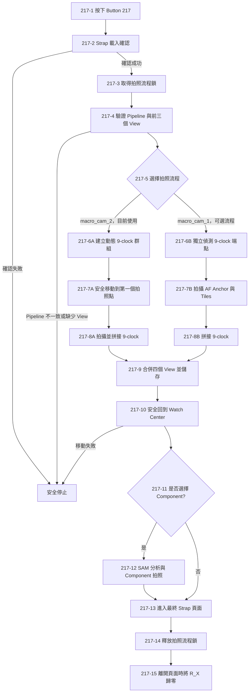
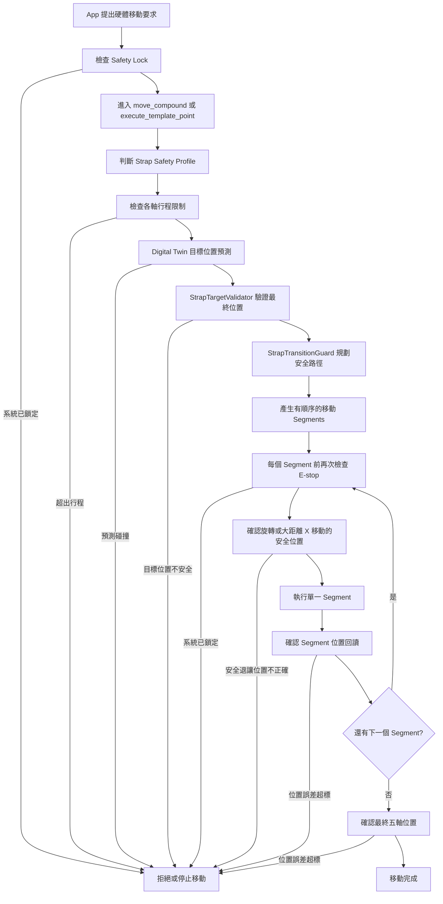

| [[#### 整理這些檔案的data or index等有哪些會存入local DB方便我們管理所有的files跟後續的分析]]<br> |     |
| -------------------------------------------------------------------- | --- |
| [[#### 整理all files 連結 Database]]                                     |     |
| [[#### database支援上萬watch?]]                                          |     |
| [[#### 「邊緣到雲端 (Edge-to-Cloud)」與「OLTP / OLAP 分離」架構]]                  |     |
| [[#### 舉例解釋SQLite vs. DynamoDB的差別]]                                  |     |
| [[#### 文詳細解釋 DB/watchDB.db的內部資料結構]]                                  |     |
| [[#### DB/watchDB.db是如何跟AWS同步]]                                      |     |
| [[#### DB browser for SQLite打開watchDB.db]]                           |     |
|                                                                      |     |
|                                                                      |     |
|                                                                      |     |

#### 整理這些檔案的data or index等有哪些會存入local DB方便我們管理所有的files跟後續的分析

```
**

之前有整理了這個App main.py如果有儲存images or 其他files有包括1. 正式拍攝影像, 2. 分析結果, 3. Camera pipeline TXT 報告, 4. Template 建立影像, 5. WatchShift 參考影像, 6. Material／XRF 檔案, 7. PDF 與報告檔, 8. SQLite 資料庫, 9. Log 與稽核檔案, 10. 其他零散輸出與快取, 及yaml files.

請幫我整理這些檔案的data or index等有哪些會存入local DB方便我們管理所有的files跟後續的分析譬如:

尋找某個uuid的image file是屬於哪個watchid, 是屬於哪個template, 是甚麼時候拍的, 是哪個watchpoint, 以及跟這個uuid相關的analysis結果是存在哪裡哪個experiment? 跟這個uuid相關的analysis結果的某個結果數值value? 跟這個uuid相關的pdf report的identifier是哪一個? 有哪個另外的uuid跟這個同屬於同一次拍照, 有哪個另外的uuid跟這個同屬於同個watchpoint?, 有哪個另外的uuid跟這個同屬於同個reference number? 跟這個uuid相關的watchpoint不同capture的uuid是? 找到所有屬於同個reference number的所有這個watchpoint的uuid, 找到所有屬於同個watchpoint的所有的uuid, 找到找到所有屬於同個reference number的所有這個watchpoint且authentication是真品的uuid

Analysis\Exp_YYYYMMDD_HHMMSS_<8字元ID>有包含哪些analysis results, analysis結果的某個結果數值value? 跟這個uuid相關的pdf report的某個analysis的identifier是哪一個? 這個experiment是從哪一次watchid來的? 是從哪個template? 這個watchid還有沒有其他experiments, 找到所有屬於同個reference number的所有這個watchpoint的uuid, 找到所有屬於同個analysis result的所有的uuid, 找到找到所有屬於同個reference number的所有這個analysis result且authentication是真品的values, 要對這個experiment裡面某個analysis找到所有相關values的distribution.

要怎麼找到Camera pipeline TXT 報告是屬於哪次拍照, 是屬於哪個template建立的, 其中的某個數值譬如拍照的exposure

尋找某個template是屬於哪個reference number, 以及用在哪個watchid, 是甚麼時候建立的, 跟哪些watchpoint有關, 以及跟這個template相關的analysis結果是存在哪裡哪個experiment? 跟這個template相關的analysis結果的某個結果數值value? 有哪個另外的template跟這個同屬於同個reference number? 找到所有屬於同個template的所有這個watch scan

是否有儲存WatchShift 參考影像相關index在database裡面

關於material data是屬於哪一次scan? 是屬於哪個reference number? 跟同個reference number的material values是否能比較不同的成分組成%? 跟同個reference number的material values是否能比較分析特定成分%?

能否找到pdf file是從哪次watch scan? 這個pdf file是屬於哪種reference number? pdf file裡面的某個數值是甚麼? pdf file裡面某數值跟另外一份pdf file數值的比較

local DB能否查詢裡面有哪些種類跟內容? 譬如有哪些template? 有哪些watch scan?

以及還有甚麼是local DB有儲存的

**
```

## 結論

我檢查了實際的 [watchDB.db](/D:/Provenance Laboratories projects/ImagingLibWatch/DB/watchDB.db)、DB schema、App 拍攝流程、analysis、WatchShift、material、PDF 與 template 程式碼。

目前 Local DB 已經有不錯的拍攝階層：

```
watch_runs
  → point_instances
    → capture_instances
      → image_assets
```

所以「影像屬於哪個 WatchID、哪個 template、哪次 run、哪個 watchpoint、哪個 capture」大致可查。

但以下關聯目前尚未完整資料庫化：

- image UUID → analysis result
- analysis result → experiment
- analysis value 的結構化查詢與 distribution
- image／analysis → PDF report identifier
- material/XRF 的 scan 與 element values
- Camera Pipeline TXT 作為獨立 file asset
- Template 建立影像
- WatchShift reference image 的完整 file index
- log、YAML、cache、零散輸出的通用 file registry
- reference number／authentication 的可靠索引

因此答案是：目前可以做「部分追溯」，但還不能可靠管理所有 files 與後續跨 scan 分析。

## 實際 Local DB 內容

目前 DB 約 359 MB，資料量如下：

|Table|筆數|用途|
|---|---|---|
|`watch_runs`|1,371|每次 watch scan／run、WatchID、template|
|`point_instances`|4,861|該 run 執行過的 watchpoint|
|`capture_instances`|3,471|watchpoint 下的 standard/HDR capture|
|`image_assets`|3,471|新版影像 asset|
|`raw_images`|7,182|舊版影像紀錄／S3 sync queue|
|`experiment_results`|9,813|舊版 analysis、PDF、Final Report|
|`analysis_results_v2`|0|新版 image→analysis 關聯表，目前沒有實際資料|
|`ui_asset_registry`|6,215|App UI 顯示用的最新 image/result path|
|`local_templates`|21|Template 完整 JSON|
|`watch_metadata`|113|WatchID、Brand、Model、Reference、完整 WatchEntry JSON|
|`watch_registry`|0|目前未實際使用|
|`users`|5|Local login cache|

Schema 定義在 [db_manager.py (line 54)](/D:/Provenance Laboratories projects/ImagingLibWatch/DB/db_manager.py:54)。

另外有幾個重要資料品質現況：

- 1,371 個 `watch_runs` 全部仍是 `running`。
- 3,471 個 `capture_instances` 全部仍是 `processing`。
- 3,471 個 capture 每個都只有一筆 `image_assets`。
- `image_assets` 包含：
    - `raw_single`：3,237
    - `hdr_fused`：234
    - `raw_bracket`：0
- 目前實際上還沒有做到一個 capture 對多張 bracket image。
- 140 個有 run 的 WatchID 中，只有 110 個能 join 到 `watch_metadata`。
- 只有 7 個 run WatchID 有非空的 Reference。
- 只有 405／1,371 個 run 能精確對上相同 TemplateID＋version。

App 拍攝流程目前只註冊一個 `raw_single` 或 `hdr_fused`，而且固定 `asset_index=0`，見 [main.py (line 27242)](/D:/Provenance Laboratories projects/ImagingLibWatch/App/main.py:27242)。

## 十類檔案目前是否有 DB index

|檔案類型|目前 DB 狀態|結論|
|---|---|---|
|1. 正式拍攝影像|`image_assets`＋`raw_images`|有，但存在雙寫與兩種 ID|
|2. Analysis 結果|`experiment_results`|有 path/task/data，但 image 關聯多數缺失|
|3. Camera Pipeline TXT|path 藏在 `image_assets.metadata`|部分有，TXT 本身不是 asset row|
|4. Template 建立影像|`TemplateScratch` filesystem|沒有正式 DB index|
|5. WatchShift reference|Template JSON 的 flags＋manifest|部分有，沒有獨立 asset table|
|6. Material／XRF|WatchEntry JSON／`material_records.json`|沒有 dedicated DB table|
|7. PDF／報告|`experiment_results` 的 `Auto_PDF_Report`|有 PDF path，但缺 report lineage|
|8. SQLite DB|`DB/watchDB.db`|本體|
|9. Log／稽核|`Local_Data/audit_logs/*.jsonl`|不在 DB|
|10. 其他輸出／快取|filesystem|沒有 generic file catalog|
|YAML|部分 analysis API 支援，template process YAML 不入 DB|實際 DB 目前沒有 `data_yaml` rows|

Audit log 是獨立 JSONL hash chain，不寫 SQLite，見 [audit_logger.py (line 98)](/D:/Provenance Laboratories projects/ImagingLibWatch/logging_system/audit_logger.py:98)。

## Image UUID 的實際問題

正式 image filename 使用 32 字元 UUID，例如：

```
1b71bfcc4f604c51b35d081fb2c0e4d9.png
```

這個 UUID 由 [local_storage.py (line 263)](/D:/Provenance Laboratories projects/ImagingLibWatch/data_manager/local_storage.py:263) 產生，並放在：

```
image_assets.metadata["asset_id"]
```

但 `image_assets.asset_id` 本身卻是另一個 ID：

```
ast_504d394de793
```

所以現在同一張 image 有至少三種識別方式：

- file UUID：`1b71bf...`
- DB asset ID：`ast_504d...`
- legacy `raw_images.id`：SQLite integer

此外，同一張 image 會先寫一次 `raw_images`，註冊 `image_assets` 時又雙寫一次 `raw_images`。目前：

- `raw_images`：7,182 rows
- 實際不同 path：3,711
- 有 3,471 個 path 各出現兩次

雙寫邏輯位於 [db_manager.py (line 144)](/D:/Provenance Laboratories projects/ImagingLibWatch/DB/db_manager.py:144)。

### 目前由 UUID 查 image lineage

可以使用：

```
WITH target AS (
    SELECT
        a.*,
        LOWER(json_extract(a.metadata, '$.asset_id')) AS file_uuid
    FROM image_assets a
    WHERE LOWER(json_extract(a.metadata, '$.asset_id')) = LOWER(:uuid)
)
SELECT
    t.file_uuid,
    t.asset_id,
    t.local_path,
    t.s3_key,
    t.watchid,
    t.run_id,
    r.template_id,
    r.template_version,
    datetime(t.created_at, 'unixepoch', 'localtime') AS captured_at,
    p.view_name,
    p.point_name,
    p.internalnum1,
    c.capture_id,
    c.internalnum2,
    c.capture_type,
    m.Reference
FROM target t
LEFT JOIN capture_instances c
       ON c.capture_instance_id = t.capture_instance_id
LEFT JOIN point_instances p
       ON p.point_instance_id = c.point_instance_id
LEFT JOIN watch_runs r
       ON r.run_id = t.run_id
LEFT JOIN watch_metadata m
       ON m.WatchID = t.watchid;
```

這可以回答：

- 哪個 WatchID
- 哪個 TemplateID/version
- 拍攝時間
- view／watchpoint
- standard 或 HDR
- capture ID
- Reference，如果 `watch_metadata.Reference` 有值

## 同一次拍照、同一 watchpoint、同 Reference 的 UUID

### 同一次 capture

結構上可以：

```
SELECT peer.*
FROM image_assets target
JOIN image_assets peer
  ON peer.capture_instance_id = target.capture_instance_id
WHERE LOWER(json_extract(target.metadata, '$.asset_id')) = LOWER(:uuid);
```

但目前每個 capture 都只有一個 `image_assets`，因此通常找不到「另外的 UUID」。

未來 HDR 應該是：

```
capture_instance_id
  ├─ raw_bracket index 0
  ├─ raw_bracket index 1
  ├─ raw_bracket index 2
  └─ hdr_fused
```

### 同一個 watchpoint

建議優先用：

```
watchid + internalnum1
```

次要 fallback 才是：

```
watchid + view_name + point_name
```

但目前只有 81／3,471 個 image asset 有非空 `internalnum1`，所以大多只能依靠 view/point 名稱。

### 同 Reference 的同一 watchpoint

可以 join：

```
image_assets.watchid
→ watch_metadata.WatchID
→ watch_metadata.Reference
```

但目前 Reference coverage 很低，而且存在 `16613T`、`16613 T` 等格式差異，因此正式查詢前應增加 `reference_normalized`。

### Authentication＝真品

Authentication 現在藏在：

```
watch_metadata.Full_JSON
  → watchauthenticity.EntireWatch
  → watchauthenticity.<component>
```

但實際 113 筆 watch metadata 中，沒有任何非空 `EntireWatch`。所以目前不能可靠執行：

> 同 Reference＋同 watchpoint＋authentication 為真品的 UUID

Authentication 結構定義在 [watchauthenticity_structure.py (line 8)](/D:/Provenance Laboratories projects/ImagingLibWatch/DB/templates/watchauthenticity_structure.py:8)，但需要真正存入 DB 並改成標準 enum，例如：

```
AUTHENTIC
NOT_AUTHENTIC
INCONCLUSIVE
NOT_EVALUATED
```

而不是自由文字 `"Authentic"`、`"Full authenticity confirmed"` 等。

## Image UUID 與 Analysis 的關係

這是目前最大的斷點。

`experiment_results` 有 9,813 rows，但：

- `raw_image_id` 非 NULL：425
- `raw_image_id` 為 NULL：9,388
- 425 筆只對應 31 個 raw image ID
- 新版 `analysis_results_v2`：0 rows

App 主分析流程明確把 `raw_image_id=None` 寫入，見 [main.py (line 22571)](/D:/Provenance Laboratories projects/ImagingLibWatch/App/main.py:22571)。

雖然 3,409 個 analysis rows 的 JSON blob 中可搜尋到 raw UUID，但那是文字推導，不是可索引 foreign key。

因此：

|問題|目前能力|
|---|---|
|UUID 相關的 analysis 在哪個 experiment|部分可從 JSON/path 推導，不可靠|
|UUID 相關的某個 analysis value|JSON 有值時可抽，但沒有可靠 image FK|
|所有屬於同 analysis result 的 UUID|無法可靠完成|
|對某 analysis value 做 distribution|可以離線解析，但 DB SQL 會重複計數|
|image → analysis_results_v2|理論上可以，實際 table 為空|

另一個問題是 analysis report data 的放置方式：

- 大部分 `data_json` row 的 `data` 是 `{}`。
- 完整 analysis JSON 反而重複存放在數個 `image_mask` rows。
- 相同 payload 會因為多個輸出圖而重複。

因此直接對 `experiment_results.data` 做 distribution 會產生重複樣本。

## Experiment 關係

實際 analysis path 中找到 119 個：

```
Exp_YYYYMMDD_HHMMSS_<8-char>
```

其中：

- 114 個可對上 `watch_runs.run_id`
- 5 個沒有相對應的 `watch_runs`

當可以對上時，能得到：

```
experiment/run
→ WatchID
→ TemplateID/version
→ point/capture/image
```

但 `experiment_results` 本身沒有 `experiment_id` 或 `run_id` 欄位，只能由 `local_path` 解析。

目前可暫時查：

```
SELECT
    er.*,
    wr.watchid,
    wr.template_id,
    wr.template_version,
    wm.Reference
FROM experiment_results er
LEFT JOIN watch_runs wr
       ON wr.run_id = :experiment_id
LEFT JOIN watch_metadata wm
       ON wm.WatchID = wr.watchid
WHERE instr(
    replace(er.local_path, '/', '\'),
    '\Analysis\' || :experiment_id || '\'
) > 0;
```

某個 value 可以用：

```
SELECT DISTINCT
    watchid,
    json_extract(data, '$.metrics.bump_density') AS value
FROM experiment_results
WHERE task_name = :analysis_name
  AND data <> '{}'
  AND json_extract(data, '$.metrics.bump_density') IS NOT NULL;
```

但目前只能算「探索性查詢」，不適合正式統計，因為缺少 `analysis_run_id` 與 `source_asset_uuid`，且 payload 有重複。

程式已有各 analysis identifier/value path mapping，例如 `metrics.bump_density`、`metrics.feature_area`、OCR、lume、crown 等，見 [report_identifiers.py (line 4)](/D:/Provenance Laboratories projects/ImagingLibWatch/core/report_identifiers.py:4)。這些 mapping 很適合拿來建立 normalized `analysis_values` table。

## Camera Pipeline TXT

Camera Pipeline TXT 內容包含：

- watchpoint
- capture parameters
- exposure
- gain/light settings
- autofocus/HDR config
- output image path
- raw image ID
- S3 key
- run ID／experiment ID

Payload 定義在 [camera_pipeline_report.py (line 91)](/D:/Provenance Laboratories projects/ImagingLibWatch/core/camera_pipeline_report.py:91)。

目前 TXT path 存在：

```
image_assets.metadata.camera_pipeline_report_path
```

實際 coverage：

- 568／3,471 image assets 有 TXT path
- exposure 則 3,471／3,471 都已存在 `image_assets.metadata.exposure`
- 同時也可從 `point_instances.hardware_cfg.exposure` 查 template/hardware 原始設定

查詢：

```
SELECT
    json_extract(metadata, '$.asset_id') AS file_uuid,
    watchid,
    run_id,
    view_name,
    point_name,
    capture_id,
    json_extract(metadata, '$.camera_pipeline_report_path') AS txt_path,
    json_extract(metadata, '$.exposure') AS actual_exposure
FROM image_assets
WHERE LOWER(json_extract(metadata, '$.asset_id')) = LOWER(:uuid);
```

缺點是 TXT 沒有自己的 UUID、hash、size、S3 key 或獨立 asset row。

## Template

`local_templates` 已保存：

- TemplateID
- version
- Reference
- Brand/Model
- watchView/watchpoints
- hardware/capture conditions
- material scan point設定
- WatchShift flags/manifest
- updated_at

Template model 見 [template_structure.py (line 21)](/D:/Provenance Laboratories projects/ImagingLibWatch/DB/templates/template_structure.py:21)。

可以查 template 用在哪些 scans：

```
SELECT
    t.TemplateID,
    t.version,
    json_extract(t.data, '$.Reference') AS Reference,
    datetime(t.updated_at, 'unixepoch', 'localtime') AS updated_at,
    r.run_id,
    r.watchid,
    datetime(r.started_at, 'unixepoch', 'localtime') AS scan_started_at
FROM local_templates t
LEFT JOIN watch_runs r
       ON r.template_id = t.TemplateID
WHERE t.TemplateID = :template_id;
```

限制：

- 只有 `updated_at`，沒有可靠 `created_at`。
- App 建立 run 時常未傳正確 template version，因此預設成 `v1`。
- TemplateScratch images 沒有 dedicated index。
- Template → analysis 仍需經過 run，再由 analysis path 推導 experiment。

Template 建立影像目前寫到：

```
Local_Data/<TemplateID>/TemplateScratch/
```

見 [main.py (line 5224)](/D:/Provenance Laboratories projects/ImagingLibWatch/App/main.py:5224)，但不會註冊到 SQLite。

## WatchShift reference

目前有部分 index：

```
local_templates.data.watchshift_images
local_templates.data.watchshift_image_manifest
```

21 個 templates 中：

- 8 個有 WatchShift flags
- 8 個有非空 manifest

Manifest 包含：

- template_id
- view_name
- S3 key
- bucket
- etag
- version ID（如果 S3 有）
- updated_at

Manifest 定義在 [internalnum_config.py (line 1725)](/D:/Provenance Laboratories projects/ImagingLibWatch/DB/templates/internalnum_config.py:1725)。

但 reference image 沒有獨立 DB asset；local path 是依規則推導：

```
DB/watchshift/<TemplateID>/<View>.toppoint1.png
```

每次 scan 的 WatchShift 計算結果則寫成：

```
Analysis/<ExpID>/watchshift_<View>.json
```

見 [main.py (line 3511)](/D:/Provenance Laboratories projects/ImagingLibWatch/App/main.py:3511)，通常沒有註冊進 `experiment_results`。

所以答案是：有 template-level manifest，但沒有完整的 WatchShift file/run-level index。

## Material／XRF

目前 Material CSV 解析內容很完整，包括：

- source file/path
- scan part
- scan mode
- instrument metadata
- alloy
- gold plated／karat
- element
- concentration %
- error %
- raw values

結構見 [material_structure.py (line 78)](/D:/Provenance Laboratories projects/ImagingLibWatch/DB/templates/material_structure.py:78)。

Material session JSON 也會記：

- WatchID
- ExpID
- material CSV folder
- records
- element values

但它只寫到：

```
Analysis/<ExpID>/material_records.json
```

見 [main.py (line 23665)](/D:/Provenance Laboratories projects/ImagingLibWatch/App/main.py:23665)，沒有 dedicated DB insert。

資料也會暫時放到 `current_watchentry.watchmaterial` 與 `material_results_by_internalnum`，見 [material_reader.py (line 576)](/D:/Provenance Laboratories projects/ImagingLibWatch/algorithms/material_reader.py:576)；只有後續成功存 Final Report 時才可能進 JSON blob。

實際 DB 現況：

- 113 個 `watch_metadata` 沒有任何已填 material data
- 139 個 Final Report 沒有任何非空 `material_results_by_internalnum`
- 沒有 `material_scans` 或 `material_values` table

因此目前無法直接用 SQL：

- 比較同 Reference 的組成 %
- 比較不同 scan 的 Au、Fe、Ni 等成分
- 取得某元素的 distribution

## PDF 與 report identifier

目前 DB 有 15 個 PDF rows：

```
task_name = Auto_PDF_Report
result_type = data_pdf
```

保存：

- WatchID
- PDF path
- generated_at
- source

註冊程式見 [main.py (line 24438)](/D:/Provenance Laboratories projects/ImagingLibWatch/App/main.py:24438)。

問題是：

- 沒有 `report_id` 欄位
- 沒有 experiment ID
- 沒有 template ID
- 沒有 source image/analysis link
- PDF 裡的數值沒有寫成 DB values
- report identifier JSON 檔沒有註冊到 DB
- PDF 顯示的 `report_id` 目前是 hard-coded `"5473454756"`，見 [main.py (line 28248)](/D:/Provenance Laboratories projects/ImagingLibWatch/App/main.py:28248)

PDF filename 的 8 字元 suffix 雖然可以暫時當 file identifier，但不是正式 report ID。

因此：

- PDF → WatchID：可以
- PDF → Reference：需再 join `watch_metadata`，而 Reference coverage 很低
- PDF → experiment/image/analysis：目前不可靠
- 比較兩份 PDF 裡的數值：必須重讀 PDF 或 `report_identifiers_*.json`，不能直接由 DB 查

## 建議的目標資料模型

應保留現有表以維持 App／CLI／cloud 相容，再 add-only 增加以下結構：

````

````

最少需要新增：

1. `file_assets`
    
    - `file_uuid`
    - `file_type`
    - `local_path`
    - `s3_key`
    - `sha256`
    - `mime_type`
    - `byte_size`
    - `created_at`
    - `metadata_json`
2. `experiments`
    
    - `experiment_id`
    - `run_id`
    - `analysis_dir`
    - `started_at`
    - `completed_at`
    - `status`
3. `analysis_runs`
    
    - `analysis_run_id`
    - `experiment_id`
    - `source_asset_uuid`
    - `algorithm_name`
    - `algorithm_version`
    - `result_document_asset_uuid`
    - `created_at`
4. `analysis_values`
    
    - `analysis_run_id`
    - `identifier_key`
    - `value_path`
    - `value_numeric`
    - `value_text`
    - `unit`
    - `ordinal`
    - `passed`
5. `reports`＋`report_analysis_links`
    
    - 正式 `report_id`
    - PDF file UUID
    - run/experiment/template/reference snapshot
    - 關聯 analysis run／identifier
6. `material_scans`＋`material_values`
    
    - scan ID
    - run／watchpoint／internalnum1
    - source CSV asset
    - element
    - concentration %
    - error %
    - unit
7. `template_assets`
    
    - TemplateID/version
    - view/point
    - asset type：scratch、WatchShift reference、calibration
8. `authenticity_assessments`
    
    - scope：watch/component/point/analysis
    - normalized status
    - source analysis/report
    - evaluated_at

## 必要 indexes

建議至少增加：

```
file_assets(file_uuid) UNIQUE
file_assets(local_path) UNIQUE
file_assets(sha256)

watch_runs(watchid, started_at)
watch_runs(template_id, template_version, started_at)

point_instances(run_id, internalnum1)
point_instances(watchid, view_name, point_name)

capture_instances(point_instance_id, internalnum2)
capture_instances(run_id, capture_id)

image_assets(file_uuid) UNIQUE
image_assets(capture_instance_id, asset_role, asset_index)
image_assets(watchid, internalnum1, internalnum2)

experiments(run_id, experiment_id)
analysis_runs(source_asset_uuid, algorithm_name)
analysis_runs(experiment_id, algorithm_name)
analysis_values(identifier_key, value_numeric)
analysis_values(analysis_run_id, identifier_key)

watch_metadata(reference_normalized)
material_scans(run_id, internalnum1)
material_values(element, concentration_percent)

reports(run_id, report_id)
report_analysis_links(report_id, analysis_run_id)
```

並應啟用真正的 foreign keys；目前現有 schema 沒有任何 FK constraint。

## 建議實作順序

為維持舊 App、CLI、DB、S3、DynamoDB 與報告相容，建議：

1. 先統一 `file_uuid`，保留原 `asset_id` 和 legacy integer ID。
2. 新增 `file_assets`，回填正式 image、analysis、PDF、TXT、WatchShift、material、template files。
3. 新增 explicit `experiment_id` 與 `analysis_run_id`。
4. 將 analysis identifiers/value mappings 寫入 `analysis_values`。
5. 新增 material/report tables。
6. 建立 compatibility views，讓舊 `raw_images`／`experiment_results` 繼續可用。
7. 修改 dual-write，避免同一 image path 重複兩筆 `raw_images`。


#### 整理all files 連結 Database
```
之前有整理了這個App main.py如果有儲存images or 其他files有包括1. 正式拍攝影像, 2. 分析結果, 3. Camera pipeline TXT 報告, 4. Template 建立影像, 5. WatchShift 參考影像, 6. Material／XRF 檔案, 7. PDF 與報告檔, 8. SQLite 資料庫, 9. Log 與稽核檔案, 10. 其他零散輸出與快取, 及yaml files.

請幫我整理這些檔案的data or index等有哪些會存入local DB方便我們管理所有的files跟後續的分析譬如:

尋找某個uuid的image file是屬於哪個watchid, 是屬於哪個template, 是甚麼時候拍的, 是哪個watchpoint, 以及跟這個uuid相關的analysis結果是存在哪裡哪個experiment? 跟這個uuid相關的analysis結果的某個結果數值value? 跟這個uuid相關的pdf report的identifier是哪一個? 有哪個另外的uuid跟這個同屬於同一次拍照, 有哪個另外的uuid跟這個同屬於同個watchpoint?, 有哪個另外的uuid跟這個同屬於同個reference number? 跟這個uuid相關的watchpoint不同capture的uuid是? 找到所有屬於同個reference number的所有這個watchpoint的uuid, 找到所有屬於同個watchpoint的所有的uuid, 找到找到所有屬於同個reference number的所有這個watchpoint且authentication是真品的uuid

Analysis\Exp_YYYYMMDD_HHMMSS_<8字元ID>有包含哪些analysis results, analysis結果的某個結果數值value? 跟這個uuid相關的pdf report的某個analysis的identifier是哪一個? 這個experiment是從哪一次watchid來的? 是從哪個template? 這個watchid還有沒有其他experiments, 找到所有屬於同個reference number的所有這個watchpoint的uuid, 找到所有屬於同個analysis result的所有的uuid, 找到找到所有屬於同個reference number的所有這個analysis result且authentication是真品的values, 要對這個experiment裡面某個analysis找到所有相關values的distribution.

要怎麼找到Camera pipeline TXT 報告是屬於哪次拍照, 是屬於哪個template建立的, 其中的某個數值譬如拍照的exposure

尋找某個template是屬於哪個reference number, 以及用在哪個watchid, 是甚麼時候建立的, 跟哪些watchpoint有關, 以及跟這個template相關的analysis結果是存在哪裡哪個experiment? 跟這個template相關的analysis結果的某個結果數值value? 有哪個另外的template跟這個同屬於同個reference number? 找到所有屬於同個template的所有這個watch scan

是否有儲存WatchShift 參考影像相關index在database裡面

關於material data是屬於哪一次scan? 是屬於哪個reference number? 跟同個reference number的material values是否能比較不同的成分組成%? 跟同個reference number的material values是否能比較分析特定成分%?

能否找到pdf file是從哪次watch scan? 這個pdf file是屬於哪種reference number? pdf file裡面的某個數值是甚麼? pdf file裡面某數值跟另外一份pdf file數值的比較

local DB能否查詢裡面有哪些種類跟內容? 譬如有哪些template? 有哪些watch scan? 以及還有甚麼是local DB有儲存的. 請幫我設計提供建議先不要改code 及修改database能夠有以上功能性可以進行那些查詢跟分析, 這database也要跟AWS D做同步
```
目前 local SQLite **只能部分支援**你列出的查詢。近期正式拍攝的「watch → run → watchpoint → capture → image」已有雛形，但還不能可靠地從任意 UUID 一路追到 analysis、experiment、PDF、material、authentication 與 AWS。

本次只做唯讀盤點，**沒有修改任何 code 或 database**；目前 Git working tree 也沒有新增變更。

### 最重要的現況問題

1. 檔案 UUID 與 DB `asset_id` 是兩套 ID  
    3,472 筆 `image_assets.asset_id` 都是 `ast_xxx`，沒有一筆等於影像檔名 UUID。真正的檔名 UUID 藏在 `metadata.asset_id` JSON 裡，且沒有索引。
    
2. 新 analysis 關聯表完全沒有資料  
    `analysis_results_v2 = 0`；9,813 筆結果仍在舊 `experiment_results`。
    
3. 9,813 筆分析結果中，9,388 筆沒有 `raw_image_id`  
    只有 425 筆 `sidepoint_service` 有直接 source-image 關聯。因此多數「UUID → analysis」只能靠路徑、檔名或 JSON 猜測。
    
4. 沒有正式的 `experiments` table  
    `Exp_YYYYMMDD...` 目前主要只是資料夾名稱。App 某條路徑會讓 `run_id = exp_id`，另一條 workflow 路徑則把兩者分開，所以不能視為穩定 contract。[App/main.py (line 34376)](/D:/Provenance Laboratories projects/ImagingLibWatch/App/main.py:34376)、[core/workflow_manager.py (line 479)](/D:/Provenance Laboratories projects/ImagingLibWatch/core/workflow_manager.py:479)
    
5. 狀態沒有結束  
    1,372 筆 `watch_runs` 全是 `running`；3,472 筆 `capture_instances` 全是 `processing`。
    
6. `reference number`、authentication 與 internalnum 覆蓋率很低  
    只有 82/3,472 個 image assets 有 `internalnum1/2`；只有 232 個 image assets 能 join 到有 Reference 的 watch metadata。113 個 `watch_metadata` 中只有 8 筆有 Reference，且目前沒有實際 authentication identifier snapshot。
    
7. 很多檔案完全沒有進 DB  
    TemplateScratch、material JSON、WatchShift reference file、identifier JSON、camera TXT 本身、audit/runtime logs、run YAML、部分 PDF 都沒有統一 asset row。
    
8. AWS 同步不是通用同步  
    worker 只直接輪詢舊 `raw_images`、`experiment_results`；`add_to_queue()` 本身是 no-op。[DB/db_manager.py (line 412)](/D:/Provenance Laboratories projects/ImagingLibWatch/DB/db_manager.py:412)、[data_manager/cloud_sync.py (line 74)](/D:/Provenance Laboratories projects/ImagingLibWatch/data_manager/cloud_sync.py:74)
    
9. 設定檔內有明文 AWS 長期憑證  
    建議立即撤銷、輪替，改用 IAM role／environment／Secrets Manager，並清除 Git 歷史中的舊值。此項優先級高於 DB refactor。
    

---

## 實際 SQLite 盤點

目前 [watchDB.db](/D:/Provenance Laboratories projects/ImagingLibWatch/DB/watchDB.db) 約 343 MiB，`integrity_check=ok`，但：

- `PRAGMA user_version = 0`
- 沒有 migration version
- 沒有宣告任何 foreign key
- `foreign_keys=OFF`
- journal mode 為 `DELETE`

|Table|筆數|現況|
|---|---|---|
|`raw_images`|7,185|舊影像 index；包含雙寫重複|
|`experiment_results`|9,813|主要分析、entry、PDF 資料|
|`watch_runs`|1,372|run/template 關聯，但全為 running|
|`point_instances`|4,862|run 中的 watchpoint|
|`capture_instances`|3,472|capture group，但全為 processing|
|`image_assets`|3,472|新影像表|
|`analysis_results_v2`|0|schema 存在但沒有實際資料|
|`local_templates`|23|template JSON cache|
|`watch_metadata`|113|watch 基本資料及完整 JSON|
|`ui_asset_registry`|6,218|UI 最新顯示檔案，會覆蓋歷史|
|`users`|8|local account cache|
|`watch_registry`|0|未實際使用|

建表與雙寫邏輯在 [DB/db_manager.py (line 54)](/D:/Provenance Laboratories projects/ImagingLibWatch/DB/db_manager.py:54)。

另外，3,472 個 V3 image path 在 `raw_images` 都被再登錄一次，因此舊表出現一份 capture 兩筆相同路徑的情況。

---

## 目前各類檔案能否查詢

|類別|現況|
|---|---|
|正式拍攝影像|部分可查。可經 `image_assets` 找 watch/run/view/point/capture/time，但檔名 UUID 藏在 JSON|
|Analysis results|不完整。結果在舊表，95.7% 沒有 source raw FK；V2 表為空|
|Camera pipeline TXT|TXT 內容完整，含 template、watchpoint、exposure、capture/run context；但 TXT 沒有獨立 DB asset row。569 個 image metadata 曾存其 path|
|Template 建立影像|`TemplateScratch` 直接寫檔，未進 DB。現有檔案樹抽查到 70 個未登錄檔案。[App/main.py (line 6762)](/D:/Provenance Laboratories projects/ImagingLibWatch/App/main.py:6762)|
|WatchShift reference|23 個 template 都有 flags，8 個有非空 manifest；檔案本身沒有 asset row。目前檔案樹有 3 個 reference images。[App/main.py (line 4436)](/D:/Provenance Laboratories projects/ImagingLibWatch/App/main.py:4436)|
|Material/XRF|parser model 很完整，但目前實際 DB 沒有 source file 或 element measurements；只找到未登錄的 `material_records.json`。[App/main.py (line 31225)](/D:/Provenance Laboratories projects/ImagingLibWatch/App/main.py:31225)|
|PDF/report|只有 15 筆 auto PDF row，全部沒有 S3 key；manual PDF 不一定登錄。PDF 內 `report_id` 目前還是固定常數，不是唯一 ID。[App/main.py (line 32023)](/D:/Provenance Laboratories projects/ImagingLibWatch/App/main.py:32023)、[App/main.py (line 36261)](/D:/Provenance Laboratories projects/ImagingLibWatch/App/main.py:36261)|
|SQLite DB|可列 table，但 active DB 不應把自己登錄在自己裡；應登錄 DB backup|
|Log/audit|audit、runtime JSONL 都沒有 DB index。audit rotation 的 cloud enqueue 實際不工作|
|YAML/run manifests|多數直接寫檔，沒有 DB asset row|
|Cache/temp/debug|沒有統一 retention/index policy|

Camera TXT 本身的資料結構足以提取 exposure 等欄位，見 [core/camera_pipeline_report.py (line 42)](/D:/Provenance Laboratories projects/ImagingLibWatch/core/camera_pipeline_report.py:42)。

---

## 你列出的查詢，目前能做到什麼

### UUID 查詢

目前可部分回答：

- 哪個 WatchID
- view／watchpoint
- capture ID
- run ID
- 拍攝時間
- 同一 `capture_instance_id` 的其他 image
- 同一 watchpoint 的其他 image
- 使用哪個 template：經 `image_assets.run_id → watch_runs.template_id`

但必須先解決 UUID：

```
filename UUID
  ≠ image_assets.asset_id
  = image_assets.metadata.asset_id
```

所以目前需要未索引的 `json_extract(metadata, '$.asset_id')`，不適合作為正式管理 API。

以下目前不能可靠回答：

- 該 UUID 的所有 analysis result
- analysis 所屬 experiment
- PDF report identifier
- 同 reference 且 authenticity=真品的 UUID
- multi-image/stitch analysis 的所有 input UUID

### Experiment 查詢

可以從 `experiment_results.local_path` 推測 `Exp_...` 並列出內容，但 DB 沒有：

- experiment row
- experiment → scan/run FK
- experiment → template FK
- experiment → input assets 多對多表
- experiment status/version/config snapshot

Analysis value 目前在 `data` JSON 中。已發現 2,161 筆含 `metrics`、805 筆含 `identifiers`，可以針對已知 JSON path 查，但無法穩定列出所有 metric、單位或做高效率 distribution。

### Template

目前可查：

- 23 個 template
- 17 個 template 有非空 Reference
- template JSON 裡的 watchpoints
- `watch_runs.template_id` 可查曾用在哪些 run
- `updated_at`

不足之處：

- 沒有可靠 `created_at`
- template image 沒有 DB index
- 沒有 immutable revision/content hash
- 1,372 個 run 中只有 1,234 個能對到目前 local template cache

### Material／PDF

Material parser 已能保存元素名稱、濃度%、error、unit 等結構，[material_structure.py (line 50)](/D:/Provenance Laboratories projects/ImagingLibWatch/DB/templates/material_structure.py:50)；問題是這些值沒有正規化寫進 DB。

PDF 可生成 identifier JSON，但該 JSON 及 identifier values 沒有進統一 DB catalog。[App/main.py (line 35577)](/D:/Provenance Laboratories projects/ImagingLibWatch/App/main.py:35577)

---

# 建議的 V4 database 設計

不要刪除或直接修改舊表。建議新增 V4 tables、views 與 dual-write，舊 App/CLI 先繼續讀舊表。

核心階層應固定為：

```
Reference / Watch Item
  → Scan Session
    → Point Visit
      → Capture Event
        → 多個 Artifacts（standard、HDR brackets、HDR fused）
          → Analysis Run
            → 多個 Analysis Inputs / Outputs / Metric Values
              → Report
```

這樣 point-level metadata 與 image-level metadata可以保持分離。

## 核心 tables

|Table|主要用途|
|---|---|
|`watch_items`|實體手錶／reference／serial identity|
|`scan_sessions`|一次完整 watch scan；保存 reference、template、authentication snapshot|
|`template_revisions`|immutable template version、Reference、content hash、created_at|
|`watchpoint_definitions`|template 中穩定的 point identity/internalnum1|
|`point_visits`|某次 scan 實際拜訪該 point|
|`capture_events`|一次 standard/HDR acquisition；internalnum2、曝光、狀態|
|`artifacts`|所有 image、TXT、JSON、YAML、PDF、material、log、DB backup|
|`artifact_aliases`|filename UUID、`ast_xxx`、legacy raw ID、舊 S3 key 對到 canonical UUID|
|`artifact_relations`|`source_of`、`derived_from`、`hdr_member_of`、`report_includes`|
|`experiments`|明確登錄 `Exp_...`、scan、run、template、folder、status|
|`analysis_runs`|algorithm/config/model version、experiment、started/completed|
|`analysis_inputs`|analysis 與多個 source asset 的 many-to-many 關聯|
|`analysis_results`|一次 task result、JSON artifact、status|
|`metric_definitions`|穩定 metric key、label、type、unit、version|
|`metric_values`|numeric/text/bool/json value；連回 result、asset、point|
|`reports`|唯一 report UUID、PDF artifact、scan/experiment/template|
|`report_metric_snapshots`|PDF 當時實際渲染的 identifier/value/page/section|
|`material_scans`|XRF source file、scan、point、instrument、method|
|`material_values`|element、concentration%、error%、unit|
|`auth_evaluations`|scan/component/point 的 authentic/not_authentic/unknown|
|`config_snapshots`|該次 scan/analysis 使用過的 YAML hash 與 snapshot artifact|
|`sync_outbox`|通用 AWS sync queue、retry/error/idempotency|

`artifacts` 建議至少包含：

```
artifact_uuid PK
artifact_kind
asset_role
scan_id
point_visit_id
capture_event_id
experiment_id
local_path
s3_bucket
s3_key
mime_type
size_bytes
sha256
created_at
retention_class
local_status
cloud_status
metadata_json
```

最重要規則是：

> 新資料的 `artifact_uuid` 必須等於檔名 UUID，並同時成為 local DB、S3 metadata 與 DynamoDB identity。

舊 `ast_xxx`、numeric `raw_image_id` 全部放到 `artifact_aliases`，不要再產生第三套 ID。

## 必要 indexes

```
UNIQUE artifacts(artifact_uuid);
UNIQUE artifacts(local_path);
UNIQUE artifacts(s3_bucket, s3_key);

INDEX artifacts(capture_event_id, asset_role);
INDEX artifacts(scan_id, created_at);
INDEX point_visits(scan_id, watchpoint_id);
INDEX scan_sessions(reference_number, started_at);
INDEX scan_sessions(template_revision_id, started_at);

INDEX analysis_inputs(artifact_uuid, analysis_run_id);
INDEX analysis_results(analysis_run_id, result_type);
INDEX metric_values(metric_definition_id, numeric_value);
INDEX metric_values(artifact_uuid, metric_definition_id);

INDEX material_values(element_symbol, concentration_percent);
INDEX auth_evaluations(scan_id, status);
INDEX sync_outbox(status, next_retry_at);
```

另建四個 read views：

- `v_asset_context`
- `v_analysis_metric_fact`
- `v_report_context`
- `v_material_fact`

---

## 新 schema 可直接支援的查詢

同一次拍照的全部 UUID：

```
SELECT artifact_uuid, asset_role
FROM artifacts
WHERE capture_event_id = (
    SELECT capture_event_id
    FROM artifacts
    WHERE artifact_uuid = ?
);
```

同 reference、同 watchpoint、authentication 為真品：

```
SELECT a.artifact_uuid, s.scan_id, s.started_at
FROM artifacts a
JOIN point_visits pv ON pv.point_visit_id = a.point_visit_id
JOIN scan_sessions s ON s.scan_id = a.scan_id
JOIN auth_evaluations ae ON ae.scan_id = s.scan_id
WHERE s.reference_number = ?
  AND pv.watchpoint_id = ?
  AND ae.status = 'authentic';
```

Experiment 某 analysis metric 的 distribution：

```
SELECT mv.numeric_value
FROM metric_values mv
JOIN analysis_results ar ON ar.analysis_result_id = mv.analysis_result_id
JOIN analysis_runs run ON run.analysis_run_id = ar.analysis_run_id
WHERE run.experiment_id = ?
  AND mv.metric_definition_id = ?;
```

Camera pipeline exposure：

```
SELECT ce.exposure_us, ce.camera_id, ce.gain,
       a.local_path AS camera_report_path
FROM capture_events ce
LEFT JOIN artifacts a
  ON a.capture_event_id = ce.capture_event_id
 AND a.artifact_kind = 'camera_pipeline_report'
WHERE ce.capture_event_id = ?;
```

同 reference 的 XRF 元素比較：

```
SELECT s.started_at, ms.scan_part, mv.element_symbol,
       mv.concentration_percent, mv.error_percent
FROM material_values mv
JOIN material_scans ms ON ms.material_scan_id = mv.material_scan_id
JOIN scan_sessions s ON s.scan_id = ms.scan_id
WHERE s.reference_number = ?
  AND mv.element_symbol = ?
ORDER BY s.started_at;
```

PDF 中使用的 identifier/value：

```
SELECT r.report_uuid, rms.identifier_key,
       rms.rendered_value, rms.page_number
FROM reports r
JOIN report_metric_snapshots rms ON rms.report_id = r.report_id
WHERE r.report_uuid = ?;
```

---

# AWS 同步建議

## S3

S3 保存檔案 bytes，建議新 key：

```
artifacts/v2/
  reference=<reference>/
  scan=<scan_uuid>/
  capture=<capture_uuid>/
  <artifact_uuid>.<ext>
```

舊 `Raw/<uuid>`、`Analysis/<uuid>` 保留，不需搬動；在 `artifact_aliases` 保存 legacy key。

## DynamoDB

DynamoDB 用於 operational lookup，不應塞大型 analysis JSON 或做整表 distribution scan。

建議 catalog access patterns：

```
PK=ASSET#<uuid>                  SK=META
PK=SCAN#<scan_id>               SK=POINT#...#CAPTURE#...#ASSET#...
PK=EXP#<experiment_id>          SK=RESULT#<analysis_run_id>#...
PK=REPORT#<report_uuid>         SK=METRIC#...
```

GSIs：

- `SCAN#scan_id → captured_at/asset`
- `REFPOINT#reference#watchpoint → captured_at/asset`
- `TEMPLATE#template#version → scan`
- `ASSET#uuid → experiment/result/report`

大量 metric distribution 建議同步成 S3 Parquet，由 Athena 查詢；DynamoDB保留單一 UUID、scan、experiment、report 的快速查找。

## 同步可靠性

不要再只用 `synced INTEGER`。每次 local transaction 同時新增 `sync_outbox`：

```
entity_type
entity_id
operation
revision
payload_hash
status
retry_count
next_retry_at
last_error
```

AWS write 必須使用 deterministic idempotency key；成功後記錄 DynamoDB version、S3 ETag/version ID。另做每日 reconciliation：

- DB 有、local file 無
- local file 有、DB 無
- DB 有、S3 無
- S3 有、DynamoDB 無
- checksum 不一致

---

# 建議導入順序

1. **先輪替明文 AWS credentials，備份 SQLite。**
2. 新增 migration framework、`schema_version`、foreign keys 與 V4 tables；不碰舊表資料。
3. 回填 canonical UUID 與 `artifact_aliases`：
    - `metadata.asset_id`
    - 檔名 UUID
    - `ast_xxx`
    - numeric `raw_image_id`
4. 由 `watch_runs/point_instances/capture_instances` 回填 scan lineage。
5. 從 `Exp_...` path 建立 experiments；無法確定的 row 標記 `lineage_confidence='inferred'`，不要假裝精確。
6. 新 capture 流程 dual-write 舊表與 V4，並正確完成 run/capture status。
7. Analysis adapter 統一登錄 inputs、outputs、metric values；stitch/multi-image analysis 必須用 junction table。
8. 接入 Camera TXT、TemplateScratch、WatchShift、Material、PDF、identifier JSON、YAML、audit/log。
9. 改成 universal outbox → S3/DynamoDB，完成後再考慮逐步停用舊表。

## 人工驗證重點

- 同一 watchpoint 拍 2 張 standard 加 1 組 HDR，確認 capture siblings、brackets、fused lineage。
- 同 reference 用不同 template 做兩次 scan，確認查詢不互相覆蓋。
- 一次 multi-image stitch analysis，確認所有 input UUID 可回溯。
- 產生 PDF，確認唯一 report UUID、identifier snapshot 與來源 metric。
- 匯入兩次 XRF，確認同 reference／同元素可比較 concentration distribution。
- offline capture 後恢復網路，確認 outbox 可重試且不重複上傳。
- 驗證 App、CLI、report、S3、DynamoDB 舊流程仍可運作。
- 對目前大量 stale DB paths 做 dry-run reconciliation；在人工確認前不要刪資料。


#### database支援上萬watch?
```
所以新的database不但要能夠執行以上提到的查詢跟分析, 而且我們可能有上千個watch系列, 十萬了watch. 跟你你設計的新database是否能否順暢的運行support這些功能性
```
可以順暢支援，但必須採用「分層式 database architecture」。如果把十萬支 watch、數千萬 image assets 和數億筆 analysis values 全塞在單一 `watchDB.db`，最後一定會遇到檔案過大、寫入鎖、備份緩慢及 distribution 查詢過慢。

## 建議的正式架構





各層職責：

|儲存層|保存內容|主要查詢|
|---|---|---|
|Local SQLite V4|本機最近資料、未同步資料、capture lineage|即時拍攝、UUID、watchpoint、experiment|
|DynamoDB|所有 entity／artifact 的精簡 index|UUID、scan、capture、template、report 快速查找|
|S3|image、TXT、JSON、YAML、PDF、XRF、log 原始檔|檔案保存與下載|
|S3 Parquet/Iceberg + Athena|正規化 analysis metrics、material values|distribution、reference 比較、authentication 統計|

DynamoDB 單一 item 上限是 400 KB，因此完整 analysis JSON、PDF、影像不能直接放入 item；AWS 也建議大型資料存 S3，在 DynamoDB 保存 object identifier。[AWS DynamoDB constraints](https://docs.aws.amazon.com/amazondynamodb/latest/developerguide/Constraints.html)、[AWS large-item guidance](https://docs.aws.amazon.com/amazondynamodb/latest/developerguide/bp-use-s3-too.html)

---

## 十萬支 watch 的大致資料量

假設：

- 100,000 次 watch scan
- 每次 50 個 watchpoints
- 每個 watchpoint 平均 2 個 capture events
- 每個 capture 平均 2 個 artifacts，含 standard/HDR brackets/fused
- 每個 point 跑 5 個 analysis
- 每個 analysis 平均 20 個 metric values

大約會得到：

|資料|預估筆數|
|---|---|
|`scan_sessions`|100,000|
|`point_visits`|5,000,000|
|`capture_events`|10,000,000|
|`artifacts`|約 20,000,000|
|`analysis_results`|約 25,000,000|
|`metric_values`|約 500,000,000|

100,000 個 watch 和幾千個 template 本身很小；真正造成壓力的是數千萬 artifacts 與數億 metric values。

因此：

- `scan_sessions/templates/watch metadata`：SQLite、DynamoDB 都很輕鬆。
- `artifacts/capture lineage`：DynamoDB適合，local SQLite 只保留 station 所需資料。
- 500 million metrics：不適合全部留在每台設備的 SQLite，也不適合為 distribution 直接掃 DynamoDB；應進 Parquet/Iceberg/Athena。

---

## 各類查詢會走哪一層

### 即時 UUID 查詢

例如：

> 這個 UUID 屬於哪個 WatchID、template、watchpoint、capture、experiment、PDF？

走 Local SQLite 或 DynamoDB：

```
PK = ASSET#<uuid>
```

這是直接 key lookup，不需要 scan。正確建立 key 與 index 後，100,000 watches 和 20 million assets 不會構成問題。

### 同一次 capture 的其他 UUID

使用：

```
GSI1PK = CAPTURE#<capture_event_id>
GSI1SK = ROLE#<asset_role>#ASSET#<uuid>
```

可以一次取得：

- raw standard
- HDR brackets
- HDR fused
- camera TXT
- derived preview

### 同 reference、同 watchpoint 的全部 UUID

使用：

```
GSI2PK = REFPOINT#<reference>#<watchpoint_id>#<shard>
GSI2SK = <captured_at>#<scan_id>#<uuid>
```

必須分頁，不能一次傳回數十萬筆。

如果某個熱門 reference 特別大，可以用 16 或 32 個 hash shards，避免所有 request 集中在同一 DynamoDB partition。AWS 建議 partition key 應讓讀寫均勻分散；單一 partition 有固定 throughput 上限。[AWS partition-key guidance](https://docs.aws.amazon.com/amazondynamodb/latest/developerguide/bp-partition-key-design.html)

### Authentication 為真品的 UUID

不要在查詢時解析巨大 `watchentry.Full_JSON`，應把 authentication 正規化：

```
scan_sessions.authentication_status
auth_evaluations.component
auth_evaluations.watchpoint_id
auth_evaluations.status
```

DynamoDB GSI 可設：

```
GSI3PK = REFAUTH#<reference>#AUTHENTIC
GSI3SK = POINT#<watchpoint>#<captured_at>#<uuid>
```

### Analysis value 與 distribution

單一 UUID 的 analysis value：

- Local SQLite `metric_values`
- DynamoDB `ASSET#uuid / METRIC#metric_key`

大量 distribution，例如：

> 同 reference、同 analysis result、authentication=真品的 value distribution

應走 Athena：

```
SELECT
    approx_percentile(numeric_value, 0.5) AS median,
    avg(numeric_value),
    stddev_pop(numeric_value),
    min(numeric_value),
    max(numeric_value)
FROM analysis_metric_facts
WHERE reference_number = ?
  AND watchpoint_id = ?
  AND metric_key = ?
  AND authentication_status = 'authentic';
```

Athena 應使用 Parquet/Iceberg，依月份或資料類型 partition，並對高 cardinality 的 reference／watchpoint 使用 bucketing。AWS 官方建議 columnar format、適當 partition、壓縮及避免大量 small files。[Athena optimization](https://docs.aws.amazon.com/athena/latest/ug/performance-tuning-data-optimization-techniques.html)、[Athena Iceberg optimization](https://docs.aws.amazon.com/athena/latest/ug/querying-iceberg-data-optimization.html)

---

## Local SQLite 能保留多少資料

SQLite 可以管理數百萬到數千萬個有索引的 metadata rows，但不建議每個 station 永久保存全公司的完整 metrics。

建議 local retention：

- 所有未同步資料
- 最近 6–12 個月的完整 scan metadata
- 最近一段期間的 analysis metrics
- 歷史 artifact catalog 的必要摘要
- 使用者指定 pin 的 watches
- template cache

已成功同步且超過 retention 的：

- 原始檔留在 S3
- metric facts 留在 Iceberg
- DynamoDB保留永久 operational index
- local 將大型 analysis JSON／cache 清理，但保留 UUID、S3 key、checksum、基本 lineage

如果某台 station 必須離線查詢全部十萬 watches，可另外下載 Parquet snapshot 並使用 local analytical engine；不應讓 GUI 直接掃 500 million-row SQLite table。

---

## SQLite 必須做的效能調整

新的 local DB 至少需要：

- `WAL` journal mode
- `foreign_keys=ON`
- 單一 writer queue，多個 read-only connections
- capture／assets／outbox 使用短 transaction
- business fields 正規化，不把 UUID、Reference、metric key 藏在 JSON
- 所有 UI list 強制 pagination
- `ANALYZE`／`PRAGMA optimize`
- migration `user_version`
- partial index，例如只索引未同步資料

關鍵 indexes：

```
CREATE UNIQUE INDEX ux_artifacts_uuid
ON artifacts(artifact_uuid);

CREATE INDEX ix_artifacts_capture
ON artifacts(capture_event_id, asset_role);

CREATE INDEX ix_artifacts_scan_time
ON artifacts(scan_id, created_at);

CREATE INDEX ix_scans_reference_time
ON scan_sessions(reference_number, started_at);

CREATE INDEX ix_point_visits_scan_point
ON point_visits(scan_id, watchpoint_id);

CREATE INDEX ix_analysis_input_asset
ON analysis_inputs(artifact_uuid, analysis_run_id);

CREATE INDEX ix_metrics_asset_key
ON metric_values(artifact_uuid, metric_definition_id);

CREATE INDEX ix_metrics_result_key
ON metric_values(analysis_result_id, metric_definition_id);

CREATE INDEX ix_outbox_pending
ON sync_outbox(status, next_retry_at)
WHERE status IN ('pending', 'retry');
```

目前 [watchDB.db](/D:/Provenance Laboratories projects/ImagingLibWatch/DB/watchDB.db) 使用 `DELETE` journal、沒有 foreign keys、沒有 schema version；正式擴充前必須先補齊。

---

## DynamoDB 不可以這樣設計

不建議：

```
PK = Reference
SK = Asset UUID
```

因為熱門系列可能有數十萬至數百萬 assets，容易形成 hot partition。

也不能：

- 把整個 watchentry 與所有 image/results 塞成一個 item
- 使用 DynamoDB `Scan` 尋找 UUID
- 使用隨機 UUID 當 chronology sort key
- 把所有 metrics 存成一個巨大 list
- 每個 value 寫一個獨立 S3 JSON small file

建議一個 entity 一個小 item，通常控制在數 KB 到數十 KB；大型 JSON 放 S3。

---

## 是否需要 Aurora PostgreSQL

以目前已經使用 DynamoDB 的系統來說，十萬 watches 可以先使用：

> SQLite V4 + DynamoDB Catalog + S3 + Iceberg/Athena

這套足以完成你列出的全部查詢。

但如果未來要求：

- 任意拖拉組合條件
- 大量 relational joins
- 使用者自訂 SQL
- 跨 reference/template/partner/material/report 的即時複合查詢
- 每個查詢都希望低於一秒

那麼中央 metadata database 建議增加 Aurora PostgreSQL，而 DynamoDB保留 UUID/capture 的 operational lookup。這不是十萬 watches 一定需要，而是「任意互動式 relational analytics」才需要。

---

## 建議效能目標

在正式 benchmark 時可以設定：

|查詢|目標|
|---|---|
|UUID → 完整 context|local p95 < 50 ms|
|UUID → DynamoDB context|p95 < 100 ms|
|同 capture assets|p95 < 100 ms|
|同 watchpoint 最近 100 筆|p95 < 200 ms|
|Experiment 全部內容|p95 < 500 ms|
|單一 metric 歷史值|p95 < 300 ms|
|數億 values distribution|Athena 約數秒至數十秒|
|Capture local DB transaction|< 50 ms，不等待 AWS|

Distribution 查詢可以預先產生 daily/monthly summary：

- count
- mean
- standard deviation
- min/max
- p05/p25/p50/p75/p95
- histogram bins

App 先顯示 cached summary，需要細節時才觸發 Athena。

## 最終判斷

**新的 V4 data model 本身可以支援數千 watch 系列及十萬 watches。**  
但 production architecture 應明確限制為：

- SQLite：station-local operational DB
- DynamoDB：global asset/entity catalog
- S3：所有檔案的 authoritative storage
- Iceberg/Athena：大型 metric/material distribution analytics
- Outbox：可靠且可重試的同步層

只要不把十萬 watches 的全部影像 metadata、完整 JSON 和數億 metrics 永久塞進單一 local SQLite，這個規模不會是架構瓶頸。


#### 「邊緣到雲端 (Edge-to-Cloud)」與「OLTP / OLAP 分離」架構
```
以下是Moonlight system的建議的正式架構架構圖, 根據我的需求: "所以新的database不但要能夠執行以上提到的查詢跟分析, 而且我們可能有上千個watch系列, 十萬了watch. 跟你你設計的新database是否能否順暢的運行support這些功能性"
可以順暢支援，但必須採用「分層式 database architecture」。如果把十萬支 watch、數千萬 image assets 和數億筆 analysis values 全塞在單一 `watchDB.db`，最後一定會遇到檔案過大、寫入鎖、備份緩慢及 distribution 查詢過慢。

請更詳細解釋各個單元以及其作用, 詳細解釋SQLite跟DynamoDB的差別, 以及這系統是怎麼運作的

flowchart LR
    App["App / CLI / Hardware"] --> Local["每台設備 Local SQLite V4"]
    Local --> Outbox["Transactional Sync Outbox"]
    Outbox --> Catalog["DynamoDB V4 Operational Catalog"]
    Outbox --> S3["S3 Artifact Storage"]
    Outbox --> Facts["Parquet / Iceberg Metric Facts"]
    Facts --> Athena["Athena Analytics"]
    Catalog --> API["UUID / Watch / Capture / Experiment API"]
    Athena --> Analysis["Distribution / Comparison / Statistics"]
```


這是一個非常經典且具備高度擴展性的「邊緣到雲端 (Edge-to-Cloud)」與「OLTP / OLAP 分離」架構。

針對你提到的規模（上千個 Watch 系列、十萬支 Watch、數千萬的影像與數億筆分析數據），這套架構是能夠**順暢運行且經得起未來擴展**的最佳實踐。如果將這些資料全塞在一個 `watchDB.db`（SQLite）中，你一定會遇到「寫入鎖死 (Write Locks)」、「查詢超時 (Timeout)」與「備份災難」等瓶頸。

以下為你詳細拆解這個架構的各個單元、SQLite 與 DynamoDB 的差異，以及資料是如何在這套系統中流動的。

## 1. 系統單元與作用解析

這個架構將系統分為三個主要層級：**Edge（邊緣端）、Sync（同步層）、Cloud（雲端層）**。

### Edge 層 (設備端)

- **App / CLI / Hardware (硬體設備/控制介面):** 第一線與硬體互動的程式。負責拍攝 Watch 的影像、執行 Experiment（實驗）並收集原始數據。
    
- **Local SQLite V4 (邊緣資料庫):** 位於每台設備本機的資料庫。它**只儲存該台設備當下需要的熱資料 (Hot Data)** 或最近幾天的測試紀錄。它的存在讓硬體在網路斷線時依然能全速運行，不用等待雲端回應。
    

### Sync 層 (同步層)

- **Transactional Sync Outbox (交易同步發件匣):** 這是一個保證資料「不遺失、不重複」的關鍵設計（Outbox Pattern）。當設備產生新資料時，會先寫入 Local SQLite，同時在 Outbox 記錄一筆「待同步任務」。背景程式會依序將 Outbox 裡的資料往雲端送，成功後才標記完成。這解決了網路不穩時的資料同步問題。
    

### Cloud 層 (雲端儲存與運算)

- **DynamoDB V4 Operational Catalog (營運目錄庫):** 負責處理「高頻率的單筆讀寫」。例如：查詢某支 Watch 的當前狀態、設備清單、或是特定 Capture 的 metadata。它是雲端系統的操作大腦。
    
- **S3 Artifact Storage (大檔案物件儲存):** 專門用來存放影像 (Images)、原始日誌檔或大型 JSON。S3 的儲存成本極低且容量無限，將大檔案從資料庫剝離，是保證資料庫效能的關鍵。
    
- **Parquet / Iceberg Metric Facts (大數據分析格式):** 這是將分析數據（Values）轉換成適合「欄位導向 (Columnar)」查詢的格式並存放在 S3。Parquet/Iceberg 非常適合壓縮大量重複的數據（例如幾億筆的測量點），且只讀取需要的欄位，速度極快。
    
- **Athena Analytics (無伺服器分析引擎):** 針對 Parquet 檔案執行標準 SQL 查詢的雲端服務。當你要分析「過去三個月內，特定 Watch 系列的良率分佈」時，Athena 可以在幾秒內掃描數億筆資料並給出結果。
    
- **API & Analysis (應用介面):** 面對終端使用者或 Web 儀表板的接口，將背後的複雜邏輯封裝起來。
    

## 2. 深入比較：SQLite vs. DynamoDB

為何不全用 SQLite？或者為何不全用 DynamoDB？這兩者的設計哲學完全不同，在架構中扮演互補的角色：

|**比較維度**|**Local SQLite V4 (邊緣端)**|**DynamoDB V4 (雲端營運端)**|
|---|---|---|
|**核心架構**|**單機關聯式資料庫** (檔案型)。所有資料存在一個本地檔案中。|**全託管分散式 NoSQL 資料庫**。資料自動分散在多個伺服器節點。|
|**資料關聯性**|支援複雜的 JOIN (關聯表查詢) 與 ACID 交易。|適合 Key-Value 或 Document 結構，不支援跨表 JOIN，強調極速的單筆讀取。|
|**規模上限**|GB 級最佳。檔案超過幾十 GB 後，查詢與備份速度會明顯下降。|**無上限 (PB 級)**。即便存入十萬支 Watch 或千萬筆 Metadata，效能依然穩定。|
|**併發能力 (Concurrency)**|較弱。寫入時會產生檔案鎖 (File/WAL Lock)，多個寫入者會互相排隊等待。|**極強**。支援每秒數十萬次的並行讀寫，完全不會互相卡死。|
|**在此架構的定位**|**「快取與單機操作」**。只存特定設備近期的擷取與測試資料，保證硬體反應速度。|**「全域目錄」**。儲存所有設備、十萬支 Watch 的總目錄與最新狀態，供 Web API 快速查詢。|

> **總結：** 讓 **SQLite** 處理單台設備的即時反應，讓 **DynamoDB** 扛下十萬支 Watch 的全局併發查詢。

## 3. 系統是如何運作的 (End-to-End Flow)

這套系統的威力在於「資料分流」**。我們以一個具體的場景為例：**「設備對一支 Watch 進行拍攝與分析，然後主管在雲端查看整體數據的分佈」。

1. **資料產生 (Capture & Analyze)：**
    
    - 硬體拍攝了 Watch 的影像，並產生了 10,000 個測量數據點。
        
    - App 將影像暫存在本地，並將 Metadata 與 10,000 個數據點快速寫入 **Local SQLite**。硬體立即進入下一次測試，零延遲。
        
2. **背景同步 (Sync Outbox)：**
    
    - Outbox 偵測到新資料，開始工作：
        
        - **大檔案分流：** 將影像上傳到 **S3 Artifact Storage**，並取得一組 S3 URL。
            
        - **目錄分流：** 將「這支 Watch 剛完成一次測試」的狀態、時間戳記、影像 URL 上傳到 **DynamoDB** 更新狀態。
            
        - **分析數據分流：** 將這 10,000 個測量數據點打包，轉成 **Parquet** 格式，丟入資料湖 (Data Lake) 中。
            
3. **日常查詢 (Operational API)：**
    
    - 當工程師打開網頁想看「清單上有哪些 Watch 剛測試完？」，**API** 會向 **DynamoDB** 查詢。因為 DynamoDB 只有輕量的 Metadata，即使有十萬支 Watch，網頁載入時間也只有幾十毫秒。
        
4. **巨量分析 (Analytics & Distribution)：**
    
    - 當資料科學家想知道「這 10 萬支 Watch、數億個數據點的分佈 (Distribution) 狀況」時。
        
    - 系統**不會**去查詢 DynamoDB，而是呼叫 **Athena**。Athena 會平行處理 S3 裡的 **Parquet** 檔案，在一兩秒內算出統計學上的均值、標準差與分佈曲線，並回傳給 **Analysis** 前端。
        
    - **關鍵好處：** 這種超級沈重的分析運算，完全不會影響到線上設備同步資料與 API 網頁的流暢度（這就是 OLTP 與 OLAP 分離的價值）。


#### 舉例解釋SQLite vs. DynamoDB的差別
```
能否舉幾個簡單的例子解釋SQLite vs. DynamoDB的差別, 並以例子解釋核心架構, 資料關聯性, 併發能力, 在此架構的定位以及其他跟我們系統有關的價
```
我們可以把 **SQLite** 想像成「**工廠檢測站工程師隨身攜帶的電子筆記本**」，而 **DynamoDB** 則是「**跨國企業總部的超大型自動化檔案中心**」。

以下我用具體、生活化的例子，為你對比這兩者在不同維度上的差異，以及它們為何在你的系統中必須這樣搭配。

### 1. 核心架構 (Core Architecture)

- **SQLite (單機檔案型):**
    
    - **例子：** 你的筆記型電腦裡有一個名為 `watchDB.db` 的 Excel 檔案。所有的資料都在這「一個檔案」裡。
        
    - **特點：** 超級輕便，不需要架設伺服器，隨開隨用。但如果這台電腦壞了，或者你想把這個檔案分享給遠在美國的同事，你必須把整個檔案傳過去。
        
- **DynamoDB (全託管分散式):**
    
    - **例子：** 像是 Google 搜尋引擎背後的超級資料中心。資料被自動切碎、複製並分散儲存在幾十台甚至幾百台伺服器上。
        
    - **特點：** 你看不到任何「實體檔案」。當你存入第十萬支 Watch 的資料時，AWS 雲端會自動增加伺服器來容納，容量與效能是「無限延伸」的。
        

### 2. 併發能力 (Concurrency) ── 這是單一資料庫最容易崩潰的地方

- **SQLite (排隊機制 / File Locks):**
    
    - **例子：** 想像一間只有「一把鑰匙」的廁所。雖然大家上廁所都很快（寫入速度快），但如果 10 個檢測儀器在「同一個毫秒」都要把測試數據寫入 `watchDB.db`，系統會把檔案鎖住。第 1 個寫入時，剩下 9 個必須排隊等待。如果資料量大，排隊太久就會引發 `Timeout` (超時錯誤)。
        
- **DynamoDB (極高併發):**
    
    - **例子：** 想像一個有 10,000 個收費閘道的高速公路收費站。全台各地的設備（幾千台儀器）同時把 Watch 的狀態回傳給總部，DynamoDB 可以瞬間讓大家同時通過，完全不需要排隊，互不干擾。
        

### 3. 資料關聯性 (Data Relationships) ── 查詢方式的不同

- **SQLite (關聯式 SQL):**
    
    - **例子：** 像是精密的試算表。你有一個「手錶表單 (Watches)」和一個「測試人員表單 (Users)」。你可以下一個指令（JOIN 查詢）：「_幫我找出『張三』在『昨天』測試的所有『Series 5 手錶』_」。SQLite 擅長做這種跨表格的複雜關聯比對。
        
- **DynamoDB (NoSQL 鍵值對):**
    
    - **例子：** 像是一本「字典」。你只要輸入 Watch 的身分證號碼（UUID），它會在一毫秒內把這支手錶的所有狀態（目錄）整包丟給你。
        
    - **特點：** 它**不擅長**做複雜的跨表 JOIN。所以我們在架構中，只把它當作「營運目錄 (Operational Catalog)」，用最簡單直接的方式（Key-Value）來取得特定 Watch 的最新狀態。
        

### 4. 在此系統架構中的精確定位

回到你的需求：「有上千個 watch 系列，十萬支 watch，數千萬 images，數億筆 values」。

- **Local SQLite 的定位：** **「前線的防護罩與快取」**
    
    - **情境：** 設備正在進行精密拍攝，如果此時網路斷線，設備不能卡死。所以設備只管把當下的 1 萬筆測試結果「啪」一下寫入本地的 SQLite（因為是本機，保證低於 1 毫秒）。SQLite 裡面可能只存這台設備「這三天」測過的幾百支 Watch，負載極輕，永遠不會變慢。
        
- **DynamoDB 的定位：** **「總部的戰情看板 (Catalog)」**
    
    - **情境：** 主管在網頁端想要查詢 UUID 為 `W-99999` 的手錶狀態。因為十萬支 Watch 的資料都在 DynamoDB，無論系統裡有 100 支還是 10 萬支手錶，DynamoDB 抓取單一支手錶的時間永遠是**平穩的個位數毫秒**。
        

### 5. 其他跟你們系統有關的巨大價值 (擴展與備份)

如果把十萬支 Watch 和數億筆數據都硬塞進一個雲端 SQLite (或單一 MySQL)：

1. **資料庫過度肥大 (The Fat DB Problem)：** 一個 `.db` 檔案可能膨脹到 50GB 甚至 100GB。每次你想備份，就得複製一個 100GB 的檔案，不但極慢，還可能在備份時影響效能。
    
    - _架構解法：_ 在這套 Moonlight 架構中，最佔空間的 Image 全丟給 S3，最龐大的數億筆 Values 丟給 Parquet/Athena。DynamoDB 裡只存「文字標籤和網址 (Metadata)」。你的 DynamoDB 可能只有幾百 MB 到幾 GB，輕巧無比。
        
2. **效能衰退 (Performance Degradation)：** 傳統資料庫資料達到千萬級別後，如果沒有精準設定 Index (索引)，查詢速度會從 0.1 秒掉到 5 秒甚至 30 秒。
    
    - _架構解法：_ DynamoDB 的特性是「效能與資料量無關」。查詢第 1 筆資料和查詢第 1 億筆資料的速度是完全一樣的。而數億筆數據的分析，交由專門做大數據掃描的 Athena 處理，這確保了系統未來成長到百萬支 Watch 時，網頁依然秒開。
        

**總結來說：** 我們利用 SQLite 在邊緣端提供「無視網路狀態的極速寫入」**；利用 DynamoDB 在雲端提供**「十萬支手錶等級的高併發全局目錄」；最後把真正巨大且沉重的檔案與數據交給 S3 和 Athena。這就是為何這套系統能順暢運行的根本原因。


```
以下是構想的下一代Moonlight system的的database架構圖, 根據我的需求: "所以新的database不但要能夠執行以上提到的查詢跟分析, 而且我們可能有上千個watch系列, 十萬了watch. 跟你你設計的新database是否能否順暢的運行support這些功能性"  
可以順暢支援，但必須採用「分層式 database architecture」。如果把十萬支 watch、數千萬 image assets 和數億筆 analysis values 全塞在單一 `watchDB.db`，最後一定會遇到檔案過大、寫入鎖、備份緩慢及 distribution 查詢過慢。

請幫我深入分析根據我目前的架構比較這下一代的架構, 以及各有甚麼優缺點? 以及是否建議用下一代Moonlight system的的database架構圖取代現在的database? 以及如果現在在local機台的SQLite是否需要更新,

詳細要升新的步驟是甚麼? 以及如果這一兩天就要開始大量create template, 掃描watchentry, 是否來得及更新整個database包括AWS? 如果來不及有沒有優先要做的變動?

flowchart LR  
App["App / CLI / Hardware"] --> Local["每台設備 Local SQLite V4"]  
Local --> Outbox["Transactional Sync Outbox"]  
Outbox --> Catalog["DynamoDB V4 Operational Catalog"]  
Outbox --> S3["S3 Artifact Storage"]  
Outbox --> Facts["Parquet / Iceberg Metric Facts"]  
Facts --> Athena["Athena Analytics"]  
Catalog --> API["UUID / Watch / Capture / Experiment API"]  
Athena --> Analysis["Distribution / Comparison / Statistics"]
```

## 結論

我建議採用下一代 Moonlight 分層架構作為目標架構，但**不建議一次性取代現有 database**。正確做法是：

1. 保留 SQLite，將它升級為每台設備的 edge operational database／durable outbox。
2. 建立全新的 AWS V4 資源，與現有 AWS V2/V3 並行。
3. 新舊 schema 雙寫、核對，最後逐步切換讀取。
4. 數億筆 metrics 只進 Parquet/Iceberg，不進 SQLite 或 DynamoDB。

完整、production-grade 的本機加 AWS 遷移，**1–2 天內來不及安全完成**。但來得及完成一組 P0 保護措施，讓你先大量建立 template，並在有限條件下開始掃描，同時保證資料未來可回填 V4。

---

## 一、目前架構其實已經有部分 V4 能力

目前並不是完全的「一個 point 一張圖」：

- 已有 `watch_runs → point_instances → capture_instances → image_assets`。
- `image_assets` 有 `capture_id`、`asset_role`、`asset_index`、`internalnum1/2`。
- HDR 可產生多張 `raw_bracket` 加一張 `hdr_fused`。
- `watchentry` 已有 `PointImageResult.captures`，每個 capture 支援多張 image 及 optional HDR。[watchentry_structure.py (line 24)](D:/Provenance Project/ImagingLibWatch/DB/templates/watchentry_structure.py:24)
- 舊 template 仍可轉成新結構。
- 我執行了三個針對多圖、HDR、舊 template 相容性的測試，全部通過。

所以真正要做的不是重新發明 multi-image model，而是把已經存在的 V4 雛形變成唯一可靠的資料路徑。

---

## 二、目前 database 的實際問題

### 1. SQLite 已經明顯膨脹

目前 `watchDB.db`：

- 約 359 MB。
- 7,277 筆 `raw_images`。
- 9,944 筆 `experiment_results`。
- 其中 `experiment_results.data` JSON 合計約 279 MB。
- 單筆最大 JSON 約 500 KB。
- 約 139–146 個 distinct watch IDs。

依目前樣本線性估算，十萬支 watch 會產生約 **200–260 GB 的 SQLite DB**，還不包含影像本身。這不是 SQLite 檔案大小的硬限制問題，而是：

- 備份、restore、migration 太慢。
- JSON distribution query 必須逐列 parse。
- index 和 VACUUM 成本增加。
- 多執行緒 capture、analysis、sync 會出現寫入競爭。

主要問題是把完整 analysis payload 重複存進 SQLite，不是影像索引本身。

### 2. 新舊 tables 雙寫，但新 table 尚未真正成為主資料源

目前 `register_image_asset()` 同時寫：

- `image_assets`
- `raw_images`

`register_analysis_result_v2()` 同時寫：

- `analysis_results_v2`
- `experiment_results`

但實際 DB 中：

- `image_assets`：3,521 rows
- `analysis_results_v2`：0 rows
- `experiment_results`：9,944 rows

表示 analysis 還是大量走 legacy path。[db_manager.py (line 144)](D:/Provenance Project/ImagingLibWatch/DB/db_manager.py:144)

### 3. 現在的 sync queue 不是 transactional outbox

目前只用 `synced=0/1`：

- 沒有 `event_id`。
- 沒有每個 destination 的獨立狀態。
- 沒有 retry count、next retry time、last error、dead-letter。
- S3、DynamoDB、Facts 無法分別追蹤。
- `get_pending_uploads()` 仍然讀 legacy tables。[db_manager.py (line 412)](D:/Provenance Project/ImagingLibWatch/DB/db_manager.py:412)

更嚴重的是：

- S3 key 空白時會直接標記 synced。
- local file 遺失時，程式目前仍可能將這筆視為成功，甚至建立 DynamoDB index。

這會造成「DB 顯示已同步，但 S3 根本沒有 object」的永久資料洞。[cloud_sync.py (line 187)](D:/Provenance Project/ImagingLibWatch/data_manager/cloud_sync.py:187)

Transactional outbox 必須把 domain row 與 outbox event 放在同一個 SQLite transaction，消費端則必須允許重送並具備冪等性；這也符合 [AWS transactional outbox guidance](https://docs.aws.amazon.com/prescriptive-guidance/latest/cloud-design-patterns/transactional-outbox.html)。

### 4. Run/capture 狀態沒有正常結束

目前資料中：

- 1,378 個 `watch_runs` 全部是 `running`。
- 3,521 個 `capture_instances` 全部是 `processing`。

程式有 start methods，卻沒有一致使用的 complete/failed/cancelled transition。[db_manager.py (line 114)](D:/Provenance Project/ImagingLibWatch/DB/db_manager.py:114)

因此以下查詢目前會失真：

- 成功率。
- 失敗 capture。
- 未完成 run。
- 可安全重跑的 capture。
- 每支 watch 最新的完整 run。

### 5. SQLite index 不足

現在主要只有四個自建 indexes。實際 query plan 顯示這些查詢會 full scan 或建立 temporary sort：

- `raw_images WHERE synced=0`
- `experiment_results WHERE synced=0`
- analysis results by watch/task/time
- runs by watch/time
- analysis by asset

此外：

- `journal_mode=DELETE`
- `foreign_keys=OFF`
- 沒有 schema migration version table

對單機少量資料尚可，但不是長期大量掃描的理想設定。

### 6. DynamoDB 現行 query model 有缺口

目前 DynamoDB `WatchAnalysisResults` 混合：

- asset index rows
- `INFO`
- `VIEW#...`
- `MAT#...`
- `AUTH`

主要問題：

- asset 的 sort key 是隨機 UUID；`query_watch_history(... ScanIndexForward=False)` 並不會依時間倒序，只是依 UUID 排序。[cloud_db.py (line 127)](D:/Provenance Project/ImagingLibWatch/data_manager/cloud_db.py:127)
- 程式查詢 `BrandModelIndex`，但 repository 中沒有任何實際寫入 `GSI1_PK/GSI1_SK` 的程式碼。
- 一千個以上 templates 時，`scan_all_templates()` 會下載整張 template table，而不是先讀 summary 或 delta。[cloud_db.py (line 305)](D:/Provenance Project/ImagingLibWatch/data_manager/cloud_db.py:305)
- DynamoDB 單 item 上限仍是 400 KB，因此完整 watchentry、template 或 analysis JSON 不適合持續膨脹。[AWS DynamoDB constraints](https://docs.aws.amazon.com/amazondynamodb/latest/developerguide/Constraints.html)

### 7. Athena 現在只是 query wrapper

目前 `AthenaQueryEngine` 只負責送出任意 SQL：

- 沒有 metric facts exporter。
- 沒有 Parquet writer。
- 沒有 Iceberg schema／table provisioning。
- 沒有 Glue/Iceberg maintenance。
- 沒有 compaction。
- 沒有明確 partition strategy。

所以「Athena 已 enabled」不等於已經有可支援 distribution analysis 的 data lake。

---

## 三、現行與下一代架構比較

|面向|現行架構|下一代分層架構|
|---|---|---|
|離線操作|很好，SQLite 可獨立工作|保留相同優點|
|實作複雜度|低至中|高，需要資料契約、IaC、監控|
|多圖/HDR|已部分支援，但新舊路徑並存|原生 point → captures → assets|
|同步可靠性|單一 `synced` flag，容易誤標成功|Transactional outbox、冪等重送、DLQ|
|十萬 watch catalog|本機全塞不可取|DynamoDB 適合 operational lookup|
|數億 metrics|JSON row 不適合|Parquet/Iceberg 適合|
|Distribution/比較|需讀大量 JSON|Athena column pruning、aggregation|
|備份與 restore|DB 越來越大|本機小型 DB；artifact/facts 分別管理|
|一致性|多處直接雙寫|明確 eventual consistency 與狀態|
|維運成本|初期低、後期技術債高|AWS 成本及維運較高，但可控|
|Cutover 風險|已運作|Big-bang 高風險，side-by-side 可控|

---

## 四、建議修正後的下一代架構

原圖的主要修改是：**設備端不要直接 commit Iceberg**。

````

````

原因是 Athena 官方也明確指出，大量小型 Parquet files 會降低效能；應批次合併成較大的 columnar files，並按常用查詢條件合理 partition。[Athena data optimization](https://docs.aws.amazon.com/athena/latest/ug/performance-tuning-data-optimization-techniques.html)

Iceberg 還需要定期 `OPTIMIZE` compaction 及 `VACUUM` snapshot/orphan cleanup。[Athena Iceberg optimization](https://docs.aws.amazon.com/athena/latest/ug/querying-iceberg-data-optimization.html)

---

## 五、哪些查詢應該去哪一層

|查詢|正確資料層|
|---|---|
|用 UUID／serial／reference 找 watch|DynamoDB GSI|
|取得某 watch 最新 run|DynamoDB，time-based sort key|
|顯示 run、point、capture、image gallery|DynamoDB + S3|
|找 HDR source brackets 與 fused image|DynamoDB asset lineage|
|取得 template 最新版本|Local cache + Templates DynamoDB|
|某系列某 metric 的 distribution|Athena/Iceberg|
|不同系列／reference／年份比較|Athena/Iceberg|
|平均、標準差、percentile、outlier|Athena/Iceberg|
|單支 watch 產生 report|DynamoDB manifest + S3 report|
|本機等待／失敗同步項目|SQLite outbox|
|即時 sub-second distribution UI|預先聚合 summary/cache；不要每次掃 Athena|

十萬 watch 對 DynamoDB 不是問題，因為 `WatchID/watch_uuid` 可自然分散 partition。真正不能放進 DynamoDB 的是數億個 analysis values；這些應維持 narrow fact schema。

---

## 六、Local SQLite 是否需要更新

**需要，而且應該比 AWS 遷移更早做。** 但不必取消 SQLite，也不需要每支 watch 一個 DB。

建議 V4 local schema 至少有：

- `schema_migrations`
- `watches`
- `watch_runs`
- `point_instances`
- `capture_instances`
- `image_assets`
- `analysis_runs`
- `metric_summaries`：只存少量本機 UI 必要 metrics
- `sync_outbox`
- `sync_deliveries`

資料責任應明確分離：

- Point metadata：座標、component、description、`internalnum1`
- Capture metadata：曝光計畫、capture type、`internalnum2`
- Image metadata：checksum、mime、尺寸、role、index、S3 key
- Analysis metadata：algorithm/model/config version
- Metric facts：獨立 long-form rows，最終寫入 Iceberg
- 完整 analysis report：local file/S3 artifact，不再塞進 SQLite JSON

應加入的主要 indexes：

- `raw_images(synced, created_at)`
- `experiment_results(synced, created_at)`
- `watch_runs(watchid, started_at DESC)`
- `capture_instances(run_id, point_instance_id, capture_id)`
- `image_assets(watchid, view_name, point_name, capture_id, created_at DESC)`
- `analysis_results_v2(asset_id, algorithm_name, created_at DESC)`
- `sync_outbox(status, next_attempt_at, created_at)`

在確認 DB 位於本機磁碟且完成 backup 後，可評估：

- `journal_mode=WAL`
- `foreign_keys=ON`
- `busy_timeout`
- 一致的 transaction boundaries
- 定期 WAL checkpoint

---

## 七、完整升級步驟

### Phase 0：定義資料契約

先固定 immutable IDs：

- `series_uuid`
- `template_uuid` + `template_version`
- `watch_uuid`
- `run_id`
- `point_instance_id`
- `capture_instance_id`
- `asset_id`
- `analysis_run_id`
- `event_id`

現有 `internalnum1/2` 應保留作為穩定 business identity，但不要用它取代 UUID。

同時列出正式 access patterns 和 SLO，例如：

- operational lookup < 300 ms
- gallery load < 1 s
- Athena distribution query < 10–30 s
- outbox eventual sync < 5 min

### Phase 1：備份與 additive SQLite migration

- 使用 SQLite online backup 建立可驗證 snapshot。
- 匯出所有 template YAML 並記錄 checksum。
- 建立 `schema_migrations`。
- 新增 V4 tables，不刪除舊 tables。
- 舊資料保持可讀。
- 新 writer 在同一 transaction 寫 canonical row 和 outbox event。

### Phase 2：修正 capture lifecycle

每層都要有：

- `pending`
- `running`
- `completed`
- `failed`
- `cancelled`
- `completed_with_warnings`

並增加：

- `completed_at`
- `error_code`
- `error_message`
- `attempt`
- `quality_status`

### Phase 3：真正的 transactional outbox

Outbox 至少需要：

- `event_id`
- `event_type`
- `aggregate_type`
- `aggregate_id`
- `payload_json`
- `created_at`
- `status`
- `attempts`
- `next_attempt_at`
- `last_error`

S3、Dynamo、Facts 必須有獨立 delivery status。相同 `event_id` 重送不得建立重複 asset/fact。

### Phase 4：建立 AWS V4 side-by-side

不要原地修改 production tables，建立：

- `moonlight-v4-catalog`
- `moonlight-v4-templates`
- 新 S3 V4 prefixes/bucket
- Glue catalog
- Iceberg metric tables
- alarms、PITR、lifecycle、IAM roles

DynamoDB sort key 應包含時間，例如：

```
PK = WATCH#<watch_uuid>
SK = RUN#<captured_at>#<run_id>
SK = ASSET#<captured_at>#<asset_id>
```

另建 series/reference/serial/date 所需 GSIs。

### Phase 5：Metric fact pipeline

建議 narrow schema：

```
event_id
watch_uuid
series_uuid
run_id
internalnum1
internalnum2
capture_instance_id
asset_id
analysis_run_id
algorithm_name
algorithm_version
metric_name
metric_index
value_double
value_text
unit
captured_at
station_id
template_version
quality_status
```

不要按 `watch_uuid` partition，否則會產生十萬個以上的小 partitions。通常按：

- capture date/month
- metric family 或 algorithm family
- deployment/tenant（若需要）

並在 partition 內保留 series/watch 作 column/filter。

### Phase 6：Shadow write、backfill、reconciliation

- 所有新 capture 同時寫 legacy 和 V4。
- 從現有 SQLite/S3 reports 抽取 metric facts。
- 使用 S3 Inventory 和 Dynamo export 對帳。
- 比較每個 run 的 point/capture/asset 數量。
- 比較 checksum、S3 existence、Dynamo status。
- 任一 destination 不一致不得標記 global complete。

### Phase 7：逐讀路徑 cutover

順序建議：

1. 新 template reads
2. gallery/asset reads
3. watch operational API
4. report reads
5. distribution/analytics
6. 停止 legacy writes
7. 舊 DB 轉 read-only archive

---

## 八、未來 1–2 天能做甚麼

### 可以安全完成的 P0

1. **立即旋轉 AWS credentials。**  
    [system_config.yaml (line 55)](D:/Provenance Project/ImagingLibWatch/config/system_config.yaml:55) 目前包含 plaintext AWS access credentials。應立刻停用、rotate，改用環境變數、AWS profile 或 device IAM mechanism；若曾提交 Git，還要視為已外洩處理。
    
2. 備份 `watchDB.db`，執行 integrity check，匯出所有 template YAML。
    
3. 大量 template 建立時：
    
    - 統一 `schema_version=3.1`
    - `internalnum_schema_version=4`
    - 使用 `standard_captures[]` / `hdr_captures[]`
    - 保持 `internalnum1/2` 不變
    - 每次修改建立新 version，不覆寫舊 version
    - 每份 YAML 保存 checksum 和建立時間
4. 將 template 保存改為 local-first + outbox。  
    現在 `TemplateManager.save_template()` 是 cloud 成功後才存 local；AWS 暫時故障會讓新 template 無法可靠保存。[template_manager.py (line 309)](D:/Provenance Project/ImagingLibWatch/DB/templates/template_manager.py:309)
    
5. 修正兩個資料遺失風險：
    
    - empty S3 key 不得標記 synced
    - missing local file 不得視為成功
6. 增加必要 SQLite indexes 和 run/capture completion updates。
    
7. 所有掃描保留：
    
    - raw assets
    - HDR source brackets
    - fused image
    - 完整 analysis report
    - algorithm/config/template versions
    - checksum

只要完整 artifacts 沒有遺失，metric facts 可以在 AWS V4 完成後再 backfill。

### 不建議 1–2 天內做的事

- 直接改掉現有 DynamoDB production table keys。
- 一次搬完全部 S3 keys。
- 讓設備直接寫 Iceberg。
- 刪除 legacy tables。
- 在未 load-test 前切換 report/gallery 全部讀 V4。
- 邊大量掃描邊執行大型 `VACUUM` 或 destructive migration。

---

## 九、是否可以現在開始大量建立 template／掃描

### Template：可以開始，但先完成保存保護

現有 schema 已能表達 multi-image/HDR，舊 template 也能相容。只要：

- append-only versioning
- local backup
- YAML export
- stable internal IDs
- 不依賴 cloud-first save

大量 template 建立不必等待完整 AWS V4。

### Watch scanning：有條件可以

至少先完成：

- DB snapshot
- sync false-success 修正
- run/capture status 修正
- stable IDs
- 保留完整 raw/report artifacts
- 確認本機磁碟容量與 pending sync queue

如果這些 P0 尚未完成，我不建議直接進入不可重做的大量 production scanning。

---

## 最終建議

- **架構方向：採用下一代分層架構。**
- **遷移方式：side-by-side、additive、shadow write；不要 big-bang replacement。**
- **SQLite：保留，但改成小型 edge DB/outbox，必須立即升級。**
- **DynamoDB：只做 operational catalog，不存數億 metrics。**
- **S3：保存不可取代的 images/reports。**
- **Iceberg/Athena：承擔 distribution、comparison、statistics。**
- **1–2 天：先保護資料與 template identity；完整 AWS V4 遷移來不及。**

本次只做了分析與驗證，沒有修改 repository 檔案。SQLite `integrity_check` 通過，三個 multi-image/HDR/legacy compatibility 測試通過；尚未實際讀取你 AWS account 內已部署 tables、GSIs、Glue catalog 和 S3 inventory，因此正式 migration 前仍須先完成一次 read-only AWS inventory。


```
請根據你畫的utton 213：Front / 3-clock / Back拍照流程圖跟Button 217：9-clock拍照流程圖. 解釋用英文解釋每個單元方塊的作用以及functions, 尤其要很詳細解釋跟防撞有關的, 要附上所有相關的functions並詳細解釋
```
# Strap Capture Flow — Detailed Function Explanation

The current repository setting is:

```
use_macro_cam_1_pipeline: false
```

Therefore, the active production path is currently **macro_cam_2 + internalnum capture points + image stitching**. The macro_cam_1 branch is still explained because the UI can select and lock it before Button 213 starts.

“Safety” below includes:

- Wrong fixture/load prevention
- Concurrent-motion prevention
- Door/E-stop protection
- Axis-limit validation
- Strap collision-envelope validation
- Safe transition planning
- Segment and final-position readback
- Failure recovery and safe retract

---

# 1. Button 213: Front / 3-clock / Back

````

````

## 213-1 — Button 213 Clicked

Purpose: receive the operator’s “Bracelet Loaded” action on `page_template_new_strap_pre`.

Functions:

- [`_batch_connect()` (line 10361)](D:/Provenance Project/ImagingLibWatch/App/main.py:10361)
- [`_strap_probe_stitch_or_create()` (line 24905)](D:/Provenance Project/ImagingLibWatch/App/main.py:24905)

`_batch_connect()` does not connect Button 213 directly to the capture function. Because Button 213 appears in `_LOAD_VERIFICATION_BUTTON_VIEWS`, it wraps the callback with Strap load verification:

```
Button 213
  -> _verify_loaded_fixture_then("strap", callback)
  -> _strap_probe_stitch_or_create()
```

This wrapper is important: the capture callback is not allowed to run until load verification succeeds.

---

## 213-2 — Strap Load Verification

Purpose: confirm that the object loaded on the holder is a Strap, rather than a box or incorrect fixture.

Functions:

- [`_verify_loaded_fixture_then()` (line 10472)](D:/Provenance Project/ImagingLibWatch/App/main.py:10472)
- [`verify_loaded_fixture()` (line 296)](D:/Provenance Project/ImagingLibWatch/Controller/load_fixture_verifier.py:296)
- [`_detection_sequence()` (line 70)](D:/Provenance Project/ImagingLibWatch/Controller/load_fixture_verifier.py:70)
- [`_center_out_grid()` (line 124)](D:/Provenance Project/ImagingLibWatch/Controller/load_fixture_verifier.py:124)
- [`_safe_move()` (line 221)](D:/Provenance Project/ImagingLibWatch/Controller/load_fixture_verifier.py:221)
- [`_read_out1()` (line 196)](D:/Provenance Project/ImagingLibWatch/Controller/load_fixture_verifier.py:196)
- [`_out1_is_valid()` (line 215)](D:/Provenance Project/ImagingLibWatch/Controller/load_fixture_verifier.py:215)

Important behavior:

1. `_verify_loaded_fixture_then()` acquires a temporary camera-operation token.
2. It starts `verify_loaded_fixture()` inside a serialized hardware worker.
3. `verify_loaded_fixture()` reads the canonical `SafetyRule.load_verification` configuration.
4. The verifier checks detection tiers from the taller fixture downward.
5. For the Strap tier, it may use the configured center-out XY grid.
6. Every probe position is sent through `_safe_move()`.
7. `_safe_move()` requires `UnifiedHardwareDriver.move_compound()`. There is no raw-Zaber fallback.
8. Keyence `OUT1` is converted into inferred fixture height.
9. The Strap is accepted only when the detected tier and configured Strap requirement match.

Current Strap verification uses a minimum inferred-Z rule:

```
inferred Z > 50 mm
```

If verification fails, the real Button 213 callback is never called.

In simulation mode, this load-verification phase is skipped.

---

## 213-3 — Acquire Operation Guard

Purpose: prevent Button 213, Button 217, or another capture button from starting an overlapping workflow.

Functions:

- [`_begin_camera_operation()` (line 10532)](D:/Provenance Project/ImagingLibWatch/App/main.py:10532)
- [`_camera_operation_is_current()` (line 10562)](D:/Provenance Project/ImagingLibWatch/App/main.py:10562)
- [`_finish_camera_operation()` (line 10568)](D:/Provenance Project/ImagingLibWatch/App/main.py:10568)

Important detail: load verification and actual capture use separate operation tokens.

```
Load-verification token
  -> verification finishes
  -> token released
  -> actual Button 213 callback starts
  -> new Button 213 token acquired
```

When `_begin_camera_operation()` succeeds, it disables all capture-entry buttons listed in `_CAMERA_OPERATION_BUTTONS`.

If another operation already owns the guard, the request is ignored before hardware movement begins.

---

## 213-4 — Wait for Holder Motion

Purpose: prevent a Strap capture worker from starting while the holder is still moving.

Functions:

- `_is_holder_move_running()`
- `_start_holder_move_async()`
- [`_start_workflow_task()` (line 10642)](D:/Provenance Project/ImagingLibWatch/App/main.py:10642)

`_strap_probe_stitch_or_create()` checks for an active holder-move worker. If one exists, it queues its continuation and waits.

`_start_workflow_task(..., hardware=True)` provides a second hardware-level check:

- No holder move may be active.
- No other hardware workflow worker may be active.

This is a concurrency interlock, not geometric collision detection, but it prevents two safe planners from commanding the same hardware simultaneously.

---

## 213-5 — Lock Pipeline and Start Audit

Purpose:

- Freeze the camera pipeline across Button 213 and Button 217.
- Start a persistent record of Strap movements.

Functions:

- [`_lock_strap_pipeline_for_session()` (line 37066)](D:/Provenance Project/ImagingLibWatch/App/main.py:37066)
- [`_load_strap_macro1_scan_config()` (line 37082)](D:/Provenance Project/ImagingLibWatch/App/main.py:37082)
- [`_strap_macro1_scan_enabled()` (line 37092)](D:/Provenance Project/ImagingLibWatch/App/main.py:37092)
- [`_start_strap_motion_recording()` (line 3845)](D:/Provenance Project/ImagingLibWatch/App/main.py:3845)
- `_attach_strap_motion_observer()`
- `_record_strap_motion_event()`

`_lock_strap_pipeline_for_session()`:

1. Reads the Wide-field or Macro Camera checkbox.
2. Writes the selected state to `strap_macro_cam1_scan.yaml`.
3. Stores the selection in `_strap_pipeline_session_use_macro1`.
4. Disables both pipeline checkboxes.

Button 217 must use the same locked selection.

Important distinction: `StrapMotionRecorder` is an audit/diagnostic mechanism. It records requested moves, completed moves, capture poses and page transitions, but it does not itself reject dangerous motion.

---

## 213-6 — Pipeline Selection

Purpose: choose the implementation used to create the first three views.

Functions:

- [`_start_strap_213_workflow()` (line 39955)](D:/Provenance Project/ImagingLibWatch/App/main.py:39955)
- [`_run_strap_213_workflow_core()` (line 39876)](D:/Provenance Project/ImagingLibWatch/App/main.py:39876)

`_start_strap_213_workflow()` creates a retained hardware worker. UI changes are handled in its completion callback; hardware operations run in `_run_strap_213_workflow_core()`.

Branches:

- `macro_cam_2`: configured internalnum points are captured and stitched.
- `macro_cam_1`: Strap endpoints are measured, dynamic raw tiles are captured, and those tiles are stitched.

Any uncaught worker error goes to the failure callback, which:

- Resets progress
- Shows “Strap scan stopped safely”
- Releases the operation guard
- Does not continue to the 9-clock page

---

## 213-7A — Detect Strap Extension: macro_cam_2

Purpose: determine whether additional capture points are required at the left or right end.

Functions:

- [`_detect_strap_extension_flags()` (line 40337)](D:/Provenance Project/ImagingLibWatch/App/main.py:40337)
- `_run_single_strap_extension_probe()`
- [`_move_strap_keyence_probe_pose()` (line 40206)](D:/Provenance Project/ImagingLibWatch/App/main.py:40206)
- `_read_strap_keyence_out1()`
- `_strap_keyence_out1_valid()`

For each configured probe position:

```
_move_strap_keyence_probe_pose()
  -> check_safety_lock()
  -> move_compound()
  -> target validation
  -> transition planning
  -> segmented move
  -> readback verification
```

If `move_compound()` is unavailable, the probe fails. Raw `zaber.move_axis()` is intentionally not used as a compatibility fallback.

The resulting `strap_left_ext` and `strap_right_ext` flags control which additional images appear in the dynamic stitch groups.

---

## 213-8A — Build Front / 3-clock / Back Groups

Purpose: translate the extension result into ordered image-capture groups.

Functions:

- [`_build_dynamic_strap_stitch_groups()` (line 40463)](D:/Provenance Project/ImagingLibWatch/App/main.py:40463)
- `_apply_strap_stitch_group_overrides()`
- `_apply_strap_stitch_source_config()`
- `_strap_capture_order_for_group()`
- [`_strap_scan_positions_ready()` (line 41403)](D:/Provenance Project/ImagingLibWatch/App/main.py:41403)

The three normal groups are:

1. `strap_right_front`
2. `strap_right_side` — 3-clock
3. `strap_right_back`

`_strap_scan_positions_ready()` performs a fail-closed preflight in production. It rejects the scan if any required point:

- Does not exist
- Contains invalid XYZ values
- Has XYZ all equal to zero

The actual capture poses come from the point/internalnum configuration, while the safety layer independently decides whether those poses are allowed.

---

## 213-9A — Capture Configured Points

Purpose: move to every configured Strap point, autofocus, capture and save its source image.

Functions:

- [`_capture_and_show_strap_stitched_views()` (line 42036)](D:/Provenance Project/ImagingLibWatch/App/main.py:42036)
- [`_capture_strap_stitch_source_image()` (line 41431)](D:/Provenance Project/ImagingLibWatch/App/main.py:41431)
- [`_execute_prepared_point_capture()` (line 9132)](D:/Provenance Project/ImagingLibWatch/App/main.py:9132)
- [`execute_template_point()` (line 9762)](D:/Provenance Project/ImagingLibWatch/Controller/hardware_drivers/unified_driver.py:9762)

Call chain:

```
_capture_and_show_strap_stitched_views()
  -> for each group
     -> for each capture item
        -> _capture_strap_stitch_source_image()
           -> _execute_prepared_point_capture()
              -> execute_template_point()
```

`_execute_prepared_point_capture()` builds the complete hardware payload:

- XYZ
- R_X and R_Z
- Camera selection
- Internal numbers
- Exposure and gain
- Lighting
- Mechanical autofocus settings
- Liquid-lens autofocus settings
- HDR settings
- Semantic target with `fixture_profile="strap"`

`execute_template_point()` checks the safety lock at entry. Its initial pose, autofocus corrections, Keyence moves, HDR Z positions and final approach are routed through the shared safety planner.

---

## 213-7B — Validate macro_cam_1 Configuration

Purpose: prevent dynamic raw-tile scanning unless all required macro_cam_1 calibration and safety requirements are present.

Functions:

- [`_validate_strap_macro1_scan_for_run()` (line 37102)](D:/Provenance Project/ImagingLibWatch/App/main.py:37102)
- `_strap_macro1_validate_pose()`
- `validate_scan_config()`
- [`validate_safety_rule()` (line 417)](D:/Provenance Project/ImagingLibWatch/Controller/safety_rules.py:417)

Production validation checks include:

- `safety.calibration_confirmed`
- Front, side, back and 9-clock pose limits
- Availability of `move_compound()`
- Required safety planner
- Camera-to-Keyence calibration consistency
- Endpoint configuration
- Focus configuration
- Canonical SafetyRule values injected into the scan configuration

The macro_cam_1 YAML controls scan calibration and capture behavior. It does not replace the canonical safety controls in `hardware_config.yaml`.

---

## 213-8B — Detect Physical Endpoints

Purpose: measure the actual left and right Strap boundaries instead of assuming a fixed number of tiles.

Functions:

- [`_detect_strap_macro1_endpoints()` (line 37474)](D:/Provenance Project/ImagingLibWatch/App/main.py:37474)
- `_select_strap_macro1_keyence_probe_y_offset()`
- `_resolve_strap_macro1_endpoint_report()`
- [`_strap_macro1_transition_to_pose()` (line 37447)](D:/Provenance Project/ImagingLibWatch/App/main.py:37447)
- [`_strap_macro1_safe_compound_move()` (line 37373)](D:/Provenance Project/ImagingLibWatch/App/main.py:37373)

Endpoint detection moves the Keyence probe through the same collision-aware planner. Each endpoint search may include:

- Seed position
- Coarse X probes
- Fine X refinement
- Small calibrated Y retries
- Consecutive invalid readings to confirm the physical edge

`_strap_macro1_safe_compound_move()` requires:

- A hardware driver
- `move_compound()`
- An unlocked safety state
- A validated target pose

It also passes the measured worst-case Strap span into the semantic target. The target validator may increase the assumed half-length, but it cannot reduce the canonical minimum.

---

## 213-9B — Capture AF Anchors and Raw Tiles

Purpose: capture dynamic macro_cam_1 images across the measured Strap span.

Functions:

- [`_capture_strap_macro1_views()` (line 39460)](D:/Provenance Project/ImagingLibWatch/App/main.py:39460)
- [`_capture_strap_macro1_view()` (line 38495)](D:/Provenance Project/ImagingLibWatch/App/main.py:38495)
- [`_strap_macro1_capture_frame()` (line 38113)](D:/Provenance Project/ImagingLibWatch/App/main.py:38113)
- `_strap_macro1_focus_result_ok()`
- `_strap_macro1_locked_current()`
- `_strap_macro1_stitch_view()`

The normal macro_cam_1 strategy is:

1. Calculate tile X positions from measured endpoints.
2. Select five autofocus anchors.
3. At each anchor, measure Keyence height and obtain a liquid-lens lock.
4. Capture and retain the anchor image.
5. Interpolate focus values for non-anchor tiles.
6. Capture remaining tiles.
7. Stitch the ordered raw tiles.

Every stage move still passes through `_strap_macro1_transition_to_pose()` or internal safe XYZ motion.

---

## 213-10 — Stitch Three Views

Purpose: convert all source images into one stitched image per view.

Functions:

- [`WatchBandStitcher.stitch_group()` (line 578)](D:/Provenance Project/ImagingLibWatch/algorithms/watchband_stitcher.py:578)
- `_strap_stitch_ordered_image_items()`
- `_strap_macro1_stitch_view()`
- [`_compose_strap_stitched_preview()` (line 41709)](D:/Provenance Project/ImagingLibWatch/App/main.py:41709)

The legacy pipeline stitches one group at a time. If any required source image is missing, the group is not stitched and the workflow stops.

The three completed views are ordered as:

```
Front -> 3-clock -> Back
```

Image stitching itself does not move hardware and therefore does not trigger collision rules.

---

## 213-11 — Save Images and Metadata

Purpose: persist enough information to display, analyze and audit the scan.

Functions:

- `_save_strap_stitched_output_images()`
- [`_save_strap_precapture_artifacts()` (line 41937)](D:/Provenance Project/ImagingLibWatch/App/main.py:41937)
- `_save_strap_stitched_overview_metadata()`
- [`_remember_strap_stitched_pre_capture_result()` (line 40546)](D:/Provenance Project/ImagingLibWatch/App/main.py:40546)
- `_remember_strap_macro1_pre_capture_result()`

Saved data includes:

- Individual stitched views
- Frame-82 overview image
- Segment/display geometry
- Stitch reports
- Extension or endpoint report
- Capture poses
- Process YAML
- Raw-image manifests for macro_cam_1
- Source-camera information

This block is storage-only. It does not command the motion system.

---

## 213-12 — Safe Return to Holder

Purpose: move the machine back to the operator-accessible holder/start position before asking the operator to flip/reload the Strap.

Functions:

- `_move_zaber_to_start_pos()`
- [`_move_zaber_to_safe_strap_pose()` (line 10106)](D:/Provenance Project/ImagingLibWatch/App/main.py:10106)
- `_strap_macro1_transition_to_pose()`
- [`move_compound()` (line 646)](D:/Provenance Project/ImagingLibWatch/Controller/hardware_drivers/unified_driver.py:646)

Configured destination:

```
X=0, Y=292, Z=150, R_X=0, R_Z=0
```

This is not a direct five-axis jump. `move_compound()` converts it into safe segments using `StrapTransitionGuard`.

If the return fails, the workflow stops and does not show the 9-clock load page.

---

## 213-13/14 — Optional SAM and Component Capture

Purpose: capture selected Strap components after the overview is available.

Functions:

- [`_start_automatic_strap_component_capture()` (line 14499)](D:/Provenance Project/ImagingLibWatch/App/main.py:14499)
- [`_start_strap_precapture_auto_analysis()` (line 14701)](D:/Provenance Project/ImagingLibWatch/App/main.py:14701)
- `_resume_pending_strap_component_capture()`
- `_on_strap_link_analysis_ready()`
- [`_preflight_strap_component_capture_routes()` (line 16557)](D:/Provenance Project/ImagingLibWatch/App/main.py:16557)
- [`_execute_strap_component_capture_plan()` (line 16671)](D:/Provenance Project/ImagingLibWatch/App/main.py:16671)
- [`_run_strap_component_capture_plan_core()` (line 16785)](D:/Provenance Project/ImagingLibWatch/App/main.py:16785)
- [`_move_zaber_to_strap_safe_retract()` (line 3949)](D:/Provenance Project/ImagingLibWatch/App/main.py:3949)
- [`_finish_strap_component_capture_operation()` (line 17790)](D:/Provenance Project/ImagingLibWatch/App/main.py:17790)

Safety behavior:

1. Only components selected for phase 213 are included.
2. Motion waits for saved, current-session SAM coordinates.
3. Macro and micro phases are independently preflighted.
4. Preflight runs the candidate poses through the Digital Twin and shared motion planner.
5. Each actual point uses the normal `execute_template_point()` path.
6. If one point fails, the next point may run only after `_move_zaber_to_strap_safe_retract()` reaches and verifies the safe retract pose.
7. The macro phase must safely retract before macro-image screw analysis begins.
8. The `finally` block performs a safe retract on both success and exception paths.
9. Retract failure is fatal; the component pipeline does not continue.

---

## 213-15/16 — Open 9-clock Page and Release Guard

Purpose: finish Button 213 and request the 9-clock load.

Functions:

- [`_show_strap_9clock_load_page()` (line 40634)](D:/Provenance Project/ImagingLibWatch/App/main.py:40634)
- `_finish_camera_operation()`

Destination:

```
page_template_new_strap_pre2
```

If no components were selected, the operation guard is released immediately after navigation.

If component capture was started, `_finish_strap_component_capture_operation()` releases the guard and then calls the navigation callback.

---

# 2. Button 217: 9-clock

````

````

## 217-1/2 — Click and Load Verification

Functions:

- `_batch_connect()`
- [`_start_strap_9clock_pre_capture()` (line 40747)](D:/Provenance Project/ImagingLibWatch/App/main.py:40747)
- `_verify_loaded_fixture_then()`
- `verify_loaded_fixture()`

Button 217 is wrapped by exactly the same Strap load-verification mechanism as Button 213.

This second verification matters because the operator has handled or flipped the Strap between the two phases.

---

## 217-3 — Acquire Operation Guard

Functions:

- `_begin_camera_operation()`
- `_camera_operation_is_current()`
- `_start_workflow_task()`

The guard prevents Button 217 from starting while:

- Another capture operation exists
- The holder is moving
- Another hardware worker is active

The operation key is:

```
template_pre_capture:strap_9clock
```

---

## 217-4 — Validate Pipeline and Previous Views

Purpose: ensure Button 217 continues the exact session created by Button 213.

Functions:

- [`_start_strap_217_workflow()` (line 41037)](D:/Provenance Project/ImagingLibWatch/App/main.py:41037)
- `_strap_macro1_scan_enabled()`
- `_strap_primary_stitched_views()`

Validation rules:

- If Button 213 used macro_cam_1 and the switch is now false, stop.
- If Button 213 used macro_cam_2 and the switch is now true, stop.
- macro_cam_2 requires three stored stitched views.
- macro_cam_1 requires three stored raw-view records.
- Missing previous views stop the 9-clock workflow before motion.

This prevents mixing images with different optics, calibration systems or coordinate mappings.

---

## 217-5/6A — Build Dynamic 9-clock Group

Functions:

- [`_build_dynamic_strap_9clock_stitch_groups()` (line 40503)](D:/Provenance Project/ImagingLibWatch/App/main.py:40503)
- `_strap_primary_stitched_views()`

The legacy 9-clock group is generated using the extension report saved by Button 213.

It normally selects the required range from the configured `4022–4028` capture-point family.

---

## 217-7A — Safe Move to First 9-clock Point

Purpose: explicitly pre-position the hardware through the safety planner before the group capture begins.

Functions:

- [`_move_strap_capture_group_start()` (line 40659)](D:/Provenance Project/ImagingLibWatch/App/main.py:40659)
- `_materialize_strap_scan_point()`
- `_move_zaber_to_safe_strap_pose()`
- `move_compound()`

The function:

1. Finds the first item in capture order.
2. Resolves its configured five-axis pose.
3. Records a motion-audit event.
4. Calls `_move_zaber_to_safe_strap_pose()`.
5. Starts no photo task if the safe move is rejected.

This is an additional entry pre-position. Each later image still performs its own safety validation.

---

## 217-8A — Capture and Stitch 9-clock

Functions:

- [`_run_strap_217_workflow_core()` (line 40950)](D:/Provenance Project/ImagingLibWatch/App/main.py:40950)
- `_capture_and_show_strap_stitched_views()`
- `_capture_strap_stitch_source_image()`
- `_execute_prepared_point_capture()`
- `execute_template_point()`
- `WatchBandStitcher.stitch_group()`

The previous three views are passed as `existing_stitched_views`. Only the new 9-clock group is captured and stitched.

---

## 217-6B/7B/8B — macro_cam_1 9-clock

Functions:

- `_capture_strap_macro1_views(["9clock"], ...)`
- `_detect_strap_macro1_endpoints()`
- `_capture_strap_macro1_view()`
- `_strap_macro1_capture_frame()`
- `_strap_macro1_stitch_view()`

The 9-clock endpoint measurement is independent because the Strap has been flipped. It must not silently reuse the Button 213 endpoint report when the current configuration requires a new measurement.

The same anchor autofocus, interpolation and tile-capture logic is then used for the 9-clock view.

---

## 217-9 — Combine Four Views and Save

Functions:

- `_ordered_strap_stitched_views()`
- `_compose_strap_stitched_preview()`
- `_save_strap_precapture_artifacts()`
- `_remember_strap_stitched_pre_capture_result()`
- `_remember_strap_macro1_pre_capture_result()`

Final display order:

```
Front -> 3-clock -> Back -> 9-clock
```

The result now satisfies `_strap_four_view_capture_complete()`.

---

## 217-10 — Safe Return to Watch Center

Functions:

- `_move_zaber_to_center_pos()`
- `_move_zaber_to_safe_strap_pose()`
- `_strap_macro1_transition_to_pose()`
- `move_compound()`

The destination is `hardware.zaber.home_positions.watch`.

Like the holder return, it is planned as a guarded multi-segment transition. If it fails, the result is not advanced to the final Strap page.

---

## 217-11/12 — Optional Component Capture

This uses the same component pipeline as Button 213, but only components assigned to phase 217 are selected.

Safety rules are identical:

- Current-session SAM coordinates are mandatory.
- Macro and micro routes are preflighted independently.
- Each capture uses `execute_template_point()`.
- Failed points require verified safe retract before continuation.
- Final retract occurs in `finally`.

---

## 217-13/14 — Final Page and Guard Release

Functions:

- `_load_new_template_data()`
- `_show_template_name_create_page()`
- `_show_precaptured_in_frame()`
- `_finish_camera_operation()`

Destination depends on the template state:

- New scratch template: go to the template naming/source page.
- Existing template: go directly to `page_template_new_strap`.

The four-view overview is displayed in `frame_82`.

---

## 217-15 — Leaving the Final Strap Page

Purpose: avoid leaving the camera arm deployed when navigating away.

Functions:

- [`go_to_page()` (line 31115)](D:/Provenance Project/ImagingLibWatch/App/main.py:31115)
- [`_force_rx_to_zero()` (line 19800)](D:/Provenance Project/ImagingLibWatch/App/main.py:19800)
- [`WorkflowManager.manual_move()` (line 3066)](D:/Provenance Project/ImagingLibWatch/core/workflow_manager.py:3066)
- `move_compound()`
- [`_finish_strap_motion_recording()` (line 3896)](D:/Provenance Project/ImagingLibWatch/App/main.py:3896)

`_force_rx_to_zero()` does not directly call a raw Zaber axis operation in the production workflow. It calls `WorkflowManager.manual_move()`, which requires `move_compound()`.

After the reset/navigation sequence, the Strap motion audit is closed and saved.

---

# 3. Complete Collision-Safety Call Chain

````

````

# 4. Detailed Safety Functions

## 4.1 Safety configuration accessors

File: [`Controller/safety_rules.py`](D:/Provenance Project/ImagingLibWatch/Controller/safety_rules.py)

### `safety_rule()`

Returns the canonical `hardware.zaber.SafetyRule` tree.

### `resolve_safety_profile()`

Determines whether a target uses:

- `watch`
- `strap`
- `box`

An explicit fixture profile is authoritative. Otherwise, the semantic target’s view and part names are inspected.

### `axis_limit_config()`

Returns the permitted axis range for the selected profile.

Current Strap limits:

```
X:   0 .. 435 mm
Y:   0 .. 292 mm
Z:   0 .. 150 mm
R_X: 0 .. 90 degrees
R_Z: continuous
```

An empty R_Z limit means continuous rotation, not unrestricted transition behavior. The Transition Guard still controls how R_Z may change.

### `door_estop_config()`

Returns MQTT topic, DI channel, open-door value and fail-closed behavior.

### `kinematics_config()` and `collision_envelope_config()`

Provide Digital Twin arm geometry and collision-box dimensions.

### `strap_safety_config()`

Returns the Strap-specific:

- Target validator settings
- Transition guard settings
- Safe staging positions
- Validated exceptions
- Readback tolerances

### `validate_safety_rule()`

Checks the SafetyRule schema before motion use, including required profiles, limits and load-verification fields.

---

## 4.2 Door and E-stop functions

### [`SafetyManager` (line 4571)](D:/Provenance Project/ImagingLibWatch/Controller/hardware_managers.py:4571)

In production, it subscribes to the configured MQTT door-sensor topic.

### [`SafetyManager._on_message()` (line 4640)](D:/Provenance Project/ImagingLibWatch/Controller/hardware_managers.py:4640)

Triggers the E-stop callback when:

- The configured door channel reports “open”
- MQTT payload parsing fails and `fail_closed_on_payload_error=true`

### [`trigger_emergency_stop()` (line 5383)](D:/Provenance Project/ImagingLibWatch/Controller/hardware_drivers/unified_driver.py:5383)

It:

1. Latches `_system_locked=True`.
2. Stops all Zaber axes.
3. Shuts down lighting.
4. Stops camera streaming.
5. Requires a manual reset.

### [`check_safety_lock()` (line 5375)](D:/Provenance Project/ImagingLibWatch/Controller/hardware_drivers/unified_driver.py:5375)

Called:

- At `move_compound()` entry
- At `execute_template_point()` entry
- Before internal XYZ movement
- Before every planned motion segment
- Before load and extension probe motion

If the system is latched, it raises immediately.

### [`manual_safety_reset()` (line 5411)](D:/Provenance Project/ImagingLibWatch/Controller/hardware_drivers/unified_driver.py:5411)

Attempts hardware recovery and clears the latch only when all recovery results succeed.

---

## 4.3 Central motion-planning functions

### [`move_compound()` (line 646)](D:/Provenance Project/ImagingLibWatch/Controller/hardware_drivers/unified_driver.py:646)

This is the main five-axis safety entry point.

It:

1. Checks the E-stop latch.
2. Reads the current five-axis pose.
3. Resolves missing target axes to their current values.
4. Applies optional kinematic compensation.
5. Calls Digital Twin prediction.
6. Calls `_plan_motion_segments()`.
7. Executes the planned segments.
8. Saves the failure reason in `_last_move_error`.

The function returns `False` if any safety stage rejects the move.

### [`execute_template_point()` (line 9762)](D:/Provenance Project/ImagingLibWatch/Controller/hardware_drivers/unified_driver.py:9762)

This is the complete capture entry point.

It covers:

- Initial capture-pose movement
- Mechanical autofocus
- Keyence probes
- Liquid autofocus
- HDR Z-bucket movement
- Final approach
- Camera capture

Its internal motion corrections are not exempt from safety rules.

### [`_move_xyz_with_safety()` (line 971)](D:/Provenance Project/ImagingLibWatch/Controller/hardware_drivers/unified_driver.py:971)

Used for internal XYZ adjustments such as:

- Autofocus movement
- Keyence searches
- HDR Z changes
- Final approach
- Focus correction

It preserves the current rotation axes, rebuilds a full five-axis target and runs it through the same planner.

### [`_plan_motion_segments()` (line 1018)](D:/Provenance Project/ImagingLibWatch/Controller/hardware_drivers/unified_driver.py:1018)

This is the shared planner.

For Strap targets it performs:

1. Fixture-profile resolution
2. Finite-number validation
3. Axis-limit validation
4. Digital Twin target check
5. `StrapTargetValidator.validate()`
6. `StrapTransitionGuard.plan()`

### [`_is_strap_semantic_target()` (line 3745)](D:/Provenance Project/ImagingLibWatch/Controller/hardware_drivers/unified_driver.py:3745)

Determines whether Strap-specific validation is required.

A target is treated as Strap when:

- `fixture_profile == "strap"`, or
- Semantic view/part text contains Strap identifiers

The Button 213/217 payloads explicitly provide Strap semantics, so they enter the Strap validator.

---

# 5. StrapTargetValidator — Final Pose Safety

Function: [`StrapTargetValidator.validate()` (line 816)](D:/Provenance Project/ImagingLibWatch/Controller/safety_rules.py:816)

This validator answers:

> “Is the requested final five-axis pose physically allowed?”

It does not decide the route. That is handled by `StrapTransitionGuard`.

## 5.1 Finite five-axis requirement

Every target must provide finite:

```
X, Y, Z, R_X, R_Z
```

NaN, infinity or non-numeric values are rejected.

## 5.2 Minimum stage Y

For ordinary non-exception targets:

```
Y >= 30 mm
```

A lower Y target is rejected.

## 5.3 Strap wall-envelope rule

When:

```
abs(R_X) >= 30 degrees
```

the validator calculates wall clearance:

```
clearance =
    target Y
    - wall Y
    - strap half length * abs(sin(R_Z))
```

Current canonical values:

```
Strap full span:       240 mm
Strap half length:     120 mm
Minimum clearance:      30 mm
Wall Y:                  0 mm
Tolerance:            0.05 mm
```

The target is accepted only when clearance is greater than the required minimum.

A macro_cam_1 request may provide a measured or maximum Strap half-length. The validator uses the larger value; the caller cannot weaken the canonical envelope.

## 5.4 Hazardous R_Z rule

A normal target requires a validated exception when all are true:

```
abs(R_X) >= 30 degrees
R_Z is within 20 degrees of 90 or 270 degrees
Y < 160 mm
```

This prevents an arbitrary deployed Strap pose from being commanded near the wall/camera frame.

## 5.5 Validated exception poses

Current exact validated exceptions:

- `4029`
- `4030`
- `4031`
- `4032`

An exception is accepted only when:

- The semantic `internalnum1` matches
- The final XYZ matches the configured pose
- R_X matches
- R_Z matches using canonical angular distance
- All values are within configured readback tolerance

The general safety rule is not a wildcard. A target that merely uses `internalnum1=4029` but does not match the configured pose is rejected.

Additional narrow exceptions exist for:

- 4029/4030 Keyence probe X/Z envelopes
- 4029/4030 autofocus Y corridors

These allow only the specifically calibrated axis variation while preserving the other axes.

---

# 6. StrapTransitionGuard — Safe Route Planning

Function: [`StrapTransitionGuard.plan()` (line 1394)](D:/Provenance Project/ImagingLibWatch/Controller/safety_rules.py:1394)

This guard answers:

> “Given an accepted target, in what order may the axes move?”

## 6.1 Normal staging values

```
Safe Y:   160 mm minimum
Safe Z:    70 mm exact staging plane
Safe R_X:   0 degrees
```

If current Y is already greater than 160 mm, the planner does not lower it to 160 mm because the larger Y provides more clearance.

## 6.2 Special 4029/4030 staging

Entering or leaving 4029/4030 uses:

```
Safe Y: 190 mm minimum
Safe Z:  70 mm
```

This protects the long Strap/endlink orientation.

## 6.3 When staging is forced

Staging is forced for:

- Deployed Strap motion
- Any R_X change
- Any R_Z change
- Entering or leaving a validated exception
- Keyence transition
- Oversized fixed-angle translation

## 6.4 R_Z change order

For an R_Z change, the planned order is:

```
1. Raise Y to safe clearance
2. Move Z to safe staging plane
3. Fold R_X to 0 degrees
4. Rotate R_Z at clearance
5. Deploy R_X to target angle
6. Move X to target
7. Move Z to target
8. Move Y to target
```

R_Z is never supposed to rotate while R_X remains deployed unless the route is an explicitly qualified local case.

## 6.5 Large top-down translation rule

Direct translation limits:

```
Maximum direct X delta: 14.25 mm
Maximum direct Y delta:  6.10 mm
Maximum direct Z delta:  3.00 mm
```

If a fixed-angle top-down move exceeds any limit, staging is required before translation.

Functions:

- [`top_down_translation_contract()` (line 1074)](D:/Provenance Project/ImagingLibWatch/Controller/safety_rules.py:1074)
- [`top_down_translation_staging_required()` (line 1147)](D:/Provenance Project/ImagingLibWatch/Controller/safety_rules.py:1147)

## 6.6 Same-view local translation

A direct local translation is permitted only when all requirements pass:

- Caller explicitly marks `strap_same_view_local_move`
- It is not a Keyence transition
- No special `internalnum1` is involved
- R_X and R_Z do not change
- R_Z is near 0° or 180°
- XYZ deltas remain within limits
- Minimum Y remains valid
- Wall clearance remains valid
- Target validation already succeeded

## 6.7 Endlink Keyence local scan

A narrow local X/Z path is allowed only inside the configured 4029/4030 probe envelope.

The current and target poses must preserve:

- Calibrated Y
- Calibrated R_X
- Calibrated R_Z
- X/Z inside the configured probe half-range

## 6.8 X-only optimization

An X-only optimization exists in code, but the current configuration has:

```
x_only_optimization:
  enabled: false
```

Therefore it is not active in the current Strap workflow.

---

# 7. Segment Execution and Readback

Function: [`_execute_motion_segments()` (line 765)](D:/Provenance Project/ImagingLibWatch/Controller/hardware_drivers/unified_driver.py:765)

This is where planned safety becomes hardware enforcement.

## Before every segment

It calls `check_safety_lock()` again. A door opening between two segments stops the next segment.

## Before a Strap rotation

Functions:

- [`_verify_strap_rotation_staging()` (line 3835)](D:/Provenance Project/ImagingLibWatch/Controller/hardware_drivers/unified_driver.py:3835)
- [`_verify_strap_rz_fold_readback()` (line 3854)](D:/Provenance Project/ImagingLibWatch/Controller/hardware_drivers/unified_driver.py:3854)
- `_strap_segment_has_rotation_delta()`

They verify that:

- Live Y is at or beyond safe clearance.
- Live Z matches the safe staging plane.
- R_X has actually reached the required folded angle before R_Z moves.

## Before a large X segment

The function reads live X/Y/Z.

If the requested X delta exceeds 14.25 mm, it requires:

```
live Y >= safe Y
live Z == safe Z within tolerance
```

The X command is not sent if live readback does not prove clearance.

## After every segment

Function:

- [`_verify_strap_keyence_pose_readback()` (line 3905)](D:/Provenance Project/ImagingLibWatch/Controller/hardware_drivers/unified_driver.py:3905)

Current tolerances:

```
XYZ tolerance:   0.05 mm
Angle tolerance: 0.5 degrees
```

The next segment does not start if the previous segment failed to reach its commanded position.

## Final pose

The complete five-axis final pose is verified again after all segments.

## Asynchronous movement restriction

Guarded Strap routes require `wait=True`. A caller cannot request asynchronous multi-segment motion because that would bypass the required between-segment readback contract.

---

# 8. Digital Twin Collision Prediction

Functions:

- [`DigitalTwinGuard` (line 7)](D:/Provenance Project/ImagingLibWatch/Controller/kinematics/digital_twin_guard.py:7)
- [`predict_collision()` (line 62)](D:/Provenance Project/ImagingLibWatch/Controller/kinematics/digital_twin_guard.py:62)
- `kinematics_config()`
- `collision_envelope_config()`

It calculates:

- Rotated platform bounding box
- Camera-arm bounding box
- Axis-aligned overlap between them

It is called both by `move_compound()` and the shared motion planner.

Important current limitation: all three configured collision envelopes currently have zero dimensions:

```
platform_box: {width: 0.0, depth: 0.0, height: 0.0}
macro_box:    {width: 0.0, length: 0.0}
micro_box:    {width: 0.0, length: 0.0}
```

Therefore, although `predict_collision()` is executed, it is not currently a meaningful calibrated volumetric collision layer.

The currently effective protections are primarily:

- Door/E-stop
- Axis limits
- StrapTargetValidator
- StrapTransitionGuard
- Large-X live-clearance check
- Rotation staging readback
- Per-segment readback
- Final-pose readback

---

# 9. Authoritative Control Files

## Canonical SafetyRule

[config/hardware_config.yaml (line 94)](D:/Provenance Project/ImagingLibWatch/config/hardware_config.yaml:94)

Important sections:

- Door/E-stop: line 97
- Axis limits: line 104
- Load verification: line 134
- Digital Twin: line 284
- Collision envelopes: line 297
- Strap target validator: line 359
- Validated exceptions: approximately line 371
- Strap transition guard: line 402
- Large-translation readback: line 441
- Segment/final readback: line 444
- Holder/start pose: line 465
- Watch-center pose: line 473

## Pipeline and macro_cam_1 scan calibration

[config/strap_macro_cam1_scan.yaml (line 7)](D:/Provenance Project/ImagingLibWatch/config/strap_macro_cam1_scan.yaml:7)

Controls:

- Camera-pipeline selection
- Endpoint scan
- Tile spacing
- Autofocus anchors
- Camera-to-Keyence calibration
- Per-view capture poses
- Camera exposure and lighting
- Stitching behavior

It does not own the canonical wall envelope, transition staging or readback tolerances; those values are injected from `hardware_config.yaml`.

## Legacy scan points and stitch groups

- [`config/internalnum_config.yaml`](D:/Provenance Project/ImagingLibWatch/config/internalnum_config.yaml)
- [`config/watchband_stitch.yaml`](D:/Provenance Project/ImagingLibWatch/config/watchband_stitch.yaml)

These define where and in what order to capture. They do not authorize unsafe motion: every resulting pose must still pass the canonical SafetyRule.

2:25 PM


```
把上面的英文詳細解釋全都翻成中文
```
# Strap 拍照流程——完整中文說明

目前 repository 的設定為：

```
use_macro_cam_1_pipeline: false
```

因此，目前實際使用的 production 流程是：

```
macro_cam_2
→ 依照 internalnum 拍攝各個點位
→ 將照片拼接成 Strap overview
```

程式中仍然保留 `macro_cam_1` 動態掃描流程，所以以下也會一併說明。

本文所稱的「Safety」包含：

- 防止載入錯誤治具或錯誤物件
- 防止多個硬體流程同時移動
- 安全門與緊急停止
- 軸向行程限制
- Strap 最終位置防撞檢查
- Strap 移動路徑規劃
- 每一段移動後的位置回讀確認
- 發生錯誤後的安全退回
- 最終回到安全位置

---

# 1. Button 213：Front / 3-clock / Back

````

````

## 213-1——按下 Button 213

作用：接收操作員在 `page_template_new_strap_pre` 頁面按下「Bracelet Loaded」的操作。

相關 functions：

- [`_batch_connect()` (line 10361)](D:/Provenance Project/ImagingLibWatch/App/main.py:10361)
- [`_strap_probe_stitch_or_create()` (line 24905)](D:/Provenance Project/ImagingLibWatch/App/main.py:24905)

`_batch_connect()` 並不是直接把 Button 213 連接到拍照 function。

因為 Button 213 存在於 `_LOAD_VERIFICATION_BUTTON_VIEWS`，所以實際連接方式是：

```
Button 213
  → _verify_loaded_fixture_then("strap", callback)
  → _strap_probe_stitch_or_create()
```

也就是說，在 Strap 載入確認成功以前，真正的 Button 213 拍照 callback 不會被執行。

---

## 213-2——Strap 載入確認

作用：確認目前放在 Holder 上的物件確實是 Strap，而不是 Box、Watch 或錯誤的治具。

相關 functions：

- [`_verify_loaded_fixture_then()` (line 10472)](D:/Provenance Project/ImagingLibWatch/App/main.py:10472)
- [`verify_loaded_fixture()` (line 296)](D:/Provenance Project/ImagingLibWatch/Controller/load_fixture_verifier.py:296)
- [`_detection_sequence()` (line 70)](D:/Provenance Project/ImagingLibWatch/Controller/load_fixture_verifier.py:70)
- [`_center_out_grid()` (line 124)](D:/Provenance Project/ImagingLibWatch/Controller/load_fixture_verifier.py:124)
- [`_safe_move()` (line 221)](D:/Provenance Project/ImagingLibWatch/Controller/load_fixture_verifier.py:221)
- [`_read_out1()` (line 196)](D:/Provenance Project/ImagingLibWatch/Controller/load_fixture_verifier.py:196)
- [`_out1_is_valid()` (line 215)](D:/Provenance Project/ImagingLibWatch/Controller/load_fixture_verifier.py:215)

執行流程：

1. `_verify_loaded_fixture_then()` 先取得一個暫時性的拍照流程 token。
2. 它在獨立且序列化的 hardware worker 中執行 `verify_loaded_fixture()`。
3. `verify_loaded_fixture()` 讀取 canonical `SafetyRule.load_verification` 設定。
4. 系統從較高的治具開始，依序檢查不同高度層級。
5. 到 Strap 層級時，可能會使用設定好的中心向外 XY 搜尋網格。
6. 每一個 Keyence 探測位置都必須經過 `_safe_move()`。
7. `_safe_move()` 強制要求使用 `UnifiedHardwareDriver.move_compound()`。
8. 不允許退回到直接呼叫原始 Zaber 移動的方式。
9. Keyence `OUT1` 會被轉換成推算出的治具高度。
10. 只有偵測到的治具層級符合 Strap 條件時，才會繼續執行 Button 213。

目前 Strap 驗證使用的主要條件為：

```
推算出的 Z > 50 mm
```

如果驗證失敗：

```
Button 213 真正的拍照 callback 不會被呼叫
```

在 simulation mode 中，這個載入確認步驟會被略過。

---

## 213-3——取得拍照流程鎖

作用：防止 Button 213、Button 217 或其他拍照按鈕同時啟動重疊的硬體流程。

相關 functions：

- [`_begin_camera_operation()` (line 10532)](D:/Provenance Project/ImagingLibWatch/App/main.py:10532)
- `_camera_operation_is_current()`
- [`_finish_camera_operation()` (line 10568)](D:/Provenance Project/ImagingLibWatch/App/main.py:10568)

一個重要細節是：

載入確認和正式拍照使用的是不同 operation token。

```
載入確認 token
  → 載入確認完成
  → 釋放 token
  → 執行真正的 Button 213 callback
  → 取得新的 Button 213 token
```

當 `_begin_camera_operation()` 成功時，它會停用 `_CAMERA_OPERATION_BUTTONS` 中列出的所有拍照入口按鈕。

如果另一個 operation 已經持有流程鎖：

```
新的拍照請求會在硬體開始移動以前被拒絕
```

---

## 213-4——等待 Holder 移動完成

作用：防止 Holder 還在移動時，又啟動 Strap 拍照 worker。

相關 functions：

- `_is_holder_move_running()`
- `_start_holder_move_async()`
- [`_start_workflow_task()` (line 10642)](D:/Provenance Project/ImagingLibWatch/App/main.py:10642)

`_strap_probe_stitch_or_create()` 會先確認 Holder move worker 是否仍在執行。

如果 Holder 還在移動，系統會：

1. 將 Strap 拍照 continuation 加入等待序列。
2. 等待 Holder 移動完成。
3. Holder 完成後才重新進入 Button 213 流程。

`_start_workflow_task(..., hardware=True)` 還會再做一次硬體層級檢查：

- 不可以有 Holder move 正在執行。
- 不可以有其他 hardware workflow worker 正在執行。

這個機制本身不是幾何防撞演算法，但它可以防止兩個安全規劃器同時控制相同硬體。

---

## 213-5——鎖定拍照流程並開始動作紀錄

作用：

- 鎖定 Button 213 到 Button 217 之間所使用的相機流程。
- 開始記錄整個 Strap 流程中的移動與拍照資訊。

相關 functions：

- [`_lock_strap_pipeline_for_session()` (line 37066)](D:/Provenance Project/ImagingLibWatch/App/main.py:37066)
- [`_load_strap_macro1_scan_config()` (line 37082)](D:/Provenance Project/ImagingLibWatch/App/main.py:37082)
- [`_strap_macro1_scan_enabled()` (line 37092)](D:/Provenance Project/ImagingLibWatch/App/main.py:37092)
- [`_start_strap_motion_recording()` (line 3845)](D:/Provenance Project/ImagingLibWatch/App/main.py:3845)
- `_attach_strap_motion_observer()`
- `_record_strap_motion_event()`

`_lock_strap_pipeline_for_session()` 會：

1. 讀取 Wide-field Camera 或 Macro Camera checkbox。
2. 將選擇結果寫入 `strap_macro_cam1_scan.yaml`。
3. 將結果儲存在 `_strap_pipeline_session_use_macro1`。
4. 停用兩個 pipeline checkbox。
5. 確保 Button 217 只能延續 Button 213 使用的相同 pipeline。

重要區別：

`StrapMotionRecorder` 是稽核與診斷工具，不是防撞判斷器。

它會記錄：

- 移動要求
- 移動完成事件
- 拍照位置
- Holder/center return
- 頁面切換
- 發生錯誤的位置

但它本身不會拒絕危險動作。

---

## 213-6——選擇拍照流程

作用：選擇建立前三個 Strap view 的實作方式。

相關 functions：

- [`_start_strap_213_workflow()` (line 39955)](D:/Provenance Project/ImagingLibWatch/App/main.py:39955)
- [`_run_strap_213_workflow_core()` (line 39876)](D:/Provenance Project/ImagingLibWatch/App/main.py:39876)

`_start_strap_213_workflow()` 建立一個保留中的 hardware worker。

UI 更新在完成 callback 中執行；真正的硬體工作在 `_run_strap_213_workflow_core()` 中執行。

兩條分支：

```
macro_cam_2：
使用設定好的 internalnum 點位拍照，再做影像拼接。

macro_cam_1：
先量測 Strap 左右端點，再動態產生 raw tile 拍照位置並拼接。
```

如果 worker 中出現未處理的錯誤，failure callback 會：

- 將進度歸零
- 顯示「Strap scan stopped safely」
- 釋放 operation guard
- 不進入 9-clock 頁面

---

## 213-7A——偵測 Strap 延伸：macro_cam_2

作用：判斷 Strap 左側或右側是否需要增加額外拍照點。

相關 functions：

- [`_detect_strap_extension_flags()` (line 40337)](D:/Provenance Project/ImagingLibWatch/App/main.py:40337)
- `_run_single_strap_extension_probe()`
- [`_move_strap_keyence_probe_pose()` (line 40206)](D:/Provenance Project/ImagingLibWatch/App/main.py:40206)
- `_read_strap_keyence_out1()`
- `_strap_keyence_out1_valid()`

每一個 Keyence 探測位置的呼叫鏈為：

```
_move_strap_keyence_probe_pose()
  → check_safety_lock()
  → move_compound()
  → 最終位置驗證
  → 安全路徑規劃
  → 分段移動
  → 位置回讀確認
```

如果 `move_compound()` 不存在，探測流程會直接失敗。

程式不允許用：

```
zaber.move_axis()
```

作為 production compatibility fallback。

最後產生的：

```
strap_left_ext
strap_right_ext
```

會決定動態拼接群組中是否需要加入額外影像。

---

## 213-8A——建立 Front / 3-clock / Back 群組

作用：根據左右延伸結果，建立有順序的拍照群組。

相關 functions：

- [`_build_dynamic_strap_stitch_groups()` (line 40463)](D:/Provenance Project/ImagingLibWatch/App/main.py:40463)
- `_apply_strap_stitch_group_overrides()`
- `_apply_strap_stitch_source_config()`
- `_strap_capture_order_for_group()`
- [`_strap_scan_positions_ready()` (line 41403)](D:/Provenance Project/ImagingLibWatch/App/main.py:41403)

三個正常群組為：

1. `strap_right_front`
2. `strap_right_side`，也就是 3-clock
3. `strap_right_back`

在 production mode 中，`_strap_scan_positions_ready()` 會做 fail-closed 檢查。

以下情況會拒絕開始掃描：

- 必要的 point 不存在
- XYZ 無法轉換成有效數字
- XYZ 全部等於零

實際拍照位置由 point/internalnum 設定提供，但這些位置仍然必須通過獨立的 SafetyRule。

設定檔只描述「想去哪裡」；SafetyRule 決定「能不能去」以及「要怎麼去」。

---

## 213-9A——拍攝設定點位

作用：移動到每一個 Strap 點位、執行 autofocus、拍照並儲存來源影像。

相關 functions：

- [`_capture_and_show_strap_stitched_views()` (line 42036)](D:/Provenance Project/ImagingLibWatch/App/main.py:42036)
- [`_capture_strap_stitch_source_image()` (line 41431)](D:/Provenance Project/ImagingLibWatch/App/main.py:41431)
- [`_execute_prepared_point_capture()` (line 9132)](D:/Provenance Project/ImagingLibWatch/App/main.py:9132)
- [`execute_template_point()` (line 9762)](D:/Provenance Project/ImagingLibWatch/Controller/hardware_drivers/unified_driver.py:9762)

完整呼叫鏈：

```
_capture_and_show_strap_stitched_views()
  → 對每一個 group
     → 對每一個 capture item
        → _capture_strap_stitch_source_image()
           → _execute_prepared_point_capture()
              → execute_template_point()
```

`_execute_prepared_point_capture()` 會建立完整的硬體參數：

- X、Y、Z
- R_X、R_Z
- 相機選擇
- internalnum1 / internalnum2
- 曝光時間
- Gain
- Lighting
- Mechanical autofocus
- Liquid-lens autofocus
- HDR 設定
- `fixture_profile="strap"` 的 semantic target

`execute_template_point()` 一進入就會檢查 safety lock。

它內部包含的以下動作都必須經過共用 safety planner：

- 初始拍照位置移動
- Mechanical autofocus
- Keyence 探測
- Liquid autofocus
- HDR Z 位置移動
- Final approach
- 最終拍照位置

---

## 213-7B——驗證 macro_cam_1 設定

作用：在動態 raw-tile 掃描開始前，確認所有 macro_cam_1 校正與 safety 條件完整。

相關 functions：

- [`_validate_strap_macro1_scan_for_run()` (line 37102)](D:/Provenance Project/ImagingLibWatch/App/main.py:37102)
- `_strap_macro1_validate_pose()`
- `validate_scan_config()`
- [`validate_safety_rule()` (line 417)](D:/Provenance Project/ImagingLibWatch/Controller/safety_rules.py:417)

Production 驗證內容包含：

- `safety.calibration_confirmed`
- Front、side、back、9-clock 的位置限制
- `move_compound()` 是否存在
- Hardware safety planner 是否存在
- Camera-to-Keyence calibration 是否一致
- Endpoint detection 設定
- Focus 設定
- Canonical SafetyRule 是否已注入 scan config

`strap_macro_cam1_scan.yaml` 負責：

- 掃描校正
- Tile 間距
- AF anchor
- Endpoint detection
- 拍照設定
- Stitch 設定

但 canonical 防撞設定仍然來自：

```
config/hardware_config.yaml
```

---

## 213-8B——偵測 Strap 實際端點

作用：量測 Strap 左右實際邊界，而不是假設固定數量的 tiles。

相關 functions：

- [`_detect_strap_macro1_endpoints()` (line 37474)](D:/Provenance Project/ImagingLibWatch/App/main.py:37474)
- `_select_strap_macro1_keyence_probe_y_offset()`
- `_resolve_strap_macro1_endpoint_report()`
- [`_strap_macro1_transition_to_pose()` (line 37447)](D:/Provenance Project/ImagingLibWatch/App/main.py:37447)
- [`_strap_macro1_safe_compound_move()` (line 37373)](D:/Provenance Project/ImagingLibWatch/App/main.py:37373)

Endpoint detection 可能包含：

- Seed position
- 粗略 X 方向探測
- 精細 X 方向搜尋
- 小範圍 Y retry
- 連續無效 Keyence reading，用來確認實際邊界

`_strap_macro1_safe_compound_move()` 強制要求：

- Hardware driver 必須存在
- `move_compound()` 必須存在
- Safety lock 沒有被鎖住
- Target pose 必須通過驗證

它也會將量測到的最大 Strap span 傳入 semantic target。

如果 caller 提供的 Strap half-length 大於 canonical 設定，validator 會使用較大的值；caller 不能藉由傳入較小值降低安全標準。

---

## 213-9B——拍攝 AF Anchor 與 Raw Tiles

作用：在量測到的 Strap 範圍中，使用 macro_cam_1 拍攝動態 raw images。

相關 functions：

- [`_capture_strap_macro1_views()` (line 39460)](D:/Provenance Project/ImagingLibWatch/App/main.py:39460)
- [`_capture_strap_macro1_view()` (line 38495)](D:/Provenance Project/ImagingLibWatch/App/main.py:38495)
- [`_strap_macro1_capture_frame()` (line 38113)](D:/Provenance Project/ImagingLibWatch/App/main.py:38113)
- `_strap_macro1_focus_result_ok()`
- `_strap_macro1_locked_current()`
- `_strap_macro1_stitch_view()`

一般 macro_cam_1 流程：

1. 根據左右 endpoint 計算 tile X 位置。
2. 選出五個 autofocus anchor。
3. 每一個 anchor 執行 Keyence 高度量測。
4. 每一個 anchor 執行 liquid-lens autofocus。
5. 保留 anchor image。
6. 對非 anchor tile 內插 focus 值。
7. 拍攝其他 tiles。
8. 按順序拼接 raw tiles。

每一個 stage move 仍然會經過：

```
_strap_macro1_transition_to_pose()
```

或 driver 內部的安全 XYZ 移動。

---

## 213-10——拼接三個 View

作用：將每一個群組的來源照片拼接成一張完整 view。

相關 functions：

- [`WatchBandStitcher.stitch_group()` (line 578)](D:/Provenance Project/ImagingLibWatch/algorithms/watchband_stitcher.py:578)
- `_strap_stitch_ordered_image_items()`
- `_strap_macro1_stitch_view()`
- [`_compose_strap_stitched_preview()` (line 41709)](D:/Provenance Project/ImagingLibWatch/App/main.py:41709)

Legacy pipeline 會逐一拼接每個 group。

只要任何必要來源影像缺少：

```
該 group 不會繼續 stitch
整個 workflow 會停止
```

完成後的前三個 view 順序為：

```
Front → 3-clock → Back
```

影像 stitch 本身不會移動硬體，因此不會觸發 motion collision rules。

---

## 213-11——儲存影像與 Metadata

作用：儲存足夠的資料，供 UI 顯示、後續 SAM 分析與 audit 使用。

相關 functions：

- `_save_strap_stitched_output_images()`
- [`_save_strap_precapture_artifacts()` (line 41937)](D:/Provenance Project/ImagingLibWatch/App/main.py:41937)
- `_save_strap_stitched_overview_metadata()`
- [`_remember_strap_stitched_pre_capture_result()` (line 40546)](D:/Provenance Project/ImagingLibWatch/App/main.py:40546)
- `_remember_strap_macro1_pre_capture_result()`

儲存內容包括：

- 每一個 stitched view
- Frame 82 overview
- Segment/display geometry
- Stitch reports
- Extension report 或 endpoint report
- 拍照位置
- Process YAML
- macro_cam_1 raw-image manifest
- Source camera 資訊

這個區塊只處理資料儲存，不會控制硬體移動。

---

## 213-12——安全回到 Holder

作用：在要求操作員翻面或重新裝載 Strap 前，先將機器移動到方便操作的 Holder/start position。

相關 functions：

- `_move_zaber_to_start_pos()`
- [`_move_zaber_to_safe_strap_pose()` (line 10106)](D:/Provenance Project/ImagingLibWatch/App/main.py:10106)
- `_strap_macro1_transition_to_pose()`
- [`move_compound()` (line 646)](D:/Provenance Project/ImagingLibWatch/Controller/hardware_drivers/unified_driver.py:646)

目前設定的 Holder/start destination 為：

```
X   = 0
Y   = 292
Z   = 150
R_X = 0
R_Z = 0
```

這不是一次直接的五軸跳躍。

`move_compound()` 會透過 `StrapTransitionGuard` 將它拆成安全的分段路徑。

如果回 Holder 失敗：

- 顯示錯誤
- 不進入 9-clock 載入頁面
- 要求操作員先檢查硬體

---

## 213-13/14——選擇性 SAM 與 Component 拍照

作用：在 overview 完成後，拍攝使用者選擇的 Strap components。

相關 functions：

- [`_start_automatic_strap_component_capture()` (line 14499)](D:/Provenance Project/ImagingLibWatch/App/main.py:14499)
- [`_start_strap_precapture_auto_analysis()` (line 14701)](D:/Provenance Project/ImagingLibWatch/App/main.py:14701)
- `_resume_pending_strap_component_capture()`
- `_on_strap_link_analysis_ready()`
- [`_preflight_strap_component_capture_routes()` (line 16557)](D:/Provenance Project/ImagingLibWatch/App/main.py:16557)
- [`_execute_strap_component_capture_plan()` (line 16671)](D:/Provenance Project/ImagingLibWatch/App/main.py:16671)
- [`_run_strap_component_capture_plan_core()` (line 16785)](D:/Provenance Project/ImagingLibWatch/App/main.py:16785)
- [`_move_zaber_to_strap_safe_retract()` (line 3949)](D:/Provenance Project/ImagingLibWatch/App/main.py:3949)
- [`_finish_strap_component_capture_operation()` (line 17790)](D:/Provenance Project/ImagingLibWatch/App/main.py:17790)

Safety 行為：

1. 只處理屬於 phase 213 且被選取的 components。
2. 必須先得到目前 Strap session 已儲存的 SAM coordinates。
3. Macro 與 micro phase 分別做 route preflight。
4. Preflight 會將 candidate pose 送入 Digital Twin 與共用 motion planner。
5. 每一個實際 point 仍然透過 `execute_template_point()`。
6. 如果某個 point 失敗，系統必須先執行 `_move_zaber_to_strap_safe_retract()`。
7. 只有確認回到 safe retract pose，下一個 point 才能繼續。
8. Macro phase 完成後，開始 macro-image screw analysis 前也必須先安全退回。
9. `finally` 區塊會在成功或例外時執行 safe retract。
10. 如果 retract 失敗，該錯誤是 fatal，component pipeline 不可繼續。

---

## 213-15/16——進入 9-clock 頁面並釋放流程鎖

作用：完成 Button 213 並要求操作員載入 9-clock view。

相關 functions：

- [`_show_strap_9clock_load_page()` (line 40634)](D:/Provenance Project/ImagingLibWatch/App/main.py:40634)
- `_finish_camera_operation()`

目的頁面：

```
page_template_new_strap_pre2
```

如果沒有選擇 components：

```
頁面切換完成後立即釋放 operation guard
```

如果有啟動 component capture：

```
_finish_strap_component_capture_operation()
  → 釋放 operation guard
  → 呼叫頁面 navigation callback
```

---

# 2. Button 217：9-clock

````

````

## 217-1/2——按下按鈕與載入確認

相關 functions：

- `_batch_connect()`
- [`_start_strap_9clock_pre_capture()` (line 40747)](D:/Provenance Project/ImagingLibWatch/App/main.py:40747)
- `_verify_loaded_fixture_then()`
- `verify_loaded_fixture()`

Button 217 使用與 Button 213 相同的 Strap load-verification mechanism。

第二次驗證很重要，因為操作員在 Button 213 和 Button 217 之間已經：

- 取下 Strap
- 翻轉 Strap
- 重新裝載 Strap

因此不能直接假設目前載入狀態仍然正確。

---

## 217-3——取得拍照流程鎖

相關 functions：

- `_begin_camera_operation()`
- `_camera_operation_is_current()`
- `_start_workflow_task()`

這個 guard 防止 Button 217 在以下情況啟動：

- 另一個拍照 operation 尚未完成
- Holder 還在移動
- 另一個 hardware worker 還在執行

Button 217 使用的 operation key 為：

```
template_pre_capture:strap_9clock
```

---

## 217-4——驗證 Pipeline 與前三個 View

作用：確認 Button 217 延續的是 Button 213 建立的同一個 session。

相關 functions：

- [`_start_strap_217_workflow()` (line 41037)](D:/Provenance Project/ImagingLibWatch/App/main.py:41037)
- `_strap_macro1_scan_enabled()`
- `_strap_primary_stitched_views()`

驗證規則：

- Button 213 使用 macro_cam_1，但現在 switch 變成 false：停止。
- Button 213 使用 macro_cam_2，但現在 switch 變成 true：停止。
- macro_cam_2 流程必須存在三張 stitched views。
- macro_cam_1 流程必須存在三筆 raw-view records。
- 缺少 Button 213 的前三個 view 時，在硬體移動前停止。

這可以避免在同一個四面 overview 中混用：

- 不同相機
- 不同光學倍率
- 不同 calibration
- 不同 coordinate mapping

---

## 217-5/6A——建立動態 9-clock 群組

相關 functions：

- [`_build_dynamic_strap_9clock_stitch_groups()` (line 40503)](D:/Provenance Project/ImagingLibWatch/App/main.py:40503)
- `_strap_primary_stitched_views()`

Legacy 9-clock group 使用 Button 213 儲存的 extension report 建立。

它通常從設定好的：

```
4022–4028
```

點位範圍中選出必要的拍照點。

---

## 217-7A——安全移動到第一個 9-clock 點

作用：在 group capture 正式開始以前，先明確透過 safety planner 移動到第一個拍照點。

相關 functions：

- [`_move_strap_capture_group_start()` (line 40659)](D:/Provenance Project/ImagingLibWatch/App/main.py:40659)
- `_materialize_strap_scan_point()`
- `_move_zaber_to_safe_strap_pose()`
- `move_compound()`

這個 function 會：

1. 找出 capture order 中的第一個 item。
2. 解析它的五軸位置。
3. 記錄 motion audit event。
4. 呼叫 `_move_zaber_to_safe_strap_pose()`。
5. 如果安全移動被拒絕，就不啟動任何拍照 task。

這只是額外的進入點預定位。

後面的每一張照片仍然會各自執行完整 safety validation。

---

## 217-8A——拍攝並拼接 9-clock

相關 functions：

- [`_run_strap_217_workflow_core()` (line 40950)](D:/Provenance Project/ImagingLibWatch/App/main.py:40950)
- `_capture_and_show_strap_stitched_views()`
- `_capture_strap_stitch_source_image()`
- `_execute_prepared_point_capture()`
- `execute_template_point()`
- `WatchBandStitcher.stitch_group()`

前三張 view 會透過：

```
existing_stitched_views
```

傳入。

Button 217 只會重新拍攝並拼接新的 9-clock group，不會重拍前三張。

---

## 217-6B/7B/8B——macro_cam_1 的 9-clock

相關 functions：

- `_capture_strap_macro1_views(["9clock"], ...)`
- `_detect_strap_macro1_endpoints()`
- `_capture_strap_macro1_view()`
- `_strap_macro1_capture_frame()`
- `_strap_macro1_stitch_view()`

9-clock 的 endpoint measurement 是獨立量測，因為 Strap 已經被操作員翻面。

當設定要求重新量測時，Button 217 不可以直接沿用 Button 213 的 endpoint report。

完成 endpoint detection 後，系統會再次執行：

- Anchor autofocus
- Focus interpolation
- Tile capture
- Tile stitching

---

## 217-9——合併四個 View 並儲存

相關 functions：

- `_ordered_strap_stitched_views()`
- `_compose_strap_stitched_preview()`
- `_save_strap_precapture_artifacts()`
- `_remember_strap_stitched_pre_capture_result()`
- `_remember_strap_macro1_pre_capture_result()`

最終顯示順序：

```
Front → 3-clock → Back → 9-clock
```

完成後，`_strap_four_view_capture_complete()` 應該會回傳 `True`。

---

## 217-10——安全回到 Watch Center

相關 functions：

- `_move_zaber_to_center_pos()`
- `_move_zaber_to_safe_strap_pose()`
- `_strap_macro1_transition_to_pose()`
- `move_compound()`

目的位置來自：

```
hardware.zaber.home_positions.watch
```

和回 Holder 一樣，這不是直接五軸跳躍。

它會經過：

- Axis limits
- Digital Twin
- StrapTargetValidator
- StrapTransitionGuard
- Segment readback
- Final pose readback

如果 center return 失敗，系統不會進入最終 Strap 頁面。

---

## 217-11/12——選擇性 Component 拍照

這裡使用和 Button 213 相同的 component pipeline，但只處理 phase 217 對應的 components。

Safety 規則相同：

- 必須有目前 session 的 SAM coordinates。
- Macro 和 micro route 分開 preflight。
- 每一個 capture 使用 `execute_template_point()`。
- Point 失敗後必須先成功 safe retract。
- `finally` 中必須再執行一次最終 safe retract。

---

## 217-13/14——進入最終頁面並釋放流程鎖

相關 functions：

- `_load_new_template_data()`
- `_show_template_name_create_page()`
- `_show_precaptured_in_frame()`
- `_finish_camera_operation()`

目的頁面取決於 template 狀態：

```
全新的 scratch template：
進入 template naming/source 頁面。

既有 template：
直接進入 page_template_new_strap。
```

四張 stitched overview 會顯示在：

```
frame_82
```

---

## 217-15——離開最終 Strap 頁面

作用：避免離開頁面後，camera arm 仍然維持展開狀態。

相關 functions：

- [`go_to_page()` (line 31115)](D:/Provenance Project/ImagingLibWatch/App/main.py:31115)
- [`_force_rx_to_zero()` (line 19800)](D:/Provenance Project/ImagingLibWatch/App/main.py:19800)
- [`WorkflowManager.manual_move()` (line 3066)](D:/Provenance Project/ImagingLibWatch/core/workflow_manager.py:3066)
- `move_compound()`
- [`_finish_strap_motion_recording()` (line 3896)](D:/Provenance Project/ImagingLibWatch/App/main.py:3896)

`_force_rx_to_zero()` 在 production workflow 中不會直接呼叫原始 Zaber axis move。

它的呼叫鏈是：

```
_force_rx_to_zero()
  → WorkflowManager.manual_move()
  → UnifiedHardwareDriver.move_compound()
  → Safety planner
```

完成 R_X reset 或頁面切換後，Strap motion audit 會被關閉並儲存。

---

# 3. 完整防撞 Safety 呼叫鏈

````

````

---

# 4. Safety Functions 詳細說明

## 4.1 Safety 設定存取 functions

檔案：[`Controller/safety_rules.py`](D:/Provenance Project/ImagingLibWatch/Controller/safety_rules.py)

### `safety_rule()`

取得 canonical：

```
hardware.zaber.SafetyRule
```

整棵設定樹。

這是目前 motion/collision safety 的主要設定來源。

### `resolve_safety_profile()`

判斷目前 target 應該使用哪個 safety profile：

- `watch`
- `strap`
- `box`

如果 semantic target 明確指定 `fixture_profile`，就優先使用該值。

否則會從以下欄位判斷：

- `view_mode`
- `view_name`
- `part_name`
- `point_name`

### `axis_limit_config()`

取得所選 profile 的軸向行程限制。

目前 Strap 限制：

```
X：   0 ～ 435 mm
Y：   0 ～ 292 mm
Z：   0 ～ 150 mm
R_X： 0 ～ 90°
R_Z： Continuous
```

R_Z 設定為空陣列表示它是 continuous rotation axis。

這不代表 R_Z 可以隨意旋轉；`StrapTransitionGuard` 仍會控制旋轉順序。

### `door_estop_config()`

取得：

- MQTT broker
- MQTT topic
- Door sensor DI channel
- Door open value
- Payload error 是否 fail closed

### `kinematics_config()`

取得 Digital Twin 的：

- Pivot position
- Camera arm 長度
- Rotation center
- Axis direction

### `collision_envelope_config()`

取得 Digital Twin 使用的：

- Platform box
- Macro camera box
- Micro camera box

### `strap_safety_config()`

取得 Strap 專用：

- Target validator
- Wall envelope
- Minimum Y
- Validated exceptions
- Transition guard
- Safe staging positions
- Readback tolerance

### `validate_safety_rule()`

檢查 SafetyRule schema 是否完整，包括：

- SafetyRule version
- Door/E-stop fields
- 每一個 profile 的 axis limits
- Load-verification fields
- Strap safety structure

---

# 5. Door 與 E-stop Functions

## [`SafetyManager` (line 4571)](D:/Provenance Project/ImagingLibWatch/Controller/hardware_managers.py:4571)

在 production mode 中，它會訂閱設定好的 MQTT door-sensor topic。

## [`SafetyManager._on_message()` (line 4640)](D:/Provenance Project/ImagingLibWatch/Controller/hardware_managers.py:4640)

以下情況會觸發 E-stop callback：

- Door sensor channel 回報「門已開啟」
- MQTT payload 無法解析，而且 `fail_closed_on_payload_error=true`

## [`trigger_emergency_stop()` (line 5383)](D:/Provenance Project/ImagingLibWatch/Controller/hardware_drivers/unified_driver.py:5383)

執行順序：

1. 設定 `_system_locked=True`。
2. 緊急停止所有 Zaber axes。
3. 關閉所有 lighting。
4. 停止 camera stream。
5. 保持 locked 狀態，直到人工 reset。

## [`check_safety_lock()` (line 5375)](D:/Provenance Project/ImagingLibWatch/Controller/hardware_drivers/unified_driver.py:5375)

它會在以下時機被呼叫：

- `move_compound()` 入口
- `execute_template_point()` 入口
- 內部 XYZ 移動以前
- 每一個 motion segment 執行以前
- Load probe 以前
- Extension probe 以前

如果 `_system_locked=True`，立即拋出錯誤，不允許下一步移動。

## [`manual_safety_reset()` (line 5411)](D:/Provenance Project/ImagingLibWatch/Controller/hardware_drivers/unified_driver.py:5411)

嘗試恢復硬體狀態。

只有全部 recovery result 成功時，才會清除 `_system_locked`。

---

# 6. 中央 Motion Planner Functions

## [`move_compound()` (line 646)](D:/Provenance Project/ImagingLibWatch/Controller/hardware_drivers/unified_driver.py:646)

這是主要五軸安全移動入口。

它會：

1. 檢查 E-stop lock。
2. 讀取目前五軸位置。
3. 未指定的 target axis 使用目前值。
4. 必要時套用 kinematic compensation。
5. 執行 Digital Twin target prediction。
6. 呼叫 `_plan_motion_segments()`。
7. 執行規劃出的 segments。
8. 發生錯誤時，把原因寫入 `_last_move_error`。

如果任何 safety stage 拒絕移動，`move_compound()` 會回傳：

```
False
```

## [`execute_template_point()` (line 9762)](D:/Provenance Project/ImagingLibWatch/Controller/hardware_drivers/unified_driver.py:9762)

這是完整拍照流程的硬體入口。

它處理：

- 初始 capture pose
- Mechanical autofocus
- Keyence autofocus
- Liquid-lens autofocus
- HDR Z movement
- Final approach
- Camera capture

內部的小幅移動不會跳過 SafetyRule。

## [`_move_xyz_with_safety()` (line 971)](D:/Provenance Project/ImagingLibWatch/Controller/hardware_drivers/unified_driver.py:971)

用於內部 XYZ 修正，例如：

- Autofocus
- Keyence 搜尋
- HDR Z bucket
- Final approach
- Focus correction

它會：

1. 保留目前 R_X/R_Z。
2. 組成完整五軸 target。
3. 再次執行 `_plan_motion_segments()`。
4. 執行分段移動。
5. 驗證位置回讀。

## [`_plan_motion_segments()` (line 1018)](D:/Provenance Project/ImagingLibWatch/Controller/hardware_drivers/unified_driver.py:1018)

這是共用路徑規劃器。

對 Strap target，它會依序執行：

1. 判斷 fixture profile。
2. 確認五軸值都是 finite number。
3. 檢查 axis limits。
4. 執行 Digital Twin。
5. 執行 `StrapTargetValidator.validate()`。
6. 執行 `StrapTransitionGuard.plan()`。

## [`_is_strap_semantic_target()` (line 3745)](D:/Provenance Project/ImagingLibWatch/Controller/hardware_drivers/unified_driver.py:3745)

判斷 target 是否需要套用 Strap-specific safety。

以下任一條件成立，就視為 Strap：

```
fixture_profile == "strap"
```

或 semantic text 中包含：

- `strap`
- `straprightside`
- `strap_right_side`

Button 213/217 的 payload 會明確傳入 Strap semantic，因此會進入 Strap validator。

---

# 7. StrapTargetValidator——最終位置 Safety

主要 function：

[`StrapTargetValidator.validate()` (line 816)](D:/Provenance Project/ImagingLibWatch/Controller/safety_rules.py:816)

它回答的問題是：

> 要求的最終五軸位置是否安全？

它不負責決定路徑；路徑由 `StrapTransitionGuard` 負責。

## 7.1 五軸值必須有效

Target 必須包含有效且有限的：

```
X
Y
Z
R_X
R_Z
```

以下情況會直接拒絕：

- NaN
- Infinity
- 非數字
- 缺少必要 axis

## 7.2 Minimum Stage Y

對一般、非 exception 的 target：

```
Y 必須 >= 30 mm
```

低於 30 mm 會被拒絕。

## 7.3 Strap Wall Envelope

當：

```
abs(R_X) >= 30°
```

validator 會計算 Strap 與 wall/camera frame 的 clearance：

```
clearance =
    target Y
    - wall Y
    - Strap half length × abs(sin(R_Z))
```

目前 canonical 設定：

```
Strap 最大完整長度：240 mm
Strap half length： 120 mm
最小 clearance：     30 mm
Wall Y：               0 mm
Tolerance：         0.05 mm
```

只有 clearance 大於要求值時，target 才能被接受。

macro_cam_1 可以提供實際量測或最大 Strap half-length。

Validator 會使用 canonical 與 caller value 中較大的值，因此 caller 無法降低安全標準。

## 7.4 危險 R_Z 規則

當以下三個條件全部成立：

```
abs(R_X) >= 30°
R_Z 位於 90° 或 270° 附近 ±20°
Y < 160 mm
```

一般 target 必須是已驗證的 exception，否則拒絕。

這防止長 Strap 在展開狀態下，被任意移到 wall/camera frame 附近。

## 7.5 Validated Exception Poses

目前設定的 exception：

- `4029`
- `4030`
- `4031`
- `4032`

Exception 只有在以下條件全部符合時才成立：

- Semantic `internalnum1` 正確
- XYZ 符合設定位置
- R_X 符合設定角度
- R_Z 經過 canonical angle 比較後符合
- 所有誤差都在 tolerance 內

因此不是只要設定：

```
internalnum1=4029
```

就可以任意移動。

如果位置與設定的五軸 pose 不符，仍然會被拒絕。

另外，4029/4030 還有窄範圍 exception：

- Keyence probe X/Z envelope
- Autofocus Y corridor

這些 exception 只允許經過校正的特定 axis 變化，其他 axes 必須保持固定。

---

# 8. StrapTransitionGuard——安全移動路徑

主要 function：

[`StrapTransitionGuard.plan()` (line 1394)](D:/Provenance Project/ImagingLibWatch/Controller/safety_rules.py:1394)

它回答的問題是：

> 已經確認安全的 target，應該用什麼軸向順序移動過去？

## 8.1 一般安全退讓位置

目前一般 staging values：

```
Safe Y：   至少 160 mm
Safe Z：   70 mm，必須到指定平面
Safe R_X： 0°
```

如果目前 Y 已經大於 160 mm，planner 不會把 Y 降回 160 mm。

原因是：

```
更大的 Y 通常代表離 wall/camera frame 更遠
```

## 8.2 4029/4030 特殊 Staging

進入或離開 4029/4030 時使用：

```
Safe Y：至少 190 mm
Safe Z：70 mm
```

這是因為 Endlink/reference pose 可能使完整 Strap 朝向 camera/light frame 延伸。

## 8.3 何時強制 Staging

以下情況會強制先到安全退讓位置：

- Strap 已經展開
- R_X 發生變化
- R_Z 發生變化
- 進入 validated exception
- 離開 validated exception
- Keyence transition
- 固定角度下的大距離 translation

## 8.4 R_Z 改變時的移動順序

當 R_Z 需要改變時，安全順序為：

```
1. Y 移到安全 clearance
2. Z 移到安全 staging plane
3. R_X 收回到 0°
4. 在安全位置旋轉 R_Z
5. R_X 展開到 target angle
6. X 移到 target
7. Z 移到 target
8. Y 最後移到 target
```

一般情況下，不允許 R_X 還在展開時直接旋轉 R_Z。

只有非常明確、已校正的 local path 才可能例外。

## 8.5 大距離 Top-down Translation

直接移動的最大差值：

```
X：14.25 mm
Y： 6.10 mm
Z： 3.00 mm
```

如果固定角度的 top-down move 超過任一限制，必須先做 staging。

相關 functions：

- [`top_down_translation_contract()` (line 1074)](D:/Provenance Project/ImagingLibWatch/Controller/safety_rules.py:1074)
- [`top_down_translation_staging_required()` (line 1147)](D:/Provenance Project/ImagingLibWatch/Controller/safety_rules.py:1147)

## 8.6 Same-view Local Translation

只有以下條件全部通過，才允許直接 local translation：

- Caller 明確設定 `strap_same_view_local_move`
- 不是 Keyence transition
- 沒有 special `internalnum1`
- R_X 不變
- R_Z 不變
- R_Z 接近 0° 或 180°
- XYZ 差值沒有超過限制
- Y 沒有低於 minimum Y
- Wall clearance 仍然安全
- Target 已通過 validator

## 8.7 Endlink Keyence Local Scan

只有在 4029/4030 設定的 probe envelope 內，才允許窄範圍 X/Z local scan。

Current pose 與 target pose 必須維持：

- 校正好的 Y
- 校正好的 R_X
- 校正好的 R_Z
- X/Z 位於設定好的 probe range 內

## 8.8 X-only Optimization

程式中存在 X-only optimization，但目前設定為：

```
x_only_optimization:
  enabled: false
```

所以目前 Strap workflow 不會使用這個 optimization。

---

# 9. Segment 執行與位置回讀

主要 function：

[`_execute_motion_segments()` (line 765)](D:/Provenance Project/ImagingLibWatch/Controller/hardware_drivers/unified_driver.py:765)

這裡是安全規劃真正轉換成硬體命令的位置。

## 每個 Segment 以前

會再次執行：

```
check_safety_lock()
```

如果安全門在兩個 segments 中間被開啟，下一個 segment 不會開始。

## Strap 旋轉以前

相關 functions：

- [`_verify_strap_rotation_staging()` (line 3835)](D:/Provenance Project/ImagingLibWatch/Controller/hardware_drivers/unified_driver.py:3835)
- [`_verify_strap_rz_fold_readback()` (line 3854)](D:/Provenance Project/ImagingLibWatch/Controller/hardware_drivers/unified_driver.py:3854)
- `_strap_segment_has_rotation_delta()`

它們會確認：

- Live Y 已到達或超過安全 clearance。
- Live Z 位於安全 staging plane。
- 在 R_Z 移動以前，R_X 已實際收回到要求角度。

## 大距離 X Segment 以前

系統會讀取 live：

- X
- Y
- Z

如果要求的 X delta 大於 14.25 mm，必須滿足：

```
Live Y >= Safe Y
Live Z == Safe Z，且誤差在 tolerance 內
```

如果 readback 無法證明目前已到 clearance pose，X command 不會被送出。

## 每一個 Segment 完成後

相關 function：

- [`_verify_strap_keyence_pose_readback()` (line 3905)](D:/Provenance Project/ImagingLibWatch/Controller/hardware_drivers/unified_driver.py:3905)

目前 tolerance：

```
XYZ tolerance：   0.05 mm
Angle tolerance： 0.5°
```

如果前一個 segment 沒有到達 command position，下一個 segment 不會開始。

## 最終位置

全部 segments 完成後，系統會再次驗證完整五軸 final pose。

## 禁止非同步 Guarded Move

Guarded Strap route 必須使用：

```
wait=True
```

Caller 不可以要求非同步 multi-segment move，因為那樣無法保證每個 segment 之間的 readback contract。

---

# 10. Digital Twin Collision Prediction

相關 functions：

- [`DigitalTwinGuard` (line 7)](D:/Provenance Project/ImagingLibWatch/Controller/kinematics/digital_twin_guard.py:7)
- [`predict_collision()` (line 62)](D:/Provenance Project/ImagingLibWatch/Controller/kinematics/digital_twin_guard.py:62)
- `kinematics_config()`
- `collision_envelope_config()`

它會計算：

- 旋轉後的 platform bounding box
- Camera arm bounding box
- 兩個 axis-aligned bounding boxes 是否重疊

`predict_collision()` 會在以下位置被呼叫：

- `move_compound()`
- `_plan_motion_segments()`
- Component route preflight

但目前有一個很重要的限制：

```
platform_box: {width: 0.0, depth: 0.0, height: 0.0}
macro_box:    {width: 0.0, length: 0.0}
micro_box:    {width: 0.0, length: 0.0}
```

也就是說，目前 collision envelopes 的尺寸都是零。

因此，雖然程式確實執行 `predict_collision()`，但目前還不能把它視為已完成校正的實體體積防撞層。

目前真正有效的主要保護是：

- Door/E-stop
- Axis limits
- StrapTargetValidator
- StrapTransitionGuard
- 大距離 X 的 live-clearance check
- 旋轉前 staging readback
- 每個 segment 的 readback
- 最終位置 readback

---

# 11. 主要控制設定檔

## Canonical SafetyRule

[config/hardware_config.yaml (line 94)](D:/Provenance Project/ImagingLibWatch/config/hardware_config.yaml:94)

重要區塊：

- Door/E-stop：line 97
- Axis limits：line 104
- Load verification：line 134
- Digital Twin：line 284
- Collision envelopes：line 297
- Strap target validator：line 359
- Validated exceptions：約 line 371
- Strap transition guard：line 402
- Large-translation readback：line 441
- Segment/final readback：line 444
- Holder/start pose：line 465
- Watch-center pose：line 473

## Pipeline 與 macro_cam_1 掃描校正

[config/strap_macro_cam1_scan.yaml (line 7)](D:/Provenance Project/ImagingLibWatch/config/strap_macro_cam1_scan.yaml:7)

控制內容：

- Camera pipeline selection
- Endpoint scan
- Tile spacing
- Autofocus anchors
- Camera-to-Keyence calibration
- 每個 view 的拍照位置
- 曝光與 lighting
- Stitching behavior

它不負責 canonical：

- Wall envelope
- Transition staging
- Axis limits
- Readback tolerance

這些值仍然來自 `hardware_config.yaml`。

## Legacy 掃描點與 Stitch Groups

- [`config/internalnum_config.yaml`](D:/Provenance Project/ImagingLibWatch/config/internalnum_config.yaml)
- [`config/watchband_stitch.yaml`](D:/Provenance Project/ImagingLibWatch/config/watchband_stitch.yaml)

這些設定檔描述：

- 要拍哪些點
- 每個點的位置
- 拍照順序
- 拼接順序
- 必要來源影像

但它們不能直接授權危險位置。

每一個由這些設定產生的 target pose，仍然必須通過 canonical SafetyRule。


#### 文詳細解釋 DB/watchDB.db的內部資料結構
```
能否中文詳細解釋 DB/watchDB.db的內部資料結構, 是否裡面有很多template, 很多watchentry以及其他等等, 我以為watchDB.db是SQLite database, 不是應該類似excel一樣有row, column..
```
我已經確認了 `DB/watchDB.db` 檔案本身確實是 SQLite 3 格式(用 `file` 指令驗證過:`SQLite 3.x database ... database pages 87740`),檔案大小 359MB,並且對照了建表的原始碼 `DB/db_manager.py` 逐一確認了裡面的資料表結構。以下詳細說明。

## 為什麼「看起來不像 Excel」

你的直覺沒錯——SQLite **確實**有 row(列)/column(欄)的結構,但它跟 Excel 不同的地方是:

- Excel 檔案通常只有一張或幾張「表」(sheet),你打開就整個看到。
- SQLite 資料庫檔案裡可以包含**多達十幾個獨立的表(table)**,每個表有自己的欄位定義,彼此用外鍵/ID關聯起來(這叫「關聯式資料庫」)。
- 如果你直接用文字編輯器打開 `.db` 檔案,看到的是二進位格式,當然看不出 row/column——要用 **DB Browser for SQLite** 這類 GUI 工具,或指令列 `sqlite3 DB/watchDB.db` 才能看到熟悉的表格畫面。

所以正確理解是:`watchDB.db` = 一個容器,裡面裝了 **13 張表**,每張表才是「像 Excel 一樣有 row/column」的東西。

## 實際的表結構(依 `_init_db()` 逐一列出)

**舊版相容表(Legacy)**

|表名|用途|
|---|---|
|`raw_images`|每張拍攝的原始照片一筆記錄(watchid, step_name, local_path, s3_key, metadata JSON, synced)|
|`experiment_results`|每個分析結果一筆記錄(watchid, task_name, result_type, data JSON)|

**核心設定/快取表**

|表名|用途|
|---|---|
|`watch_registry`|極簡的 watchid 首次/最後出現時間|
|`users`|本地帳號快取(username, password_hash, salt, role)|
|**`local_templates`**|**你問的 template 就在這裡** — Primary Key 是 `(TemplateID, version)`,`data` 欄位是整包 template 的 JSON 字串|
|`watch_metadata`|每支錶一筆(WatchID 為主鍵),含 Brand/Model/Reference/Version + `Full_JSON`(完整快照)—用來做搜尋索引|
|`ui_asset_registry`|UI 顯示用的路徑對照表|

**V3 資產導向表(新架構,拆得更細)**

|表名|用途|
|---|---|
|`watch_runs`|一次拍攝流程(routine)的執行記錄|
|`point_instances`|流程中每個拍攝點(view+point)的執行實例|
|`capture_instances`|每個點底下每次拍照(capture)的實例|
|`image_assets`|**每一張照片一筆**(取代 raw_images 的正規化新版)|
|`analysis_results_v2`|**每一個分析結果一筆**(取代 experiment_results 的正規化新版)|

## 針對你的問題:「是否有很多 template、很多 watchentry」

- **Template:確實存在,且很多** — 全部存在 `local_templates` 表裡,一列 = 一個 (TemplateID, version) 組合,內容是 JSON 字串(不是攤平成很多欄位,而是整包塞進一個 `data` TEXT 欄位)。這是典型的「關聯式表 + JSON blob 欄位」混合設計。
- **`watchentry`(手錶檢測執行記錄):並沒有一張叫 `watchentries` 的表** — 我查了 `core/workflow_manager.py` 和 `App/main.py:32625`,`watchentry` 這個 Python dataclass(定義在 `DB/templates/watchentry_structure.py`)的完整內容主要是寫到**雲端 DynamoDB**,SQLite 這邊只做兩件事:
    1. `watch_metadata` 表存一份**扁平化快取**(Brand/Model/Reference + Full_JSON 快照),方便離線快速搜尋;
    2. 過程中產生的**照片與分析結果**(不是整個 entry)則逐筆寫進 `image_assets` / `analysis_results_v2`(以及舊版 `raw_images` / `experiment_results` 做雙寫相容)。

也就是說,watchDB.db 的角色是:「**本地寫入緩衝區 + 雲端 DynamoDB 的鏡射快取**」,不是唯一真實來源(source of truth)——這點在文件 `helper/docs/14_db/14.3_watchDB_db.md` 裡也有明確說明,而且它被 `.gitignore` 排除,是每台工作站各自產生的執行期資料。

## 如果你想親眼看實際的 row 數量

我這台環境沒有現成的 `python`/`sqlite3` 指令列可以直接查詢實際筆數(只確認了 schema 是否吻合)。你可以自己執行,例如:

sqlite3 "DB/watchDB.db" ".tables"

或者更方便的是下載 **DB Browser for SQLite**(免費 GUI 工具),直接打開 `watchDB.db`,點「Browse Data」分頁,選任一張表,就會看到你熟悉的 row/column 表格畫面了。需要的話我可以幫你寫一個小腳本把每張表的筆數和大小統計出來。

Background shell completedSearch for a real python executable outside the store alias

This is just a background task finishing (the earlier `find` search for a Python executable) — nothing requiring action, and my previous answer already covered the question without needing it. No further action needed here.


#### DB/watchDB.db是如何跟AWS同步
```
那請中文詳細解釋DB/watchDB.db是如何跟AWS同步, 而且watchDB.db是SQLite, 而AWS上的應該是有四個DynamoDB(目前有moonlight-WatchAnalysisResults, moonlight-WatchCommandLog, moonlight-WatchTemplates, moonlight-WatchUsers), 他們之間是怎麼互動? 怎麼由local的SQLite database跟AWS 不同型態database DynamoDB互動
```
我對照了實際設定檔 `config/system_config.yaml:57-70` 確認你講的四張表名稱完全正確,以及原始碼 `data_manager/cloud_db.py`、`data_manager/cloud_sync.py`、`core/watch_record_manager.py` 的實際邏輯。以下詳細說明。

## 核心觀念:SQLite 和 DynamoDB 「不是互相同步的兩份一樣的資料庫」

這是最關鍵的一點——這套系統**沒有底層自動的表對表複製機制**(不是 SQLite table ↔ DynamoDB table 逐欄同步)。而是**應用層(Python 程式碼)在每個關鍵操作點,手動把同一份資料分別轉換成兩邊各自適合的格式**去寫入:

- SQLite 扮演的角色:**本地寫入緩衝區(write buffer)+ 離線快取(offline cache)**
- DynamoDB 扮演的角色:**雲端的「可查詢索引」或「主要真實來源(master)」**,依表而異

兩者資料模型完全不同,靠中間的 Python dict/JSON 物件當「轉接介面」,分別呼叫 `sqlite3` 的 INSERT 和 `boto3` 的 `put_item` API。

---

## 四張 DynamoDB 表,對應到系統裡的三個「平面(plane)」

|DynamoDB 表|Partition Key / Sort Key|平面|跟本地 SQLite 的關係|
|---|---|---|---|
|`moonlight-WatchAnalysisResults`|`WatchID` / `sort_key`|資料平面(Data)|**單向推送**:本地 `image_assets`/`raw_images`/`analysis_results_v2` 等表 → 雲端(見下方流程①②)|
|`moonlight-WatchCommandLog`|`DeviceID` / `CommandID`|控制平面(Control)|**幾乎無關**:這是 AWS IoT 遠端遙控指令的日誌,直接由雲端讀寫,不經過本地 SQLite|
|`moonlight-WatchTemplates`|`TemplateID` / `version`|設定平面(Config)|**雲端為主、本地為快取**:對應本地 `local_templates` 表(見下方流程③)|
|`moonlight-WatchUsers`|`username`|帳號|**雲端為主、本地為快取**:對應本地 `users` 表(見下方流程④)|

---
## 流程① 拍照/分析結果同步 —— 「Async Push」模式

這是最主要、最常跑的同步路徑,對應 `WatchAnalysisResults` 表:
```
本地拍照/分析完成
  → 寫入 SQLite (image_assets / raw_images / analysis_results_v2 表, synced=0)
        │  (這一步是同步、立即完成的,不等網路)
        ▼
CloudSyncManager 背景執行緒 (daemon thread)
  → 每 ~2 秒輪詢一次 SQLite:SELECT * WHERE synced=0
    (或呼叫 kick_sync_worker() 立刻喚醒,不用等 2 秒)
        ▼
對每一筆 pending 資料 (_sync_one_item):
  1) 把本地檔案上傳到 S3 (Raw/<uuid>.ext 或 Analysis/<uuid>.ext)
  2) 呼叫 CloudDatabaseManager.index_record()
        ▼
index_record() 把 metadata「攤平(flatten)」成一個 DynamoDB item:
  {
    "WatchID": watchid,          ← Partition Key
    "sort_key": asset_id,        ← Sort Key (用 UUID)
    "s3_key": ...,
    "view_name": ..., "point_name": ..., "capture_id": ...,
    "internalnum1": ..., "internalnum2": ...,
    "metadata_raw": {...}        ← 完整 JSON 也保留一份
  }
        ▼
S3 上傳 + DynamoDB 寫入都成功
  → 才把 SQLite 那一列 UPDATE synced=1
```
重點:**SQLite 這邊的一列,對應 DynamoDB 那邊的一個 item**——但欄位名稱、欄位數量完全不同,是靠 `index_record()` 這個 Python 函式手動做「欄位對映」轉換的,不是資料庫層級的自動同步。而且這條路徑目前**沒有上傳失敗次數上限**(unbounded retry),卡住的資料會一直重試到成功為止。

---

## 流程② 完整 watchentry 記錄 —— 「拆分成多個 item」

一個 `watchentry`(一次完整檢測記錄,包含所有 view、材質、真偽鑑定結果)如果整包塞進一個 DynamoDB item,很容易超過 DynamoDB **單一 item 400KB 的硬限制**。所以 `core/watch_record_manager.py:103` 的 `save_full_record_to_cloud()` 把它拆開,寫進**同一張** `WatchAnalysisResults` 表,但用不同的 `sort_key` 前綴區分:
|sort_key|內容|
|---|---|
|`INFO`|Brand/Model/Reference 等根層級欄位|
|`VIEW#Front`、`VIEW#Back`...|每個 view 的檢測結果|
|`MAT#CaseBody`、`MAT#BoxLidFront`...|每個材質部位的量測結果|
|`AUTH`|真偽鑑定(authenticity)結果|

所以同一個 `WatchID` 底下,`WatchAnalysisResults` 表裡其實混雜著**兩種完全不同形狀的 item**:一堆單張照片的 flat index item(流程①),加上幾筆這個 entry 本體的 split-key item(流程②)。之後如果要重組回完整的 watchentry,就用 `_reconstruct_split_aws_entries` 依 `sort_key` 前綴反向拼回去。

這條路徑**不經過本地 SQLite 表**——`watchentry` 本體是直接被組成 DynamoDB item 送上雲端的,SQLite 這邊只留一份扁平化的搜尋快取在 `watch_metadata` 表(我們上次談過的)。

## 流程③ Template 同步 —— 雲端是「master」,本地只是 cache

跟①②方向相反,Template 是**雲端優先**的設計(`helper/docs/06_domain_model/6.16_template_loading_and_saving.md`):

儲存 (TemplateManager.save_template)
  1) 先寫 DynamoDB WatchTemplates 表 (PK=TemplateID, SK=version)
  2) 只有雲端寫入成功，才寫回本地 SQLite local_templates 表當快取
     （如果雲端寫失敗，本地也不會更新——"fail together" 設計，
       跟①②的"本地一定先成功、雲端是best-effort"完全相反）

讀取 (TemplateManager.get_template)
  1) 優先讀本地 SQLite local_templates（離線也能用）
  2) 找不到才去雲端拉

兩邊都各自有一份 `TEMPLATE_SYNC_BLOCKLIST`(拒絕把 `local_db_all_objects`、`local_watchentry_list` 這類匯出檔名當成真的 Template 存進去的防呆機制)——是**各自獨立實作**的相同邏輯,不是共用同一段程式碼,這點文件裡也特別點出是維護風險。

## 流程④ User 帳號同步 —— 整批覆寫快取

`WatchUsers` 表跟本地 `users` 表的關係最簡單:`update_local_user_cache()` 把雲端整份使用者清單抓下來,整批 `INSERT OR REPLACE` 覆寫進 SQLite,讓站點離線時也能用密碼雜湊比對登入(`get_user_offline`)。這是**單向、批次**的快取更新,不是逐筆同步。

---

## 流程⑤ Command Log —— 跟 SQLite 完全無關的獨立通道

`WatchCommandLog` 是遠端遙控(AWS IoT / MQTT)專用,`claim_command_once()` 用 DynamoDB 的 conditional update(`ConditionExpression`)做「這個指令只能被執行一次」的冪等判斷,直接雲端讀寫,**不透過本地 SQLite**,概念上跟前面幾條資料同步路徑完全獨立。

## 為什麼「型態不同」也能互動:關鍵在於資料轉換,不是資料庫互通

1. **沒有 ORM 或跨資料庫同步工具**——就是 Python 函式手動把同一份 dict 資料,分別組成 `INSERT INTO ... VALUES (?,?,?)` 和 `table.put_item(Item={...})` 兩種呼叫。
2. **型別轉換是手動處理的**:DynamoDB 不接受 Python 原生 `float`,所有數值寫入前都要跑 `_float_to_decimal()` 轉成 `Decimal`(且 `NaN`/`inf` 會被轉成 `None`,因為 DynamoDB 完全拒絕非有限數值)。SQLite 這邊反而簡單,直接把整包 JSON 字串塞進一個 `TEXT` 欄位就好。
3. **兩邊「正規化程度」不同**:SQLite 傾向把常查詢的欄位拆成獨立 column(如 `watch_metadata.Brand/Model`),但大 JSON 直接整包存一欄；DynamoDB 則刻意把 asset 索引「攤平」成多個 top-level attribute(方便 Athena/GSI 查詢),但完整原始資料仍保留一份在 `metadata_raw`。
4. **一致性模型不同且鬆散**:SQLite 寫入是同步、立即的;DynamoDB 是背景執行緒非同步輪詢推送過去的——中間會有幾秒到「不確定多久」的延遲(尤其是 S3 資料要等到 Athena/Glue catalog 抓到才能被 SQL 查到,這一段完全不受這套系統控制)。

---

## 值得注意的現況/風險(來自文件裡的既有發現)

- 上傳失敗**沒有重試次數上限**,卡住的項目會一直在背景重試,沒有 dead-letter 機制。
- `query_watches_by_gsi()`(依 Brand/Model 查詢)依賴一個名叫 `BrandModelIndex` 的 GSI,**必須手動在 AWS Console 建立**,程式本身不會自動建立這個索引。
- `system.offline_mode = true` 時,`CloudDatabaseManager` 完全跳過連線,所有寫入雲端的呼叫都變成 no-op——這時候資料就只留在本地 SQLite,直到離線模式關閉才會補上傳。

如果你想看某一條路徑(例如 template 同步或 watchentry 拆分/重組)更細部的程式碼片段,我可以再深入挖給你看。


#### DB browser for SQLite打開watchDB.db
```
我用DB browser for SQLite打開watchDB.db, 看到裡面有13個tables - analysis_results_v2, capture_instances, experiment_results, image_assets, local_templates, point_instances, raw_images, sqlite_sequence, ui_asset_registry, users, watch_metadata, watch_registry, watch_runs, 以及四個indices - Idx_asset_cap_inst, Idx_asset_cap_internalnums, Idx_path, Idx_watch_meta_brand_model這些各是甚麼? 以及有沒有哪個是現在沒在用的. 我選local_templates並選Database Structure看到裡面有TemplateID, version, data, update_at. 這些各是甚麼? 然後選Browse Data看到有很多筆TemplateID譬如run_16613T(V3), test_hdr1, test_Josh...等. 那local_templates是怎麼把資料傳給AWS的DynamoDB - moonlight-WatchTemplates? 在裡面的data structure是怎麼樣的? 能否以實際例子譬如當local_template新創了一個template, 之後怎麼存到moonlight-WatchTemplates
```
我對照了 `DB/db_manager.py`、`DB/templates/template_manager.py:309`、`data_manager/cloud_db.py:325`、`DB/templates/template_structure.py`、`DB/templates/internalnum_config.py:1515` 的實際程式碼,並且用 grep 逐一確認了每張表/每個索引在整個專案裡「有沒有被真的呼叫到」,而不是只憑建表語法猜測。以下分三部分回答。

---

## 一、13 個表 + 4 個索引逐一說明,以及哪些沒在用

|表名|用途|使用狀態(用 grep 實際驗證)|
|---|---|---|
|`raw_images`|每張照片一筆(舊版)|✅ **主力表**——`get_pending_uploads()` 就是從這裡 `WHERE synced=0` 撈出待上傳清單,是 CloudSyncManager 背景執行緒**實際輪詢的來源**|
|`experiment_results`|每個分析結果一筆(舊版)|✅ 同上,`get_pending_uploads()` 也從這裡撈,同樣是真正驅動上傳的表|
|`image_assets`|照片的「V3 正規化版」|✅ 有寫也有讀(`get_image_assets_for_point`、`get_preferred_raw_image_path`),但**不是**雲端上傳佇列的來源(下面細講)|
|`analysis_results_v2`|分析結果的「V3 正規化版」|⚠️ **只寫不讀**——全專案沒有任何地方對它下 `SELECT`,寫進去後目前沒人讀回來|
|`watch_runs`|一次拍攝流程(routine)的執行記錄|⚠️ **只寫不讀**——`start_watch_run()` 被 `core/workflow_manager.py`、`App/main.py` 呼叫寫入,但沒有任何查詢讀取它|
|`point_instances`|每個拍攝點的執行實例|⚠️ **只寫不讀**,同上|
|`capture_instances`|每次拍照的執行實例|⚠️ **只寫不讀**,同上|
|`local_templates`|Template 快取(你的問題主角)|✅ 大量讀寫|
|`watch_metadata`|Brand/Model/Reference 搜尋索引快取|⚠️ 只有 `upsert_watch_metadata()`(寫)被 `App/main.py:33065` 呼叫;對應的讀取函式 `search_watches_by_metadata()` **在全專案沒有任何呼叫者**——等於寫了但沒人查|
|`ui_asset_registry`|UI 顯示用的路徑對照表|✅ 大量讀寫|
|`users`|帳號本地快取|✅ 讀寫皆有(離線登入用)|
|`watch_registry`|錶的首次/最後出現時間|❌ **完全死表**——`register_watch()` 這個方法本身除了自己定義那行之外,**全專案沒有任何地方呼叫它**,連寫入都沒發生|
|`sqlite_sequence`|—|不是應用程式自己建的表,是 SQLite **內建系統表**——因為 `raw_images`/`experiment_results` 用了 `INTEGER PRIMARY KEY AUTOINCREMENT`,SQLite 會自動生出這張表來記錄各表目前的自動遞增計數器,DB Browser 才會列出來,不用管它|

**索引部分**(對照 `DB/db_manager.py:55,63,85,97`):

|索引|建在哪張表/欄位|有沒有被實際查詢用到|
|---|---|---|
|`idx_path`|`raw_images(local_path)`|✅ 有用——`get_image_record_by_path()` 用 `WHERE local_path=?` 精確比對會吃到這個索引|
|`idx_watch_meta_brand_model`|`watch_metadata(Brand, Model)`|❌ **目前沒用到**——因為它服務的 `search_watches_by_metadata()` 本身就是死代碼,沒人呼叫,索引也就空轉|
|`idx_asset_cap_inst`|`image_assets(capture_instance_id)`|❌ **目前沒用到**——我找了所有對 `image_assets` 下的查詢,沒有一個是用 `capture_instance_id` 當篩選條件(實際查詢都是用 `watchid`/`view_name`/`point_name`)|
|`idx_asset_internalnums`|`image_assets(watchid, internalnum1, internalnum2)`|❌ **目前沒用到**——同樣沒有查詢用 `internalnum1`/`internalnum2` 當篩選條件|

**小結,回答「有沒有現在沒在用的」**:有,而且不少——`watch_registry` 是完全的死表;`watch_runs`/`point_instances`/`capture_instances`/`analysis_results_v2` 是「持續累積但沒人讀回來」的單向紀錄表(可能是為未來報表/稽核功能預留,或只是設計時多做了正規化但 UI 端還沒接上);4 個索引裡有 3 個目前沒有任何查詢會用到它們,只有 `idx_path` 是真正有效的。這些空轉的索引/表不會造成錯誤,但每次寫入都要多付一點索引維護成本,是可以考慮清理的地方。

---

## 二、`local_templates` 的四個欄位

CREATE TABLE local_templates (
    TemplateID TEXT,
    version    TEXT,
    data       TEXT,
    updated_at REAL,
    PRIMARY KEY (TemplateID, version)
)

|欄位|說明|
|---|---|
|`TemplateID`|樣板的唯一識別碼(你看到的 `run_16613T(V3)`、`test_hdr1`、`test_Josh` 這些字串)。是複合主鍵的一半。|
|`version`|同一個 `TemplateID` 可以有多個版本(`v1`, `v2`...)。`TemplateID` + `version` 兩者合起來才是唯一鍵——這就是為什麼你會看到同名 TemplateID 出現好幾筆,只是 version 不同。|
|`data`|**整包 Template 內容的 JSON 字串**——不是攤平成很多欄位,而是把整個 Python `WatchTemplate` dataclass(所有 view、point、材質、量測設定…)序列化成一大串 JSON 文字塞進這一個 TEXT 欄位。你點開任一筆的 `data`,會看到一整包巢狀 JSON。|
|`updated_at`|最後更新時間,epoch seconds(Unix timestamp,浮點數)|

---

## 三、`local_templates` 怎麼傳到 AWS `moonlight-WatchTemplates`——實際流程 + 具體範例

### 關鍵:雲端優先寫,本地只在雲端成功後才寫

跟你可能猜測的「本地先存,背景再同步過去」**不一樣**——Template 儲存是 `DB/templates/template_manager.py:309` 的 `save_template()` 這個函式**同步、順序**執行的,順序是「先雲端、後本地」:

```
def save_template(self, template_obj):
    item = normalize_template_payload(
        template_obj.to_dynamo_item(),
        template_obj.TemplateID,
        template_obj.version,
        refresh_updated_at=True,
    )
    if self.cloud_db.save_template_cloud(item):        # ① 先寫 DynamoDB
        self.local_db.save_local_template(              # ② 雲端成功才寫 SQLite
            item["TemplateID"], item["version"], item
        )
        return True
    else:
        return False   # 雲端失敗 → 本地也不會存，整個操作視為失敗
```

### 具體例子:假設你在 UI 新建一個叫 `run_16613T` 的樣板(version `V3`)

**步驟 1 —— 記憶體中的 Python 物件**

UI 填完表單後,建立一個 `WatchTemplate` dataclass 實例,大致長這樣(欄位定義在 `DB/templates/template_structure.py:22`):

```
WatchTemplate(
    templatename = "run_16613T",
    TemplateID   = "run_16613T",
    version      = "V3",
    template_type= "watch",
    schema_version = "3.1",
    Brand = "Rolex", Reference = "16613", ...,
    watchView = WatchView(Front=..., Back=..., ...),   # 巢狀物件
    watchmaterial = WatchMaterialTemplate(...),
    ...
)
```


**步驟 2 —— `to_dynamo_item()` 轉成純 dict**

`asdict(self)` 把整個 dataclass(含巢狀的 `watchView`/`watchmaterial`)攤成一個 Python `dict`,並且會**刪掉沒被實際填寫/確認過的 point 欄位**(避免空樣板佔太多空間),結果大概是:

```
{
  "templatename": "run_16613T",
  "TemplateID": "run_16613T",
  "version": "V3",
  "schema_version": "3.1",
  "Brand": "Rolex", "Reference": "16613",
  "watchView": {
      "Front": {"Point1": {"pointID": "...", "complete": 1, ...}},
      "Back":  {...}
  },
  "watchmaterial": {...},
  "updated_at": 0.0
}
```

**步驟 3 —— `normalize_template_payload(..., refresh_updated_at=True)`**

補齊/修正一些欄位(`DB/templates/internalnum_config.py:1515`):把 `updated_at` 蓋成 `time.time()` 目前時間、確保 `TemplateID`/`version` 是乾淨字串、跑內部編號 schema migration、移除巨大的衍生欄位 `internalnum_manifest`(避免超過 DynamoDB 400KB item 上限)。

**步驟 4a —— 寫進 DynamoDB `moonlight-WatchTemplates`**

`data_manager/cloud_db.py:325` 的 `save_template_cloud()`:先把所有 `float` 轉成 `Decimal`(DynamoDB API 硬性要求),然後直接 `self.template_table.put_item(Item=safe_item)`。這一步寫進 DynamoDB 的**是一個原生的多屬性(multi-attribute)item**,結構大概像這樣(用 AWS 的 JSON 表示法):

```
{
  "TemplateID": {"S": "run_16613T"},        ← Partition Key
  "version":    {"S": "V3"},                 ← Sort Key
  "templatename": {"S": "run_16613T"},
  "Brand": {"S": "Rolex"},
  "Reference": {"S": "16613"},
  "watchView": {"M": {                       ← 巢狀 dict 存成 DynamoDB 的 "Map" 型別
      "Front": {"M": {"Point1": {"M": {...}}}},
      "Back":  {"M": {...}}
  }},
  "watchmaterial": {"M": {...}},
  "updated_at": {"N": "1755840000.123"}
}
```

**這是跟 SQLite 最大的結構差異**:同一包 Python dict,DynamoDB 是把**每個 top-level key 變成一個獨立的屬性(attribute)**,巢狀 dict/list 也保留原生的 Map/List 結構(可以直接對 `watchView.Front.Point1` 這種路徑做屬性層級查詢);而 SQLite 那邊完全不拆——整包直接 `json.dumps()` 變成一整串文字塞進**一個** `data` TEXT 欄位。

**步驟 4b —— 雲端成功後,才寫回本地 `local_templates`**

`DB/db_manager.py:519` 的 `save_local_template()`:

INSERT OR REPLACE INTO local_templates (TemplateID, version, data, updated_at)
VALUES ('run_16613T', 'V3', '{"templatename":"run_16613T","TemplateID":"run_16613T",...}', 1755840000.123)

也就是你在 DB Browser 看到的那一列——`data` 欄位裡那一大串 JSON,其實就是**跟剛才寫進 DynamoDB 那個 item 完全同一份內容**,只是 DynamoDB 把它拆成多個原生屬性存,SQLite 把它整包序列化成一段文字存。

### 如果雲端寫入失敗會怎樣?

`save_template_cloud()` 回傳 `False`(可能是超過 380KB 軟限制、驗證沒過、或網路/AWS 認證失敗),`save_template()` 就直接 `return False`,**完全不會執行第 4b 步**——也就是說,你新建的樣板即使在畫面上看起來存好了,只要雲端那一步沒成功,SQLite `local_templates` 裡根本不會有這一筆。這跟你之前問的照片同步(先本地寫、雲端是背景 best-effort)剛好是相反的設計哲學,前面文件裡也特別點出這是刻意的「fail-together」設計。


```
以下是Moonlight system的建議的正式架構架構圖, 根據我的需求: "所以新的database不但要能夠執行以上提到的查詢跟分析, 而且我們可能有上千個watch系列, 十萬了watch. 跟你你設計的新database是否能否順暢的運行support這些功能性" 可以順暢支援，但必須採用「分層式 database architecture」。如果把十萬支 watch、數千萬 image assets 和數億筆 analysis values 全塞在單一 `watchDB.db`，最後一定會遇到檔案過大、寫入鎖、備份緩慢及 distribution 查詢過慢。 請深入分析這套系統的優缺點以及是否建議這樣設計或有更好的設計?為什麼 更詳細解釋各個單元以及其作用, 詳細解釋SQLite跟DynamoDB的差別, 以及這系統是怎麼運作的, 也以實際例子解釋你的新架構 flowchart LR App["App / CLI / Hardware"] --> Local["每台設備 Local SQLite V4"] Local --> Outbox["Transactional Sync Outbox"] Outbox --> Catalog["DynamoDB V4 Operational Catalog"] Outbox --> S3["S3 Artifact Storage"] Outbox --> Facts["Parquet / Iceberg Metric Facts"] Facts --> Athena["Athena Analytics"] Catalog --> API["UUID / Watch / Capture / Experiment API"] Athena --> Analysis["Distribution / Comparison / Statistics"]
```
# 深度分析:單站 SQLite + 四表 DynamoDB → 你提出的「分層式 V4 架構」

我先講結論,再逐層拆解:**你朋友/團隊建議的方向是對的,而且跟現有系統相比不是「推倒重來」,而是「補齊現有系統本來就欠缺的那一塊(結構化分析層)」**。理由詳述如下。

---

## 一、先釐清一個容易誤解的地方:瓶頸在「本地端」還是「中央端」?

這點很重要,因為它決定了你要優化的其實不是 `watchDB.db` 本身,而是雲端那一側。

回顧上一輪我們確認過的架構:`watchDB.db` 是**每一台工作站各自一份**,角色是「本地寫入緩衝區 + 離線快取」,理論上資料一旦 `synced=1` 上傳成功,本地就沒有義務永久保留全部歷史(現有程式碼沒有主動清除機制,但架構設計的意圖是如此)。

所以:

- **如果需求只是「單站要能順暢拍照、離線也能跑」**——現有 SQLite 單機檔案完全夠用,十萬支錶的「總量」跟單一站點的本地檔案大小沒有直接關係,因為每支錶只會短暫停留在某一台站點的本地 DB,同步完就是雲端的事了。
- **如果需求是「要能對全部十萬支錶、跨所有站點做統計分析/比對」**——瓶頸從來就不在 `watchDB.db`,而在**中央端**:目前系統唯一具備「集中式、可分析」能力的,是 DynamoDB(單筆查詢)+ Athena(直接掃 S3 上零散的 JSON/圖片 metadata)。而 Athena 直接掃描非結構化/半結構化的 S3 物件,在資料量到千萬、億級筆數時,查詢費用和延遲會急遽惡化——這才是你這次問題真正要解決的痛點。

你提出的架構圖裡新增的 **Parquet/Iceberg Metric Facts** 這個節點,正是針對這個「中央端分析瓶頸」設計的,不是針對本地 SQLite。這是我認為這個提案抓對重點的地方。

---

## 二、SQLite 與 DynamoDB 的本質差異(這是理解整張圖為什麼要「分層」的基礎)

|維度|SQLite|DynamoDB|
|---|---|---|
|資料模型|關聯式(Table + Schema,支援 JOIN)|NoSQL Key-Value/Document(PK/SK 為主,其餘欄位可自由增減,無強制 schema)|
|查詢能力|完整 SQL:`JOIN`、`GROUP BY`、子查詢、聚合函數,由查詢優化器自動選索引|只能用 PK 做等值查詢,或 PK+SK 做 range 查詢;要用第二維度就得另外建 GSI(如 `BrandModelIndex`);**沒有原生 JOIN,沒有跨 item 的 `GROUP BY`/聚合**|
|擴展性|單機檔案型,沒有原生水平擴展——要自己刻 sharding|雲端全託管,依 partition key 自動水平擴展,理論上可支撐近乎無限並發讀寫(前提是 key 設計均勻、不產生 hot partition)|
|交易(Transaction)|完整 ACID,可跨多表交易|有 `TransactWriteItems`,但限制較多(單次最多 100 item、額外計費),不像關聯式資料庫那樣自然好用|
|延遲/一致性|本地讀寫微秒~毫秒級,單機|個位數毫秒級,但要走網路;預設是最終一致性讀取,要付額外成本才有強一致性讀|
|成本模型|幾乎零成本(就是一個檔案)|依讀寫容量單位(RCU/WCU)或 on-demand 計費 + 儲存費用|
|適合場景|單機、需要複雜關聯查詢、離線優先|高並發、低延遲的「已知 key」點查詢(OLTP 型的 operational lookup)|
|**分析型查詢(OLAP)能力**|可以用 SQL 做,但單機無法平行掃描 TB 級資料|**完全不適合**——沒有 `GROUP BY`,沒有跨 item 聚合,想做統計分析必須另外搭配 Athena/EMR/Redshift 之類的分析引擎|

**這一行「分析型查詢能力」正是整套架構為什麼一定要多加一層 Athena(甚至 Parquet/Iceberg)的原因**——DynamoDB 天生就不是用來回答「這一萬支 Daytona 的 dial color 分布是什麼」這種問題的,無論資料量大小都一樣做不到,不是效能問題,是能力問題。

---

## 三、現有系統在「查詢跟分析」需求下,具體會卡在哪裡

用你提到的十萬支錶、上千系列規模具體推算:

- 假設每支錶平均 6 個 view × 5 個 point,每個 point 2~3 張照片 → 單支錶 **50~80 張影像資產**,十萬支錶就是 **500 萬~800 萬筆 `image_assets`**。
- 每張照片跑 3~5 種演算法分析 → **上千萬~上億筆 analysis 結果**。

現有架構下,這些資料最終落在 DynamoDB `WatchAnalysisResults` 表(flat item)+ S3(圖片/報表原始檔)。如果你要做「distribution/comparison/statistics」這類分析:

1. DynamoDB 做不到——只能一筆一筆用 PK 查,或全表 `Scan`(非常慢且昂貴,DynamoDB 的 Scan 是逐頁讀取全部資料再在應用端過濾,完全不是為分析設計的)。
2. 只能靠 Athena 直接對 S3 掃描。但目前 S3 上存的是**零散的原始 JSON/圖片**,沒有欄式(columnar)結構、沒有 partition 規劃——Athena 每次查詢都要整批掃過所有物件、解析 JSON,費用是按「掃描的資料量」計費,億級筆數規模下,一次查詢可能就要掃 TB 級資料,又慢又貴。
3. 前面文件也提過:S3 → Athena/Glue catalog 抓到新資料**沒有主動 refresh 機制**,新寫入的資料要多久才查得到是不確定的——這在「即時分析」場景下是硬傷。

這就是你提出的架構裡 **Parquet/Iceberg Metric Facts** 要解決的問題。

---

## 四、逐一解釋新架構每個節點的作用

App/CLI/Hardware
    │
    ▼
每台設備 Local SQLite V4  ──── 本地寫入緩衝區(跟現在角色相同,離線也能拍照/分析)
    │
    ▼
Transactional Sync Outbox ──── 新增的可靠投遞層(關鍵改進點,見下方詳述)
    │
    ├──▶ DynamoDB V4 Operational Catalog ──▶ UUID/Watch/Capture/Experiment API
    │         (單筆查詢用途:「這支錶現在狀態如何」「這次拍攝的 asset 有哪些」)
    │
    ├──▶ S3 Artifact Storage
    │         (存放原始影像、報表等大型二進位檔案,跟現在角色相同)
    │
    └──▶ Parquet / Iceberg Metric Facts ──▶ Athena Analytics ──▶ Distribution/Comparison/Statistics
              (結構化、欄式儲存的分析資料湖,這是新增的核心)

### ① Local SQLite V4(每台設備)

角色跟現在的 `watchDB.db` 一樣——本地寫入緩衝區。**這一層應該保留,不需要換掉**,因為離線可靠性、低延遲寫入的需求不會因為中央資料量變大而改變。差異只在於:V4 版本裡它應該更明確地只扮演「暫存」角色,同步完成後的資料應該有機制定期歸檔/清理,而不是無限累積在本地(這點現有系統目前沒有做,值得在新架構落地時一併補上)。

### ② Transactional Sync Outbox(新增,關鍵改進)

這是「Outbox Pattern」——一種分散式系統裡確保「本地資料寫入」和「對外發送同步事件」**要嘛一起成功、要嘛一起失敗**的標準做法。

跟現有系統對比:現在的 `raw_images`/`experiment_results` 表其實已經是一種簡化版 outbox(用 `synced` 欄位當作「還沒送出去的佇列」),但我們上次分析時發現了它的弱點——**上傳失敗沒有重試次數上限,也沒有 dead-letter 機制**,卡住的項目會無限期在背景重試,沒人知道它卡住了。

正式的 Outbox 設計會補上:

- 獨立的 outbox 事件表,跟業務資料**在同一個本地 SQLite transaction 裡一起 commit**(保證不會發生「資料寫了但同步事件漏記」的情況)。
- 一個獨立的 relay/dispatcher process,對每個下游目標(Catalog / S3 / Facts)分別追蹤送達狀態、重試次數,超過門檻就丟進 dead-letter 佇列讓人工介入,而不是無限重試。
- 同一份本地資料**同時扇出(fan-out)給三個不同下游**,而不是像現在只有一條「上傳到 S3 + 寫 DynamoDB」的單一路徑。

### ③ DynamoDB V4 Operational Catalog

延續現在四張表的角色,但聚焦在「Operational」——也就是**只做它擅長的事**:單筆、已知 key 的高並發查詢(某支錶現在的狀態、某次拍攝的 asset 清單、某個指令的執行狀態)。不試圖用它做統計分析,這正是吸取了現有系統「把所有東西都塞進 DynamoDB,包括拆分後的完整 watchentry」這種設計的教訓。

### ④ UUID/Watch/Capture/Experiment API

在 DynamoDB 之上包一層 API,把底層儲存細節封裝起來。現有系統目前是 App 端直接用 `boto3` SDK 操作 DynamoDB(`data_manager/cloud_db.py`),這樣做的問題是:未來如果要換底層儲存、加快取層、或做存取權限控管,所有呼叫端都要跟著改。加一層 API 是好的工程實踐,值得採納。

### ⑤ S3 Artifact Storage

角色不變,存放原始影像、HDR 合成圖、PDF 報表這類大型二進位檔案——這向來是 S3 的強項(幾乎無限容量、低成本、高耐久),不需要換。

### ⑥ Parquet/Iceberg Metric Facts(新增,整個架構的核心)

這是解決「十萬支錶、億級分析數值要做統計/分佈/比對」問題的關鍵元件。需要說明兩個技術概念:

- **Parquet**:一種「欄式(columnar)」檔案格式。跟現在 Athena 直接讀 JSON 的「列式(row-based)」相比,欄式儲存在做統計分析時效能差非常多——例如你只要 `dial_color` 這一欄做分布統計,Parquet 可以只讀這一欄,完全跳過其他幾十個欄位;而且每個欄位有自己的 min/max 統計值,可以直接跳過不相關的資料區塊(row group)。實務上同樣查詢,Parquet 通常比掃描原始 JSON 快 10~100 倍,Athena 費用也等比例下降(因為費用是按掃描量計費)。
- **Iceberg**:架在 Parquet 之上的「table format」,提供 ACID 交易、schema 演進(以後加新欄位不用重寫整個資料湖)、time travel(查詢某個時間點的歷史快照)、以及自動化的 partition 管理和小檔案合併(compaction)。對於「資料會持續增長、schema 偶爾會變」的分析資料湖場景特別合適——你的系統本來就有「v1 到 v2 schema migration」這類經驗,Iceberg 的 schema evolution 正好對應這個需求。

**重要提醒**:圖上「Outbox → Facts」這條線不是自動發生的,實務上需要一個 ETL/streaming 轉換元件(例如 AWS Glue ETL job、Kinesis Firehose、或定期跑的 batch job),把 DynamoDB/S3 上的原始 metadata 轉換、攤平、寫成 Parquet/Iceberg 格式,並依查詢模式設計 partition(例如依 `Brand`/`Model`/日期分區)。這是落地時容易被低估工作量的一塊。

### ⑦ Athena Analytics + Distribution/Comparison/Statistics

對 Parquet/Iceberg 資料做 SQL 分析,對應你最初提到的「查詢跟分析」需求本體。因為底層是結構化欄式資料且有 partition,查詢速度和成本相較「直接掃 S3 JSON」會有數量級的改善。

---

## 五、跟現有系統的對照表:保留 / 新增 / 取代

|現有系統|新架構|變化|
|---|---|---|
|每站 `watchDB.db`(SQLite,write buffer)|每站 Local SQLite V4|**保留角色**,建議補上定期歸檔/清理機制|
|`raw_images`/`experiment_results` 的 `synced=0` 輪詢|Transactional Sync Outbox|**升級**:同一 transaction 保證、多目標 fan-out、dead-letter 機制|
|4 張 DynamoDB 表(`WatchAnalysisResults`/`WatchCommandLog`/`WatchTemplates`/`WatchUsers`)|DynamoDB V4 Operational Catalog|**保留但收斂角色**——只做單筆 operational 查詢,不再承載「完整 watchentry 用 split-key 塞進同一張表」這種混用分析/交易的設計|
|App 直接用 boto3 呼叫 DynamoDB|UUID/Watch/Capture/Experiment API|**新增封裝層**|
|S3 存原始影像|S3 Artifact Storage|**保留不變**|
|Athena 直接掃 S3 上零散 JSON|Parquet/Iceberg Metric Facts + Athena|**新增結構化分析層**,這是解決你「查詢跟分析」+「十萬支錶規模」需求的核心|

---

## 六、兩個具體例子,走過新架構的兩條不同路徑

**例子 1——「查某支特定錶(WatchID = RLX-16613-00042)現在的狀態跟已拍攝的 asset 清單」**

這是「已知 key、單筆查詢」,走 **DynamoDB Catalog** 這條路:App 呼叫 `Watch API`,API 內部對 `WatchID` 做一次 `Query`(不是 Scan),個位數毫秒回應。**完全不會碰到 Athena/Parquet**,因為那條路是為分析設計的,拿來做單筆查詢反而更慢更貴。

**例子 2——「過去一年所有 Rolex Daytona 系列,dial color 的分布統計,並跟 Submariner 系列比較」**

這是「跨十萬支錶、要做 GROUP BY/統計」的分析型查詢,DynamoDB 做不到,走 **Parquet/Iceberg + Athena** 這條路:

1. 資料已經依 `Brand=Rolex, Model=Daytona/Submariner` 做 partition,Athena 查詢時先做 partition pruning,只掃相關分區,完全跳過其他上千個系列的資料。
2. Parquet 欄式儲存讓 Athena 只讀 `dial_color`、`Brand`、`Model` 這幾欄,不用把整包巢狀 JSON 全部解析出來。
3. 查詢秒級內回應,費用只跟實際掃描的資料量(而不是整個資料湖)成正比。

相較之下,如果現有架構要回答同一個問題,得讓 Athena 對 S3 上億筆零散 JSON 物件做全表掃描,解析每一筆的巢狀結構,查詢可能要跑數分鐘、掃描費用也高出一到兩個數量級。

---

## 七、我的建議:方向正確,但落地時要注意幾個風險點

1. **Outbox 要真的做到「同 transaction」**——如果只是換個名字繼續用 polling + `synced` flag,沒有解決「無限重試無 dead-letter」的根本問題,那就只是換皮,沒有真正解決現有系統文件裡點出的可靠性缺口。
2. **DynamoDB partition key 設計要避免 hot partition**——現有用 `WatchID` 當 PK 分散度還算合理,但如果新增的 Catalog 有「依系列批次查詢」的場景,要注意別讓某個熱門系列集中在少數 partition 上造成流量瓶頸。
3. **Parquet/Iceberg 的小檔案問題(small file problem)**——如果 Outbox 是即時、逐筆把資料寫進資料湖,很容易產生大量小 Parquet 檔案,反而拖慢 Athena 查詢。建議搭配 Iceberg 的自動 compaction,或改用小批次(micro-batch)方式寫入。
4. **需要明確定義 ETL 轉換邏輯**——目前現有系統裡類似 `normalize_template_payload` 這種「攤平巢狀資料」的邏輯,在新架構裡要在「Outbox → Facts」這一段重新設計一次(要決定哪些欄位攤平進 Parquet schema、怎麼處理 schema 演進)。
5. **Local SQLite 的角色要跟現有系統一樣明確保持「暫存」而非「歷史庫」**——不然十萬支錶的規模問題依然可能悄悄回到本地端。

**總結**:這套「本地 SQLite(OLTP write buffer)+ DynamoDB(operational catalog)+ S3(物件)+ Parquet/Iceberg + Athena(OLAP 分析)」的分層架構,是業界處理「高並發交易型讀寫 + 大規模分析型查詢」這兩種截然不同負載時的標準做法(關鍵字:OLTP/OLAP 分離、Lakehouse 架構)。以你們的規模(十萬支錶、上億筆分析值)來說,這是必要的演進方向,而不是過度設計。