|                                                                 |     |
| --------------------------------------------------------------- | --- |
| [[#### 主要防撞路徑]]                                                 |     |
| [[#### 完整防撞路徑及現有保護機制]]                                          |     |
| [[#### move_compound function analysis]]                        |     |
| [[#### App 13拍照移動流程實際走法]]                                       |     |
| [[#### Strap合併成兩個Rules, 且所有safety都整合進hardware_config]]          |     |
|                                                                 |     |
| [[#### TemplateRun_213跟TemplateRun_213流程中的collision avoidance]] |     |
|                                                                 |     |
| [[#### Strap 拍照流程——完整中文說明]]                                     |     |


#### 主要防撞路徑
目前的主要防撞路徑是 `UnifiedHardwareDriver.move_compound()`：先檢查門禁鎖定、預測目標碰撞，再把移動拆成「Z 退避 → XY/旋轉 → Z 接近」的安全段落。

### 程式與設定位置

- 總設定：[hardware_config.yaml](D:\Provenance Project\ImagingLibWatch\config\hardware_config.yaml:78)
- 安全路徑、Strap 高風險規則、E-stop：[unified_driver.py](D:\Provenance Project\ImagingLibWatch\Controller\hardware_drivers\unified_driver.py:475)
- Zaber 軸界限、韌體限位、單軸防呆：[hardware_managers.py](D:\Provenance Project\ImagingLibWatch\Controller\hardware_managers.py:249)
- MQTT 門禁監聽：[hardware_managers.py](D:\Provenance Project\ImagingLibWatch\Controller\hardware_managers.py:4261)
- 幾何數位孿生碰撞預測：[digital_twin_guard.py](D:\Provenance Project\ImagingLibWatch\Controller\kinematics\digital_twin_guard.py:62)
- 舊版 `SafeZoneManager`：[safe_zone_manager.py](D:\Provenance Project\ImagingLibWatch\Controller\hardware_drivers\safe_zone_manager.py:11)；目前沒有被正式 driver 建立或呼叫，屬未接線的舊機制。

### 現有保護機制

| 層級                | 定義與作用                                                                                          |
| ----------------- | ---------------------------------------------------------------------------------------------- |
| 軸行程限制             | X `0–435 mm`、Y `0–292 mm`、Z `0–150 mm`、R_X `0–90°`。程式會 clamp，連線後也會寫入 Zaber 韌體 `limit.min/max`。 |
| R_Z 轉動            | `rotate_z_limit: []` 表示連續軸；程式會選擇最短等效角度旋轉，避免不必要多圈，但沒有機械纜線扭轉/圈數上限。                               |
| 運動平滑              | linear/rotation motion profiles 限制速度、加減速與 S-curve，降低慣性撞擊，但本身不是碰撞偵測。                            |
| 一般安全路徑            | Side/Crown 等路徑先移到 `safe_retract_z`（watch 為 20 mm；box 為 10 mm），再平移/旋轉，最後回目標 Z。                  |
| R_X/R_Z interlock | 觸發條件包含大角度 R_X、R_Z 穿越危險角、XY 大位移等；會先退 Z、把 R_X 收至 `0°`、完成 R_Z/XY、再恢復 R_X。                         |
| Strap 高風險         | R_X ≥ 30° 且 R_Z 接近/穿越 90° 或 270° 時，強制至 Y=160、Z=70 的已驗證避讓姿態；先折回 R_X=0°，再轉 R_Z，最後才接近目標。          |
| Strap 白名單         | `4029–4032` 必須同時匹配完整五軸姿態才允許，並經由 Y=160/Z=70 進出。                                                 |
| Strap 牆面包絡        | 以 200 mm Strap、Y=0 牆面、30 mm 最小淨空估算；在 R_X > 30° 時拒絕端點會進入危險區的目標。                                 |
| 讀回確認              | Strap 每個涉及旋轉的 segment 前，都會讀回 Y/Z；R_Z 旋轉前還會確認 R_X 已折回安全角度。                                      |
| 門禁 E-stop         | MQTT 收到 `DI0 = 0` 時，鎖定系統、停止所有 Zaber 軸、關燈、停相機；必須手動 reset 才可恢復。                                  |

Strap 的路徑規劃與高風險判斷集中在 [_plan_motion_segments](D:/Provenance Project/ImagingLibWatch/Controller/hardware_drivers/unified_driver.py)，讀回保護在 [這兩個檢查](D:/Provenance Project/ImagingLibWatch/Controller/hardware_drivers/unified_driver.py)。

### 目前「怎麼確保不撞」

若所有正式拍攝、移動、對焦流程都走 `driver.move_compound(...)`，保護順序是：

```
門禁未鎖定
  → 目標姿態數位孿生預檢
  → 軸行程限制
  → 依情境產生退避/折臂/旋轉/接近的分段路徑
  → Strap 旋轉前讀回 Y/Z/R_X
  → Zaber 韌體限位與運動 profile 執行
```

### 重要缺口／風險

1. 數位孿生目前實質失效。  
    [`safe_zone`](D:\Provenance Project\ImagingLibWatch\config\hardware_config.yaml:110) 的 platform、macro、micro bounding box 全部是 `0.0`；程式會把這些零值覆蓋預設尺寸，因此 AABB 碰撞模型退化，無法代表鏡頭、治具、手錶的實際體積。
    
2. 數位孿生只檢查「最終姿態」，不掃描每個移動軌跡；真正的路徑安全主要仰賴規則式退避與 staging，而非連續幾何碰撞檢查。
    
3. 有低階入口可繞過安全規劃。  
    例如 [controller_server.py](D:\Provenance Project\ImagingLibWatch\Controller\controller_server.py:100) 的 `move_stage`、[workflow_manager.py](D:\Provenance Project\ImagingLibWatch\core\workflow_manager.py:3062) 的 manual move，直接呼叫 `zaber.move_axis()`，只有軸界限 clamp，沒有門禁鎖、數位孿生、Strap staging 或路徑拆段。應限制這些入口只用於維護模式，或改統一委派給 `move_compound()`。
    
4. MQTT 門禁斷線目前只記錄 warning，沒有 fail-safe E-stop；這是軟體/網路型保護，不能視為安全等級的硬體 interlock。對人員防護應有獨立硬體安全迴路直接切斷馬達使能。
    
5. R_Z 無圈數/纜線保護。最短路徑可降低風險，但不等於可無限轉動；應依實際配線加入累積圈數、軟體角度窗或硬體 slip ring 的明確規則。
    

已存在相當多路徑規劃測試，例如 [test_unified_motion_planning.py](D:/Provenance Project/ImagingLibWatch/tests/test_unified_motion_planning.py)。我嘗試執行，但目前 Python 環境缺少 `pytest` 與 `PyYAML`，所以沒有做出可執行的測試驗證。此次沒有修改檔案。


#### 完整防撞路徑及現有保護機制
```
請幫我整理目前的完整防撞路徑及現有保護機制, 程式與設定位置包括code在哪裡, config在哪裡?, 以及似乎有很多是很類似的請整理
```
以下是依目前工作樹程式碼做的完整防撞盤點；本次只分析，沒有修改檔案。

## 一頁結論

目前有四層保護：

1. Zaber 軸範圍與韌體 soft limit。
2. `UnifiedHardwareDriver` 規則式安全路徑規劃。
3. `DigitalTwinGuard` 幾何碰撞預測。
4. 門禁 MQTT → 急停 → 軟體鎖定。

但現況有三個重要缺口：

- `hardware.zaber.safe_zone` 的碰撞盒尺寸全部是 `0`，Digital Twin 退化成零體積幾何，幾乎沒有有效碰撞保護。
- `strap_macro_cam1_scan.yaml` 又設定 `require_nonzero_collision_envelopes: false`，所以 production preflight 不會因零尺寸而拒絕。
- 手動移動、舊 controller server、部分 autofocus 與 `execute_template_point` 內部路徑會繞過部分保護。

此外目前 [system_config.yaml (line 1)](D:/Provenance Laboratories projects/ImagingLibWatch/config/system_config.yaml:1) 是 `mode: simulation`，因此從標準 Workflow 啟動時不會控制實體硬體，門禁 MQTT 也不會啟用。

---

## 完整正式移動路徑

### A. 最完整路徑：`move_compound`

````
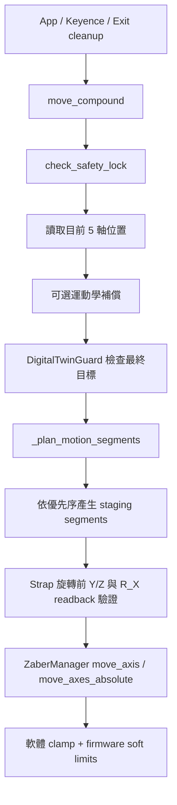
````

主入口在 [unified_driver.py (line 475)](D:/Provenance Laboratories projects/ImagingLibWatch/Controller/hardware_drivers/unified_driver.py:475)：

- 先檢查門禁鎖。
- 讀取目前五軸座標。
- 可選擇套用旋轉偏心補償。
- Digital Twin 檢查「最終位置」。
- 呼叫路徑規劃器。
- 旋轉 segment 前驗證 Strap staging readback。
- 最後交給 ZaberManager 執行。

注意：Digital Twin 只檢查最終目標，不會沿每個中間 segment 連續取樣檢查碰撞。

### B. 一般 Template capture 路徑

`execute_template_point()` 在 [unified_driver.py (line 8591)](D:/Provenance Laboratories projects/ImagingLibWatch/Controller/hardware_drivers/unified_driver.py:8591)：

- 有執行 `check_safety_lock()`。
- 有呼叫 `_plan_motion_segments()`。
- 但沒有經過 `move_compound()`。
- 因此沒有一般目標的 Digital Twin 檢查。
- 執行 segment 時也沒有 `move_compound` 那組 Strap rotation staging readback 驗證。

也就是說，目前「正式拍攝路徑」有規則式 dog-leg/interlock，但保護程度弱於直接使用 `move_compound()`。

### C. Strap macro_cam_1 掃描

這是目前最保守的一條路徑：

1. 驗證整份 scan config。
2. 驗證每個 pose 的軸範圍及最低 Y。
3. 建立 Y → Z → fold R_X → rotate R_Z → restore R_X → X → Y → Z 的外層 waypoint。
4. 每個 waypoint 再送入 `move_compound()`。
5. 每個 waypoint 完成後核對五軸 readback。

主要位置：

- Config preflight：[App/main.py (line 34250)](D:/Provenance Laboratories projects/ImagingLibWatch/App/main.py:34250)
- Pose 限位：[App/main.py (line 34489)](D:/Provenance Laboratories projects/ImagingLibWatch/App/main.py:34489)
- 安全 compound wrapper：[App/main.py (line 34525)](D:/Provenance Laboratories projects/ImagingLibWatch/App/main.py:34525)
- View transition/readback：[App/main.py (line 34593)](D:/Provenance Laboratories projects/ImagingLibWatch/App/main.py:34593)
- Waypoint 產生器：[strap_macro1_scan.py (line 1151)](D:/Provenance Laboratories projects/ImagingLibWatch/core/strap_macro1_scan.py:1151)

### D. Strap Keyence 探針

Keyence 專用路徑在 [unified_driver.py (line 3296)](D:/Provenance Laboratories projects/ImagingLibWatch/Controller/hardware_drivers/unified_driver.py:3296)：

- 先拒絕非數值、非有限值及超過軸限位的目標。
- Strap 先退到固定 staging。
- 檢查 safety lock。
- 執行 Digital Twin。
- 執行 `_plan_motion_segments()`。
- 旋轉前核對 staging 與 R_X fold。
- 完成後核對五軸 readback。

這條路徑和 macro_cam_1 scan 是目前保護最完整的兩條。

---

## `_plan_motion_segments` 實際優先序

核心位於 [unified_driver.py (line 606)](D:/Provenance Laboratories projects/ImagingLibWatch/Controller/hardware_drivers/unified_driver.py:606)。它是 first-match-return，實際順序為：

1. `strap_special_staging`
    
    特定 `internalnum1` 必須同時匹配白名單中的完整五軸位置；進入、離開都經 Y=160、Z=70。白名單是 `4029–4032`。
    
2. Strap Keyence staging
    
    探針移動使用同一套 special staging contract。
    
3. Strap wall envelope
    
    依公式檢查：
    
    `clearance = Y - wall_y - half_length × abs(sin(R_Z))`
    
4. Large R_X transition
    
    大幅 R_X 變化時，使用：
    
    `Y safe → Z safe → fold R_X → R_Z → restore R_X → X → Z → Y`
    
5. Strap high-risk interlock
    
    R_X ≥ 30° 且 R_Z 路徑接近 90°/270°時觸發；小 Y 的最終位置必須有明確 semantic whitelist。
    
6. Generic fixture rotation interlock
    
    `Z retract → fold R_X → R_Z+XY → restore R_X → target Z`
    
7. View-mode dog-leg
    
    `REHAUT/CROWN/SIDE/LEFT_HAND_CROWN` 一律先 retract Z；其他 view 依 Z 移動方向決定先後。
    

---

## 設定位置

主要設定集中在 [hardware_config.yaml (line 78)](D:/Provenance Laboratories projects/ImagingLibWatch/config/hardware_config.yaml:78)：

|設定|位置|目前值/作用|
|---|---|---|
|門禁 MQTT|78–82|localhost:1883、DI0|
|運動學 pivot/arm|104–108|Digital Twin 幾何來源|
|Digital Twin boxes|110–113|全部為 `0.0`|
|Generic safe retract|115|Z=20|
|Home poses|116–146|watch/strap/box|
|舊 Strap interlock|147–157|fallback/重複設定|
|Fixture profile|159–166|active=`watch`、mode=`4`|
|Watch motion safety|168–239|large-RX、special、wall、high-risk|
|Box motion safety|240–259|box 專用角度窗口|
|Zaber 軸限位|296–301|X/Y/Z/RX 有界，RZ 為連續軸|

Strap macro_cam_1 的額外設定在 [strap_macro_cam1_scan.yaml (line 267)](D:/Provenance Laboratories projects/ImagingLibWatch/config/strap_macro_cam1_scan.yaml:267)：

- `calibration_confirmed: true`
- `require_hardware_safety_planner: true`
- `require_nonzero_collision_envelopes: false`
- Strap 全長 240 mm
- 最低牆面間隙 30 mm
- staging Y=160、Z=70
- 額外 stage limits
- 強制 view transition staging
- readback tolerance

---

## 相似或重複機制整理

### 1. 兩套幾何碰撞引擎

- 正式引用的是 [DigitalTwinGuard (line 6)](D:/Provenance Laboratories projects/ImagingLibWatch/Controller/kinematics/digital_twin_guard.py:6)。
- [SafeZoneManager (line 11)](D:/Provenance Laboratories projects/ImagingLibWatch/Controller/hardware_drivers/safe_zone_manager.py:11) 是另一套 AABB、另一套 config 格式及 pivot 定義。
- 全 repo 沒有找到 `SafeZoneManager` 的實際呼叫者，目前可視為未接線/遺留實作。

兩者不應被誤認為雙重保護；現況只有 Digital Twin 接在部分正式路徑上。

### 2. 三套相似的安全路徑

- Unified driver 的通用 `_plan_motion_segments`。
- Strap scan 的外層 `build_safe_transition_waypoints`。
- App 關閉/換頁的 `_move_zaber_to_strap_safe_retract`。

後兩者不是完全重複：它們增加 waypoint readback 或 shutdown staging，但固定數值和移動順序高度相似。

### 3. 安全常數重複

- Y=160：large-RX、special staging、high-risk、scan transit。
- Z=70：large-RX、special staging、high-risk、scan retract。
- Wall clearance=30：hardware wall envelope 與 scan safety。
- Strap half-length：
    - hardware legacy envelope：100 mm
    - motion recorder legacy：100 mm
    - macro_cam_1 scan：120 mm

macro_cam_1 會透過 semantic metadata 把 driver 的 100 mm 加嚴至 120 mm，因此不是單純衝突；但目前來源分散，容易日後漂移。

### 4. 軸限位重複

- Hardware 真正限位在 `hardware_config.yaml`。
- macro_cam_1 scan 又有一份 `safety.stage_limits`。

兩份目前數值相同，但沒有單一來源自動同步。

### 5. 兩種 emergency stop

- `trigger_emergency_stop()`：停止硬體並把 `_system_locked=True`，必須人工 reset。
- `emergency_stop()`：只停止 Zaber/light/camera，不會 latch `_system_locked`。

因此不同 UI/呼叫者使用不同 API 時，停止後的鎖定行為並不一致。

---

## 現有底層保護

ZaberManager 在 [hardware_managers.py (line 249)](D:/Provenance Laboratories projects/ImagingLibWatch/Controller/hardware_managers.py:249) 提供：

- 啟動時將 YAML limits 寫入 Zaber firmware。
- 每次 `move_axis` 再做軟體 clamp。
- `RLock` 避免多執行緒同時發送移動。
- compound move 固定命令順序為 Z、R_X、R_Z、X、Y。
- R_Z 空陣列表示連續旋轉；韌體限位被擴成極大值。
- 急停呼叫所有裝置的 `all_axes.stop()`。

但低階移動超界時是「clamp 後繼續」，不是 fail-closed 拒絕；上層若沒有 readback 驗證，可能誤以為已到達原始目標。

---

## 門禁與急停

實作在：

- [SafetyManager (line 4261)](D:/Provenance Laboratories projects/ImagingLibWatch/Controller/hardware_managers.py:4261)
- [trigger_emergency_stop (line 4566)](D:/Provenance Laboratories projects/ImagingLibWatch/Controller/hardware_drivers/unified_driver.py:4566)

行為：

- Production 才連 MQTT。
- `DI0 == 0/false` 觸發急停。
- JSON 解析錯誤也 fail-closed 觸發急停。
- 停止順序為 Zaber → lighting → camera。
- 鎖定後需要 `manual_safety_reset()`。

缺口：

- MQTT 初始連線失敗或後續斷線只記錄 disconnected，不會自動 latch 急停。
- `manual_safety_reset()` 不檢查門是否已關閉，也不檢查 SafetyManager/MQTT 是否恢復；它只恢復 Zaber/light/camera/IO。

---

## 明確繞過完整防撞的入口

|入口|實際保護|
|---|---|
|[WorkflowManager.manual_move (line 3056)](D:/Provenance Laboratories projects/ImagingLibWatch/core/workflow_manager.py:3056)|直接呼叫 Zaber；只有軸 clamp/firmware limit|
|[controller_server move_stage (line 98)](D:/Provenance Laboratories projects/ImagingLibWatch/Controller/controller_server.py:98)|直接 Zaber，沒有 planner、Digital Twin、SafetyManager|
|測試工具直接使用 ZaberManager|通常只有軸限位|
|多個 autofocus 內部微調|初始 pose 可能安全，但後續直接單軸移動，不逐步跑 Digital Twin|
|`execute_template_point`|有鎖及 planner，沒有一般 `move_compound` 的 Digital Twin/readback 層|

---

## 稽核與測試

Strap 執行時會在 `DB/strap_motion_logs` 記錄：

- 每個 Zaber command。
- 移動前、目標、移動後的位置。
- Strap 對 Y=0 牆的計算間隙。
- 最低間隙及是否出現負值。

程式在 [strap_motion_recorder.py (line 36)](D:/Provenance Laboratories projects/ImagingLibWatch/core/strap_motion_recorder.py:36)。這是事後稽核，不會即時阻止移動。

主要測試：

- [test_unified_motion_planning.py (line 36)](D:/Provenance Laboratories projects/ImagingLibWatch/tests/test_unified_motion_planning.py:36)：high-risk、special staging、readback fail-closed、連續 R_Z。
- [test_strap_macro1_scan.py (line 963)](D:/Provenance Laboratories projects/ImagingLibWatch/tests/test_strap_macro1_scan.py:963)：safe transition、軸限位、wall envelope、零碰撞盒 gate。
- [test_safety_system.py (line 1)](D:/Provenance Laboratories projects/ImagingLibWatch/Controller/test_hardware/test_safety_system.py:1)：MQTT 門禁模擬；不是實體門鎖/HIL 測試。

## 建議優先處理

1. 實測並填入非零 `safe_zone` 包絡，然後將 `require_nonzero_collision_envelopes` 改為 `true`。
2. 讓 `execute_template_point` 統一走 `move_compound`，或補上相同 Digital Twin/readback contract。
3. 禁止 production 的 `manual_move`/`controller_server.move_stage` 直接繞過 planner。
4. MQTT disconnected 應 fail-closed，manual reset 應確認門已關閉且 safety channel healthy。
5. 合併重複的 Y/Z、wall geometry、stage limits 成單一安全設定來源。
6. 明確區分「latched emergency stop」與「shutdown stop」，避免 UI 呼叫錯誤 API。

變更檔案：無。實體設備仍需要空治具、低速、最長 Strap、門禁斷線及實體 E-stop 的 HIL 驗證。


#### move_compound function analysis
```
所以在執行App main.py的每個有移動跟轉動的job都是使用move_compound function去控制? 還是有拍照task的有移動跟轉動的job都是使用move_compound function去控制? 那在App裡面的create template的拍照流程跟App裡面的watchentry的拍照流程是否也都使用move_compound function? 或像移動到home or center or 要放置watch的是否也使用move_compound function?

也請介紹以下列出的move_compound完整步驟是否正確  
flowchart TD  
A["App / Keyence / Exit cleanup"] --> B["move_compound"]  
B --> C["check_safety_lock"]  
C --> D["讀取目前 5 軸位置"]  
D --> E["可選運動學補償"]  
E --> F["DigitalTwinGuard 檢查最終目標"]  
F --> G["_plan_motion_segments"]  
G --> H["依優先序產生 staging segments"]  
H --> I["Strap 旋轉前 Y/Z 與 R_X readback 驗證"]  
I --> J["ZaberManager move_axis / move_axes_absolute"]  
J --> K["軟體 clamp + firmware soft limits"]  
並介紹每個步驟A,B,C....  
以及各跟那些functions and config有關
```

結論：**不是所有 App 移動，也不是所有拍照移動，都會呼叫 `move_compound()`。**

更精確地說，目前有三種運動路徑：

1. 直接呼叫 `move_compound()`。
2. 不呼叫 `move_compound()`，但直接使用同一個 `_plan_motion_segments()` planner。
3. 直接呼叫 `zaber.move_axis()`／`move_axes_absolute()`，完全繞過 planner 與 Digital Twin。

## 各 App 流程實際走法

| App 功能                         | 是否呼叫 `move_compound()` | 實際路徑                                                                                  |
| ------------------------------ | ---------------------- | ------------------------------------------------------------------------------------- |
| A. Create Template pre-capture | 否                      | `execute_template_point()` → `_plan_motion_segments()` → Zaber                        |
| B. Create Template 點選後正式拍照     | 通常否                    | `execute_template_point()` → planner → AF → final approach                            |
| C. WatchEntry 正式拍照             | 否                      | `_capture_images_routine_internal()` → `execute_template_point()` → planner           |
| D. Standard/HDR capture        | 否                      | 都進 `execute_template_point()`；HDR 同點可能略過重複 XYZ                                        |
| E. Control panel 手動五軸移動        | 是                      | `_move_control_pose()` → `move_compound()`                                            |
| F. Control panel Go Home       | 是                      | `_resolve_control_home_pose()` → `_move_control_pose()` → `move_compound()`           |
| G. 移到 holder／放錶位置              | 是，production driver 下  | `_move_zaber_to_start_pos()` → `_move_zaber_to_safe_strap_pose()` → `move_compound()` |
| H. 移到 watch center             | 是                      | `_move_zaber_to_center_pos()` → safe strap pose → `move_compound()`                   |
| I. App Exit 最終回 Home           | 部分                     | 先用直接 `move_axis()` 做 Strap safe retract，再用 `move_compound()` 回 Home                   |
| J. Keyence probe 移動            | 否                      | `_execute_keyence_planned_pose()` 直接做 Digital Twin + planner + Zaber                  |
| K. Final focus approach        | 否                      | `_do_final_approach()` 直接呼叫 Zaber                                                     |
| L. 某些 AF 掃描／Keyence XY 掃描      | 混合                     | 有些 Y scan 用 `move_compound()`；有些直接 `move_axis()`                                      |
| M. simulation `move_compound`  | 名稱相同但不是安全路徑            | 只有 sleep，沒有 planner 或碰撞檢查                                                             |

主要依據：

- Create Template pre-capture 呼叫 [`execute_template_point()` (line 1640)](/D:/Provenance Project/ImagingLibWatch/App/main.py:1640)
- Create Template prepared capture 呼叫 [`execute_template_point()` (line 8788)](/D:/Provenance Project/ImagingLibWatch/App/main.py:8788)
- WatchEntry capture routine 呼叫 [`execute_template_point()` (line 32043)](/D:/Provenance Project/ImagingLibWatch/App/main.py:32043)
- `execute_template_point()` 直接呼叫 planner，而非 `move_compound()`：[unified_driver.py (line 9420)](/D:/Provenance Project/ImagingLibWatch/Controller/hardware_drivers/unified_driver.py:9420)
- Control panel 移動呼叫 `move_compound()`：[main.py (line 26483)](/D:/Provenance Project/ImagingLibWatch/App/main.py:26483)
- Holder/Center 共用 safe pose：[main.py (line 9325)](/D:/Provenance Project/ImagingLibWatch/App/main.py:9325)
- Exit cleanup：[main.py (line 3545)](/D:/Provenance Project/ImagingLibWatch/App/main.py:3545)、[main.py (line 3657)](/D:/Provenance Project/ImagingLibWatch/App/main.py:3657)

所以「拍照 task 有移動與轉動」並不能直接推導成「一定呼叫 `move_compound()`」。正式拍照通常只是**共用它的 planner**。

---

## 你的 A–K 流程是否正確

整體方向接近，但 A、I、K 需要修正，而且漏掉 `move_compound()` 的參數正規化及錯誤處理。

````
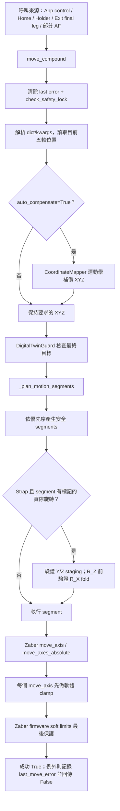
````

### A：App / Keyence / Exit cleanup

你的：

> App / Keyence / Exit cleanup → move_compound

只對一部分來源成立。

- App control、Go Home、holder、center：會進 `move_compound()`。
- Exit：safe retract 是直接 `move_axis()`；safe retract 成功後，最後回 Home 才進 `move_compound()`。
- Keyence：主要走 `_execute_keyence_planned_pose()`，它直接呼叫 Digital Twin、planner 和 Zaber，不會經過 `move_compound()`。
- Create Template／WatchEntry 拍照：主要走 `execute_template_point()`，同樣直接使用 planner。

### B：`move_compound`

定義位於 [unified_driver.py (line 475)](/D:/Provenance Project/ImagingLibWatch/Controller/hardware_drivers/unified_driver.py:475)。

接受：

- `target_x/y/z`
- `target_rx/rz`
- 或傳入 `{"stage_L_X": ..., ...}` dict
- `auto_compensate`
- `cam_alias`
- `wait`
- `semantic_target`

未指定的軸會使用目前位置，而不是歸零。

### C：`check_safety_lock`

位於 [unified_driver.py (line 4560)](/D:/Provenance Project/ImagingLibWatch/Controller/hardware_drivers/unified_driver.py:4560)。

它只檢查 `_system_locked`。Door-open／SafetyManager 觸發 `trigger_emergency_stop()` 後會：

- 停止 Zaber
- 關閉燈光
- 停止相機
- 將系統保持 locked

必須透過 `manual_safety_reset()` 完成硬體 recovery 後才解除。

這不是幾何碰撞檢查；它是「系統是否已被安全事件鎖住」。

### D：讀取目前五軸位置

讀取：

- `stage_L_X`
- `stage_L_Y`
- `stage_L_Z`
- `stage_R_X`
- `stage_R_Z`

其中 R_Z 是 continuous rotation axis，所以會先用 `canonical_angle_deg()` 正規化成等價的 0–360° 角度，規劃與比較才不會把例如 23760° 認為需要轉很多圈。

Zaber 真正送命令時又會用 `_nearest_equivalent_angle()` 選擇離目前位置最近的等價角度。

### E：可選運動學補償

方向正確，但它只在：

```
auto_compensate=True
```

且 R_X/R_Z 發生改變時執行。

相關 function：

- `CoordinateMapper.calculate_full_eccentric_compensation()`
- `move_compound()` 內將 `dX/dY/dZ` 加到 requested XYZ

相關 config：

- `hardware.zaber.kinematics`
- `pivot_z_L1`
- `camera_arm_L2_macro`
- `camera_arm_L2_micro`
- rotation pivot 等參數

重要現況：App 中找到的 production `move_compound()` callers 幾乎都明確傳入 `auto_compensate=False`，目前沒有非測試 caller 明確使用 `True`。

另外，`execute_template_point()` 有另一套不同的 `_apply_angle_pose_compensation()`，受以下設定控制：

- `hardware.autofocus.keyence_autofocus.angle_aware`
- `pose_compensation`
- `angle_pose_compensation`

這套不能和 `move_compound(auto_compensate=True)` 當成同一件事。

### F：DigitalTwinGuard 檢查最終目標

正確，但只檢查**最終 target pose**：

```
predict_collision(x, y, z, rx, rz, cam_alias)
```

相關程式：

- [digital_twin_guard.py (line 6)](/D:/Provenance Project/ImagingLibWatch/Controller/kinematics/digital_twin_guard.py:6)
- `DigitalTwinGuard.predict_collision()`
- `_get_aabb()`
- `_check_overlap()`

相關 config：

- `hardware.zaber.kinematics`
- `hardware.zaber.safe_zone.platform_box`
- `macro_box`
- `micro_box`

目前 config 中這些 box 尺寸全部是 `0.0`：

```
platform_box: {width: 0.0, depth: 0.0, height: 0.0}
macro_box: {width: 0.0, length: 0.0}
micro_box: {width: 0.0, length: 0.0}
```

見 [hardware_config.yaml (line 110)](/D:/Provenance Project/ImagingLibWatch/config/hardware_config.yaml:110)。

因此目前 Digital Twin 無法代表真實平台、錶與鏡頭體積，實際幾何保護能力非常有限。現有安全主要依靠 `_plan_motion_segments()` 的規則式 interlocks。

另一個限制是：`move_compound()` 並沒有對 planner 產生的每一個中間 segment 再逐段做 Digital Twin 檢查。

### G、H：`_plan_motion_segments` 與 staging priority

定義位於 [unified_driver.py (line 606)](/D:/Provenance Project/ImagingLibWatch/Controller/hardware_drivers/unified_driver.py:606)。

規劃大致依下列優先序：

1. Strap 特殊 internalnum whitelist：
    
    - 4029–4032
    - 驗證 internalnum 和完整五軸 target 必須吻合
    - 經 Y=160、Z=70 staging
2. 離開 Strap 特殊點：
    
    - 先退出到 safe Y/Z
    - 再遞迴規劃後續目的地
3. Strap Keyence transition：
    
    - 強制經特殊 staging
4. Strap wall envelope：
    
    - 根據 Y、R_Z、strap half-length 計算靠牆端點 clearance
    - 不足時直接 reject，不產生 motion
5. Large R_X transition：
    
    - Y safe
    - Z safe
    - 必要時 fold R_X
    - R_Z
    - restore R_X
    - final X
    - final Z
    - final Y
6. Strap high-risk interlock：
    
    - 特別處理 R_X 高角度且 R_Z 接近 90°／270° 的情況
    - 可能要求 `allow_high_risk_final_approach`
7. 一般 fixture rotation interlock：
    
    - retract Z
    - fold R_X
    - rotate R_Z + XY
    - restore R_X
    - final Z
8. `REHAUT_VIEW`／`CROWN_VIEW`／`SIDE_VIEW`：
    
    - Z retract
    - 高度安全時移動 XY/RX/RZ
    - Z descend
9. Front／Back 一般路徑：
    
    - 依 target Z 相對 current Z 決定先 Z 還是先 XY/rotation

相關 config 集中在 [hardware_config.yaml (line 147)](/D:/Provenance Project/ImagingLibWatch/config/hardware_config.yaml:147)：

- `fixture.active_profile`
- `motion_interlock_mode`
- `safe_retract_z`
- `rotation_interlock`
- `large_rx_transition`
- `strap_special_staging`
- `strap_wall_envelope`
- `strap_high_risk_interlock`
- `strap_x_only_keep_rx_at_rz_0_180`

### I：Strap 旋轉前 readback 驗證

你的描述需要加上「條件式」。

在 `move_compound()` 中，只有同時符合以下條件才驗證：

- segment 是 `COMPOUND`
- 包含 R_X 或 R_Z
- semantic target 被辨識為 Strap
- segment 有 `strap_rotation_staging_required=True`
- readback 顯示真的有 rotation delta

相關 functions：

- `_is_strap_semantic_target()`
- `_strap_segment_has_rotation_delta()`
- `_verify_strap_rotation_staging()`：驗證 Y/Z
- `_verify_strap_rz_fold_readback()`：R_Z 前驗證 R_X 已 fold

它不是所有 rotation segment 都無條件執行。

另外，`execute_template_point()` 在 [unified_driver.py (line 9434)](/D:/Provenance Project/ImagingLibWatch/Controller/hardware_drivers/unified_driver.py:9434) 自己執行 planner segments 時，沒有走 `move_compound()` 裡這段相同的 Strap rotation readback wrapper。Keyence 的 `_execute_keyence_planned_pose()` 則有自己的 readback 驗證。

### J：ZaberManager 執行

Planner 只產生兩種主要 segment：

- `Z_ONLY` → `zaber.move_axis("stage_L_Z", ...)`
- `COMPOUND` → `zaber.move_axes_absolute({...})`

`move_axes_absolute()` 的預設命令順序為：

1. Z
2. R_X
3. R_Z
4. X
5. Y

但實際 segment 通常只包含其中幾軸；planner 已經事先將安全順序拆成多個 segment。

相關程式：[hardware_managers.py (line 458)](/D:/Provenance Project/ImagingLibWatch/Controller/hardware_managers.py:458)、[hardware_managers.py (line 500)](/D:/Provenance Project/ImagingLibWatch/Controller/hardware_managers.py:500)。

### K：軟體 clamp + firmware soft limits

概念正確，但它不是在 Zaber 命令完成後才做，而是在 J 裡面分成兩層：

1. 軟體 clamp  
    `ZaberManager.move_axis()` 送命令前根據 `self.limits` clamp。
    
2. Firmware limits  
    Zaber 連線時 `_apply_hardware_limits()` 將同一組 limits 寫入：
    
    - `limit.min`
    - `limit.max`

相關 config 位於 [hardware_config.yaml (line 296)](/D:/Provenance Project/ImagingLibWatch/config/hardware_config.yaml:296)：

- X：0–435 mm
- Y：0–292 mm
- Z：0–150 mm
- R_X：0–90°
- R_Z：空 list，代表 continuous rotation

這一層只限制各軸 travel range，無法判斷多軸組合是否會碰撞。

## 最重要的架構判讀

目前不是：

```
所有移動 → move_compound → 安全
```

而是：

```
App Home/Holder/Control
    → move_compound
    → Digital Twin final target
    → planner
    → Zaber

Create Template / WatchEntry capture
    → execute_template_point
    → angle-aware compensation
    → planner
    → Keyence/AF
    → direct final approach
    → capture

Keyence planned probe
    → Keyence-specific preflight
    → Digital Twin
    → planner
    → Strap readback verification
    → Zaber

其他 AF / cleanup / compatibility paths
    → 可能直接 Zaber
```

因此，`move_compound()` 是重要的安全入口，但目前還不是全 App 唯一的五軸運動入口。最值得注意的殘餘風險是：

- Digital Twin box 尺寸目前為零。
- `execute_template_point()` 複用 planner，但不複用完整 `move_compound()` wrapper。
- `_do_final_approach()` 直接走 Zaber。
- 仍存在直接 `move_axis()` 的 AF、safe retract、compatibility 路徑。
- `move_compound()` 捕捉例外後回傳 `False`，caller 必須檢查；而且它目前沒有檢查每個 Zaber segment 的 boolean 回傳值。
-


```
如果依App main.py的各 App 流程實際走法依照下列的錶列出的13個流程:


## 各 App 流程實際走法

| App 功能                         | 是否呼叫 `move_compound()` | 實際路徑                                                                                  |
| ------------------------------ | ---------------------- | ------------------------------------------------------------------------------------- |
| A. Create Template pre-capture | 否                      | `execute_template_point()` → `_plan_motion_segments()` → Zaber                        |
| B. Create Template 點選後正式拍照     | 通常否                    | `execute_template_point()` → planner → AF → final approach                            |
| C. WatchEntry 正式拍照             | 否                      | `_capture_images_routine_internal()` → `execute_template_point()` → planner           |
| D. Standard/HDR capture        | 否                      | 都進 `execute_template_point()`；HDR 同點可能略過重複 XYZ                                        |
| E. Control panel 手動五軸移動        | 是                      | `_move_control_pose()` → `move_compound()`                                            |
| F. Control panel Go Home       | 是                      | `_resolve_control_home_pose()` → `_move_control_pose()` → `move_compound()`           |
| G. 移到 holder／放錶位置              | 是，production driver 下  | `_move_zaber_to_start_pos()` → `_move_zaber_to_safe_strap_pose()` → `move_compound()` |
| H. 移到 watch center             | 是                      | `_move_zaber_to_center_pos()` → safe strap pose → `move_compound()`                   |
| I. App Exit 最終回 Home           | 部分                     | 先用直接 `move_axis()` 做 Strap safe retract，再用 `move_compound()` 回 Home                   |
| J. Keyence probe 移動            | 否                      | `_execute_keyence_planned_pose()` 直接做 Digital Twin + planner + Zaber                  |
| K. Final focus approach        | 否                      | `_do_final_approach()` 直接呼叫 Zaber                                                     |
| L. 某些 AF 掃描／Keyence XY 掃描      | 混合                     | 有些 Y scan 用 `move_compound()`；有些直接 `move_axis()`                                      |
| M. simulation `move_compound`  | 名稱相同但不是安全路徑            | 只有 sleep，沒有 planner 或碰撞檢查                                                             |


我希望以此為基準完善各 App 流程的並模組化整理(也先不要修改code而是釐清每條流程), 包括個別流程的主要流程function(舉例來說在第一個Create Template pre-capture你有寫到實際路徑`execute_template_point()` → `_plan_motion_segments()` → Zaber那這是否是包含在哪個function裡面, 我會稱這個function為主要流程function or 入口function, 也就是在這function裡包含`execute_template_point()` → `_plan_motion_segments()` → Zaber, 且這function最可以代表Create Template pre-capture). 

然後就像Create Template pre-capture, Create Template 點選後正式拍照, WatchEntry 正式拍照, Standard/HDR capture都有execute_template_point, 所以這些execute_template_point不同流程使用到execute_template_point下面的每一步小流程是否都一樣? 那這些小流程各是甚麼? 

也請將一些類似execute_template_point這樣常用且有很多步小流程的也要整理這些小流程
```

已依目前程式做完靜態追蹤，沒有修改任何 code。

先講核心結論：

1. `execute_template_point()` 是「單一拍攝點的共用拍攝引擎」，但不同呼叫者不會走完全相同的小流程；Standard、HDR、AF 模式、焦點重用與位置快取都會造成分支或跳過。
2. `move_compound()` 是「一般五軸安全移動入口」，它與 `execute_template_point()` 都使用 `_plan_motion_segments()`，但兩者不是同一條安全路徑。
3. `execute_template_point()` 的初始定位雖使用 planner，卻不經過 `move_compound()`，因此也沒有 `move_compound()` 裡的 Digital Twin final-target 檢查；後段 `_do_final_approach()` 更是直接操作 Zaber。
4. 目前 [system_config.yaml (line 2)](D:/Provenance Laboratories projects/ImagingLibWatch/config/system_config.yaml:2) 是 `simulation`。以下 hardware 路徑是 production/hybrid 時的實際走法。
5. `_execute_point_capture()` 目前只有定義、沒有靜態呼叫者，應視為舊路徑，不能代表現行 Create Template 正式拍照。

## 一、建議統一成三層理解

````
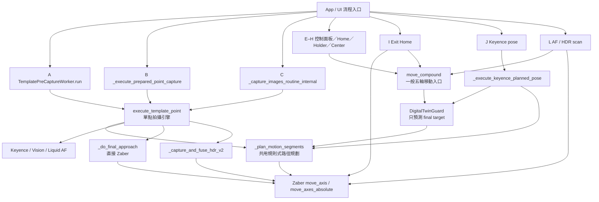
````

這張圖最重要的地方是：`_plan_motion_segments()` 是共用 planner，但「有使用 planner」不等於「完整走過同一個安全入口」。

---

# 二、A–M 每條 App 流程的主要入口

|流程|最具代表性的主要流程函式|production/hybrid 實際主路徑|判定|
|---|---|---|---|
|A. Create Template pre-capture|`TemplatePreCaptureWorker.run()`|`_start_template_pre_capture_sequence()` → Worker `run()` → 建立每張 `hw_cfg` → `execute_template_point()` → 儲存/旋轉/crop|原表方向正確，但真正代表整個流程的是 Worker `run()`|
|B. Create Template 正式點拍|`_execute_prepared_point_capture()`|`_scratch_next_capture()` → `_start_prepared_point_capture_async()` → `_execute_prepared_point_capture()` → `execute_template_point()`|現行路徑；舊 `_execute_point_capture()` 沒有呼叫者|
|C. WatchEntry 正式拍照|`_capture_images_routine_internal()`|`load_camimgs()` → `CaptureRoutineWorker.run()` → `_capture_images_routine_internal()` → capture loop → `execute_template_point()`|正確|
|D. Standard/HDR|不是獨立入口，是 B/C 內的 capture 分支|Standard/HDR 都建立各自 `hw_cfg` → `execute_template_point()`|共用入口，但內部步驟不完全相同|
|E. Control panel 五軸移動|`_move_control_pose()`|`_ctrl_move()` → `_move_control_pose()` → `move_compound()`|正確|
|F. Control panel Go Home|`_ctrl_action(...,"go_home")`|`_resolve_control_home_pose()` → `_move_control_pose()` → `move_compound()`|正確|
|G. Holder／放錶位置|`_move_zaber_to_start_pos()`|Macro 1：`_strap_macro1_transition_to_pose()`；其他 camera：`_move_zaber_to_safe_strap_pose()` → `move_compound()`|原表需補 Macro 1 特殊 transition|
|H. Watch center|`_move_zaber_to_center_pos()`|與 G 相同，依 camera 分成 Macro 1 特殊路徑或一般 safe strap pose|原表需補 Macro 1 分支|
|I. App Exit Home|`_move_zaber_to_home_on_exit()`|`closeEvent()` → `_move_zaber_to_strap_safe_retract()` 直接分軸 → `move_compound(home)`|正確|
|J. Keyence probe|App-facing：`position_height_measurement_probe()`；共用核心：`_execute_keyence_planned_pose()`|target validation → safety lock → Strap staging → Digital Twin → planner → Zaber → readback|正確，但 helper 並非唯一 UI 入口|
|K. Final focus approach|`_do_final_approach()`|near point → 切 capture profile → 直接 Zaber X/Y/Z|正確；不經 planner/Twin|
|L. AF/Keyence XY/Y scan|依 AF 類型不同|Side Y scan 可用 `move_compound()`；Keyence/vision/HDR Z-stack 有直接 `move_axis()`|正確，是混合安全邊界|
|M. Simulation move|`SimulationHardware.move_compound()`|log → sleep 0.5 秒|正確；沒有 planner、碰撞檢查、pose state，且介面也與 production 不完全一致|

## A. Create Template pre-capture

UI 啟動入口：

- [`_start_template_pre_capture_sequence()` (line 16836)](D:/Provenance Laboratories projects/ImagingLibWatch/App/main.py:16836)

真正包含完整五張圖循環的主要流程函式：

- [`TemplatePreCaptureWorker` (line 1508)](D:/Provenance Laboratories projects/ImagingLibWatch/App/main.py:1508)
- [`TemplatePreCaptureWorker.run()` (line 1540)](D:/Provenance Laboratories projects/ImagingLibWatch/App/main.py:1540)

路徑：

```
_start_template_pre_capture_sequence()
└─ TemplatePreCaptureWorker.run()
   ├─ 依 front / side1 / side2 / side3 / side4 建立 hw_cfg
   ├─ simulation：讀取模擬圖片
   └─ production/hybrid：
      └─ execute_template_point(hw_cfg)
         ├─ planner / AF / final approach
         └─ camera capture
   ├─ rotation
   ├─ center crop
   └─ 儲存 JPG / progress signal
```

完成後再進：

- [`_on_template_pre_capture_finished()` (line 17249)](D:/Provenance Laboratories projects/ImagingLibWatch/App/main.py:17249)：更新圖片、執行 color detection、復歸角度、切換頁面。

所以 A 的「主要流程函式」應定義為 `TemplatePreCaptureWorker.run()`；`_start_template_pre_capture_sequence()` 是 UI/執行緒入口。

## B. Create Template 點選後正式拍照

現行主要流程：

- [`_prepare_selected_point_from_enlarge()` (line 8172)](D:/Provenance Laboratories projects/ImagingLibWatch/App/main.py:8172)：把點選座標轉成 pose，這時還沒有正式 AF/capture。
- [`_scratch_next_capture()` (line 15858)](D:/Provenance Laboratories projects/ImagingLibWatch/App/main.py:15858)：決定下一張 Standard/HDR。
- [`_start_prepared_point_capture_async()` (line 8886)](D:/Provenance Laboratories projects/ImagingLibWatch/App/main.py:8886)：非同步入口。
- [`_execute_prepared_point_capture()` (line 8487)](D:/Provenance Laboratories projects/ImagingLibWatch/App/main.py:8487)：最能代表正式拍照的主要流程函式。

```
_prepare_selected_point_from_enlarge()
└─ 準備/鎖定 pose

_scratch_next_capture()
└─ _start_prepared_point_capture_async()
   └─ _execute_prepared_point_capture()
      ├─ 解析 point/capture/internalnum
      ├─ 建立 canonical hw_cfg
      ├─ 建立 focus_hardware
      ├─ 套用 bezel policy
      ├─ HDR 可重用上一張 Standard focus
      ├─ execute_template_point()
      └─ 保存 scratch image / focus state
```

舊的 [`_execute_point_capture()` (line 8362)](D:/Provenance Laboratories projects/ImagingLibWatch/App/main.py:8362)：

- Micro 走 interactive micro capture。
- Macro 直接 `move_compound()` 後拍照。
- 目前 `rg` 只找到定義，沒有實際呼叫者，應標為 legacy/dead candidate。

## C. WatchEntry 正式拍照

App/UI 入口：

- [`load_camimgs()` (line 31355)](D:/Provenance Laboratories projects/ImagingLibWatch/App/main.py:31355)

Worker：

- [`CaptureRoutineWorker` (line 1478)](D:/Provenance Laboratories projects/ImagingLibWatch/App/main.py:1478)
- `CaptureRoutineWorker.run()` 在同一區塊呼叫 internal routine。

主要流程函式：

- [`_capture_images_routine_internal()` (line 31780)](D:/Provenance Laboratories projects/ImagingLibWatch/App/main.py:31780)

```
load_camimgs(side)
└─ CaptureRoutineWorker.run()
   └─ _capture_images_routine_internal()
      ├─ 建立 DB run / output dirs
      ├─ 依 watchpoint execution order 走訪
      ├─ normalization：point + capture + internalnum
      ├─ 分出 standard_captures / hdr_captures
      ├─ 建立 focus_hardware
      ├─ 套用 WatchShift / bezel policy
      ├─ HDR 判斷是否重用 Standard focus
      ├─ execute_template_point(hw_cfg)
      ├─ 儲存 local image / DB
      ├─ S3 / metadata
      └─ analysis / UI progress
```

所以 C 的代表函式確實是 `_capture_images_routine_internal()`；`load_camimgs()` 是 UI 啟動層。

---

# 三、`execute_template_point()` 的完整小流程

核心位置：

- [`UnifiedHardwareDriver.execute_template_point()` (line 8591)](D:/Provenance Laboratories projects/ImagingLibWatch/Controller/hardware_drivers/unified_driver.py:8591)

## Phase 0：輸入與狀態

- fixture profile override。
- `check_safety_lock()`。
- 建立 side-reference scope。
- 判斷：
    - `is_hdr`
    - `z_positions`
    - `reuse_previous_focus`
    - `skip_xyz_move`
    - 是否使用獨立 `focus_hardware`
    - 是否有 Standard focus 可以重用。

## Phase 1：解析拍照與 AF 路由

主要工作：

1. 解析 `X/Y/Z/RX/RZ`、`Xmod/Ymod/Zmod`。
2. 解析 camera、exposure、gain、lighting、postcolor。
3. HDR AF 使用中間 exposure 作 preview。
4. 依 `af_mode_id` 載入 AF recipe。
5. 決定 capture camera 與 focus camera。
6. 呼叫 `resolve_autofocus_routing()` 決定：
    - Keyence coarse AF
    - vision AF
    - liquid-lens AF
    - side-Zaber AF
    - 是否略過 first camera pose。
7. 計算 Keyence angle-aware pose compensation。
8. 建立 position signature，判斷是否 `is_same_pos`。

## Phase 2：初始定位與機械 AF

只有 `not is_same_pos` 時執行：

```
讀取 current pose
→ 建立 target pose + semantic target
→ _plan_motion_segments()
→ 直接 zaber.move_axis / move_axes_absolute
→ 選擇 coarse AF
   ├─ option 4：_af_keyence_absolute()
   ├─ option 1：_af_keyence_matlab_like()
   ├─ option 2/3：_af_vision_method()
   └─ disabled：使用 base Z
→ 計算 final X/Y/Z
→ _do_final_approach()
```

重點：

- 這裡有 planner。
- 但沒有呼叫 `move_compound()`。
- 也沒有 `move_compound()` 裡的通用 Digital Twin preflight。
- `_do_final_approach()` 又是另一段直接 Zaber 路徑。

## Phase 3：拍照硬體設定

- 開 capture lights。
- 切換 camera。
- 套用 AWB/AGC/Gamma/ColorTransform lock。
- 設定並驗證 exposure/gain。

## Phase 4：Liquid AF 與最後修正

依設定走其中一條：

- `reuse_previous_focus`：保持目前 liquid current，不重新 AF。
- HDR skip AF：使用 manual cammag/current。
- Side-Zaber two-stage：
    - `_run_side_zaber_liquid_lens_autofocus()`
- Side reference reuse。
- FPGA/hardware liquid AF。
- software sweep fallback。
- AF failure fallback/manual current。
- 若 `focus_required` 且 AF 失敗，capture 前中止。
- 套用最後 `Xmod/Ymod/Zmod`。
- 若 mod 非零，第二次呼叫 `_do_final_approach()`。
- final stage readback。
- 恢復 capture lighting/camera/exposure。
- capture settle。

## Phase 5：真正拍照

- Standard：`cam.capture_image()`。
- HDR：[`_capture_and_fuse_hdr_v2()` (line 5201)](D:/Provenance Laboratories projects/ImagingLibWatch/Controller/hardware_drivers/unified_driver.py:5201)。
- finally 關燈。
- color calibration / post-color。
- rotation。
- 更新位置 signature cache。
- 回傳：

```
(image, final_z, glass_thickness)
```

---

# 四、Standard/HDR 是否走完全相同的小流程？

答案是：共用同一支函式，但不保證執行同一組步驟。

|情況|XYZ 初始移動|Coarse AF|Liquid AF|最終 capture|
|---|---|---|---|---|
|一般 Standard|通常執行|依 `use_autofocus`/AF mode|依 `use_liqud_af`|單張|
|同點 HDR，重用 Standard focus|通常跳過|跳過|保留 Standard liquid current|HDR brackets/fusion|
|HDR 有不同 `z_positions`|可能先到 base pose|視 Z bucket 政策重跑|視設定|多 exposure／多 Z|
|明確 `skip_xyz_move=True`|跳過|通常跳過|可能保留或手動設定|單張或 HDR|
|position signature 相同|跳過|跳過機械 AF|視 reuse/設定|繼續拍照|
|AF mode 7/8 等 side mode|執行 planner 定位|常停用 Keyence|Side-Zaber/FPGA two-stage|單張或 HDR|

因此真正決定差異的不是「誰呼叫它」，而是呼叫者組出的 `hw_cfg`：

- A：pre-capture 固定設定。
- B：prepared point + capture + focus_capture + bezel policy。
- C：template/watchpoint/capture + WatchEntry 修正 + Standard/HDR focus reference。
- D：`is_hdr`、`hdr_enable`、`z_positions`、`reuse_previous_focus`、`skip_xyz_move`。

---

# 五、其他常用複合函式

## 1. `move_compound()`

位置：

- [`move_compound()` (line 475)](D:/Provenance Laboratories projects/ImagingLibWatch/Controller/hardware_drivers/unified_driver.py:475)

內部步驟：

```
check_safety_lock()
→ 讀取五軸 current pose
→ target 正規化
→ optional kinematic auto compensation
→ DigitalTwinGuard.predict_collision(final target)
→ _plan_motion_segments()
→ 逐 segment 執行 Z_ONLY / COMPOUND
→ Strap rotation staging readback
→ 成功 True；例外轉成 False + _last_move_error
```

這是目前最完整的一般五軸移動入口，但 Digital Twin 只檢查 final target，沒有逐一檢查所有中間 segment 的幾何碰撞。

## 2. `_plan_motion_segments()`

位置：

- [`_plan_motion_segments()` (line 606)](D:/Provenance Laboratories projects/ImagingLibWatch/Controller/hardware_drivers/unified_driver.py:606)

它是規則式 planner，主要負責：

- fixture profile 與 `motion_interlock_mode`。
- safe retract Z。
- Strap/Box semantic 判斷。
- large R_X transition staging。
- Strap fixed-point whitelist。
- Strap wall envelope。
- high-risk R_X/R_Z staging。
- R_Z hazard crossing。
- generic dog-leg。
- 最後 target segment。

它不是 Digital Twin，也不直接操作硬體；輸出的是 `Z_ONLY`／`COMPOUND` segment 清單。

## 3. `_execute_keyence_planned_pose()`

位置：

- [`_execute_keyence_planned_pose()` (line 3296)](D:/Provenance Laboratories projects/ImagingLibWatch/Controller/hardware_drivers/unified_driver.py:3296)

步驟：

```
numeric/finite/axis-limit validation
→ safety lock
→ Strap Keyence staging
→ 讀 current pose
→ Digital Twin final-target check
→ _plan_motion_segments()
→ segment execution
→ Strap rotation/RX fold readback
→ final pose readback
→ report
```

這條比 `execute_template_point()` Phase 2 多了明確 axis-limit 與 Digital Twin preflight。

App-facing 六點量測入口是：

- [`position_height_measurement_probe()` (line 3483)](D:/Provenance Laboratories projects/ImagingLibWatch/Controller/hardware_drivers/unified_driver.py:3483)

一般 AF direct-probe 會經：

- [`_start_keyence_probe_motion()` (line 3435)](D:/Provenance Laboratories projects/ImagingLibWatch/Controller/hardware_drivers/unified_driver.py:3435)

## 4. `_do_final_approach()`

位置：

- [`_do_final_approach()` (line 4426)](D:/Provenance Laboratories projects/ImagingLibWatch/Controller/hardware_drivers/unified_driver.py:4426)

步驟：

```
讀 final_approach config
→ 套用 default motion profile
→ 移到 near target
→ 切 capture profile
→ 最後 X/Y/Z
→ 恢復 default profile
```

特殊 Strap case 會採 Y-last/reassert X/Z，但本質仍是直接 Zaber，不經：

- `move_compound()`
- `_plan_motion_segments()`
- Digital Twin

## 5. `_capture_and_fuse_hdr_v2()`

位置：

- [`_capture_and_fuse_hdr_v2()` (line 5201)](D:/Provenance Laboratories projects/ImagingLibWatch/Controller/hardware_drivers/unified_driver.py:5201)

包含：

- HDR defaults。
- 自動 exposure plan。
- exposure/Z bucket。
- 每 bucket lighting/exposure。
- 必要時遞迴呼叫 `execute_template_point()` 做 Z-bucket AF。
- 其他 Z-stack 移動則直接 `move_axis(stage_L_Z)`。
- bracket 儲存、fusion、auto processing。
- 最後 restore Z。

這也是 L 類「混合安全路徑」的一個來源。

## 6. AF 複合函式

- [`perform_two_stage_autofocus()` (line 1516)](D:/Provenance Laboratories projects/ImagingLibWatch/Controller/hardware_drivers/unified_driver.py:1516)  
    Control/API 型入口：coarse AF → `move_compound()` 到 focus Z → liquid AF。
    
- [`run_robust_autofocus()` (line 1622)](D:/Provenance Laboratories projects/ImagingLibWatch/Controller/hardware_drivers/unified_driver.py:1622)  
    依 AF option 路由到 Keyence absolute、Matlab-like 或 vision AF。
    
- [`_run_side_zaber_liquid_lens_autofocus()` (line 5932)](D:/Provenance Laboratories projects/ImagingLibWatch/Controller/hardware_drivers/unified_driver.py:5932)  
    Side Y candidates + FPGA liquid current 掃描；Y 移動使用 `move_compound()`。
    

要注意：`execute_template_point()` 不只是簡單呼叫 `perform_two_stage_autofocus()`；它自己編排 coarse AF、liquid AF、focus/capture lighting、final approach 與失敗政策，因此兩者存在部分概念重疊。

---

# 六、設定檔位置與控制範圍

|設定檔|主要用途|
|---|---|
|[system_config.yaml (line 1)](D:/Provenance Laboratories projects/ImagingLibWatch/config/system_config.yaml:1)|simulation/production/hybrid 模式|
|[hardware_config.yaml (line 84)](D:/Provenance Laboratories projects/ImagingLibWatch/config/hardware_config.yaml:84)|Zaber、camera、lighting、Keyence、AF 的主要硬體設定|
|[hardware_config.yaml (line 110)](D:/Provenance Laboratories projects/ImagingLibWatch/config/hardware_config.yaml:110)|Digital Twin `safe_zone` 幾何|
|[hardware_config.yaml (line 116)](D:/Provenance Laboratories projects/ImagingLibWatch/config/hardware_config.yaml:116)|Home poses|
|[hardware_config.yaml (line 159)](D:/Provenance Laboratories projects/ImagingLibWatch/config/hardware_config.yaml:159)|fixture profile、`motion_interlock_mode`|
|[hardware_config.yaml (line 186)](D:/Provenance Laboratories projects/ImagingLibWatch/config/hardware_config.yaml:186)|large R_X staging|
|[hardware_config.yaml (line 199)](D:/Provenance Laboratories projects/ImagingLibWatch/config/hardware_config.yaml:199)|Strap special staging/validated targets|
|[hardware_config.yaml (line 214)](D:/Provenance Laboratories projects/ImagingLibWatch/config/hardware_config.yaml:214)|Strap wall envelope|
|[hardware_config.yaml (line 222)](D:/Provenance Laboratories projects/ImagingLibWatch/config/hardware_config.yaml:222)|Strap high-risk interlock|
|[hardware_config.yaml (line 261)](D:/Provenance Laboratories projects/ImagingLibWatch/config/hardware_config.yaml:261)|Zaber motion profiles|
|[hardware_config.yaml (line 283)](D:/Provenance Laboratories projects/ImagingLibWatch/config/hardware_config.yaml:283)|final approach|
|[hardware_config.yaml (line 335)](D:/Provenance Laboratories projects/ImagingLibWatch/config/hardware_config.yaml:335)|camera-to-Keyence offset|
|[hardware_config.yaml (line 789)](D:/Provenance Laboratories projects/ImagingLibWatch/config/hardware_config.yaml:789)|AF 基本設定|
|[af_mode_config.yaml (line 8)](D:/Provenance Laboratories projects/ImagingLibWatch/config/af_mode_config.yaml:8)|各 `af_mode_id` 對 hardware config 的 override recipe|
|[hdr_config.yaml (line 234)](D:/Provenance Laboratories projects/ImagingLibWatch/config/hdr_config.yaml:234)|HDR 自動 exposure/fusion 處理|
|[template_create_config.yaml (line 1)](D:/Provenance Laboratories projects/ImagingLibWatch/config/template_create_config.yaml:1)|Template pre-capture、bezel tilt 等 Create Template 行為|
|[internalnum_config.yaml](D:/Provenance Laboratories projects/ImagingLibWatch/config/internalnum_config.yaml)|internalnum 對 point/capture 預設 pose、camera、AF、HDR 參數|
|[strap_macro_cam1_scan.yaml (line 1)](D:/Provenance Laboratories projects/ImagingLibWatch/config/strap_macro_cam1_scan.yaml:1)|Strap Macro 1 scan、endpoint、tile、anchor AF、安全限制|

目前需特別注意：

- `hardware.zaber.safe_zone` 的 platform/macro/micro collision box 尺寸目前是 `0.0`，因此 Digital Twin 幾何保護實質上沒有正常物理 envelope。
- Strap scan 設定在 [strap_macro_cam1_scan.yaml (line 273)](D:/Provenance Laboratories projects/ImagingLibWatch/config/strap_macro_cam1_scan.yaml:273) 設為 `require_nonzero_collision_envelopes: false`。
- 所以目前真正主要的防撞力量來自 `_plan_motion_segments()` 的 staging/interlock/wall-envelope 規則，而不是 Digital Twin AABB。

---

# 七、13 條表之外，App 內還有的路徑

若目標是「App/main.py 完整盤點」，原本 A–M 還漏了：

1. Bezel 自動傾角量測  
    [`_measure_bezel_surface_tilt()` (line 7573)](D:/Provenance Laboratories projects/ImagingLibWatch/App/main.py:7573)  
    準備/恢復 pose 使用 `move_compound()`，Keyence sample 有自己的量測動作。
    
2. Strap Macro 1 dynamic scan  
    [`_strap_macro1_capture_frame()` (line 35286)](D:/Provenance Laboratories projects/ImagingLibWatch/App/main.py:35286)  
    Capture 使用 `execute_template_point()`。
    
3. Strap Macro 1 transition  
    [`_strap_macro1_transition_to_pose()` (line 34593)](D:/Provenance Laboratories projects/ImagingLibWatch/App/main.py:34593)  
    外層有額外 waypoint/readback，再進安全 compound move。
    
4. Strap extension probe  
    [`_move_strap_keyence_probe_pose()` (line 37276)](D:/Provenance Laboratories projects/ImagingLibWatch/App/main.py:37276)  
    優先使用 `move_compound()`，但仍保留沒有 driver 時的 raw-axis fallback。
    
5. Macro top-view preview  
    [`_capture_and_show_macro_top_view()` (line 39273)](D:/Provenance Laboratories projects/ImagingLibWatch/App/main.py:39273)  
    production 使用 `execute_template_point()`。
    

---

# 八、依相似性整理後的模組分組

目前可以先在文件/設計上歸為五組，不必立刻修改 code：

1. App Orchestrators  
    A/B/C、Strap scan、top preview：負責建立 capture payload、循環、儲存、UI/DB。
    
2. Capture Point Engine  
    `execute_template_point()`：單一點的 motion + AF + light + camera + HDR。
    
3. Safe Pose Motion  
    `move_compound()`、`_execute_keyence_planned_pose()`、`_plan_motion_segments()`。
    
4. Focus Pipeline  
    Keyence、vision、liquid-lens、side-Zaber、focus reuse。
    
5. Raw/Terminal Motion  
    `_do_final_approach()`、HDR Z-stack、Exit safe retract、legacy fallback。
    

最值得後續統一的不是 A/B/C 本身，而是第 3 與第 5 組之間的安全邊界：目前「一般移動」、「capture 初始定位」、「Keyence」、「final approach」、「HDR Z-stack」、「Exit retract」各自有不同程度的 planner、Twin、limit validation 與 readback。這正是目前看起來很多功能相似、實際保護程度卻不完全一致的主因。


#### App 13拍照移動流程實際走法
```
我可以把A. Create Template pre-capture的路徑寫成  
_start_template_pre_capture_sequence()  
└─ TemplatePreCaptureWorker.run()  
├─ 依 front / side1 / side2 / side3 / side4 建立 hw_cfg  
├─ simulation：讀取模擬圖片  
└─ production/hybrid：  
└─ execute_template_point(hw_cfg)  
├─ planner / AF / final approach  
└─ camera capture  
├─ rotation  
├─ center crop  
└─ 儲存 JPG / progress signal

把B. Create Template 點選後正式拍照的路徑寫成  
_prepare_selected_point_from_enlarge()  
└─ 準備/鎖定 pose

_scratch_next_capture()  
└─ _start_prepared_point_capture_async()  
└─ _execute_prepared_point_capture()  
├─ 解析 point/capture/internalnum  
├─ 建立 canonical hw_cfg  
├─ 建立 focus_hardware  
├─ 套用 bezel policy  
├─ HDR 可重用上一張 Standard focus  
├─ execute_template_point()  
└─ 保存 scratch image / focus state

把C. WatchEntry 正式拍照的路徑寫成  
load_camimgs(side)  
└─ CaptureRoutineWorker.run()  
└─ _capture_images_routine_internal()  
├─ 建立 DB run / output dirs  
├─ 依 watchpoint execution order 走訪  
├─ normalization：point + capture + internalnum  
├─ 分出 standard_captures / hdr_captures  
├─ 建立 focus_hardware  
├─ 套用 WatchShift / bezel policy  
├─ HDR 判斷是否重用 Standard focus  
├─ execute_template_point(hw_cfg)  
├─ 儲存 local image / DB  
├─ S3 / metadata  
└─ analysis / UI progress

使用你的分類的有13個 App 流程實際走法, 請都列出路徑並指出路路徑的哪一步是跟哪個防撞機制有關係特別解釋
```

可以，但 A、B、C 各有幾個重要細節需要修正。最關鍵的是：

- `execute_template_point()` 的主拍照姿態會走 `_plan_motion_segments()`。
- 但它的主姿態移動**沒有呼叫 `move_compound()`，也沒有先呼叫 `DigitalTwinGuard`**。
- Keyence planned pose 才有獨立的 Digital Twin 檢查。
- `_do_final_approach()`、HDR Z-stack 與部分 AF 則直接操作 Zaber。

## 防撞／安全機制圖例

下面 13 條路徑會用這些標記：

|標記|機制|性質|
|---|---|---|
|`[LOCK]`|`check_safety_lock()`|Door open／E-stop 系統鎖；不是幾何防撞|
|`[VALIDATE]`|目標範圍、whitelist、semantic、wall clearance 驗證|App/driver 額外前置檢查|
|`[TWIN]`|`DigitalTwinGuard.predict_collision()`|最終五軸 pose 的 AABB 碰撞預測|
|`[PLAN]`|`_plan_motion_segments()`|retract、staging、fold R_X、R_Z 順序、wall/high-risk interlock|
|`[READBACK]`|Y/Z/R_X/R_Z 實際位置核對|防止 staging 尚未到位就旋轉|
|`[LIMIT]`|軟體 clamp + Zaber firmware limits|單軸範圍保護，不理解多軸碰撞|
|`[RAW]`|直接 `move_axis()`／`move_axes_absolute()`|沒有 Twin/Planner，除非 caller 先自行做|

---

# A. Create Template pre-capture

你的寫法基本正確，但完整入口前面還有「等待 holder move」；而且五張的 `view_name` 目前全部設為 `"Front"`。

```
_start_template_pre_capture_sequence()
├─ 如果 holder move 正在執行
│  └─ _start_holder_move_async()
│     └─ HolderMoveWorker.run()
│        └─ _move_zaber_to_start_pos()
│           └─ move_compound()                         [完整安全鏈，見流程 7]
│
├─ 載入 config/template_create_config.yaml
├─ 建立 TemplatePreCaptureWorker
└─ TemplatePreCaptureWorker.run()
   └─ 依 front / side1 / side2 / side3 / side4
      ├─ point_defaults_for_internalnum()
      ├─ capture_defaults_for_internalnum()
      ├─ 建立 hw_cfg
      │  ├─ 五軸 pose
      │  ├─ camera / exposure / lighting
      │  ├─ AF 設定
      │  └─ view_name="Front"
      │
      ├─ simulation
      │  └─ _get_sim_image_by_internalnum()
      │     └─ 無硬體運動、無防撞
      │
      └─ production / hybrid
         └─ execute_template_point(hw_cfg)
            ├─ check_safety_lock()                    [LOCK]
            ├─ angle pose compensation
            ├─ _plan_motion_segments()                [PLAN]
            ├─ Zaber 執行 segments                    [LIMIT]
            ├─ Keyence / vision / liquid-lens AF
            │  ├─ planned Keyence 路徑可能有          [TWIN][PLAN][READBACK]
            │  └─ 其他 AF/direct move 可能是          [RAW][LIMIT]
            ├─ _do_final_approach()                   [RAW][LIMIT]
            └─ camera capture
      ├─ 套用 rotation
      ├─ center crop
      ├─ cv2.imwrite(...jpg)
      ├─ step_done_signal
      └─ finished_signal
```

程式位置：

- [`_start_template_pre_capture_sequence()` (line 16836)](/D:/Provenance Project/ImagingLibWatch/App/main.py:16836)
- [`TemplatePreCaptureWorker.run()` (line 1540)](/D:/Provenance Project/ImagingLibWatch/App/main.py:1540)
- [`execute_template_point()` (line 8591)](/D:/Provenance Project/ImagingLibWatch/Controller/hardware_drivers/unified_driver.py:8591)

防撞重點：

1. `execute_template_point()` 初始移動有 `[PLAN]`，但沒有 `[TWIN]`。
2. side1–side4 仍傳 `view_name="Front"`，所以不一定取得 `SIDE_VIEW` generic dog-leg；但 large-R_X、Strap 特殊規則仍可能依角度／semantic 觸發。
3. 最後的 `_do_final_approach()` 是直接 XYZ move，只有 `[LIMIT]`。

---

# B. Create Template 點選後正式拍照

你的路徑需要拆成「第一張拍照」和「下一個 capture」。

`_prepare_selected_point_from_enlarge()` 只計算並保存 pose，**不會在這裡移動硬體**。

## B1. 第一張 capture

```
_process_interactive_macro_click()
├─ Stage 1：top → enlarge
├─ Stage 2：enlarge → locked
│  └─ _start_point_prepare_async()
│     └─ _prepare_selected_point_from_enlarge()
│        ├─ 解析 point / active capture / internalnum
│        ├─ fixed internalnum：
│        │  └─ 使用 internalnum_config pose
│        ├─ 一般點：
│        │  └─ _macro_click_to_target_xyz()
│        ├─ _apply_bezel_auto_tilt_if_needed()
│        ├─ 套用 template-side / Strap stitched pose
│        ├─ 同步 pose 到所有 captures
│        └─ 僅保存/鎖定 pose，不移動硬體
│
└─ Stage 3：locked → taken
   └─ _start_prepared_point_capture_async()
      └─ _execute_prepared_point_capture()
         ├─ 解析 point / capture / internalnum
         ├─ 判斷 Standard 或 HDR
         ├─ 建立 canonical hw_cfg
         ├─ 建立 focus_hardware
         ├─ 套用 fixed pose / bezel policy
         ├─ 判斷是否可重用 Standard focus
         ├─ execute_template_point()                  [LOCK][PLAN][LIMIT]
         │  ├─ Keyence planned 部分可能              [TWIN][PLAN][READBACK]
         │  └─ final approach                         [RAW][LIMIT]
         ├─ _save_scratch_template_image()
         └─ 更新 _scratch_standard_focus_ready
```

## B2. 下一個 capture

```
_scratch_next_capture()
├─ 找出 standard_captures + hdr_captures
├─ current_scratch_capture_idx += 1
├─ point pose 同步至下一個 capture
├─ 如果下一個是 HDR
│  └─ reuse_previous_focus=True
└─ _start_prepared_point_capture_async()
   └─ _execute_prepared_point_capture()
      └─ 與 B1 相同
```

程式位置：

- [`_process_interactive_macro_click()` (line 39576)](/D:/Provenance Project/ImagingLibWatch/App/main.py:39576)
- [`_prepare_selected_point_from_enlarge()` (line 8172)](/D:/Provenance Project/ImagingLibWatch/App/main.py:8172)
- [`_execute_prepared_point_capture()` (line 8487)](/D:/Provenance Project/ImagingLibWatch/App/main.py:8487)
- [`_scratch_next_capture()` (line 15858)](/D:/Provenance Project/ImagingLibWatch/App/main.py:15858)

---

# C. WatchEntry 正式拍照

你的路徑也正確。更完整的版本是：

```
load_camimgs(side)
├─ capture preflight / duplicate-run guard
├─ 建立 run_context
└─ production / hybrid
   └─ CaptureRoutineWorker.run()
      └─ _capture_images_routine_internal()
         ├─ normalize template internalnums
         ├─ 建立 raw/output/analysis directories
         ├─ local_db.start_watch_run()
         ├─ _watchpoint_execution_order()
         └─ 對每個 watch point
            ├─ normalization：
            │  ├─ point pose
            │  ├─ camera / AF / lighting
            │  ├─ internalnum1 / internalnum2
            │  └─ capture defaults
            ├─ 分出 standard_captures / hdr_captures
            ├─ local_db.start_point_instance()
            └─ 對每個 capture
               ├─ 建立 canonical hw_cfg
               ├─ 合併 focus_hardware
               ├─ 套用 WatchShift correction
               ├─ 套用 bezel / capture policy
               ├─ HDR 判斷 reuse Standard focus
               ├─ execute_template_point(hw_cfg)      [LOCK][PLAN][LIMIT]
               │  ├─ Keyence planned pose            [TWIN][PLAN][READBACK]
               │  └─ final approach                  [RAW][LIMIT]
               ├─ HDR fusion
               ├─ 寫入暫存 PNG
               ├─ local_db.start_capture_instance()
               ├─ process_and_sync_raw_image()
               │  ├─ local image
               │  ├─ S3
               │  └─ metadata
               ├─ register_image_asset()
               ├─ record_capture_image_result()
               ├─ analysis tasks
               └─ step_done_signal → UI progress
```

程式位置：

- [`load_camimgs()` (line 31355)](/D:/Provenance Project/ImagingLibWatch/App/main.py:31355)
- [`CaptureRoutineWorker.run()` (line 1493)](/D:/Provenance Project/ImagingLibWatch/App/main.py:1493)
- [`_capture_images_routine_internal()` (line 31780)](/D:/Provenance Project/ImagingLibWatch/App/main.py:31780)

防撞重點與 A/B 相同：正式拍照初始 pose 有 planner，但沒有先做 Digital Twin。

---

# 4. Standard／HDR capture 內部路徑

這不是另一個獨立 UI 入口，而是 A、B、C 最後都可能進入的內部 branch。

## Standard

```
execute_template_point()
├─ check_safety_lock()                               [LOCK]
├─ 解析 capture/focus pose
├─ _apply_angle_pose_compensation()
├─ 判斷 is_same_pos / skip_xyz_move
├─ 若需要定位
│  ├─ _plan_motion_segments()                       [PLAN]
│  └─ move_axis / move_axes_absolute                [LIMIT]
├─ autofocus
├─ _do_final_approach()                             [RAW][LIMIT]
└─ cam.capture_image()
```

## HDR 重用 Standard focus

```
Standard capture 成功
└─ 記錄 Standard focus ready

HDR capture
├─ configure_hdr_reuse_standard_focus()
├─ reuse_previous_focus=True
├─ skip_xyz_move=True
├─ 不重新做主要 XYZ/AF
└─ _capture_and_fuse_hdr_v2()
```

## HDR 有 `z_positions`

```
_capture_and_fuse_hdr_v2()
└─ 對每個 HDR bucket
   ├─ 若要求 AF 且 Z bucket 改變
   │  └─ 遞迴 execute_template_point(frame_cfg)
   ├─ 否則
   │  └─ zaber.move_axis(stage_L_Z, z_target)        [RAW][LIMIT]
   ├─ camera capture
   └─ 最後 restore Z                                [RAW][LIMIT]
```

重要風險：HDR Z-stack 的直接 Z 移動沒有 `[TWIN]`、`[PLAN]` 或獨立 `[LOCK]`。

---

# 5. Control panel 手動五軸移動

```
Control UI axis/pose action
└─ _move_control_pose()
   ├─ _control_edit_allowed()
   ├─ 讀取現有五軸 pose
   ├─ 合併 requested pose
   ├─ _clamp_control_pose_to_limits()                [VALIDATE]
   └─ background move_job()
      └─ driver.move_compound()
         ├─ check_safety_lock()                      [LOCK]
         ├─ 讀取目前五軸
         ├─ DigitalTwinGuard final target            [TWIN]
         ├─ _plan_motion_segments()                  [PLAN]
         ├─ Strap rotation readback，條件式          [READBACK]
         └─ Zaber                                    [LIMIT]
```

位置：[`_move_control_pose()` (line 26454)](/D:/Provenance Project/ImagingLibWatch/App/main.py:26454)。

這是較完整的安全鏈。

---

# 6. Control panel Go Home

```
_ctrl_action(action="go_home")
├─ _resolve_control_home_pose()
│  ├─ 優先 current template home point
│  └─ fallback hardware.zaber.home_positions
└─ _move_control_pose(reason="<profile>_home")
   └─ move_compound()                                [LOCK][TWIN][PLAN][READBACK][LIMIT]
```

位置：[`_ctrl_action()` (line 27061)](/D:/Provenance Project/ImagingLibWatch/App/main.py:27061)。

Home 在此是 configured/template pose，不是 `ZaberManager.home_axis()` 的機械歸零。

---

# 7. Holder／放置手錶位置

```
_start_holder_move_async()
└─ HolderMoveWorker.run()
   └─ _move_zaber_to_start_pos()
      ├─ 讀取 hardware.zaber.start_position
      │
      ├─ macro_cam_2
      │  └─ _move_zaber_to_safe_strap_pose()
      │     └─ move_compound()                       [LOCK][TWIN][PLAN][READBACK][LIMIT]
      │
      └─ macro_cam_1 Strap pipeline
         └─ _strap_macro1_transition_to_pose()
            ├─ _strap_macro1_validate_pose()         [VALIDATE]
            ├─ build_safe_transition_waypoints()     [VALIDATE]
            └─ 每個 waypoint
               ├─ 確認 rotation 僅在 safe Y/Z        [VALIDATE]
               ├─ R_Z 前要求 R_X=0                  [VALIDATE]
               ├─ _strap_macro1_safe_compound_move()
               │  └─ move_compound()                 [LOCK][TWIN][PLAN][READBACK][LIMIT]
               └─ 五軸 waypoint readback             [READBACK]
```

設定：

```
hardware.zaber.start_position:
  x: 0
  y: 292
  z: 150
  r_x: 0
  r_z: 0
```

這是目前安全機制最完整的 App 移動之一。

---

# 8. 移到 Watch Center

```
_move_zaber_to_center_pos()
├─ _zaber_center_position_from_config()
│  └─ hardware.zaber.home_positions.watch
│
├─ macro_cam_2
│  └─ _move_zaber_to_safe_strap_pose()
│     └─ move_compound()                             [LOCK][TWIN][PLAN][READBACK][LIMIT]
│
└─ macro_cam_1
   └─ _strap_macro1_transition_to_pose()
      └─ 安全 waypoints + move_compound              [VALIDATE][LOCK][TWIN][PLAN][READBACK][LIMIT]
```

位置：[`_move_zaber_to_center_pos()` (line 9347)](/D:/Provenance Project/ImagingLibWatch/App/main.py:9347)。

---

# 9. App Exit cleanup

Exit 是混合路徑。

```
closeEvent()
└─ _move_zaber_to_home_on_exit()
   ├─ 取得 Zaber motion lock
   ├─ _move_zaber_to_strap_safe_retract()
   │  ├─ driver.check_safety_lock()                  [LOCK]
   │  ├─ move_axis(Y=safe_y)                         [RAW][LIMIT]
   │  ├─ move_axis(Z=safe_z)                         [RAW][LIMIT]
   │  ├─ Y/Z readback                                [READBACK]
   │  ├─ move_axis(R_X=0)                            [RAW][LIMIT]
   │  ├─ R_X readback                                [READBACK]
   │  ├─ move_axis(R_Z=0)                            [RAW][LIMIT]
   │  └─ 最終 Y/Z/R_X/R_Z readback                   [READBACK]
   │
   └─ safe retract 成功後
      └─ driver.move_compound(home pose)
         └─                                           [LOCK][TWIN][PLAN][LIMIT]
```

注意：safe retract 雖然順序保守且有 readback，但沒有 `[TWIN]` 或 `[PLAN]`。

---

# 10. Keyence planned probe pose

```
AF / Keyence caller
└─ _execute_keyence_planned_pose()
   ├─ _validate_keyence_direct_target()              [VALIDATE]
   ├─ check_safety_lock()                            [LOCK]
   ├─ Strap target：
   │  └─ _move_to_strap_keyence_staging()
   │     └─ 安全 Y/Z staging + readback              [PLAN][READBACK]
   ├─ 讀取目前五軸
   ├─ DigitalTwinGuard.predict_collision()           [TWIN]
   ├─ _plan_motion_segments()                        [PLAN]
   ├─ rotation 前：
   │  ├─ _verify_strap_rotation_staging()            [READBACK]
   │  └─ _verify_strap_rz_fold_readback()            [READBACK]
   ├─ Zaber 執行 segments                            [LIMIT]
   └─ 最終 pose readback                             [READBACK]
```

位置：[`_execute_keyence_planned_pose()` (line 3296)](/D:/Provenance Project/ImagingLibWatch/Controller/hardware_drivers/unified_driver.py:3296)。

這條路徑比 `execute_template_point()` 的主姿態移動更完整，因為它明確包含 `[TWIN]` 和 Strap readback。

---

# 11. Final focus approach

```
execute_template_point()
└─ _do_final_approach(target_x, target_y, target_z)
   ├─ apply default motion profile
   ├─ final_approach.enable=False
   │  └─ move_axes_absolute_ordered(X,Y,Z)            [RAW][LIMIT]
   │
   └─ final_approach.enable=True
      ├─ 移到 near pose                               [RAW][LIMIT]
      ├─ apply capture motion profile
      ├─ 移到 final pose                              [RAW][LIMIT]
      └─ restore default profile
```

位置：[`_do_final_approach()` (line 4426)](/D:/Provenance Project/ImagingLibWatch/Controller/hardware_drivers/unified_driver.py:4426)。

它沒有：

- `[TWIN]`
- `[PLAN]`
- 自己的 `check_safety_lock()`
- 一般情況下的 final pose readback gate

它依賴前面流程已經把機器移到接近安全位置，以及 Zaber `[LIMIT]`。但 near/final XYZ 是新的多軸命令，因此仍是重要殘餘風險。

---

# 12. AF scan／Keyence XY／Side-Zaber 路徑

這一類是混合的，不能統一說都走 `move_compound()`。

## Side-Zaber liquid AF 的 Y scan

```
_run_side_zaber_liquid_lens_autofocus()
└─ _move_to_y()
   ├─ check_safety_lock()                            [LOCK]
   └─ move_compound(target_y=...)
      └─                                             [TWIN][PLAN][READBACK][LIMIT]
```

## 新式 Keyence planned pose

```
_af_keyence_absolute() / angle-aware route
└─ _execute_keyence_planned_pose()
   └─                                             [VALIDATE][LOCK][TWIN][PLAN][READBACK][LIMIT]
```

## 舊式／fallback Keyence XY

```
run_robust_autofocus() / fallback branch
├─ check_safety_lock()                              [LOCK，僅入口]
├─ move_axis(stage_L_X, keyence_x)                  [RAW][LIMIT]
├─ move_axis(stage_L_Y, keyence_y)                  [RAW][LIMIT]
├─ Keyence read
└─ move_axis 回 camera/base pose                    [RAW][LIMIT]
```

因此「AF 有移動」不代表一定具備 Twin/Planner。要看它走 `_execute_keyence_planned_pose()`、`move_compound()`，還是直接 `move_axis()`。

---

# 13. Simulation `move_compound`

```
SimulationHardware.move_compound(position_list)
├─ logger
├─ time.sleep(0.5)
└─ return
```

沒有：

- 真正五軸位置 state
- `[LOCK]`
- `[TWIN]`
- `[PLAN]`
- `[READBACK]`
- `[LIMIT]`

位置：[simulation_driver.py (line 74)](/D:/Provenance Project/ImagingLibWatch/Controller/hardware_drivers/simulation_driver.py:74)。

所以 simulation 可以測 UI、資料、影像與流程，但不能驗證運動防撞邏輯。

---

# 13 條路徑的安全覆蓋總表

|#|流程|LOCK|TWIN|PLAN|READBACK|LIMIT|
|---|---|---|---|---|---|---|
|1|Template pre-capture|✓|僅 Keyence 子路徑|✓|僅特定子路徑|✓|
|2|Template 正式點拍|✓|僅 Keyence 子路徑|✓|僅特定子路徑|✓|
|3|WatchEntry 正式拍照|✓|僅 Keyence 子路徑|✓|僅特定子路徑|✓|
|4|Standard/HDR|✓|部分|部分|部分|✓|
|5|Control 五軸 move|✓|✓|✓|Strap 條件式|✓|
|6|Control Go Home|✓|✓|✓|Strap 條件式|✓|
|7|Holder／放錶|✓|✓|✓|✓|✓|
|8|Watch Center|✓|✓|✓|✓|✓|
|9|Exit cleanup|✓|最後一段|最後一段|safe retract 有|✓|
|10|Keyence planned pose|✓|✓|✓|✓|✓|
|11|Final approach|間接|✗|✗|通常無|✓|
|12|AF／Keyence scan|混合|混合|混合|混合|✓|
|13|Simulation|✗|✗|✗|✗|✗|

## 最需要特別注意的三點

1. `execute_template_point()` 不是 `move_compound()` 的完整等價替代  
    它使用 planner，但主拍照 target 沒有 Digital Twin，執行 rotation segments 時也沒有 `move_compound()` 那套完整 Strap readback wrapper。
    
2. Digital Twin 目前 box dimensions 都是 0  
    [hardware_config.yaml (line 110)](/D:/Provenance Project/ImagingLibWatch/config/hardware_config.yaml:110) 中 `platform_box`、`macro_box`、`micro_box` 都是零尺寸，因此即使路徑標記 `[TWIN]`，目前幾何碰撞模型的實際保護力仍很弱。
    
3. Planner 與 axis limits 是不同層次  
    `_plan_motion_segments()` 能理解安全順序、Strap wall、R_X/R_Z hazard；Zaber limits 只知道單一軸是否超出 X/Y/Z/R_X/R_Z 範圍，無法判斷五軸組合碰撞。


```
這是現有的保護機制, 請更詳細解釋"R_X/R_Z interlock", "Strap 高風險","Strap 白名單", "Strap 牆面包絡", "讀回確認"這幾個Strap相關現有保護機制的差別在哪裡? 是否觸發的條件不同? 如果我想要結合成1 or 2重要strap 保護機制就好 是否建議以及應該怎麼合併? 以及我是否可以把這幾條重要strap 保護機制放在config用參數或其他方式控制, 當要修改就不需要改code只要改config 先提供分析建議不要改code

|層級|定義與作用|
|---|---|
|軸行程限制|X `0–435 mm`、Y `0–292 mm`、Z `0–150 mm`、R_X `0–90°`。程式會 clamp，連線後也會寫入 Zaber 韌體 `limit.min/max`。|
|R_Z 轉動|`rotate_z_limit: []` 表示連續軸；程式會選擇最短等效角度旋轉，避免不必要多圈，但沒有機械纜線扭轉/圈數上限。|
|運動平滑|linear/rotation motion profiles 限制速度、加減速與 S-curve，降低慣性撞擊，但本身不是碰撞偵測。|
|一般安全路徑|Side/Crown 等路徑先移到 `safe_retract_z`（watch 為 20 mm；box 為 10 mm），再平移/旋轉，最後回目標 Z。|
|R_X/R_Z interlock|觸發條件包含大角度 R_X、R_Z 穿越危險角、XY 大位移等；會先退 Z、把 R_X 收至 `0°`、完成 R_Z/XY、再恢復 R_X。|
|Strap 高風險|R_X ≥ 30° 且 R_Z 接近/穿越 90° 或 270° 時，強制至 Y=160、Z=70 的已驗證避讓姿態；先折回 R_X=0°，再轉 R_Z，最後才接近目標。|
|Strap 白名單|`4029–4032` 必須同時匹配完整五軸姿態才允許，並經由 Y=160/Z=70 進出。|
|Strap 牆面包絡|以 200 mm Strap、Y=0 牆面、30 mm 最小淨空估算；在 R_X > 30° 時拒絕端點會進入危險區的目標。|
|讀回確認|Strap 每個涉及旋轉的 segment 前，都會讀回 Y/Z；R_Z 旋轉前還會確認 R_X 已折回安全角度。|
|門禁 E-stop|MQTT 收到 `DI0 = 0` 時，鎖定系統、停止所有 Zaber 軸、關燈、停相機；必須手動 reset 才可恢復。|
```
可以整合，但我不建議把五種保護「刪到只剩一個判斷」。它們其實負責不同安全問題：

- 安全終點：這個目標姿態本身能不能存在？
- 安全路徑：從目前姿態怎麼走到目標？
- 執行確認：硬體是否真的到達安全中繼點？

最好的簡化方式是：**對外只有一個 Strap motion safety 入口，內部保留兩層機制**：

1. `Strap Target Validator`：牆面包絡＋精確姿態例外白名單。
2. `Strap Transition Guard`：統一 R_X/R_Z staging 路徑＋讀回確認。

---

# 一、五種現有機制的差別

| 機制                   | 回答的安全問題                                        | 結果                                |
| -------------------- | ---------------------------------------------- | --------------------------------- |
| 一般 R_X/R_Z interlock | 這次運動是否要改走安全 dog-leg？                           | 產生安全 segments                     |
| Strap 高風險            | Strap 展開且靠近 90°/270° 時，要不要走更保守的 Y=160/Z=70 路線？ | 產生更保守 segments，或拒絕 final approach |
| Strap 白名單            | 某個一般幾何規則可能不允許的特殊姿態，是否已人工驗證？                    | 精確匹配才允許，否則拒絕                      |
| Strap 牆面包絡           | Strap 最終端點是否會太靠近 Y=0 牆？                        | 不安全就直接拒絕                          |
| 讀回確認                 | 軟體以為已到 safe Y/Z/R_X，但硬體真的到了嗎？                  | 不符合就拒絕下一個旋轉命令                     |

所以：

- Interlock／高風險是「路徑規劃」。
- 白名單／牆面包絡是「終點准入」。
- 讀回確認是「執行階段驗證」。

它們不是完全重複。

---

# 二、一般 R_X/R_Z interlock

## 觸發條件

目前 `should_apply_rotation_interlock` 大致要求全部成立：

```
rotation_interlock.enable = true
AND 這次被視為適用的 fixture/view
AND max(|current R_X|, |target R_X|) >= rx_side_threshold
AND 存在明顯姿態變化
AND current R_Z → target R_Z 的最短路徑經過 hazard window
```

「明顯姿態變化」包括任一項：

```
XY distance >= xy_delta_threshold_mm
OR R_Z delta >= rz_delta_threshold_deg
OR R_X delta >= rx_delta_threshold_deg
```

目前 watch profile 主要參數：

```
rx_side_threshold_deg: 30
rx_delta_threshold_deg: 5
rz_delta_threshold_deg: 30
xy_delta_threshold_mm: 0.5
rz_hazard_angles_deg: [90, 270]
rz_hazard_window_deg: 20
safe_rx_deg: 0
```

因此典型 hazard window 是：

```
R_Z 70°–110°
R_Z 250°–290°
```

而且它判斷的是 R_Z 的**最短旋轉路徑**，不是只看最終 R_Z。

## 產生的路徑

一般 interlock 是：

```
必要時 Z → safe_retract_z
R_X → 0°
R_Z + XY → target
R_X → target
Z → target
```

watch 的一般 `safe_retract_z` 是 20 mm，不是 Strap 的 Y=160/Z=70。

## 和 `large_rx_transition` 的關係

目前實際上還有一個優先級較高的：

```
large_rx_transition:
  activation_rx_deg: 30
  rx_delta_threshold_deg: 5
  safe_y_mm: 160
  safe_z_mm: 70
```

只要：

```
watch fixture
AND R_X 變化 >= 5°
AND current/target R_X 最大值 > 30°
```

就可能直接走 `large_rx_transition`，不需要 R_Z 經過 90°/270°。

所以目前你稱作「R_X/R_Z interlock」的部分，實際包含兩個概念：

1. Large R_X transition：R_X 大幅變化就 staging。
2. Generic rotation interlock：R_X 已高角度且 R_Z 路徑經 hazard 才 staging。

這也是目前邏輯顯得複雜的來源之一。

---

# 三、Strap 高風險 interlock

## 觸發條件

`strap_high_risk_motion` 大致要求：

```
strap_high_risk_interlock.enable = true
AND 上層 rotation_interlock.enable = true
AND semantic target 被辨識為 Strap
AND max(|current R_X|, |target R_X|) >= 30°
AND 存在旋轉、位移或 Y 不在 safe 區
AND current/target/path 的 R_Z 接近 90° 或 270°
```

目前參數：

```
rx_threshold_deg: 30
rz_hazard_angles_deg: [90, 270]
rz_hazard_window_deg: 20
safe_y_mm: 160
safe_z_mm: 70
fold_rx_during_rz: true
require_final_approach_whitelist: true
```

和一般 interlock 最大的不同是：

- 只針對 Strap semantic target。
- 同時考慮 current R_Z、target R_Z 和中間 R_Z path。
- 使用 Y=160/Z=70，而不是一般 watch `safe_retract_z=20`。
- R_Z 旋轉前強制把 R_X 收回 0°。
- 最後進入低 Y、高 R_X、hazard R_Z 的姿態時，可能需要額外授權。

## 路徑

```
Y → 160
Z → 70
R_X → 0
R_Z → target
R_X → target
X → target
Z → target
Y → target
```

Y 最後才接近目標，是為了讓長 Strap 在旋轉完成後才接近牆面／fixture。

## `require_final_approach_whitelist` 的命名問題

這個名稱容易和 `validated_targets: 4029–4032` 混淆。

目前它實際檢查的是 caller 傳入：

```
allow_high_risk_final_approach=True
```

或：

```
strap_high_risk_final_approach=True
```

它**不是直接查詢 4029–4032 的白名單 map**。

因此現有程式中其實有兩種「白名單」：

1. `validated_targets`：internalnum＋精確五軸 pose 白名單。
2. `allow_high_risk_final_approach`：caller 傳入的 boolean permission。

我建議未來移除第二種 caller boolean，統一由安全 config 的命名例外規則決定，不應由任一 caller 自行聲稱「這次可以進高風險終點」。

---

# 四、Strap 精確姿態白名單

目前是：

```
strap_special_staging:
  validated_targets:
    '4029': {完整五軸 pose}
    '4030': {完整五軸 pose}
    '4031': {完整五軸 pose}
    '4032': {完整五軸 pose}
```

## 觸發條件

只要 `semantic_target.internalnum1` 命中其中一個 key，就會進入特殊白名單處理。

但不只 internalnum 要相同，還需要：

```
X/Y/Z 誤差 <= axis_tolerance_mm，目前 0.05 mm
R_X/R_Z 誤差 <= angle_tolerance_deg，目前 0.5°
semantic 必須被識別為 Strap
```

只要 internalnum 命中但 pose 不吻合，直接拒絕。

例如：

```
internalnum1=4032
但 X/Y/Z/R_X/R_Z 任一值不是 config 中的驗證值
→ reject
```

## 路徑

特殊點也走：

```
Y → 160
Z → 70
必要時 R_X → 0
R_Z → target
R_X → target
X → target
Z → target
Y → target
```

離開特殊點時，也會先辨識目前 pose 是否等於白名單 pose；如果是，會先退出到 safe Y/Z，再遞迴規劃下一段。

## 與牆面包絡的關係

特殊白名單的優先序比牆面包絡高：

```
special whitelist
→ wall envelope
→ large/high-risk/general interlock
```

白名單命中後 `_plan_motion_segments()` 直接回傳特殊 route，因此後面的 wall envelope 不會再執行。

這代表白名單本質上是：

> 這個姿態可能不符合一般保守模型，但已經人工實測，所以允許作為精確例外。

例如 4032：

```
Y=63
R_Z=270
half length=100
```

一般牆面公式會算成：

```
63 - 100 × |sin(270°)| = -37 mm
```

一定會被牆面包絡拒絕；但因 4032 是精確人工驗證姿態，會在牆面檢查前走特殊 route。

所以白名單不能簡單刪除併入 wall envelope，除非新幾何模型能準確描述這些特殊實際配置。

---

# 五、Strap 牆面包絡

這是「最終 target rejection」，不是路徑 planner。

## 觸發條件

```
strap_wall_envelope.enable = true
AND semantic target 是 Strap
AND |target R_X| >= rx_threshold_deg，目前 30°
```

接著計算：

```
clearance =
    target_Y
    - wall_Y
    - strap_half_length × |sin(target_R_Z)|
```

目前：

```
wall_y_mm: 0
strap_half_length_mm: 100
minimum_clearance_mm: 30
rx_threshold_deg: 30
tolerance_mm: 0.05
```

如果：

```
clearance <= 30.05 mm
```

就拒絕。

## 例子

R_Z=0° 或 180°：

```
sin(R_Z)=0
clearance = Y
所以 Y 必須 > 30.05
```

R_Z=90° 或 270°：

```
|sin(R_Z)|=1
clearance = Y - 100
所以 Y 必須 > 130.05
```

R_Z=45°：

```
clearance ≈ Y - 70.71
所以 Y 必須 > 100.76
```

## 這個模型的限制

它只是保守的平面幾何估算：

- 只看最終 target，不檢查中間路徑。
- Strap 被當成固定半長的直線。
- 沒有考慮 Strap 彎曲、厚度、錶頭、扣件或 fixture。
- R_X 只作為啟動門檻，公式沒有使用 R_X 投影。
- 不會判斷相機、光源或其他機構碰撞。

但是它的優點是簡單、可解釋，而且能在任何馬達命令之前拒絕明顯不安全的終點。

另外 caller 可以傳入：

```
strap_half_length_mm
strap_minimum_wall_clearance_mm
```

但程式只允許讓它們變得更保守：

```
effective value = max(config value, caller value)
```

caller 不能把全域限制降低。

---

# 六、讀回確認

讀回確認不是碰撞模型，而是確認安全前置條件真的成立。

## `move_compound()` 中的觸發條件

目前並不是「每個 Strap rotation segment 都檢查」。

只有同時符合：

```
segment.type == COMPOUND
AND segment 包含 R_X 或 R_Z
AND semantic target 是 Strap
AND segment.strap_rotation_staging_required == true
AND readback 顯示確實存在 rotation delta
```

才會執行。

## 檢查內容

旋轉 R_X/R_Z 前：

```
讀回 Y 是否等於 safe_y
讀回 Z 是否等於 safe_z
```

R_Z 前，如果 segment 包含：

```
strap_rz_requires_rx_deg = 0
```

還會讀回：

```
R_X 是否確實已到 0°
```

不吻合就不送出下一個旋轉命令。

## 現有覆蓋缺口

讀回目前不是全域一致的：

- `move_compound()`：只有帶 staging flag 的 segment 才檢查。
- `_execute_keyence_planned_pose()`：有自己的 Strap staging/readback。
- macro_cam_1 Strap transition：每個 waypoint 後會做完整五軸 readback，最完整。
- `execute_template_point()` 主 segment loop：沒有完全共用 `move_compound()` 的 rotation readback wrapper。
- `_do_final_approach()`：通常沒有 final pose gate。
- 一般 generic fixture interlock segments 沒有都設 `strap_rotation_staging_required`。
- `move_compound()` 一般是旋轉前檢查，不是每一段執行後都驗證最終位置。

因此你原表格這句：

> Strap 每個涉及旋轉的 segment 前，都會讀回 Y/Z

應修正成：

> 經 `move_compound()` 或 Keyence 特定安全路徑執行、且被 planner 標為需要 Strap staging 的實際旋轉 segment，會在旋轉前讀回 Y/Z；R_Z 前還可驗證 R_X。其他直接執行 planner 或 Zaber 的路徑未必涵蓋。

---

# 七、目前實際優先順序

目前 `_plan_motion_segments()` 的核心優先順序可以理解為：

````
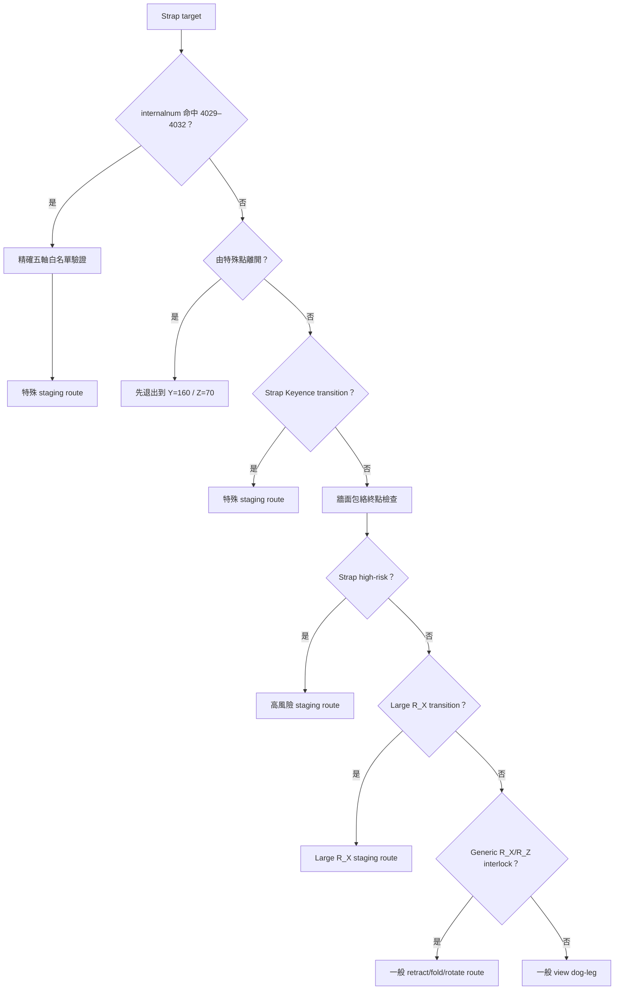
````

這個順序會影響結果。例如特殊白名單命中後，wall/high-risk 就不再執行。

---

# 八、建議合併成兩個機制

## 機制一：Strap Target Validator

負責回答：

> 目標姿態是否允許？

內部合併：

- 軸 limits 的前置 target validation。
- Strap wall envelope。
- 精確人工驗證例外。
- internalnum／完整五軸 pose 一致性。
- target semantic 必須明確是 Strap。

建議結果只有三種：

```
ALLOW_GENERAL
ALLOW_VALIDATED_EXCEPTION
REJECT
```

白名單不再是一套獨立 planner，只是 validator 的「精確例外資料」。

例如：

```
一般 target
→ 必須通過 wall envelope

4029–4032
→ internalnum＋五軸 pose 精確匹配
→ 標記為 VALIDATED_EXCEPTION
→ 可以略過一般 wall formula
→ 但仍必須走特殊安全 route
```

不建議繼續讓 caller 傳：

```
allow_high_risk_final_approach=True
```

caller 應只能提供：

```
motion_domain=strap
internalnum=4032
target pose=...
```

是否例外應完全由 validator 和 config 判定。

## 機制二：Strap Transition Guard

負責回答：

> 已允許的 target 要怎麼安全到達？硬體是否真的照路徑到達？

內部合併：

- Generic R_X/R_Z interlock。
- Large R_X transition。
- Strap high-risk route。
- safe Y/Z staging。
- R_X fold。
- segment 前後 readback。
- final pose readback。

推薦一條 canonical route：

```
1. 讀取 current pose
2. 必要時 Y → safe transit Y
3. 必要時 Z → safe transit Z
4. 驗證 Y/Z readback
5. 若要轉 R_Z，先 R_X → safe R_X
6. 驗證 R_X readback
7. R_Z → target
8. 驗證 R_Z readback
9. R_X → target
10. 驗證 R_X readback
11. X → target
12. Z → target
13. Y → target
14. 驗證完整 final pose
```

如此不再需要三套非常相似的：

- generic interlock route
- large-R_X route
- high-risk route

它們可以變成同一 route 的不同觸發級別。

---

# 九、要使用保守或最佳化模式？

建議 config 提供兩種命名 policy，而不是保留大量相互重疊的 boolean。

## Conservative，建議 production 起始值

```
任何 R_Z 變化
OR 任何明顯 R_X 變化
OR R_X 已展開時的 XY 移動
→ 一律先到 Y=160/Z=70
```

優點：

- 邏輯簡單。
- 比較容易證明安全。
- 不依賴 90°/270° hazard 判斷是否正確。
- 讀回規則一致。

缺點：

- 移動時間增加。
- 很小的 X tile move 也可能多走 staging。

## Optimized

允許經驗證的快速例外，例如：

```
只移動 X
AND Y/Z/R_X/R_Z 都不變
AND R_Z 接近 0° 或 180°
AND wall envelope 通過
→ 保持 R_X，不進 staging
```

目前已有 `strap_x_only_keep_rx_at_rz_0_180` 的概念，可以保留為 optimization，但必須：

- 有完整測試。
- 只能縮短路徑，不能略過 target validator。
- 仍需 final X readback。
- production 預設應先使用 conservative。

---

# 十、哪些應該放 config，哪些不應該？

可以讓未來校正主要透過 config，但不是所有安全邏輯都適合變成可自由修改的參數。

## 適合放 config

這些是設備校正資料：

```
safe_transit_y_mm
safe_transit_z_mm
safe_rx_deg
deployed_rx_threshold_deg
hazard_angles_deg
hazard_window_deg
axis_tolerance_mm
angle_tolerance_deg
wall_y_mm
strap_half_length_mm
minimum_wall_clearance_mm
validated_exception_poses
x_only_optimization
```

## 應固定在 code 的安全 invariant

這些不建議讓 YAML 任意重排：

```
不安全 target 必須 fail closed
R_Z 旋轉前必須驗證 R_X 已折回
旋轉前必須驗證 safe Y/Z
人工例外必須匹配完整五軸 pose
target validator 必須在任何 motion 之前執行
每段失敗不得繼續執行下一段
invalid/missing config 在 production 必須拒絕運動
```

例如不建議讓使用者在 YAML 寫任意：

```
move_order: [R_Z, Y, R_X, Z]
```

因為一個順序錯誤就可能取消整個防撞保證。應讓 config 只能選擇經 code 定義和測試的 named policy：

```
transition_policy: conservative
```

或：

```
transition_policy: validated_optimized
```

---

# 十一、建議的新 config 結構

以下只是架構建議，不是目前已實作格式：

```
strap_safety:
  version: 1
  enforcement: production_fail_closed

  identification:
    require_explicit_motion_domain: true

  transit_pose:
    y_mm: 160.0
    z_mm: 70.0
    safe_rx_deg: 0.0

  target_validator:
    wall_envelope:
      enabled: true
      wall_y_mm: 0.0
      strap_half_length_mm: 100.0
      minimum_clearance_mm: 30.0
      deployed_rx_threshold_deg: 30.0
      tolerance_mm: 0.05

    validated_exceptions:
      "4029":
        pose:
          x: 327.512
          y: 164.001
          z: 74.213
          rx: 90.0
          rz: 90.0
        route_profile: validated_exception
        reason: manually_validated_reference_pose

  transition_guard:
    policy: conservative
    deployed_rx_threshold_deg: 30.0
    rotation_delta_threshold_deg: 0.5

    hazards:
      rz_angles_deg: [90.0, 270.0]
      window_deg: 20.0

    optimization:
      allow_x_only_at_rz_0_180: false

  readback:
    before_rotation: true
    after_each_rotation: true
    after_each_translation: true
    verify_final_pose: true
    axis_tolerance_mm: 0.05
    angle_tolerance_deg: 0.5
```

---

# 十二、只改 config 能不能完成這次合併？

**目前不行。**

目前很多數值已經 config-driven，但以下仍寫死在 code：

- 規則優先順序。
- generic／large-RX／high-risk 三套 route 的分支。
- wall envelope 公式。
- special whitelist 先於 wall envelope 的行為。
- 哪些 segments 具有 readback flag。
- 哪些 caller 可以傳 high-risk permission。
- `execute_template_point()`、final approach、HDR、AF 等不同運動入口。
- semantic target 的部分字串判斷。
- readback 對 `strap_special_staging` config 的耦合。

因此需要一次初始 refactor，把所有 Strap 運動導向單一 safety API。完成後，大部分物理參數和白名單才可以只改 config。

目前還有兩份容易混淆的設定：

```
hardware.zaber.strap_rotation_interlock
hardware.zaber.fixture.profiles.watch.motion_safety.rotation_interlock
```

profile 內的設定通常優先，外層主要是 fallback。未來應統一成單一 `strap_safety` 設定來源，否則修改了外層但 runtime 仍使用 profile 內層，容易造成誤判。

# 最終建議

我建議採用：

```
一個對外入口：
StrapSafetyController.execute_move(target, context)

內部兩個不可略過的階段：
1. Target Validator
2. Transition Guard + Readback
```

合併關係如下：

```
牆面包絡 + 精確白名單
→ Target Validator

Generic R_X/R_Z + Large R_X + Strap high-risk + 讀回確認
→ Transition Guard
```

不要只保留 wall envelope，因為安全終點不代表中間路徑安全；也不要只保留 staging route，因為安全路徑不能讓不安全終點變安全。

此外，未來 config 應在載入時做 schema 驗證、軸範圍檢查、safe pose 合理性檢查、白名單完整五軸驗證和 config hash 日誌。Production 下 config 缺漏或無效時應 fail closed，且不建議在運動中 hot reload。


#### Strap合併成兩個Rules, 且所有safety都整合進hardware_config
```
請採用你的最終建議修改code跟config, 合併成 Target Validator跟Transition Guard, 也把其他相關的保護機制例如軸行程限制等等參數都統一放在hardware_config裡面的SafetyRule裡面, 方面user去調整防撞相關所有參數, 並再三確定相關的config, code都有做相對應的變更
```
已完成重構。正式 App、拍照、AF/HDR、WatchEntry、Home/Center/Holder、遠端與手動移動路徑都已統一進入安全 planner；Strap 保護正式收斂為兩層：

- `Target Validator`：軸範圍、Digital Twin、牆面包絡、4029–4032 精確五軸白名單。
- `Transition Guard`：Y/Z staging、R_X 折回、R_Z 旋轉、恢復 R_X、逐段與最終讀回。Strap 或多段路徑禁止 `wait=False`。

主要變更：

- 所有防撞參數集中在 [hardware_config.yaml (line 94)](D:/Provenance Project/ImagingLibWatch/config/hardware_config.yaml:94) 的 `hardware.zaber.SafetyRule`：

    - Door E-stop  -->  **door_estop:**
    - 軸行程與韌體 soft limits --> **axis_travel_limits**
    - Watch holder load確認 --> **load_verification**
    - 運動/旋轉 profile --> **motion_profiles, rotation_control**
    - final approach --> **final_approach:**
    - AF 移動限制 --> **autofocus_motion_safety**
    - Digital Twin 幾何與旋轉中心 --> **digital_twin**
    - watch/box fixture --> **fixture**
    - Target Validator / Transition Guard -->
    
- 新增集中式 schema、resolver 與兩層 Strap 保護：[safety_rules.py (line 173)](D:/Provenance Project/ImagingLibWatch/Controller/safety_rules.py:173)。
- 統一運動入口及 segment executor：[unified_driver.py (line 497)](D:/Provenance Project/ImagingLibWatch/Controller/hardware_drivers/unified_driver.py:497)。
- Keyence probe、AF 掃描、HDR Z-stack、final approach 等內部小移動也重新經過 planner，不再視為安全例外。
- App safe retract、exit、Home/Center/Holder 均使用 `move_compound`：[main.py (line 3550)](D:/Provenance Project/ImagingLibWatch/App/main.py:3550)。
- Macro1 scan 的安全參數改由 Hardware SafetyRule 注入：[strap_macro1_scan.py (line 31)](D:/Provenance Project/ImagingLibWatch/core/strap_macro1_scan.py:31)。
- 遠端 E-stop 現在同時設定持續性 software lock，必須明確 reset：[controller_server.py (line 76)](D:/Provenance Project/ImagingLibWatch/Controller/controller_server.py:76)。
- 加入架構測試，防止正式路徑再次出現裸 `move_axis`：[test_safety_rules.py (line 73)](D:/Provenance Project/ImagingLibWatch/tests/test_safety_rules.py:73)。

驗證結果：

- 141 項 SafetyRule、motion、AF、capture、Macro1 測試通過。
- 10 項 App Strap/Home/Bezel 回歸測試通過。
- 192 個已配置 Strap 姿態全部完成 Target Validator 與連續轉場模擬。
- YAML schema、scan config、Python compile、`git diff --check` 均通過。
- 使用者原本未追蹤的 wiki 檔案未修改。

仍有兩項必須注意：

- Digital Twin box dimensions 目前仍是既有的 `0.0`，所以幾何碰撞模型尚未完成實體資格確認。填入量測值後，建議把 `require_nonzero_collision_envelopes_for_strap_scan` 改成 `true`，屆時零值會讓 production/hybrid fail-closed。
- `Controller/test_hardware` 內部分工程校正工具仍有刻意保留的裸軸操作；正式 App/core/server 不會走這些工具。實機上線前仍應以空載、低速完成 Home、四個 Strap 方向、4029–4032 與 E-stop/reset 的人工驗證。
-


```
在目前的軸行程限制保護機制只有一組譬如(X `0–435 mm`、Y `0–292 mm`、Z `0–150 mm`、R_X `0–90), 但我們要擴充成三組包括watch, strap, box的軸行程限制因為他們的size都不同所以應該要分成三組才合理. 譬如在watchentry or create template時, 當選擇Front view, back view, openback view, openbackcrown view時是watch的軸行程限制, Strap view是strap的軸行程限制, box view是box的軸行程限制. 而數值應該在hardware_config裡面的SafetyRule裡面方面設定. 

在Controller/test_hardware/裡面有很多testing code裡面都可以按鈕直接zaber移動或轉動, 但目前都沒有遵守保護機制譬如軸行程限制保護機制 or strap Target Validator or Transition Guard. 我希望這些有可以移動的testing code也都要套用軸行程限制保護機制 or strap Target Validator or Transition Guard. 方法是當打開這些有UI的testing code, 然後當要開始移動zaber就會跳出視窗詢問這是watch or strap or box有選單or clicked box可以讓user選擇, 之後就會套用所屬的軸行程限制保護機制 or strap Target Validator or Transition Guard, 而當你按鈕譬如會超出軸行程限制或可能撞擊, 則在移動前會跳出警告window說明為何並有選項可以繼續獲取消這個動作.

在按下App main.py按下下列代表不同watch view or strap or box前應該新增一個確認機制確保user在holder真的是放front or back or box or strap. 方法是按下這些按鈕之後, zaber移動到x=150, y=78.46, rx=0, rz=0且z=80的位置(這應該就是Keyence probe position對準watch中央位置), 然後依據z=80, z=73, z=32, z=27, z=21分別測量keyence的讀數, 而如果keyence的out1有讀到數值則停止下個z位置的測量.

譬如如果我目前選的是box(按下pushButton_TemplateRun_23, pushButton_TemplateRun_215)然後我從z=80開始測量, 如果在z=80位置keyence的out1有讀到數值且推算final z的位置是z=80+-3, 則代表這是box, 則停止測量且代表load正確可以進到下一步(而如果load錯誤譬如在z=80讀取不到則直接顯示錯誤), 並跳出視窗顯示在center position拍的image. 

譬如如果我目前選的是strap(按下pushButton_TemplateRun_22, pushButton_TemplateRun_37, pushButton_TemplateRun_213, pushButton_TemplateRun_217)然後我從z=80開始測量,如果在z=80位置讀取no signal, 則移動到z=73位置讀取no signal(在z=73位置需在附近水平搜尋以每次一格1mm, 找5x5的區域如果都沒有才確定沒有), 那有讀到數值且推算final z的位置不是z=73+-3, 也代表錯誤, 並跳出視窗顯示在center position拍的image. 

譬如如果我目前選的是front(按下pushButton_TemplateRun_3, pushButton_TemplateRun_124)然後我從z=80開始測量, 如果在z=80位置讀取no signal, 則移動到z=73位置讀取no signal, 移動到z=32位置讀取no signal, 移動到z=27位置讀取no signal, 如果在z=21位置keyence的out1有讀到數值且推算final z的位置是z=21+-3, 則代表這是front則停止測量且代表load正確可以進到下一步. 但如果移動到z=27位置讀取keyence的out1有讀到數值且推算final z的位置不是z=21+-3, 也代表錯誤, 並跳出視窗顯示在center position拍的image. 

這是代表不同view應該要有的z position: Front watch z = 21.779, Back watch z = 32.717, openback and openbackcrown watch z = 27.123, strap 73.213, box =80

以下是代表不同view跟相關的按鈕:
front: pushButton_TemplateRun_3, pushButton_TemplateRun_124
back: pushButton_TemplateRun_6, pushButton_TemplateRun_126
openback: pushButton_TemplateRun_16, pushButton_TemplateRun_128
openbackcrown: pushButton_TemplateRun_20, pushButton_TemplateRun_130
strap: pushButton_TemplateRun_22, pushButton_TemplateRun_37, pushButton_TemplateRun_213, pushButton_TemplateRun_217
box: pushButton_TemplateRun_23, pushButton_TemplateRun_215
```

已完成程式與設定重構，所有 Zaber 移動現在統一受 SafetyRule、fixture profile 與 `move_compound()` planner 管理。

### 主要完成項目

- 在 [hardware_config.yaml (line 103)](D:/Provenance Project/ImagingLibWatch/config/hardware_config.yaml:103) 建立三組獨立軸行程：
    
    - `watch`
    - `strap`
    - `box`
- 目前三組先沿用既有安全範圍，避免在沒有實機量測資料下猜測限制值；之後可直接修改 YAML，不需改 code。
    
- Zaber firmware 寫入三組限制的聯集範圍；實際每次移動則由 software planner 套用所選 profile 的限制。
    
- [safety_rules.py (line 62)](D:/Provenance Project/ImagingLibWatch/Controller/safety_rules.py:62) 集中管理：
    
    - profile 判斷
    - 軸行程限制
    - Target Validator
    - Transition Guard
    - SafetyRule schema validation
    - profile 與 view 衝突時 fail-closed，例如 `watch + StrapRightSide` 會直接拒絕。
- [unified_driver.py (line 583)](D:/Provenance Project/ImagingLibWatch/Controller/hardware_drivers/unified_driver.py:583) 已確保：
    
    - `move_compound()` 按 watch／strap／box 選擇限制。
    - Strap 自動使用 Target Validator 與 Transition Guard。
    - Create Template、WatchEntry、CLI workflow 都帶入 per-view profile。
    - testing UI 選擇的 profile 不會被 `execute_template_point()` 重設成 watch。
- [hardware_managers.py (line 115)](D:/Provenance Project/ImagingLibWatch/Controller/hardware_managers.py:115) 增加 raw-motion router：
    
    - `move_axis`
    - `move_relative`
    - `move_axes_absolute`
    - `home_axis`
    
    若不是 planner 核准的 segment，都會重新導入 `move_compound()`；raw mechanical home 會被阻擋。
    

### App Holder Load Verification

14 個指定按鈕已全部接到 [App/main.py (line 2968)](D:/Provenance Project/ImagingLibWatch/App/main.py:2968) 的驗證流程。

實際驗證由 [load_fixture_verifier.py (line 203)](D:/Provenance Project/ImagingLibWatch/Controller/load_fixture_verifier.py:203) 執行：

- 移動到 `X=150, Y=78.46, RX=0, RZ=0`。
- 按 `Z=80 → 73 → 32 → 27 → 21` 依 view 搜尋。
- Box 在 Z80 無訊號就失敗。
- Strap 在 Z73 中心無訊號時搜尋 5×5、每格 1 mm。
- 第一個有效 OUT1 後立即停止後續 Z 探測。
- 使用 config 的 `probe_z + OUT1 × scale + offset` 推算 final Z。
- 與各 view 預期 Z 比較，容許值 ±3 mm。
- 顯示 center image；錯誤載入時維持已安全到達的 Z 拍攝，不會為了錯誤照片移向可能碰撞的 expected Z。
- 成功時使用者仍須按 Continue；失敗不可繞過。

### Testing tools

新增共用 [safety_motion.py (line 25)](D:/Provenance Project/ImagingLibWatch/Controller/test_hardware/safety_motion.py:25)，並套用到所有可移動或會執行拍照運動的 testing UI／CLI：

- UI 必須選擇 watch／strap／box，Strap Registration 固定使用 strap。
- 超出 axis limit、Target Validator 拒絕的目標不可強制繼續。
- 可透過安全 staging 完成的高風險移動會顯示 Continue Safely／Cancel。
- `unlock_table.py` 不再把 firmware limits 擴張到極大值。
- 非 UI script 必須設定 `IMAGINGLIB_TEST_FIXTURE=watch|strap|box`。

### 正式拍照 profile

[workflow_manager.py (line 2646)](D:/Provenance Project/ImagingLibWatch/core/workflow_manager.py:2646) 現在逐 capture step 判斷：

- Front／Back／OpenBack／OpenBackCrown → `watch`
- StrapRightSide → `strap`
- Box Front → `box`

Create Template pre-capture、正式 selected-point capture、WatchEntry capture 也採用相同規則。

### 驗證結果

- Safety／motion／load verification／workflow：48 項全數通過。
- Autofocus／Strap macro scan／side AF／internalnum：113 項全數通過。
- App 規則：159 項中 157 通過；兩個原有且與本次安全重構無關的失敗仍存在：
    - `0032_creation_and_watchentry_share_canonical_capture_precedence`
    - `side_xz_initial_values_preserve_legacy_center_target_pose`
- Python compile、YAML parse、`git diff --check` 通過。
- SafetyRule schema validation：`[]`，沒有設定錯誤。
- 測試產生的暫存 output 已移除；既有未追蹤的 wiki 文件未修改。

### 實機啟用前仍需確認

1. 實際量測並分別填入 watch／strap／box 的限制；目前三組仍是相同的 legacy 範圍。
2. 確認 Keyence OUT1 正負方向與 `probe_z_plus_out1` 公式。
3. 確認 center image 的 `X=263.0985, Y=15.659`、曝光和燈光。
4. 用空 holder、低速依序 dry-run 六種 view。
5. Digital Twin 的 collision-envelope 尺寸目前仍為 0，尚未具有完整幾何防撞能力。


```
所以你的意思是目前在hardware_config.yaml裡面有hardware.zaber.SafetyRule裡面有door_estop, axis_travel_limits, load_verification....等設定是存在的, 但目前code裡面無法載入這些設定而真的實行SafetyRule避免撞擊嗎?
```


#### TemplateRun_213跟TemplateRun_213流程中的collision avoidance
```
請幫我完整整理從按下page_template_new_strap_pre的pushButton_TemplateRun_213按鈕到結束的流程中, 以及從page_template_new_strap_pre2的pushButton_TemplateRun_217按鈕到結束的流程中, 有哪些流程中重要步驟的functions, 以及在流程中遇到的跟防撞safety rules相關的functions.

只需簡短解釋, 重點是讓junior engineer了解Strap的拍照流程及在哪幾個點會觸發防撞safety rules, 以及這些防撞safety rules functions在哪裡控制. 如果可以提供流程圖或可幫助了解的figures(裡面都是英文)更好
```

目前實際設定是 `use_macro_cam_1_pipeline: false`，所以兩個按鈕會走 **legacy macro_cam_2 + internalnum 4001–4028 + stitching** 流程；程式也保留 macro_cam_1 動態掃描分支。

## Button 213：Front / 3-clock / Back


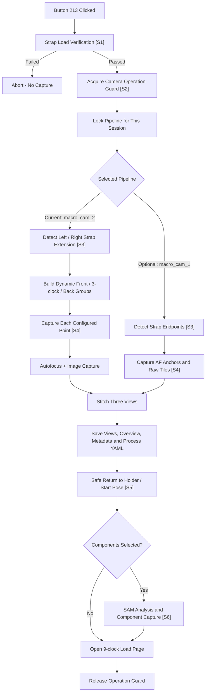


主要 functions：

- 按鈕綁定在 [`_batch_connect()` (line 10361)](D:/Provenance Project/ImagingLibWatch/App/main.py:10361)，Button 213 的入口為 [`_strap_probe_stitch_or_create()` (line 24905)](D:/Provenance Project/ImagingLibWatch/App/main.py:24905)。
- [`_verify_loaded_fixture_then()` (line 10472)](D:/Provenance Project/ImagingLibWatch/App/main.py:10472) → [`verify_loaded_fixture()` (line 296)](D:/Provenance Project/ImagingLibWatch/Controller/load_fixture_verifier.py:296)：用 Keyence 確認目前 Holder 上確實是 Strap。
- [`_begin_camera_operation()` (line 10532)](D:/Provenance Project/ImagingLibWatch/App/main.py:10532)：鎖住所有拍照入口，防止重複點擊或兩個流程同時移動硬體。
- [`_start_strap_213_workflow()` (line 39955)](D:/Provenance Project/ImagingLibWatch/App/main.py:39955)：啟動背景硬體 worker。
- [`_run_strap_213_workflow_core()` (line 39876)](D:/Provenance Project/ImagingLibWatch/App/main.py:39876)：213 的實際工作主體。
- Legacy 路線使用 [`_detect_strap_extension_flags()` (line 40337)](D:/Provenance Project/ImagingLibWatch/App/main.py:40337) 判斷左右 Strap 是否延伸。
- [`_capture_and_show_strap_stitched_views()` (line 42036)](D:/Provenance Project/ImagingLibWatch/App/main.py:42036)：依 group 拍圖、stitch、組合 overview、儲存 metadata。
- 每一張來源圖經過 [`_capture_strap_stitch_source_image()` (line 41431)](D:/Provenance Project/ImagingLibWatch/App/main.py:41431) → [`_execute_prepared_point_capture()` (line 9132)](D:/Provenance Project/ImagingLibWatch/App/main.py:9132) → `execute_template_point()`。
- 若有勾選 component，會執行 [`_start_automatic_strap_component_capture()` (line 14499)](D:/Provenance Project/ImagingLibWatch/App/main.py:14499)，先做 SAM 分析，再拍 Endlink、Screw、Link 等指定部件。
- 完成後安全回到 Holder，進入 `page_template_new_strap_pre2`。

## Button 217：9-clock


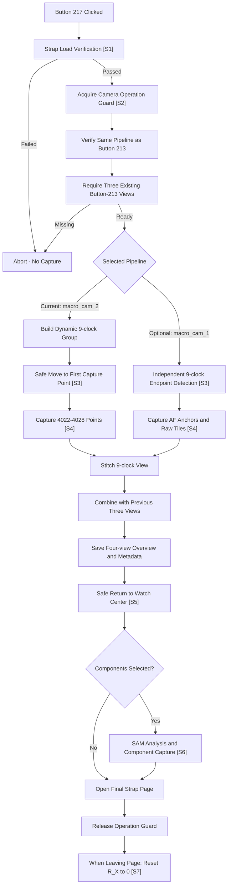


主要 functions：

- 入口為 [`_start_strap_9clock_pre_capture()` (line 40747)](D:/Provenance Project/ImagingLibWatch/App/main.py:40747)。
    
- [`_start_strap_217_workflow()` (line 41037)](D:/Provenance Project/ImagingLibWatch/App/main.py:41037)：確認 pipeline 沒有在 213/217 中間被切換，並確認前三個 view 已存在。
    
- [`_run_strap_217_workflow_core()` (line 40950)](D:/Provenance Project/ImagingLibWatch/App/main.py:40950)：拍攝 9-clock 並安全回到 watch center。
    
- [`_move_strap_capture_group_start()` (line 40659)](D:/Provenance Project/ImagingLibWatch/App/main.py:40659)：Legacy 路線在開始拍照前，先透過 safety planner 移到第一個 9-clock point。
    
- 完成後把 9-clock 與前三個 view 合併，產生順序固定為：
    
    `Front → 3-clock → Back → 9-clock`
    
- 有 component 選項時，再執行 phase 217 的 SAM/component capture。
    
- 新 template 會進入命名頁；既有 template 直接進入 `page_template_new_strap` 並顯示四張 overview。
    
- 離開最終 Strap 頁時，[`_force_rx_to_zero()` (line 19800)](D:/Provenance Project/ImagingLibWatch/App/main.py:19800) 將 R_X 收回 0°。
    

## 防撞 Safety Rules 觸發點

|標記|何時觸發|控制 functions|
|---|---|---|
|S1|213、217 每次按下後、正式拍照前|`_verify_loaded_fixture_then()`、`verify_loaded_fixture()`、[`_safe_move()` (line 221)](D:/Provenance Project/ImagingLibWatch/Controller/load_fixture_verifier.py:221)|
|S2|建立拍照流程及硬體 worker 時|`_begin_camera_operation()`、[`_start_workflow_task()` (line 10642)](D:/Provenance Project/ImagingLibWatch/App/main.py:10642)|
|S3|Keyence load/extension/endpoint probe，以及進入第一個拍照點|`_move_strap_keyence_probe_pose()`、`_move_strap_capture_group_start()`|
|S4|每一個拍照點、AF 移動、HDR Z 移動及小幅 focus correction|[`execute_template_point()` (line 9762)](D:/Provenance Project/ImagingLibWatch/Controller/hardware_drivers/unified_driver.py:9762)、`_move_xyz_with_safety()`|
|S5|回 Holder、回 watch center|[`_move_zaber_to_safe_strap_pose()` (line 10106)](D:/Provenance Project/ImagingLibWatch/App/main.py:10106) → `move_compound()`|
|S6|SAM/component 拍照前及每一個 component point|component route preflight，之後仍經 `execute_template_point()`|
|S7|離開最後 Strap 頁、R_X 歸零|`_force_rx_to_zero()` → `manual_move()` → `move_compound()`|
|Anytime|Door 打開、MQTT 資料異常或系統已鎖定|[`SafetyManager._on_message()` (line 4640)](D:/Provenance Project/ImagingLibWatch/Controller/hardware_managers.py:4640) → [`trigger_emergency_stop()` (line 5383)](D:/Provenance Project/ImagingLibWatch/Controller/hardware_drivers/unified_driver.py:5383)|

所有實際 Strap 移動最後都集中到：


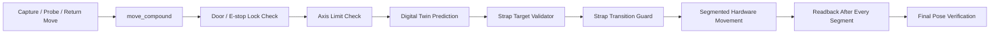


核心 enforcement functions：

- [`move_compound()` (line 646)](D:/Provenance Project/ImagingLibWatch/Controller/hardware_drivers/unified_driver.py:646)：所有安全移動的中央入口。
- [`_plan_motion_segments()` (line 1018)](D:/Provenance Project/ImagingLibWatch/Controller/hardware_drivers/unified_driver.py:1018)：執行 axis limits、Digital Twin、Strap target validation 和 route planning。
- [`StrapTargetValidator.validate()` (line 816)](D:/Provenance Project/ImagingLibWatch/Controller/safety_rules.py:816)：檢查最終五軸位置是否安全。
- [`StrapTransitionGuard.plan()` (line 1394)](D:/Provenance Project/ImagingLibWatch/Controller/safety_rules.py:1394)：把移動拆成安全順序。
- [`_execute_motion_segments()` (line 765)](D:/Provenance Project/ImagingLibWatch/Controller/hardware_drivers/unified_driver.py:765)：每段移動後做 readback，錯誤就停止後續段落。

Junior engineer 最需要記住的三條規則：

1. **Final target 必須先合法**：Y 不得低於 30 mm；Strap 展開時必須通過 wall-clearance 檢查。
2. **需要轉動或長距離移動時先退到安全區**：一般為 Y ≥ 160、Z = 70；4029/4030 使用更保守的 Y ≥ 190、Z = 70。改變 R_Z 前會先把 R_X 收回 0°。
3. **每一段都要 readback**：XYZ 誤差 0.05 mm、角度誤差 0.5°；不符合便 fail closed。

Safety Rules 的主要控制位置是 [config/hardware_config.yaml (line 94)](D:/Provenance Project/ImagingLibWatch/config/hardware_config.yaml:94)：

- Load verification：line 134
- Digital Twin：line 284
- Strap target validator：line 359
- Strap transition guard：line 402
- Segment/final readback：line 444
- Holder/start 與 watch-center pose：line 465 起

Pipeline switch 在 [config/strap_macro_cam1_scan.yaml (line 7)](D:/Provenance Project/ImagingLibWatch/config/strap_macro_cam1_scan.yaml:7)；目前為 `false`，而且 213 開始後會鎖定，217 不允許混用另一條 pipeline。

需要特別注意：程式確實會呼叫 [`DigitalTwinGuard.predict_collision()` (line 62)](D:/Provenance Project/ImagingLibWatch/Controller/kinematics/digital_twin_guard.py:62)，但目前 `collision_envelopes` 三組尺寸都是 `0.0`。因此現在主要有效的防撞保護是 **axis limits、StrapTargetValidator、StrapTransitionGuard、segment readback 與 Door/E-stop**；Digital Twin 尚不能視為已完成實體體積校準的防撞層。


213 and 217 process 
```
請根據你畫的utton 213：Front / 3-clock / Back拍照流程圖跟Button 217：9-clock拍照流程圖. 解釋用英文解釋每個單元方塊的作用以及functions, 尤其要很詳細解釋跟防撞有關的, 要附上所有相關的functions並詳細解釋
```

# Strap Capture Flow — Detailed Function Explanation

The current repository setting is:

```
use_macro_cam_1_pipeline: false
```

Therefore, the active production path is currently **macro_cam_2 + internalnum capture points + image stitching**. The macro_cam_1 branch is still explained because the UI can select and lock it before Button 213 starts.

“Safety” below includes:

- Wrong fixture/load prevention
- Concurrent-motion prevention
- Door/E-stop protection
- Axis-limit validation
- Strap collision-envelope validation
- Safe transition planning
- Segment and final-position readback
- Failure recovery and safe retract

---

# 1. Button 213: Front / 3-clock / Back


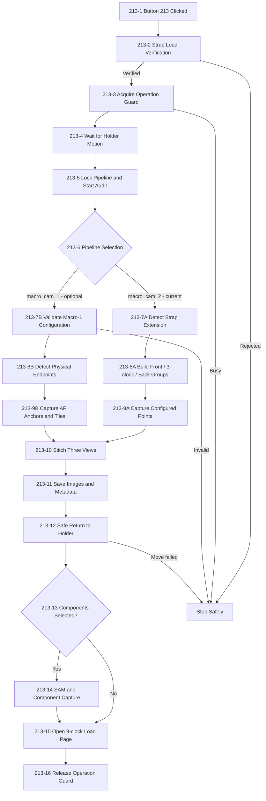


## 213-1 — Button 213 Clicked

Purpose: receive the operator’s “Bracelet Loaded” action on `page_template_new_strap_pre`.

Functions:

- [`_batch_connect()` (line 10361)](D:/Provenance Project/ImagingLibWatch/App/main.py:10361)
- [`_strap_probe_stitch_or_create()` (line 24905)](D:/Provenance Project/ImagingLibWatch/App/main.py:24905)

`_batch_connect()` does not connect Button 213 directly to the capture function. Because Button 213 appears in `_LOAD_VERIFICATION_BUTTON_VIEWS`, it wraps the callback with Strap load verification:

```
Button 213
  -> _verify_loaded_fixture_then("strap", callback)
  -> _strap_probe_stitch_or_create()
```

This wrapper is important: the capture callback is not allowed to run until load verification succeeds.

---

## 213-2 — Strap Load Verification

Purpose: confirm that the object loaded on the holder is a Strap, rather than a box or incorrect fixture.

Functions:

- [`_verify_loaded_fixture_then()` (line 10472)](D:/Provenance Project/ImagingLibWatch/App/main.py:10472)
- [`verify_loaded_fixture()` (line 296)](D:/Provenance Project/ImagingLibWatch/Controller/load_fixture_verifier.py:296)
- [`_detection_sequence()` (line 70)](D:/Provenance Project/ImagingLibWatch/Controller/load_fixture_verifier.py:70)
- [`_center_out_grid()` (line 124)](D:/Provenance Project/ImagingLibWatch/Controller/load_fixture_verifier.py:124)
- [`_safe_move()` (line 221)](D:/Provenance Project/ImagingLibWatch/Controller/load_fixture_verifier.py:221)
- [`_read_out1()` (line 196)](D:/Provenance Project/ImagingLibWatch/Controller/load_fixture_verifier.py:196)
- [`_out1_is_valid()` (line 215)](D:/Provenance Project/ImagingLibWatch/Controller/load_fixture_verifier.py:215)

Important behavior:

1. `_verify_loaded_fixture_then()` acquires a temporary camera-operation token.
2. It starts `verify_loaded_fixture()` inside a serialized hardware worker.
3. `verify_loaded_fixture()` reads the canonical `SafetyRule.load_verification` configuration.
4. The verifier checks detection tiers from the taller fixture downward.
5. For the Strap tier, it may use the configured center-out XY grid.
6. Every probe position is sent through `_safe_move()`.
7. `_safe_move()` requires `UnifiedHardwareDriver.move_compound()`. There is no raw-Zaber fallback.
8. Keyence `OUT1` is converted into inferred fixture height.
9. The Strap is accepted only when the detected tier and configured Strap requirement match.

Current Strap verification uses a minimum inferred-Z rule:

```
inferred Z > 50 mm
```

If verification fails, the real Button 213 callback is never called.

In simulation mode, this load-verification phase is skipped.

---

## 213-3 — Acquire Operation Guard

Purpose: prevent Button 213, Button 217, or another capture button from starting an overlapping workflow.

Functions:

- [`_begin_camera_operation()` (line 10532)](D:/Provenance Project/ImagingLibWatch/App/main.py:10532)
- [`_camera_operation_is_current()` (line 10562)](D:/Provenance Project/ImagingLibWatch/App/main.py:10562)
- [`_finish_camera_operation()` (line 10568)](D:/Provenance Project/ImagingLibWatch/App/main.py:10568)

Important detail: load verification and actual capture use separate operation tokens.

```
Load-verification token
  -> verification finishes
  -> token released
  -> actual Button 213 callback starts
  -> new Button 213 token acquired
```

When `_begin_camera_operation()` succeeds, it disables all capture-entry buttons listed in `_CAMERA_OPERATION_BUTTONS`.

If another operation already owns the guard, the request is ignored before hardware movement begins.

---

## 213-4 — Wait for Holder Motion

Purpose: prevent a Strap capture worker from starting while the holder is still moving.

Functions:

- `_is_holder_move_running()`
- `_start_holder_move_async()`
- [`_start_workflow_task()` (line 10642)](D:/Provenance Project/ImagingLibWatch/App/main.py:10642)

`_strap_probe_stitch_or_create()` checks for an active holder-move worker. If one exists, it queues its continuation and waits.

`_start_workflow_task(..., hardware=True)` provides a second hardware-level check:

- No holder move may be active.
- No other hardware workflow worker may be active.

This is a concurrency interlock, not geometric collision detection, but it prevents two safe planners from commanding the same hardware simultaneously.

---

## 213-5 — Lock Pipeline and Start Audit

Purpose:

- Freeze the camera pipeline across Button 213 and Button 217.
- Start a persistent record of Strap movements.

Functions:

- [`_lock_strap_pipeline_for_session()` (line 37066)](D:/Provenance Project/ImagingLibWatch/App/main.py:37066)
- [`_load_strap_macro1_scan_config()` (line 37082)](D:/Provenance Project/ImagingLibWatch/App/main.py:37082)
- [`_strap_macro1_scan_enabled()` (line 37092)](D:/Provenance Project/ImagingLibWatch/App/main.py:37092)
- [`_start_strap_motion_recording()` (line 3845)](D:/Provenance Project/ImagingLibWatch/App/main.py:3845)
- `_attach_strap_motion_observer()`
- `_record_strap_motion_event()`

`_lock_strap_pipeline_for_session()`:

1. Reads the Wide-field or Macro Camera checkbox.
2. Writes the selected state to `strap_macro_cam1_scan.yaml`.
3. Stores the selection in `_strap_pipeline_session_use_macro1`.
4. Disables both pipeline checkboxes.

Button 217 must use the same locked selection.

Important distinction: `StrapMotionRecorder` is an audit/diagnostic mechanism. It records requested moves, completed moves, capture poses and page transitions, but it does not itself reject dangerous motion.

---

## 213-6 — Pipeline Selection

Purpose: choose the implementation used to create the first three views.

Functions:

- [`_start_strap_213_workflow()` (line 39955)](D:/Provenance Project/ImagingLibWatch/App/main.py:39955)
- [`_run_strap_213_workflow_core()` (line 39876)](D:/Provenance Project/ImagingLibWatch/App/main.py:39876)

`_start_strap_213_workflow()` creates a retained hardware worker. UI changes are handled in its completion callback; hardware operations run in `_run_strap_213_workflow_core()`.

Branches:

- `macro_cam_2`: configured internalnum points are captured and stitched.
- `macro_cam_1`: Strap endpoints are measured, dynamic raw tiles are captured, and those tiles are stitched.

Any uncaught worker error goes to the failure callback, which:

- Resets progress
- Shows “Strap scan stopped safely”
- Releases the operation guard
- Does not continue to the 9-clock page

---

## 213-7A — Detect Strap Extension: macro_cam_2

Purpose: determine whether additional capture points are required at the left or right end.

Functions:

- [`_detect_strap_extension_flags()` (line 40337)](D:/Provenance Project/ImagingLibWatch/App/main.py:40337)
- `_run_single_strap_extension_probe()`
- [`_move_strap_keyence_probe_pose()` (line 40206)](D:/Provenance Project/ImagingLibWatch/App/main.py:40206)
- `_read_strap_keyence_out1()`
- `_strap_keyence_out1_valid()`

For each configured probe position:

```
_move_strap_keyence_probe_pose()
  -> check_safety_lock()
  -> move_compound()
  -> target validation
  -> transition planning
  -> segmented move
  -> readback verification
```

If `move_compound()` is unavailable, the probe fails. Raw `zaber.move_axis()` is intentionally not used as a compatibility fallback.

The resulting `strap_left_ext` and `strap_right_ext` flags control which additional images appear in the dynamic stitch groups.

---

## 213-8A — Build Front / 3-clock / Back Groups

Purpose: translate the extension result into ordered image-capture groups.

Functions:

- [`_build_dynamic_strap_stitch_groups()` (line 40463)](D:/Provenance Project/ImagingLibWatch/App/main.py:40463)
- `_apply_strap_stitch_group_overrides()`
- `_apply_strap_stitch_source_config()`
- `_strap_capture_order_for_group()`
- [`_strap_scan_positions_ready()` (line 41403)](D:/Provenance Project/ImagingLibWatch/App/main.py:41403)

The three normal groups are:

1. `strap_right_front`
2. `strap_right_side` — 3-clock
3. `strap_right_back`

`_strap_scan_positions_ready()` performs a fail-closed preflight in production. It rejects the scan if any required point:

- Does not exist
- Contains invalid XYZ values
- Has XYZ all equal to zero

The actual capture poses come from the point/internalnum configuration, while the safety layer independently decides whether those poses are allowed.

---

## 213-9A — Capture Configured Points

Purpose: move to every configured Strap point, autofocus, capture and save its source image.

Functions:

- [`_capture_and_show_strap_stitched_views()` (line 42036)](D:/Provenance Project/ImagingLibWatch/App/main.py:42036)
- [`_capture_strap_stitch_source_image()` (line 41431)](D:/Provenance Project/ImagingLibWatch/App/main.py:41431)
- [`_execute_prepared_point_capture()` (line 9132)](D:/Provenance Project/ImagingLibWatch/App/main.py:9132)
- [`execute_template_point()` (line 9762)](D:/Provenance Project/ImagingLibWatch/Controller/hardware_drivers/unified_driver.py:9762)

Call chain:

```
_capture_and_show_strap_stitched_views()
  -> for each group
     -> for each capture item
        -> _capture_strap_stitch_source_image()
           -> _execute_prepared_point_capture()
              -> execute_template_point()
```

`_execute_prepared_point_capture()` builds the complete hardware payload:

- XYZ
- R_X and R_Z
- Camera selection
- Internal numbers
- Exposure and gain
- Lighting
- Mechanical autofocus settings
- Liquid-lens autofocus settings
- HDR settings
- Semantic target with `fixture_profile="strap"`

`execute_template_point()` checks the safety lock at entry. Its initial pose, autofocus corrections, Keyence moves, HDR Z positions and final approach are routed through the shared safety planner.

---

## 213-7B — Validate macro_cam_1 Configuration

Purpose: prevent dynamic raw-tile scanning unless all required macro_cam_1 calibration and safety requirements are present.

Functions:

- [`_validate_strap_macro1_scan_for_run()` (line 37102)](D:/Provenance Project/ImagingLibWatch/App/main.py:37102)
- `_strap_macro1_validate_pose()`
- `validate_scan_config()`
- [`validate_safety_rule()` (line 417)](D:/Provenance Project/ImagingLibWatch/Controller/safety_rules.py:417)

Production validation checks include:

- `safety.calibration_confirmed`
- Front, side, back and 9-clock pose limits
- Availability of `move_compound()`
- Required safety planner
- Camera-to-Keyence calibration consistency
- Endpoint configuration
- Focus configuration
- Canonical SafetyRule values injected into the scan configuration

The macro_cam_1 YAML controls scan calibration and capture behavior. It does not replace the canonical safety controls in `hardware_config.yaml`.

---

## 213-8B — Detect Physical Endpoints

Purpose: measure the actual left and right Strap boundaries instead of assuming a fixed number of tiles.

Functions:

- [`_detect_strap_macro1_endpoints()` (line 37474)](D:/Provenance Project/ImagingLibWatch/App/main.py:37474)
- `_select_strap_macro1_keyence_probe_y_offset()`
- `_resolve_strap_macro1_endpoint_report()`
- [`_strap_macro1_transition_to_pose()` (line 37447)](D:/Provenance Project/ImagingLibWatch/App/main.py:37447)
- [`_strap_macro1_safe_compound_move()` (line 37373)](D:/Provenance Project/ImagingLibWatch/App/main.py:37373)

Endpoint detection moves the Keyence probe through the same collision-aware planner. Each endpoint search may include:

- Seed position
- Coarse X probes
- Fine X refinement
- Small calibrated Y retries
- Consecutive invalid readings to confirm the physical edge

`_strap_macro1_safe_compound_move()` requires:

- A hardware driver
- `move_compound()`
- An unlocked safety state
- A validated target pose

It also passes the measured worst-case Strap span into the semantic target. The target validator may increase the assumed half-length, but it cannot reduce the canonical minimum.

---

## 213-9B — Capture AF Anchors and Raw Tiles

Purpose: capture dynamic macro_cam_1 images across the measured Strap span.

Functions:

- [`_capture_strap_macro1_views()` (line 39460)](D:/Provenance Project/ImagingLibWatch/App/main.py:39460)
- [`_capture_strap_macro1_view()` (line 38495)](D:/Provenance Project/ImagingLibWatch/App/main.py:38495)
- [`_strap_macro1_capture_frame()` (line 38113)](D:/Provenance Project/ImagingLibWatch/App/main.py:38113)
- `_strap_macro1_focus_result_ok()`
- `_strap_macro1_locked_current()`
- `_strap_macro1_stitch_view()`

The normal macro_cam_1 strategy is:

1. Calculate tile X positions from measured endpoints.
2. Select five autofocus anchors.
3. At each anchor, measure Keyence height and obtain a liquid-lens lock.
4. Capture and retain the anchor image.
5. Interpolate focus values for non-anchor tiles.
6. Capture remaining tiles.
7. Stitch the ordered raw tiles.

Every stage move still passes through `_strap_macro1_transition_to_pose()` or internal safe XYZ motion.

---

## 213-10 — Stitch Three Views

Purpose: convert all source images into one stitched image per view.

Functions:

- [`WatchBandStitcher.stitch_group()` (line 578)](D:/Provenance Project/ImagingLibWatch/algorithms/watchband_stitcher.py:578)
- `_strap_stitch_ordered_image_items()`
- `_strap_macro1_stitch_view()`
- [`_compose_strap_stitched_preview()` (line 41709)](D:/Provenance Project/ImagingLibWatch/App/main.py:41709)

The legacy pipeline stitches one group at a time. If any required source image is missing, the group is not stitched and the workflow stops.

The three completed views are ordered as:

```
Front -> 3-clock -> Back
```

Image stitching itself does not move hardware and therefore does not trigger collision rules.

---

## 213-11 — Save Images and Metadata

Purpose: persist enough information to display, analyze and audit the scan.

Functions:

- `_save_strap_stitched_output_images()`
- [`_save_strap_precapture_artifacts()` (line 41937)](D:/Provenance Project/ImagingLibWatch/App/main.py:41937)
- `_save_strap_stitched_overview_metadata()`
- [`_remember_strap_stitched_pre_capture_result()` (line 40546)](D:/Provenance Project/ImagingLibWatch/App/main.py:40546)
- `_remember_strap_macro1_pre_capture_result()`

Saved data includes:

- Individual stitched views
- Frame-82 overview image
- Segment/display geometry
- Stitch reports
- Extension or endpoint report
- Capture poses
- Process YAML
- Raw-image manifests for macro_cam_1
- Source-camera information

This block is storage-only. It does not command the motion system.

---

## 213-12 — Safe Return to Holder

Purpose: move the machine back to the operator-accessible holder/start position before asking the operator to flip/reload the Strap.

Functions:

- `_move_zaber_to_start_pos()`
- [`_move_zaber_to_safe_strap_pose()` (line 10106)](D:/Provenance Project/ImagingLibWatch/App/main.py:10106)
- `_strap_macro1_transition_to_pose()`
- [`move_compound()` (line 646)](D:/Provenance Project/ImagingLibWatch/Controller/hardware_drivers/unified_driver.py:646)

Configured destination:

```
X=0, Y=292, Z=150, R_X=0, R_Z=0
```

This is not a direct five-axis jump. `move_compound()` converts it into safe segments using `StrapTransitionGuard`.

If the return fails, the workflow stops and does not show the 9-clock load page.

---

## 213-13/14 — Optional SAM and Component Capture

Purpose: capture selected Strap components after the overview is available.

Functions:

- [`_start_automatic_strap_component_capture()` (line 14499)](D:/Provenance Project/ImagingLibWatch/App/main.py:14499)
- [`_start_strap_precapture_auto_analysis()` (line 14701)](D:/Provenance Project/ImagingLibWatch/App/main.py:14701)
- `_resume_pending_strap_component_capture()`
- `_on_strap_link_analysis_ready()`
- [`_preflight_strap_component_capture_routes()` (line 16557)](D:/Provenance Project/ImagingLibWatch/App/main.py:16557)
- [`_execute_strap_component_capture_plan()` (line 16671)](D:/Provenance Project/ImagingLibWatch/App/main.py:16671)
- [`_run_strap_component_capture_plan_core()` (line 16785)](D:/Provenance Project/ImagingLibWatch/App/main.py:16785)
- [`_move_zaber_to_strap_safe_retract()` (line 3949)](D:/Provenance Project/ImagingLibWatch/App/main.py:3949)
- [`_finish_strap_component_capture_operation()` (line 17790)](D:/Provenance Project/ImagingLibWatch/App/main.py:17790)

Safety behavior:

1. Only components selected for phase 213 are included.
2. Motion waits for saved, current-session SAM coordinates.
3. Macro and micro phases are independently preflighted.
4. Preflight runs the candidate poses through the Digital Twin and shared motion planner.
5. Each actual point uses the normal `execute_template_point()` path.
6. If one point fails, the next point may run only after `_move_zaber_to_strap_safe_retract()` reaches and verifies the safe retract pose.
7. The macro phase must safely retract before macro-image screw analysis begins.
8. The `finally` block performs a safe retract on both success and exception paths.
9. Retract failure is fatal; the component pipeline does not continue.

---

## 213-15/16 — Open 9-clock Page and Release Guard

Purpose: finish Button 213 and request the 9-clock load.

Functions:

- [`_show_strap_9clock_load_page()` (line 40634)](D:/Provenance Project/ImagingLibWatch/App/main.py:40634)
- `_finish_camera_operation()`

Destination:

```
page_template_new_strap_pre2
```

If no components were selected, the operation guard is released immediately after navigation.

If component capture was started, `_finish_strap_component_capture_operation()` releases the guard and then calls the navigation callback.

---

# 2. Button 217: 9-clock


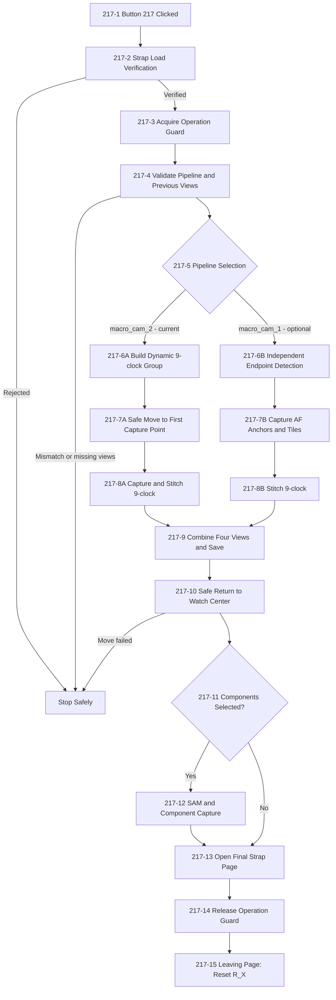


## 217-1/2 — Click and Load Verification

Functions:

- `_batch_connect()`
- [`_start_strap_9clock_pre_capture()` (line 40747)](D:/Provenance Project/ImagingLibWatch/App/main.py:40747)
- `_verify_loaded_fixture_then()`
- `verify_loaded_fixture()`

Button 217 is wrapped by exactly the same Strap load-verification mechanism as Button 213.

This second verification matters because the operator has handled or flipped the Strap between the two phases.

---

## 217-3 — Acquire Operation Guard

Functions:

- `_begin_camera_operation()`
- `_camera_operation_is_current()`
- `_start_workflow_task()`

The guard prevents Button 217 from starting while:

- Another capture operation exists
- The holder is moving
- Another hardware worker is active

The operation key is:

```
template_pre_capture:strap_9clock
```

---

## 217-4 — Validate Pipeline and Previous Views

Purpose: ensure Button 217 continues the exact session created by Button 213.

Functions:

- [`_start_strap_217_workflow()` (line 41037)](D:/Provenance Project/ImagingLibWatch/App/main.py:41037)
- `_strap_macro1_scan_enabled()`
- `_strap_primary_stitched_views()`

Validation rules:

- If Button 213 used macro_cam_1 and the switch is now false, stop.
- If Button 213 used macro_cam_2 and the switch is now true, stop.
- macro_cam_2 requires three stored stitched views.
- macro_cam_1 requires three stored raw-view records.
- Missing previous views stop the 9-clock workflow before motion.

This prevents mixing images with different optics, calibration systems or coordinate mappings.

---

## 217-5/6A — Build Dynamic 9-clock Group

Functions:

- [`_build_dynamic_strap_9clock_stitch_groups()` (line 40503)](D:/Provenance Project/ImagingLibWatch/App/main.py:40503)
- `_strap_primary_stitched_views()`

The legacy 9-clock group is generated using the extension report saved by Button 213.

It normally selects the required range from the configured `4022–4028` capture-point family.

---

## 217-7A — Safe Move to First 9-clock Point

Purpose: explicitly pre-position the hardware through the safety planner before the group capture begins.

Functions:

- [`_move_strap_capture_group_start()` (line 40659)](D:/Provenance Project/ImagingLibWatch/App/main.py:40659)
- `_materialize_strap_scan_point()`
- `_move_zaber_to_safe_strap_pose()`
- `move_compound()`

The function:

1. Finds the first item in capture order.
2. Resolves its configured five-axis pose.
3. Records a motion-audit event.
4. Calls `_move_zaber_to_safe_strap_pose()`.
5. Starts no photo task if the safe move is rejected.

This is an additional entry pre-position. Each later image still performs its own safety validation.

---

## 217-8A — Capture and Stitch 9-clock

Functions:

- [`_run_strap_217_workflow_core()` (line 40950)](D:/Provenance Project/ImagingLibWatch/App/main.py:40950)
- `_capture_and_show_strap_stitched_views()`
- `_capture_strap_stitch_source_image()`
- `_execute_prepared_point_capture()`
- `execute_template_point()`
- `WatchBandStitcher.stitch_group()`

The previous three views are passed as `existing_stitched_views`. Only the new 9-clock group is captured and stitched.

---

## 217-6B/7B/8B — macro_cam_1 9-clock

Functions:

- `_capture_strap_macro1_views(["9clock"], ...)`
- `_detect_strap_macro1_endpoints()`
- `_capture_strap_macro1_view()`
- `_strap_macro1_capture_frame()`
- `_strap_macro1_stitch_view()`

The 9-clock endpoint measurement is independent because the Strap has been flipped. It must not silently reuse the Button 213 endpoint report when the current configuration requires a new measurement.

The same anchor autofocus, interpolation and tile-capture logic is then used for the 9-clock view.

---

## 217-9 — Combine Four Views and Save

Functions:

- `_ordered_strap_stitched_views()`
- `_compose_strap_stitched_preview()`
- `_save_strap_precapture_artifacts()`
- `_remember_strap_stitched_pre_capture_result()`
- `_remember_strap_macro1_pre_capture_result()`

Final display order:

```
Front -> 3-clock -> Back -> 9-clock
```

The result now satisfies `_strap_four_view_capture_complete()`.

---

## 217-10 — Safe Return to Watch Center

Functions:

- `_move_zaber_to_center_pos()`
- `_move_zaber_to_safe_strap_pose()`
- `_strap_macro1_transition_to_pose()`
- `move_compound()`

The destination is `hardware.zaber.home_positions.watch`.

Like the holder return, it is planned as a guarded multi-segment transition. If it fails, the result is not advanced to the final Strap page.

---

## 217-11/12 — Optional Component Capture

This uses the same component pipeline as Button 213, but only components assigned to phase 217 are selected.

Safety rules are identical:

- Current-session SAM coordinates are mandatory.
- Macro and micro routes are preflighted independently.
- Each capture uses `execute_template_point()`.
- Failed points require verified safe retract before continuation.
- Final retract occurs in `finally`.

---

## 217-13/14 — Final Page and Guard Release

Functions:

- `_load_new_template_data()`
- `_show_template_name_create_page()`
- `_show_precaptured_in_frame()`
- `_finish_camera_operation()`

Destination depends on the template state:

- New scratch template: go to the template naming/source page.
- Existing template: go directly to `page_template_new_strap`.

The four-view overview is displayed in `frame_82`.

---

## 217-15 — Leaving the Final Strap Page

Purpose: avoid leaving the camera arm deployed when navigating away.

Functions:

- [`go_to_page()` (line 31115)](D:/Provenance Project/ImagingLibWatch/App/main.py:31115)
- [`_force_rx_to_zero()` (line 19800)](D:/Provenance Project/ImagingLibWatch/App/main.py:19800)
- [`WorkflowManager.manual_move()` (line 3066)](D:/Provenance Project/ImagingLibWatch/core/workflow_manager.py:3066)
- `move_compound()`
- [`_finish_strap_motion_recording()` (line 3896)](D:/Provenance Project/ImagingLibWatch/App/main.py:3896)

`_force_rx_to_zero()` does not directly call a raw Zaber axis operation in the production workflow. It calls `WorkflowManager.manual_move()`, which requires `move_compound()`.

After the reset/navigation sequence, the Strap motion audit is closed and saved.

---

# 3. Complete Collision-Safety Call Chain


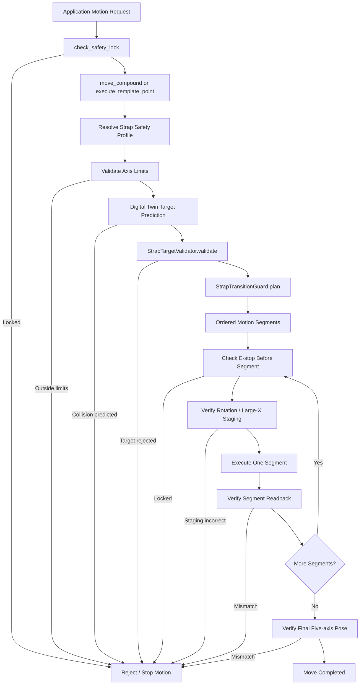


# 4. Detailed Safety Functions

## 4.1 Safety configuration accessors

File: [`Controller/safety_rules.py`](D:/Provenance Project/ImagingLibWatch/Controller/safety_rules.py)

### `safety_rule()`

Returns the canonical `hardware.zaber.SafetyRule` tree.

### `resolve_safety_profile()`

Determines whether a target uses:

- `watch`
- `strap`
- `box`

An explicit fixture profile is authoritative. Otherwise, the semantic target’s view and part names are inspected.

### `axis_limit_config()`

Returns the permitted axis range for the selected profile.

Current Strap limits:

```
X:   0 .. 435 mm
Y:   0 .. 292 mm
Z:   0 .. 150 mm
R_X: 0 .. 90 degrees
R_Z: continuous
```

An empty R_Z limit means continuous rotation, not unrestricted transition behavior. The Transition Guard still controls how R_Z may change.

### `door_estop_config()`

Returns MQTT topic, DI channel, open-door value and fail-closed behavior.

### `kinematics_config()` and `collision_envelope_config()`

Provide Digital Twin arm geometry and collision-box dimensions.

### `strap_safety_config()`

Returns the Strap-specific:

- Target validator settings
- Transition guard settings
- Safe staging positions
- Validated exceptions
- Readback tolerances

### `validate_safety_rule()`

Checks the SafetyRule schema before motion use, including required profiles, limits and load-verification fields.

---

## 4.2 Door and E-stop functions

### [`SafetyManager` (line 4571)](D:/Provenance Project/ImagingLibWatch/Controller/hardware_managers.py:4571)

In production, it subscribes to the configured MQTT door-sensor topic.

### [`SafetyManager._on_message()` (line 4640)](D:/Provenance Project/ImagingLibWatch/Controller/hardware_managers.py:4640)

Triggers the E-stop callback when:

- The configured door channel reports “open”
- MQTT payload parsing fails and `fail_closed_on_payload_error=true`

### [`trigger_emergency_stop()` (line 5383)](D:/Provenance Project/ImagingLibWatch/Controller/hardware_drivers/unified_driver.py:5383)

It:

1. Latches `_system_locked=True`.
2. Stops all Zaber axes.
3. Shuts down lighting.
4. Stops camera streaming.
5. Requires a manual reset.

### [`check_safety_lock()` (line 5375)](D:/Provenance Project/ImagingLibWatch/Controller/hardware_drivers/unified_driver.py:5375)

Called:

- At `move_compound()` entry
- At `execute_template_point()` entry
- Before internal XYZ movement
- Before every planned motion segment
- Before load and extension probe motion

If the system is latched, it raises immediately.

### [`manual_safety_reset()` (line 5411)](D:/Provenance Project/ImagingLibWatch/Controller/hardware_drivers/unified_driver.py:5411)

Attempts hardware recovery and clears the latch only when all recovery results succeed.

---

## 4.3 Central motion-planning functions

### [`move_compound()` (line 646)](D:/Provenance Project/ImagingLibWatch/Controller/hardware_drivers/unified_driver.py:646)

This is the main five-axis safety entry point.

It:

1. Checks the E-stop latch.
2. Reads the current five-axis pose.
3. Resolves missing target axes to their current values.
4. Applies optional kinematic compensation.
5. Calls Digital Twin prediction.
6. Calls `_plan_motion_segments()`.
7. Executes the planned segments.
8. Saves the failure reason in `_last_move_error`.

The function returns `False` if any safety stage rejects the move.

### [`execute_template_point()` (line 9762)](D:/Provenance Project/ImagingLibWatch/Controller/hardware_drivers/unified_driver.py:9762)

This is the complete capture entry point.

It covers:

- Initial capture-pose movement
- Mechanical autofocus
- Keyence probes
- Liquid autofocus
- HDR Z-bucket movement
- Final approach
- Camera capture

Its internal motion corrections are not exempt from safety rules.

### [`_move_xyz_with_safety()` (line 971)](D:/Provenance Project/ImagingLibWatch/Controller/hardware_drivers/unified_driver.py:971)

Used for internal XYZ adjustments such as:

- Autofocus movement
- Keyence searches
- HDR Z changes
- Final approach
- Focus correction

It preserves the current rotation axes, rebuilds a full five-axis target and runs it through the same planner.

### [`_plan_motion_segments()` (line 1018)](D:/Provenance Project/ImagingLibWatch/Controller/hardware_drivers/unified_driver.py:1018)

This is the shared planner.

For Strap targets it performs:

1. Fixture-profile resolution
2. Finite-number validation
3. Axis-limit validation
4. Digital Twin target check
5. `StrapTargetValidator.validate()`
6. `StrapTransitionGuard.plan()`

### [`_is_strap_semantic_target()` (line 3745)](D:/Provenance Project/ImagingLibWatch/Controller/hardware_drivers/unified_driver.py:3745)

Determines whether Strap-specific validation is required.

A target is treated as Strap when:

- `fixture_profile == "strap"`, or
- Semantic view/part text contains Strap identifiers

The Button 213/217 payloads explicitly provide Strap semantics, so they enter the Strap validator.

---

# 5. StrapTargetValidator — Final Pose Safety

Function: [`StrapTargetValidator.validate()` (line 816)](D:/Provenance Project/ImagingLibWatch/Controller/safety_rules.py:816)

This validator answers:

> “Is the requested final five-axis pose physically allowed?”

It does not decide the route. That is handled by `StrapTransitionGuard`.

## 5.1 Finite five-axis requirement

Every target must provide finite:

```
X, Y, Z, R_X, R_Z
```

NaN, infinity or non-numeric values are rejected.

## 5.2 Minimum stage Y

For ordinary non-exception targets:

```
Y >= 30 mm
```

A lower Y target is rejected.

## 5.3 Strap wall-envelope rule

When:

```
abs(R_X) >= 30 degrees
```

the validator calculates wall clearance:

```
clearance =
    target Y
    - wall Y
    - strap half length * abs(sin(R_Z))
```

Current canonical values:

```
Strap full span:       240 mm
Strap half length:     120 mm
Minimum clearance:      30 mm
Wall Y:                  0 mm
Tolerance:            0.05 mm
```

The target is accepted only when clearance is greater than the required minimum.

A macro_cam_1 request may provide a measured or maximum Strap half-length. The validator uses the larger value; the caller cannot weaken the canonical envelope.

## 5.4 Hazardous R_Z rule

A normal target requires a validated exception when all are true:

```
abs(R_X) >= 30 degrees
R_Z is within 20 degrees of 90 or 270 degrees
Y < 160 mm
```

This prevents an arbitrary deployed Strap pose from being commanded near the wall/camera frame.

## 5.5 Validated exception poses

Current exact validated exceptions:

- `4029`
- `4030`
- `4031`
- `4032`

An exception is accepted only when:

- The semantic `internalnum1` matches
- The final XYZ matches the configured pose
- R_X matches
- R_Z matches using canonical angular distance
- All values are within configured readback tolerance

The general safety rule is not a wildcard. A target that merely uses `internalnum1=4029` but does not match the configured pose is rejected.

Additional narrow exceptions exist for:

- 4029/4030 Keyence probe X/Z envelopes
- 4029/4030 autofocus Y corridors

These allow only the specifically calibrated axis variation while preserving the other axes.

---

# 6. StrapTransitionGuard — Safe Route Planning

Function: [`StrapTransitionGuard.plan()` (line 1394)](D:/Provenance Project/ImagingLibWatch/Controller/safety_rules.py:1394)

This guard answers:

> “Given an accepted target, in what order may the axes move?”

## 6.1 Normal staging values

```
Safe Y:   160 mm minimum
Safe Z:    70 mm exact staging plane
Safe R_X:   0 degrees
```

If current Y is already greater than 160 mm, the planner does not lower it to 160 mm because the larger Y provides more clearance.

## 6.2 Special 4029/4030 staging

Entering or leaving 4029/4030 uses:

```
Safe Y: 190 mm minimum
Safe Z:  70 mm
```

This protects the long Strap/endlink orientation.

## 6.3 When staging is forced

Staging is forced for:

- Deployed Strap motion
- Any R_X change
- Any R_Z change
- Entering or leaving a validated exception
- Keyence transition
- Oversized fixed-angle translation

## 6.4 R_Z change order

For an R_Z change, the planned order is:

```
1. Raise Y to safe clearance
2. Move Z to safe staging plane
3. Fold R_X to 0 degrees
4. Rotate R_Z at clearance
5. Deploy R_X to target angle
6. Move X to target
7. Move Z to target
8. Move Y to target
```

R_Z is never supposed to rotate while R_X remains deployed unless the route is an explicitly qualified local case.

## 6.5 Large top-down translation rule

Direct translation limits:

```
Maximum direct X delta: 14.25 mm
Maximum direct Y delta:  6.10 mm
Maximum direct Z delta:  3.00 mm
```

If a fixed-angle top-down move exceeds any limit, staging is required before translation.

Functions:

- [`top_down_translation_contract()` (line 1074)](D:/Provenance Project/ImagingLibWatch/Controller/safety_rules.py:1074)
- [`top_down_translation_staging_required()` (line 1147)](D:/Provenance Project/ImagingLibWatch/Controller/safety_rules.py:1147)

## 6.6 Same-view local translation

A direct local translation is permitted only when all requirements pass:

- Caller explicitly marks `strap_same_view_local_move`
- It is not a Keyence transition
- No special `internalnum1` is involved
- R_X and R_Z do not change
- R_Z is near 0° or 180°
- XYZ deltas remain within limits
- Minimum Y remains valid
- Wall clearance remains valid
- Target validation already succeeded

## 6.7 Endlink Keyence local scan

A narrow local X/Z path is allowed only inside the configured 4029/4030 probe envelope.

The current and target poses must preserve:

- Calibrated Y
- Calibrated R_X
- Calibrated R_Z
- X/Z inside the configured probe half-range

## 6.8 X-only optimization

An X-only optimization exists in code, but the current configuration has:

```
x_only_optimization:
  enabled: false
```

Therefore it is not active in the current Strap workflow.

---

# 7. Segment Execution and Readback

Function: [`_execute_motion_segments()` (line 765)](D:/Provenance Project/ImagingLibWatch/Controller/hardware_drivers/unified_driver.py:765)

This is where planned safety becomes hardware enforcement.

## Before every segment

It calls `check_safety_lock()` again. A door opening between two segments stops the next segment.

## Before a Strap rotation

Functions:

- [`_verify_strap_rotation_staging()` (line 3835)](D:/Provenance Project/ImagingLibWatch/Controller/hardware_drivers/unified_driver.py:3835)
- [`_verify_strap_rz_fold_readback()` (line 3854)](D:/Provenance Project/ImagingLibWatch/Controller/hardware_drivers/unified_driver.py:3854)
- `_strap_segment_has_rotation_delta()`

They verify that:

- Live Y is at or beyond safe clearance.
- Live Z matches the safe staging plane.
- R_X has actually reached the required folded angle before R_Z moves.

## Before a large X segment

The function reads live X/Y/Z.

If the requested X delta exceeds 14.25 mm, it requires:

```
live Y >= safe Y
live Z == safe Z within tolerance
```

The X command is not sent if live readback does not prove clearance.

## After every segment

Function:

- [`_verify_strap_keyence_pose_readback()` (line 3905)](D:/Provenance Project/ImagingLibWatch/Controller/hardware_drivers/unified_driver.py:3905)

Current tolerances:

```
XYZ tolerance:   0.05 mm
Angle tolerance: 0.5 degrees
```

The next segment does not start if the previous segment failed to reach its commanded position.

## Final pose

The complete five-axis final pose is verified again after all segments.

## Asynchronous movement restriction

Guarded Strap routes require `wait=True`. A caller cannot request asynchronous multi-segment motion because that would bypass the required between-segment readback contract.

---

# 8. Digital Twin Collision Prediction

Functions:

- [`DigitalTwinGuard` (line 7)](D:/Provenance Project/ImagingLibWatch/Controller/kinematics/digital_twin_guard.py:7)
- [`predict_collision()` (line 62)](D:/Provenance Project/ImagingLibWatch/Controller/kinematics/digital_twin_guard.py:62)
- `kinematics_config()`
- `collision_envelope_config()`

It calculates:

- Rotated platform bounding box
- Camera-arm bounding box
- Axis-aligned overlap between them

It is called both by `move_compound()` and the shared motion planner.

Important current limitation: all three configured collision envelopes currently have zero dimensions:

```
platform_box: {width: 0.0, depth: 0.0, height: 0.0}
macro_box:    {width: 0.0, length: 0.0}
micro_box:    {width: 0.0, length: 0.0}
```

Therefore, although `predict_collision()` is executed, it is not currently a meaningful calibrated volumetric collision layer.

The currently effective protections are primarily:

- Door/E-stop
- Axis limits
- StrapTargetValidator
- StrapTransitionGuard
- Large-X live-clearance check
- Rotation staging readback
- Per-segment readback
- Final-pose readback

---

# 9. Authoritative Control Files

## Canonical SafetyRule

[config/hardware_config.yaml (line 94)](D:/Provenance Project/ImagingLibWatch/config/hardware_config.yaml:94)

Important sections:

- Door/E-stop: line 97
- Axis limits: line 104
- Load verification: line 134
- Digital Twin: line 284
- Collision envelopes: line 297
- Strap target validator: line 359
- Validated exceptions: approximately line 371
- Strap transition guard: line 402
- Large-translation readback: line 441
- Segment/final readback: line 444
- Holder/start pose: line 465
- Watch-center pose: line 473

## Pipeline and macro_cam_1 scan calibration

[config/strap_macro_cam1_scan.yaml (line 7)](D:/Provenance Project/ImagingLibWatch/config/strap_macro_cam1_scan.yaml:7)

Controls:

- Camera-pipeline selection
- Endpoint scan
- Tile spacing
- Autofocus anchors
- Camera-to-Keyence calibration
- Per-view capture poses
- Camera exposure and lighting
- Stitching behavior

It does not own the canonical wall envelope, transition staging or readback tolerances; those values are injected from `hardware_config.yaml`.

## Legacy scan points and stitch groups

- [`config/internalnum_config.yaml`](D:/Provenance Project/ImagingLibWatch/config/internalnum_config.yaml)
- [`config/watchband_stitch.yaml`](D:/Provenance Project/ImagingLibWatch/config/watchband_stitch.yaml)

These define where and in what order to capture. They do not authorize unsafe motion: every resulting pose must still pass the canonical SafetyRule.


#### Strap 拍照流程——完整中文說明
```
把英文詳細解釋的全部翻成中文
```

# Strap 拍照流程——完整中文說明

目前 repository 的設定為：

```
use_macro_cam_1_pipeline: false
```

因此，目前實際使用的 production 流程是：

```
macro_cam_2
→ 依照 internalnum 拍攝各個點位
→ 將照片拼接成 Strap overview
```

程式中仍然保留 `macro_cam_1` 動態掃描流程，所以以下也會一併說明。

本文所稱的「Safety」包含：

- 防止載入錯誤治具或錯誤物件
- 防止多個硬體流程同時移動
- 安全門與緊急停止
- 軸向行程限制
- Strap 最終位置防撞檢查
- Strap 移動路徑規劃
- 每一段移動後的位置回讀確認
- 發生錯誤後的安全退回
- 最終回到安全位置

---

# 1. Button 213：Front / 3-clock / Back

````
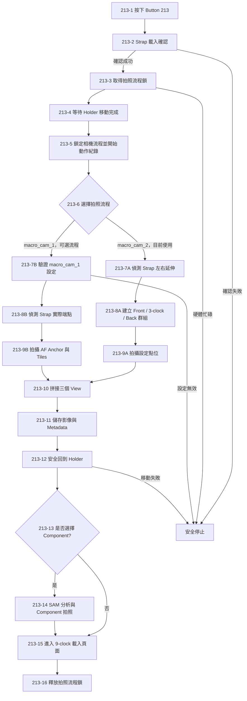
````

## 213-1——按下 Button 213

作用：接收操作員在 `page_template_new_strap_pre` 頁面按下「Bracelet Loaded」的操作。

相關 functions：

- [`_batch_connect()` (line 10361)](D:/Provenance Project/ImagingLibWatch/App/main.py:10361)
- [`_strap_probe_stitch_or_create()` (line 24905)](D:/Provenance Project/ImagingLibWatch/App/main.py:24905)

`_batch_connect()` 並不是直接把 Button 213 連接到拍照 function。

因為 Button 213 存在於 `_LOAD_VERIFICATION_BUTTON_VIEWS`，所以實際連接方式是：

```
Button 213
  → _verify_loaded_fixture_then("strap", callback)
  → _strap_probe_stitch_or_create()
```

也就是說，在 Strap 載入確認成功以前，真正的 Button 213 拍照 callback 不會被執行。

---

## 213-2——Strap 載入確認

作用：確認目前放在 Holder 上的物件確實是 Strap，而不是 Box、Watch 或錯誤的治具。

相關 functions：

- [`_verify_loaded_fixture_then()` (line 10472)](D:/Provenance Project/ImagingLibWatch/App/main.py:10472)
- [`verify_loaded_fixture()` (line 296)](D:/Provenance Project/ImagingLibWatch/Controller/load_fixture_verifier.py:296)
- [`_detection_sequence()` (line 70)](D:/Provenance Project/ImagingLibWatch/Controller/load_fixture_verifier.py:70)
- [`_center_out_grid()` (line 124)](D:/Provenance Project/ImagingLibWatch/Controller/load_fixture_verifier.py:124)
- [`_safe_move()` (line 221)](D:/Provenance Project/ImagingLibWatch/Controller/load_fixture_verifier.py:221)
- [`_read_out1()` (line 196)](D:/Provenance Project/ImagingLibWatch/Controller/load_fixture_verifier.py:196)
- [`_out1_is_valid()` (line 215)](D:/Provenance Project/ImagingLibWatch/Controller/load_fixture_verifier.py:215)

執行流程：

1. `_verify_loaded_fixture_then()` 先取得一個暫時性的拍照流程 token。
2. 它在獨立且序列化的 hardware worker 中執行 `verify_loaded_fixture()`。
3. `verify_loaded_fixture()` 讀取 canonical `SafetyRule.load_verification` 設定。
4. 系統從較高的治具開始，依序檢查不同高度層級。
5. 到 Strap 層級時，可能會使用設定好的中心向外 XY 搜尋網格。
6. 每一個 Keyence 探測位置都必須經過 `_safe_move()`。
7. `_safe_move()` 強制要求使用 `UnifiedHardwareDriver.move_compound()`。
8. 不允許退回到直接呼叫原始 Zaber 移動的方式。
9. Keyence `OUT1` 會被轉換成推算出的治具高度。
10. 只有偵測到的治具層級符合 Strap 條件時，才會繼續執行 Button 213。

目前 Strap 驗證使用的主要條件為：

```
推算出的 Z > 50 mm
```

如果驗證失敗：

```
Button 213 真正的拍照 callback 不會被呼叫
```

在 simulation mode 中，這個載入確認步驟會被略過。

---

## 213-3——取得拍照流程鎖

作用：防止 Button 213、Button 217 或其他拍照按鈕同時啟動重疊的硬體流程。

相關 functions：

- [`_begin_camera_operation()` (line 10532)](D:/Provenance Project/ImagingLibWatch/App/main.py:10532)
- `_camera_operation_is_current()`
- [`_finish_camera_operation()` (line 10568)](D:/Provenance Project/ImagingLibWatch/App/main.py:10568)

一個重要細節是：

載入確認和正式拍照使用的是不同 operation token。

```
載入確認 token
  → 載入確認完成
  → 釋放 token
  → 執行真正的 Button 213 callback
  → 取得新的 Button 213 token
```

當 `_begin_camera_operation()` 成功時，它會停用 `_CAMERA_OPERATION_BUTTONS` 中列出的所有拍照入口按鈕。

如果另一個 operation 已經持有流程鎖：

```
新的拍照請求會在硬體開始移動以前被拒絕
```

---

## 213-4——等待 Holder 移動完成

作用：防止 Holder 還在移動時，又啟動 Strap 拍照 worker。

相關 functions：

- `_is_holder_move_running()`
- `_start_holder_move_async()`
- [`_start_workflow_task()` (line 10642)](D:/Provenance Project/ImagingLibWatch/App/main.py:10642)

`_strap_probe_stitch_or_create()` 會先確認 Holder move worker 是否仍在執行。

如果 Holder 還在移動，系統會：

1. 將 Strap 拍照 continuation 加入等待序列。
2. 等待 Holder 移動完成。
3. Holder 完成後才重新進入 Button 213 流程。

`_start_workflow_task(..., hardware=True)` 還會再做一次硬體層級檢查：

- 不可以有 Holder move 正在執行。
- 不可以有其他 hardware workflow worker 正在執行。

這個機制本身不是幾何防撞演算法，但它可以防止兩個安全規劃器同時控制相同硬體。

---

## 213-5——鎖定拍照流程並開始動作紀錄

作用：

- 鎖定 Button 213 到 Button 217 之間所使用的相機流程。
- 開始記錄整個 Strap 流程中的移動與拍照資訊。

相關 functions：

- [`_lock_strap_pipeline_for_session()` (line 37066)](D:/Provenance Project/ImagingLibWatch/App/main.py:37066)
- [`_load_strap_macro1_scan_config()` (line 37082)](D:/Provenance Project/ImagingLibWatch/App/main.py:37082)
- [`_strap_macro1_scan_enabled()` (line 37092)](D:/Provenance Project/ImagingLibWatch/App/main.py:37092)
- [`_start_strap_motion_recording()` (line 3845)](D:/Provenance Project/ImagingLibWatch/App/main.py:3845)
- `_attach_strap_motion_observer()`
- `_record_strap_motion_event()`

`_lock_strap_pipeline_for_session()` 會：

1. 讀取 Wide-field Camera 或 Macro Camera checkbox。
2. 將選擇結果寫入 `strap_macro_cam1_scan.yaml`。
3. 將結果儲存在 `_strap_pipeline_session_use_macro1`。
4. 停用兩個 pipeline checkbox。
5. 確保 Button 217 只能延續 Button 213 使用的相同 pipeline。

重要區別：

`StrapMotionRecorder` 是稽核與診斷工具，不是防撞判斷器。

它會記錄：

- 移動要求
- 移動完成事件
- 拍照位置
- Holder/center return
- 頁面切換
- 發生錯誤的位置

但它本身不會拒絕危險動作。

---

## 213-6——選擇拍照流程

作用：選擇建立前三個 Strap view 的實作方式。

相關 functions：

- [`_start_strap_213_workflow()` (line 39955)](D:/Provenance Project/ImagingLibWatch/App/main.py:39955)
- [`_run_strap_213_workflow_core()` (line 39876)](D:/Provenance Project/ImagingLibWatch/App/main.py:39876)

`_start_strap_213_workflow()` 建立一個保留中的 hardware worker。

UI 更新在完成 callback 中執行；真正的硬體工作在 `_run_strap_213_workflow_core()` 中執行。

兩條分支：

```
macro_cam_2：
使用設定好的 internalnum 點位拍照，再做影像拼接。

macro_cam_1：
先量測 Strap 左右端點，再動態產生 raw tile 拍照位置並拼接。
```

如果 worker 中出現未處理的錯誤，failure callback 會：

- 將進度歸零
- 顯示「Strap scan stopped safely」
- 釋放 operation guard
- 不進入 9-clock 頁面

---

## 213-7A——偵測 Strap 延伸：macro_cam_2

作用：判斷 Strap 左側或右側是否需要增加額外拍照點。

相關 functions：

- [`_detect_strap_extension_flags()` (line 40337)](D:/Provenance Project/ImagingLibWatch/App/main.py:40337)
- `_run_single_strap_extension_probe()`
- [`_move_strap_keyence_probe_pose()` (line 40206)](D:/Provenance Project/ImagingLibWatch/App/main.py:40206)
- `_read_strap_keyence_out1()`
- `_strap_keyence_out1_valid()`

每一個 Keyence 探測位置的呼叫鏈為：

```
_move_strap_keyence_probe_pose()
  → check_safety_lock()
  → move_compound()
  → 最終位置驗證
  → 安全路徑規劃
  → 分段移動
  → 位置回讀確認
```

如果 `move_compound()` 不存在，探測流程會直接失敗。

程式不允許用：

```
zaber.move_axis()
```

作為 production compatibility fallback。

最後產生的：

```
strap_left_ext
strap_right_ext
```

會決定動態拼接群組中是否需要加入額外影像。

---

## 213-8A——建立 Front / 3-clock / Back 群組

作用：根據左右延伸結果，建立有順序的拍照群組。

相關 functions：

- [`_build_dynamic_strap_stitch_groups()` (line 40463)](D:/Provenance Project/ImagingLibWatch/App/main.py:40463)
- `_apply_strap_stitch_group_overrides()`
- `_apply_strap_stitch_source_config()`
- `_strap_capture_order_for_group()`
- [`_strap_scan_positions_ready()` (line 41403)](D:/Provenance Project/ImagingLibWatch/App/main.py:41403)

三個正常群組為：

1. `strap_right_front`
2. `strap_right_side`，也就是 3-clock
3. `strap_right_back`

在 production mode 中，`_strap_scan_positions_ready()` 會做 fail-closed 檢查。

以下情況會拒絕開始掃描：

- 必要的 point 不存在
- XYZ 無法轉換成有效數字
- XYZ 全部等於零

實際拍照位置由 point/internalnum 設定提供，但這些位置仍然必須通過獨立的 SafetyRule。

設定檔只描述「想去哪裡」；SafetyRule 決定「能不能去」以及「要怎麼去」。

---

## 213-9A——拍攝設定點位

作用：移動到每一個 Strap 點位、執行 autofocus、拍照並儲存來源影像。

相關 functions：

- [`_capture_and_show_strap_stitched_views()` (line 42036)](D:/Provenance Project/ImagingLibWatch/App/main.py:42036)
- [`_capture_strap_stitch_source_image()` (line 41431)](D:/Provenance Project/ImagingLibWatch/App/main.py:41431)
- [`_execute_prepared_point_capture()` (line 9132)](D:/Provenance Project/ImagingLibWatch/App/main.py:9132)
- [`execute_template_point()` (line 9762)](D:/Provenance Project/ImagingLibWatch/Controller/hardware_drivers/unified_driver.py:9762)

完整呼叫鏈：

```
_capture_and_show_strap_stitched_views()
  → 對每一個 group
     → 對每一個 capture item
        → _capture_strap_stitch_source_image()
           → _execute_prepared_point_capture()
              → execute_template_point()
```

`_execute_prepared_point_capture()` 會建立完整的硬體參數：

- X、Y、Z
- R_X、R_Z
- 相機選擇
- internalnum1 / internalnum2
- 曝光時間
- Gain
- Lighting
- Mechanical autofocus
- Liquid-lens autofocus
- HDR 設定
- `fixture_profile="strap"` 的 semantic target

`execute_template_point()` 一進入就會檢查 safety lock。

它內部包含的以下動作都必須經過共用 safety planner：

- 初始拍照位置移動
- Mechanical autofocus
- Keyence 探測
- Liquid autofocus
- HDR Z 位置移動
- Final approach
- 最終拍照位置

---

## 213-7B——驗證 macro_cam_1 設定

作用：在動態 raw-tile 掃描開始前，確認所有 macro_cam_1 校正與 safety 條件完整。

相關 functions：

- [`_validate_strap_macro1_scan_for_run()` (line 37102)](D:/Provenance Project/ImagingLibWatch/App/main.py:37102)
- `_strap_macro1_validate_pose()`
- `validate_scan_config()`
- [`validate_safety_rule()` (line 417)](D:/Provenance Project/ImagingLibWatch/Controller/safety_rules.py:417)

Production 驗證內容包含：

- `safety.calibration_confirmed`
- Front、side、back、9-clock 的位置限制
- `move_compound()` 是否存在
- Hardware safety planner 是否存在
- Camera-to-Keyence calibration 是否一致
- Endpoint detection 設定
- Focus 設定
- Canonical SafetyRule 是否已注入 scan config

`strap_macro_cam1_scan.yaml` 負責：

- 掃描校正
- Tile 間距
- AF anchor
- Endpoint detection
- 拍照設定
- Stitch 設定

但 canonical 防撞設定仍然來自：

```
config/hardware_config.yaml
```

---

## 213-8B——偵測 Strap 實際端點

作用：量測 Strap 左右實際邊界，而不是假設固定數量的 tiles。

相關 functions：

- [`_detect_strap_macro1_endpoints()` (line 37474)](D:/Provenance Project/ImagingLibWatch/App/main.py:37474)
- `_select_strap_macro1_keyence_probe_y_offset()`
- `_resolve_strap_macro1_endpoint_report()`
- [`_strap_macro1_transition_to_pose()` (line 37447)](D:/Provenance Project/ImagingLibWatch/App/main.py:37447)
- [`_strap_macro1_safe_compound_move()` (line 37373)](D:/Provenance Project/ImagingLibWatch/App/main.py:37373)

Endpoint detection 可能包含：

- Seed position
- 粗略 X 方向探測
- 精細 X 方向搜尋
- 小範圍 Y retry
- 連續無效 Keyence reading，用來確認實際邊界

`_strap_macro1_safe_compound_move()` 強制要求：

- Hardware driver 必須存在
- `move_compound()` 必須存在
- Safety lock 沒有被鎖住
- Target pose 必須通過驗證

它也會將量測到的最大 Strap span 傳入 semantic target。

如果 caller 提供的 Strap half-length 大於 canonical 設定，validator 會使用較大的值；caller 不能藉由傳入較小值降低安全標準。

---

## 213-9B——拍攝 AF Anchor 與 Raw Tiles

作用：在量測到的 Strap 範圍中，使用 macro_cam_1 拍攝動態 raw images。

相關 functions：

- [`_capture_strap_macro1_views()` (line 39460)](D:/Provenance Project/ImagingLibWatch/App/main.py:39460)
- [`_capture_strap_macro1_view()` (line 38495)](D:/Provenance Project/ImagingLibWatch/App/main.py:38495)
- [`_strap_macro1_capture_frame()` (line 38113)](D:/Provenance Project/ImagingLibWatch/App/main.py:38113)
- `_strap_macro1_focus_result_ok()`
- `_strap_macro1_locked_current()`
- `_strap_macro1_stitch_view()`

一般 macro_cam_1 流程：

1. 根據左右 endpoint 計算 tile X 位置。
2. 選出五個 autofocus anchor。
3. 每一個 anchor 執行 Keyence 高度量測。
4. 每一個 anchor 執行 liquid-lens autofocus。
5. 保留 anchor image。
6. 對非 anchor tile 內插 focus 值。
7. 拍攝其他 tiles。
8. 按順序拼接 raw tiles。

每一個 stage move 仍然會經過：

```
_strap_macro1_transition_to_pose()
```

或 driver 內部的安全 XYZ 移動。

---

## 213-10——拼接三個 View

作用：將每一個群組的來源照片拼接成一張完整 view。

相關 functions：

- [`WatchBandStitcher.stitch_group()` (line 578)](D:/Provenance Project/ImagingLibWatch/algorithms/watchband_stitcher.py:578)
- `_strap_stitch_ordered_image_items()`
- `_strap_macro1_stitch_view()`
- [`_compose_strap_stitched_preview()` (line 41709)](D:/Provenance Project/ImagingLibWatch/App/main.py:41709)

Legacy pipeline 會逐一拼接每個 group。

只要任何必要來源影像缺少：

```
該 group 不會繼續 stitch
整個 workflow 會停止
```

完成後的前三個 view 順序為：

```
Front → 3-clock → Back
```

影像 stitch 本身不會移動硬體，因此不會觸發 motion collision rules。

---

## 213-11——儲存影像與 Metadata

作用：儲存足夠的資料，供 UI 顯示、後續 SAM 分析與 audit 使用。

相關 functions：

- `_save_strap_stitched_output_images()`
- [`_save_strap_precapture_artifacts()` (line 41937)](D:/Provenance Project/ImagingLibWatch/App/main.py:41937)
- `_save_strap_stitched_overview_metadata()`
- [`_remember_strap_stitched_pre_capture_result()` (line 40546)](D:/Provenance Project/ImagingLibWatch/App/main.py:40546)
- `_remember_strap_macro1_pre_capture_result()`

儲存內容包括：

- 每一個 stitched view
- Frame 82 overview
- Segment/display geometry
- Stitch reports
- Extension report 或 endpoint report
- 拍照位置
- Process YAML
- macro_cam_1 raw-image manifest
- Source camera 資訊

這個區塊只處理資料儲存，不會控制硬體移動。

---

## 213-12——安全回到 Holder

作用：在要求操作員翻面或重新裝載 Strap 前，先將機器移動到方便操作的 Holder/start position。

相關 functions：

- `_move_zaber_to_start_pos()`
- [`_move_zaber_to_safe_strap_pose()` (line 10106)](D:/Provenance Project/ImagingLibWatch/App/main.py:10106)
- `_strap_macro1_transition_to_pose()`
- [`move_compound()` (line 646)](D:/Provenance Project/ImagingLibWatch/Controller/hardware_drivers/unified_driver.py:646)

目前設定的 Holder/start destination 為：

```
X   = 0
Y   = 292
Z   = 150
R_X = 0
R_Z = 0
```

這不是一次直接的五軸跳躍。

`move_compound()` 會透過 `StrapTransitionGuard` 將它拆成安全的分段路徑。

如果回 Holder 失敗：

- 顯示錯誤
- 不進入 9-clock 載入頁面
- 要求操作員先檢查硬體

---

## 213-13/14——選擇性 SAM 與 Component 拍照

作用：在 overview 完成後，拍攝使用者選擇的 Strap components。

相關 functions：

- [`_start_automatic_strap_component_capture()` (line 14499)](D:/Provenance Project/ImagingLibWatch/App/main.py:14499)
- [`_start_strap_precapture_auto_analysis()` (line 14701)](D:/Provenance Project/ImagingLibWatch/App/main.py:14701)
- `_resume_pending_strap_component_capture()`
- `_on_strap_link_analysis_ready()`
- [`_preflight_strap_component_capture_routes()` (line 16557)](D:/Provenance Project/ImagingLibWatch/App/main.py:16557)
- [`_execute_strap_component_capture_plan()` (line 16671)](D:/Provenance Project/ImagingLibWatch/App/main.py:16671)
- [`_run_strap_component_capture_plan_core()` (line 16785)](D:/Provenance Project/ImagingLibWatch/App/main.py:16785)
- [`_move_zaber_to_strap_safe_retract()` (line 3949)](D:/Provenance Project/ImagingLibWatch/App/main.py:3949)
- [`_finish_strap_component_capture_operation()` (line 17790)](D:/Provenance Project/ImagingLibWatch/App/main.py:17790)

Safety 行為：

1. 只處理屬於 phase 213 且被選取的 components。
2. 必須先得到目前 Strap session 已儲存的 SAM coordinates。
3. Macro 與 micro phase 分別做 route preflight。
4. Preflight 會將 candidate pose 送入 Digital Twin 與共用 motion planner。
5. 每一個實際 point 仍然透過 `execute_template_point()`。
6. 如果某個 point 失敗，系統必須先執行 `_move_zaber_to_strap_safe_retract()`。
7. 只有確認回到 safe retract pose，下一個 point 才能繼續。
8. Macro phase 完成後，開始 macro-image screw analysis 前也必須先安全退回。
9. `finally` 區塊會在成功或例外時執行 safe retract。
10. 如果 retract 失敗，該錯誤是 fatal，component pipeline 不可繼續。

---

## 213-15/16——進入 9-clock 頁面並釋放流程鎖

作用：完成 Button 213 並要求操作員載入 9-clock view。

相關 functions：

- [`_show_strap_9clock_load_page()` (line 40634)](D:/Provenance Project/ImagingLibWatch/App/main.py:40634)
- `_finish_camera_operation()`

目的頁面：

```
page_template_new_strap_pre2
```

如果沒有選擇 components：

```
頁面切換完成後立即釋放 operation guard
```

如果有啟動 component capture：

```
_finish_strap_component_capture_operation()
  → 釋放 operation guard
  → 呼叫頁面 navigation callback
```

---

# 2. Button 217：9-clock

````
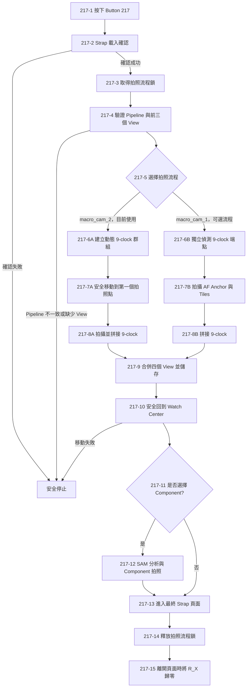
````

## 217-1/2——按下按鈕與載入確認

相關 functions：

- `_batch_connect()`
- [`_start_strap_9clock_pre_capture()` (line 40747)](D:/Provenance Project/ImagingLibWatch/App/main.py:40747)
- `_verify_loaded_fixture_then()`
- `verify_loaded_fixture()`

Button 217 使用與 Button 213 相同的 Strap load-verification mechanism。

第二次驗證很重要，因為操作員在 Button 213 和 Button 217 之間已經：

- 取下 Strap
- 翻轉 Strap
- 重新裝載 Strap

因此不能直接假設目前載入狀態仍然正確。

---

## 217-3——取得拍照流程鎖

相關 functions：

- `_begin_camera_operation()`
- `_camera_operation_is_current()`
- `_start_workflow_task()`

這個 guard 防止 Button 217 在以下情況啟動：

- 另一個拍照 operation 尚未完成
- Holder 還在移動
- 另一個 hardware worker 還在執行

Button 217 使用的 operation key 為：

```
template_pre_capture:strap_9clock
```

---

## 217-4——驗證 Pipeline 與前三個 View

作用：確認 Button 217 延續的是 Button 213 建立的同一個 session。

相關 functions：

- [`_start_strap_217_workflow()` (line 41037)](D:/Provenance Project/ImagingLibWatch/App/main.py:41037)
- `_strap_macro1_scan_enabled()`
- `_strap_primary_stitched_views()`

驗證規則：

- Button 213 使用 macro_cam_1，但現在 switch 變成 false：停止。
- Button 213 使用 macro_cam_2，但現在 switch 變成 true：停止。
- macro_cam_2 流程必須存在三張 stitched views。
- macro_cam_1 流程必須存在三筆 raw-view records。
- 缺少 Button 213 的前三個 view 時，在硬體移動前停止。

這可以避免在同一個四面 overview 中混用：

- 不同相機
- 不同光學倍率
- 不同 calibration
- 不同 coordinate mapping

---

## 217-5/6A——建立動態 9-clock 群組

相關 functions：

- [`_build_dynamic_strap_9clock_stitch_groups()` (line 40503)](D:/Provenance Project/ImagingLibWatch/App/main.py:40503)
- `_strap_primary_stitched_views()`

Legacy 9-clock group 使用 Button 213 儲存的 extension report 建立。

它通常從設定好的：

```
4022–4028
```

點位範圍中選出必要的拍照點。

---

## 217-7A——安全移動到第一個 9-clock 點

作用：在 group capture 正式開始以前，先明確透過 safety planner 移動到第一個拍照點。

相關 functions：

- [`_move_strap_capture_group_start()` (line 40659)](D:/Provenance Project/ImagingLibWatch/App/main.py:40659)
- `_materialize_strap_scan_point()`
- `_move_zaber_to_safe_strap_pose()`
- `move_compound()`

這個 function 會：

1. 找出 capture order 中的第一個 item。
2. 解析它的五軸位置。
3. 記錄 motion audit event。
4. 呼叫 `_move_zaber_to_safe_strap_pose()`。
5. 如果安全移動被拒絕，就不啟動任何拍照 task。

這只是額外的進入點預定位。

後面的每一張照片仍然會各自執行完整 safety validation。

---

## 217-8A——拍攝並拼接 9-clock

相關 functions：

- [`_run_strap_217_workflow_core()` (line 40950)](D:/Provenance Project/ImagingLibWatch/App/main.py:40950)
- `_capture_and_show_strap_stitched_views()`
- `_capture_strap_stitch_source_image()`
- `_execute_prepared_point_capture()`
- `execute_template_point()`
- `WatchBandStitcher.stitch_group()`

前三張 view 會透過：

```
existing_stitched_views
```

傳入。

Button 217 只會重新拍攝並拼接新的 9-clock group，不會重拍前三張。

---

## 217-6B/7B/8B——macro_cam_1 的 9-clock

相關 functions：

- `_capture_strap_macro1_views(["9clock"], ...)`
- `_detect_strap_macro1_endpoints()`
- `_capture_strap_macro1_view()`
- `_strap_macro1_capture_frame()`
- `_strap_macro1_stitch_view()`

9-clock 的 endpoint measurement 是獨立量測，因為 Strap 已經被操作員翻面。

當設定要求重新量測時，Button 217 不可以直接沿用 Button 213 的 endpoint report。

完成 endpoint detection 後，系統會再次執行：

- Anchor autofocus
- Focus interpolation
- Tile capture
- Tile stitching

---

## 217-9——合併四個 View 並儲存

相關 functions：

- `_ordered_strap_stitched_views()`
- `_compose_strap_stitched_preview()`
- `_save_strap_precapture_artifacts()`
- `_remember_strap_stitched_pre_capture_result()`
- `_remember_strap_macro1_pre_capture_result()`

最終顯示順序：

```
Front → 3-clock → Back → 9-clock
```

完成後，`_strap_four_view_capture_complete()` 應該會回傳 `True`。

---

## 217-10——安全回到 Watch Center

相關 functions：

- `_move_zaber_to_center_pos()`
- `_move_zaber_to_safe_strap_pose()`
- `_strap_macro1_transition_to_pose()`
- `move_compound()`

目的位置來自：

```
hardware.zaber.home_positions.watch
```

和回 Holder 一樣，這不是直接五軸跳躍。

它會經過：

- Axis limits
- Digital Twin
- StrapTargetValidator
- StrapTransitionGuard
- Segment readback
- Final pose readback

如果 center return 失敗，系統不會進入最終 Strap 頁面。

---

## 217-11/12——選擇性 Component 拍照

這裡使用和 Button 213 相同的 component pipeline，但只處理 phase 217 對應的 components。

Safety 規則相同：

- 必須有目前 session 的 SAM coordinates。
- Macro 和 micro route 分開 preflight。
- 每一個 capture 使用 `execute_template_point()`。
- Point 失敗後必須先成功 safe retract。
- `finally` 中必須再執行一次最終 safe retract。

---

## 217-13/14——進入最終頁面並釋放流程鎖

相關 functions：

- `_load_new_template_data()`
- `_show_template_name_create_page()`
- `_show_precaptured_in_frame()`
- `_finish_camera_operation()`

目的頁面取決於 template 狀態：

```
全新的 scratch template：
進入 template naming/source 頁面。

既有 template：
直接進入 page_template_new_strap。
```

四張 stitched overview 會顯示在：

```
frame_82
```

---

## 217-15——離開最終 Strap 頁面

作用：避免離開頁面後，camera arm 仍然維持展開狀態。

相關 functions：

- [`go_to_page()` (line 31115)](D:/Provenance Project/ImagingLibWatch/App/main.py:31115)
- [`_force_rx_to_zero()` (line 19800)](D:/Provenance Project/ImagingLibWatch/App/main.py:19800)
- [`WorkflowManager.manual_move()` (line 3066)](D:/Provenance Project/ImagingLibWatch/core/workflow_manager.py:3066)
- `move_compound()`
- [`_finish_strap_motion_recording()` (line 3896)](D:/Provenance Project/ImagingLibWatch/App/main.py:3896)

`_force_rx_to_zero()` 在 production workflow 中不會直接呼叫原始 Zaber axis move。

它的呼叫鏈是：

```
_force_rx_to_zero()
  → WorkflowManager.manual_move()
  → UnifiedHardwareDriver.move_compound()
  → Safety planner
```

完成 R_X reset 或頁面切換後，Strap motion audit 會被關閉並儲存。

---

# 3. 完整防撞 Safety 呼叫鏈

````
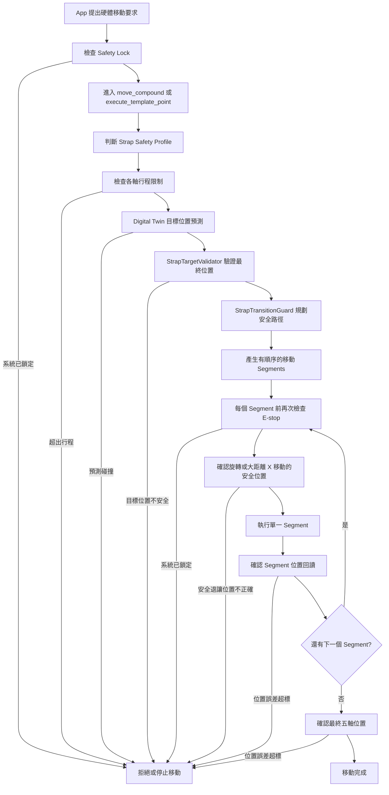
````

---

# 4. Safety Functions 詳細說明

## 4.1 Safety 設定存取 functions

檔案：[`Controller/safety_rules.py`](D:/Provenance Project/ImagingLibWatch/Controller/safety_rules.py)

### `safety_rule()`

取得 canonical：

```
hardware.zaber.SafetyRule
```

整棵設定樹。

這是目前 motion/collision safety 的主要設定來源。

### `resolve_safety_profile()`

判斷目前 target 應該使用哪個 safety profile：

- `watch`
- `strap`
- `box`

如果 semantic target 明確指定 `fixture_profile`，就優先使用該值。

否則會從以下欄位判斷：

- `view_mode`
- `view_name`
- `part_name`
- `point_name`

### `axis_limit_config()`

取得所選 profile 的軸向行程限制。

目前 Strap 限制：

```
X：   0 ～ 435 mm
Y：   0 ～ 292 mm
Z：   0 ～ 150 mm
R_X： 0 ～ 90°
R_Z： Continuous
```

R_Z 設定為空陣列表示它是 continuous rotation axis。

這不代表 R_Z 可以隨意旋轉；`StrapTransitionGuard` 仍會控制旋轉順序。

### `door_estop_config()`

取得：

- MQTT broker
- MQTT topic
- Door sensor DI channel
- Door open value
- Payload error 是否 fail closed

### `kinematics_config()`

取得 Digital Twin 的：

- Pivot position
- Camera arm 長度
- Rotation center
- Axis direction

### `collision_envelope_config()`

取得 Digital Twin 使用的：

- Platform box
- Macro camera box
- Micro camera box

### `strap_safety_config()`

取得 Strap 專用：

- Target validator
- Wall envelope
- Minimum Y
- Validated exceptions
- Transition guard
- Safe staging positions
- Readback tolerance

### `validate_safety_rule()`

檢查 SafetyRule schema 是否完整，包括：

- SafetyRule version
- Door/E-stop fields
- 每一個 profile 的 axis limits
- Load-verification fields
- Strap safety structure

---

# 5. Door 與 E-stop Functions

## [`SafetyManager` (line 4571)](D:/Provenance Project/ImagingLibWatch/Controller/hardware_managers.py:4571)

在 production mode 中，它會訂閱設定好的 MQTT door-sensor topic。

## [`SafetyManager._on_message()` (line 4640)](D:/Provenance Project/ImagingLibWatch/Controller/hardware_managers.py:4640)

以下情況會觸發 E-stop callback：

- Door sensor channel 回報「門已開啟」
- MQTT payload 無法解析，而且 `fail_closed_on_payload_error=true`

## [`trigger_emergency_stop()` (line 5383)](D:/Provenance Project/ImagingLibWatch/Controller/hardware_drivers/unified_driver.py:5383)

執行順序：

1. 設定 `_system_locked=True`。
2. 緊急停止所有 Zaber axes。
3. 關閉所有 lighting。
4. 停止 camera stream。
5. 保持 locked 狀態，直到人工 reset。

## [`check_safety_lock()` (line 5375)](D:/Provenance Project/ImagingLibWatch/Controller/hardware_drivers/unified_driver.py:5375)

它會在以下時機被呼叫：

- `move_compound()` 入口
- `execute_template_point()` 入口
- 內部 XYZ 移動以前
- 每一個 motion segment 執行以前
- Load probe 以前
- Extension probe 以前

如果 `_system_locked=True`，立即拋出錯誤，不允許下一步移動。

## [`manual_safety_reset()` (line 5411)](D:/Provenance Project/ImagingLibWatch/Controller/hardware_drivers/unified_driver.py:5411)

嘗試恢復硬體狀態。

只有全部 recovery result 成功時，才會清除 `_system_locked`。

---

# 6. 中央 Motion Planner Functions

## [`move_compound()` (line 646)](D:/Provenance Project/ImagingLibWatch/Controller/hardware_drivers/unified_driver.py:646)

這是主要五軸安全移動入口。

它會：

1. 檢查 E-stop lock。
2. 讀取目前五軸位置。
3. 未指定的 target axis 使用目前值。
4. 必要時套用 kinematic compensation。
5. 執行 Digital Twin target prediction。
6. 呼叫 `_plan_motion_segments()`。
7. 執行規劃出的 segments。
8. 發生錯誤時，把原因寫入 `_last_move_error`。

如果任何 safety stage 拒絕移動，`move_compound()` 會回傳：

```
False
```

## [`execute_template_point()` (line 9762)](D:/Provenance Project/ImagingLibWatch/Controller/hardware_drivers/unified_driver.py:9762)

這是完整拍照流程的硬體入口。

它處理：

- 初始 capture pose
- Mechanical autofocus
- Keyence autofocus
- Liquid-lens autofocus
- HDR Z movement
- Final approach
- Camera capture

內部的小幅移動不會跳過 SafetyRule。

## [`_move_xyz_with_safety()` (line 971)](D:/Provenance Project/ImagingLibWatch/Controller/hardware_drivers/unified_driver.py:971)

用於內部 XYZ 修正，例如：

- Autofocus
- Keyence 搜尋
- HDR Z bucket
- Final approach
- Focus correction

它會：

1. 保留目前 R_X/R_Z。
2. 組成完整五軸 target。
3. 再次執行 `_plan_motion_segments()`。
4. 執行分段移動。
5. 驗證位置回讀。

## [`_plan_motion_segments()` (line 1018)](D:/Provenance Project/ImagingLibWatch/Controller/hardware_drivers/unified_driver.py:1018)

這是共用路徑規劃器。

對 Strap target，它會依序執行：

1. 判斷 fixture profile。
2. 確認五軸值都是 finite number。
3. 檢查 axis limits。
4. 執行 Digital Twin。
5. 執行 `StrapTargetValidator.validate()`。
6. 執行 `StrapTransitionGuard.plan()`。

## [`_is_strap_semantic_target()` (line 3745)](D:/Provenance Project/ImagingLibWatch/Controller/hardware_drivers/unified_driver.py:3745)

判斷 target 是否需要套用 Strap-specific safety。

以下任一條件成立，就視為 Strap：

```
fixture_profile == "strap"
```

或 semantic text 中包含：

- `strap`
- `straprightside`
- `strap_right_side`

Button 213/217 的 payload 會明確傳入 Strap semantic，因此會進入 Strap validator。

---

# 7. StrapTargetValidator——最終位置 Safety

主要 function：

[`StrapTargetValidator.validate()` (line 816)](D:/Provenance Project/ImagingLibWatch/Controller/safety_rules.py:816)

它回答的問題是：

> 要求的最終五軸位置是否安全？

它不負責決定路徑；路徑由 `StrapTransitionGuard` 負責。

## 7.1 五軸值必須有效

Target 必須包含有效且有限的：

```
X
Y
Z
R_X
R_Z
```

以下情況會直接拒絕：

- NaN
- Infinity
- 非數字
- 缺少必要 axis

## 7.2 Minimum Stage Y

對一般、非 exception 的 target：

```
Y 必須 >= 30 mm
```

低於 30 mm 會被拒絕。

## 7.3 Strap Wall Envelope

當：

```
abs(R_X) >= 30°
```

validator 會計算 Strap 與 wall/camera frame 的 clearance：

```
clearance =
    target Y
    - wall Y
    - Strap half length × abs(sin(R_Z))
```

目前 canonical 設定：

```
Strap 最大完整長度：240 mm
Strap half length： 120 mm
最小 clearance：     30 mm
Wall Y：               0 mm
Tolerance：         0.05 mm
```

只有 clearance 大於要求值時，target 才能被接受。

macro_cam_1 可以提供實際量測或最大 Strap half-length。

Validator 會使用 canonical 與 caller value 中較大的值，因此 caller 無法降低安全標準。

## 7.4 危險 R_Z 規則

當以下三個條件全部成立：

```
abs(R_X) >= 30°
R_Z 位於 90° 或 270° 附近 ±20°
Y < 160 mm
```

一般 target 必須是已驗證的 exception，否則拒絕。

這防止長 Strap 在展開狀態下，被任意移到 wall/camera frame 附近。

## 7.5 Validated Exception Poses

目前設定的 exception：

- `4029`
- `4030`
- `4031`
- `4032`

Exception 只有在以下條件全部符合時才成立：

- Semantic `internalnum1` 正確
- XYZ 符合設定位置
- R_X 符合設定角度
- R_Z 經過 canonical angle 比較後符合
- 所有誤差都在 tolerance 內

因此不是只要設定：

```
internalnum1=4029
```

就可以任意移動。

如果位置與設定的五軸 pose 不符，仍然會被拒絕。

另外，4029/4030 還有窄範圍 exception：

- Keyence probe X/Z envelope
- Autofocus Y corridor

這些 exception 只允許經過校正的特定 axis 變化，其他 axes 必須保持固定。

---

# 8. StrapTransitionGuard——安全移動路徑

主要 function：

[`StrapTransitionGuard.plan()` (line 1394)](D:/Provenance Project/ImagingLibWatch/Controller/safety_rules.py:1394)

它回答的問題是：

> 已經確認安全的 target，應該用什麼軸向順序移動過去？

## 8.1 一般安全退讓位置

目前一般 staging values：

```
Safe Y：   至少 160 mm
Safe Z：   70 mm，必須到指定平面
Safe R_X： 0°
```

如果目前 Y 已經大於 160 mm，planner 不會把 Y 降回 160 mm。

原因是：

```
更大的 Y 通常代表離 wall/camera frame 更遠
```

## 8.2 4029/4030 特殊 Staging

進入或離開 4029/4030 時使用：

```
Safe Y：至少 190 mm
Safe Z：70 mm
```

這是因為 Endlink/reference pose 可能使完整 Strap 朝向 camera/light frame 延伸。

## 8.3 何時強制 Staging

以下情況會強制先到安全退讓位置：

- Strap 已經展開
- R_X 發生變化
- R_Z 發生變化
- 進入 validated exception
- 離開 validated exception
- Keyence transition
- 固定角度下的大距離 translation

## 8.4 R_Z 改變時的移動順序

當 R_Z 需要改變時，安全順序為：

```
1. Y 移到安全 clearance
2. Z 移到安全 staging plane
3. R_X 收回到 0°
4. 在安全位置旋轉 R_Z
5. R_X 展開到 target angle
6. X 移到 target
7. Z 移到 target
8. Y 最後移到 target
```

一般情況下，不允許 R_X 還在展開時直接旋轉 R_Z。

只有非常明確、已校正的 local path 才可能例外。

## 8.5 大距離 Top-down Translation

直接移動的最大差值：

```
X：14.25 mm
Y： 6.10 mm
Z： 3.00 mm
```

如果固定角度的 top-down move 超過任一限制，必須先做 staging。

相關 functions：

- [`top_down_translation_contract()` (line 1074)](D:/Provenance Project/ImagingLibWatch/Controller/safety_rules.py:1074)
- [`top_down_translation_staging_required()` (line 1147)](D:/Provenance Project/ImagingLibWatch/Controller/safety_rules.py:1147)

## 8.6 Same-view Local Translation

只有以下條件全部通過，才允許直接 local translation：

- Caller 明確設定 `strap_same_view_local_move`
- 不是 Keyence transition
- 沒有 special `internalnum1`
- R_X 不變
- R_Z 不變
- R_Z 接近 0° 或 180°
- XYZ 差值沒有超過限制
- Y 沒有低於 minimum Y
- Wall clearance 仍然安全
- Target 已通過 validator

## 8.7 Endlink Keyence Local Scan

只有在 4029/4030 設定的 probe envelope 內，才允許窄範圍 X/Z local scan。

Current pose 與 target pose 必須維持：

- 校正好的 Y
- 校正好的 R_X
- 校正好的 R_Z
- X/Z 位於設定好的 probe range 內

## 8.8 X-only Optimization

程式中存在 X-only optimization，但目前設定為：

```
x_only_optimization:
  enabled: false
```

所以目前 Strap workflow 不會使用這個 optimization。

---

# 9. Segment 執行與位置回讀

主要 function：

[`_execute_motion_segments()` (line 765)](D:/Provenance Project/ImagingLibWatch/Controller/hardware_drivers/unified_driver.py:765)

這裡是安全規劃真正轉換成硬體命令的位置。

## 每個 Segment 以前

會再次執行：

```
check_safety_lock()
```

如果安全門在兩個 segments 中間被開啟，下一個 segment 不會開始。

## Strap 旋轉以前

相關 functions：

- [`_verify_strap_rotation_staging()` (line 3835)](D:/Provenance Project/ImagingLibWatch/Controller/hardware_drivers/unified_driver.py:3835)
- [`_verify_strap_rz_fold_readback()` (line 3854)](D:/Provenance Project/ImagingLibWatch/Controller/hardware_drivers/unified_driver.py:3854)
- `_strap_segment_has_rotation_delta()`

它們會確認：

- Live Y 已到達或超過安全 clearance。
- Live Z 位於安全 staging plane。
- 在 R_Z 移動以前，R_X 已實際收回到要求角度。

## 大距離 X Segment 以前

系統會讀取 live：

- X
- Y
- Z

如果要求的 X delta 大於 14.25 mm，必須滿足：

```
Live Y >= Safe Y
Live Z == Safe Z，且誤差在 tolerance 內
```

如果 readback 無法證明目前已到 clearance pose，X command 不會被送出。

## 每一個 Segment 完成後

相關 function：

- [`_verify_strap_keyence_pose_readback()` (line 3905)](D:/Provenance Project/ImagingLibWatch/Controller/hardware_drivers/unified_driver.py:3905)

目前 tolerance：

```
XYZ tolerance：   0.05 mm
Angle tolerance： 0.5°
```

如果前一個 segment 沒有到達 command position，下一個 segment 不會開始。

## 最終位置

全部 segments 完成後，系統會再次驗證完整五軸 final pose。

## 禁止非同步 Guarded Move

Guarded Strap route 必須使用：

```
wait=True
```

Caller 不可以要求非同步 multi-segment move，因為那樣無法保證每個 segment 之間的 readback contract。

---

# 10. Digital Twin Collision Prediction

相關 functions：

- [`DigitalTwinGuard` (line 7)](D:/Provenance Project/ImagingLibWatch/Controller/kinematics/digital_twin_guard.py:7)
- [`predict_collision()` (line 62)](D:/Provenance Project/ImagingLibWatch/Controller/kinematics/digital_twin_guard.py:62)
- `kinematics_config()`
- `collision_envelope_config()`

它會計算：

- 旋轉後的 platform bounding box
- Camera arm bounding box
- 兩個 axis-aligned bounding boxes 是否重疊

`predict_collision()` 會在以下位置被呼叫：

- `move_compound()`
- `_plan_motion_segments()`
- Component route preflight

但目前有一個很重要的限制：

```
platform_box: {width: 0.0, depth: 0.0, height: 0.0}
macro_box:    {width: 0.0, length: 0.0}
micro_box:    {width: 0.0, length: 0.0}
```

也就是說，目前 collision envelopes 的尺寸都是零。

因此，雖然程式確實執行 `predict_collision()`，但目前還不能把它視為已完成校正的實體體積防撞層。

目前真正有效的主要保護是：

- Door/E-stop
- Axis limits
- StrapTargetValidator
- StrapTransitionGuard
- 大距離 X 的 live-clearance check
- 旋轉前 staging readback
- 每個 segment 的 readback
- 最終位置 readback

---

# 11. 主要控制設定檔

## Canonical SafetyRule

[config/hardware_config.yaml (line 94)](D:/Provenance Project/ImagingLibWatch/config/hardware_config.yaml:94)

重要區塊：

- Door/E-stop：line 97
- Axis limits：line 104
- Load verification：line 134
- Digital Twin：line 284
- Collision envelopes：line 297
- Strap target validator：line 359
- Validated exceptions：約 line 371
- Strap transition guard：line 402
- Large-translation readback：line 441
- Segment/final readback：line 444
- Holder/start pose：line 465
- Watch-center pose：line 473

## Pipeline 與 macro_cam_1 掃描校正

[config/strap_macro_cam1_scan.yaml (line 7)](D:/Provenance Project/ImagingLibWatch/config/strap_macro_cam1_scan.yaml:7)

控制內容：

- Camera pipeline selection
- Endpoint scan
- Tile spacing
- Autofocus anchors
- Camera-to-Keyence calibration
- 每個 view 的拍照位置
- 曝光與 lighting
- Stitching behavior

它不負責 canonical：

- Wall envelope
- Transition staging
- Axis limits
- Readback tolerance

這些值仍然來自 `hardware_config.yaml`。

## Legacy 掃描點與 Stitch Groups

- [`config/internalnum_config.yaml`](D:/Provenance Project/ImagingLibWatch/config/internalnum_config.yaml)
- [`config/watchband_stitch.yaml`](D:/Provenance Project/ImagingLibWatch/config/watchband_stitch.yaml)

這些設定檔描述：

- 要拍哪些點
- 每個點的位置
- 拍照順序
- 拼接順序
- 必要來源影像

但它們不能直接授權危險位置。

每一個由這些設定產生的 target pose，仍然必須通過 canonical SafetyRule。


