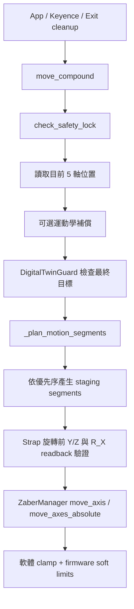
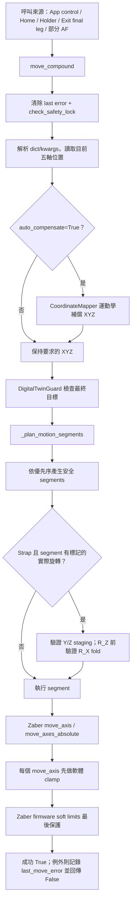

|                                          |     |
| ---------------------------------------- | --- |
| [[主要防撞路徑]]                               |     |
| [[#### 完整防撞路徑及現有保護機制]]                   |     |
| [[#### move_compound function analysis]] |     |
|                                          |     |

目前的主要防撞路徑是 `UnifiedHardwareDriver.move_compound()`：先檢查門禁鎖定、預測目標碰撞，再把移動拆成「Z 退避 → XY/旋轉 → Z 接近」的安全段落。

### 程式與設定位置

- 總設定：[hardware_config.yaml](D:\Provenance Project\ImagingLibWatch\config\hardware_config.yaml:78)
- 安全路徑、Strap 高風險規則、E-stop：[unified_driver.py](D:\Provenance Project\ImagingLibWatch\Controller\hardware_drivers\unified_driver.py:475)
- Zaber 軸界限、韌體限位、單軸防呆：[hardware_managers.py](D:\Provenance Project\ImagingLibWatch\Controller\hardware_managers.py:249)
- MQTT 門禁監聽：[hardware_managers.py](D:\Provenance Project\ImagingLibWatch\Controller\hardware_managers.py:4261)
- 幾何數位孿生碰撞預測：[digital_twin_guard.py](D:\Provenance Project\ImagingLibWatch\Controller\kinematics\digital_twin_guard.py:62)
- 舊版 `SafeZoneManager`：[safe_zone_manager.py](D:\Provenance Project\ImagingLibWatch\Controller\hardware_drivers\safe_zone_manager.py:11)；目前沒有被正式 driver 建立或呼叫，屬未接線的舊機制。

### 現有保護機制

| 層級                | 定義與作用                                                                                          |
| ----------------- | ---------------------------------------------------------------------------------------------- |
| 軸行程限制             | X `0–435 mm`、Y `0–292 mm`、Z `0–150 mm`、R_X `0–90°`。程式會 clamp，連線後也會寫入 Zaber 韌體 `limit.min/max`。 |
| R_Z 轉動            | `rotate_z_limit: []` 表示連續軸；程式會選擇最短等效角度旋轉，避免不必要多圈，但沒有機械纜線扭轉/圈數上限。                               |
| 運動平滑              | linear/rotation motion profiles 限制速度、加減速與 S-curve，降低慣性撞擊，但本身不是碰撞偵測。                            |
| 一般安全路徑            | Side/Crown 等路徑先移到 `safe_retract_z`（watch 為 20 mm；box 為 10 mm），再平移/旋轉，最後回目標 Z。                  |
| R_X/R_Z interlock | 觸發條件包含大角度 R_X、R_Z 穿越危險角、XY 大位移等；會先退 Z、把 R_X 收至 `0°`、完成 R_Z/XY、再恢復 R_X。                         |
| Strap 高風險         | R_X ≥ 30° 且 R_Z 接近/穿越 90° 或 270° 時，強制至 Y=160、Z=70 的已驗證避讓姿態；先折回 R_X=0°，再轉 R_Z，最後才接近目標。          |
| Strap 白名單         | `4029–4032` 必須同時匹配完整五軸姿態才允許，並經由 Y=160/Z=70 進出。                                                 |
| Strap 牆面包絡        | 以 200 mm Strap、Y=0 牆面、30 mm 最小淨空估算；在 R_X > 30° 時拒絕端點會進入危險區的目標。                                 |
| 讀回確認              | Strap 每個涉及旋轉的 segment 前，都會讀回 Y/Z；R_Z 旋轉前還會確認 R_X 已折回安全角度。                                      |
| 門禁 E-stop         | MQTT 收到 `DI0 = 0` 時，鎖定系統、停止所有 Zaber 軸、關燈、停相機；必須手動 reset 才可恢復。                                  |

Strap 的路徑規劃與高風險判斷集中在 [_plan_motion_segments](D:/Provenance Project/ImagingLibWatch/Controller/hardware_drivers/unified_driver.py)，讀回保護在 [這兩個檢查](D:/Provenance Project/ImagingLibWatch/Controller/hardware_drivers/unified_driver.py)。

### 目前「怎麼確保不撞」

若所有正式拍攝、移動、對焦流程都走 `driver.move_compound(...)`，保護順序是：

```
門禁未鎖定
  → 目標姿態數位孿生預檢
  → 軸行程限制
  → 依情境產生退避/折臂/旋轉/接近的分段路徑
  → Strap 旋轉前讀回 Y/Z/R_X
  → Zaber 韌體限位與運動 profile 執行
```

### 重要缺口／風險

1. 數位孿生目前實質失效。  
    [`safe_zone`](D:\Provenance Project\ImagingLibWatch\config\hardware_config.yaml:110) 的 platform、macro、micro bounding box 全部是 `0.0`；程式會把這些零值覆蓋預設尺寸，因此 AABB 碰撞模型退化，無法代表鏡頭、治具、手錶的實際體積。
    
2. 數位孿生只檢查「最終姿態」，不掃描每個移動軌跡；真正的路徑安全主要仰賴規則式退避與 staging，而非連續幾何碰撞檢查。
    
3. 有低階入口可繞過安全規劃。  
    例如 [controller_server.py](D:\Provenance Project\ImagingLibWatch\Controller\controller_server.py:100) 的 `move_stage`、[workflow_manager.py](D:\Provenance Project\ImagingLibWatch\core\workflow_manager.py:3062) 的 manual move，直接呼叫 `zaber.move_axis()`，只有軸界限 clamp，沒有門禁鎖、數位孿生、Strap staging 或路徑拆段。應限制這些入口只用於維護模式，或改統一委派給 `move_compound()`。
    
4. MQTT 門禁斷線目前只記錄 warning，沒有 fail-safe E-stop；這是軟體/網路型保護，不能視為安全等級的硬體 interlock。對人員防護應有獨立硬體安全迴路直接切斷馬達使能。
    
5. R_Z 無圈數/纜線保護。最短路徑可降低風險，但不等於可無限轉動；應依實際配線加入累積圈數、軟體角度窗或硬體 slip ring 的明確規則。
    

已存在相當多路徑規劃測試，例如 [test_unified_motion_planning.py](D:/Provenance Project/ImagingLibWatch/tests/test_unified_motion_planning.py)。我嘗試執行，但目前 Python 環境缺少 `pytest` 與 `PyYAML`，所以沒有做出可執行的測試驗證。此次沒有修改檔案。


#### 完整防撞路徑及現有保護機制
```
請幫我整理目前的完整防撞路徑及現有保護機制, 程式與設定位置包括code在哪裡, config在哪裡?, 以及似乎有很多是很類似的請整理
```
以下是依目前工作樹程式碼做的完整防撞盤點；本次只分析，沒有修改檔案。

## 一頁結論

目前有四層保護：

1. Zaber 軸範圍與韌體 soft limit。
2. `UnifiedHardwareDriver` 規則式安全路徑規劃。
3. `DigitalTwinGuard` 幾何碰撞預測。
4. 門禁 MQTT → 急停 → 軟體鎖定。

但現況有三個重要缺口：

- `hardware.zaber.safe_zone` 的碰撞盒尺寸全部是 `0`，Digital Twin 退化成零體積幾何，幾乎沒有有效碰撞保護。
- `strap_macro_cam1_scan.yaml` 又設定 `require_nonzero_collision_envelopes: false`，所以 production preflight 不會因零尺寸而拒絕。
- 手動移動、舊 controller server、部分 autofocus 與 `execute_template_point` 內部路徑會繞過部分保護。

此外目前 [system_config.yaml (line 1)](D:/Provenance Laboratories projects/ImagingLibWatch/config/system_config.yaml:1) 是 `mode: simulation`，因此從標準 Workflow 啟動時不會控制實體硬體，門禁 MQTT 也不會啟用。

---

## 完整正式移動路徑

### A. 最完整路徑：`move_compound`

````

````

主入口在 [unified_driver.py (line 475)](D:/Provenance Laboratories projects/ImagingLibWatch/Controller/hardware_drivers/unified_driver.py:475)：

- 先檢查門禁鎖。
- 讀取目前五軸座標。
- 可選擇套用旋轉偏心補償。
- Digital Twin 檢查「最終位置」。
- 呼叫路徑規劃器。
- 旋轉 segment 前驗證 Strap staging readback。
- 最後交給 ZaberManager 執行。

注意：Digital Twin 只檢查最終目標，不會沿每個中間 segment 連續取樣檢查碰撞。

### B. 一般 Template capture 路徑

`execute_template_point()` 在 [unified_driver.py (line 8591)](D:/Provenance Laboratories projects/ImagingLibWatch/Controller/hardware_drivers/unified_driver.py:8591)：

- 有執行 `check_safety_lock()`。
- 有呼叫 `_plan_motion_segments()`。
- 但沒有經過 `move_compound()`。
- 因此沒有一般目標的 Digital Twin 檢查。
- 執行 segment 時也沒有 `move_compound` 那組 Strap rotation staging readback 驗證。

也就是說，目前「正式拍攝路徑」有規則式 dog-leg/interlock，但保護程度弱於直接使用 `move_compound()`。

### C. Strap macro_cam_1 掃描

這是目前最保守的一條路徑：

1. 驗證整份 scan config。
2. 驗證每個 pose 的軸範圍及最低 Y。
3. 建立 Y → Z → fold R_X → rotate R_Z → restore R_X → X → Y → Z 的外層 waypoint。
4. 每個 waypoint 再送入 `move_compound()`。
5. 每個 waypoint 完成後核對五軸 readback。

主要位置：

- Config preflight：[App/main.py (line 34250)](D:/Provenance Laboratories projects/ImagingLibWatch/App/main.py:34250)
- Pose 限位：[App/main.py (line 34489)](D:/Provenance Laboratories projects/ImagingLibWatch/App/main.py:34489)
- 安全 compound wrapper：[App/main.py (line 34525)](D:/Provenance Laboratories projects/ImagingLibWatch/App/main.py:34525)
- View transition/readback：[App/main.py (line 34593)](D:/Provenance Laboratories projects/ImagingLibWatch/App/main.py:34593)
- Waypoint 產生器：[strap_macro1_scan.py (line 1151)](D:/Provenance Laboratories projects/ImagingLibWatch/core/strap_macro1_scan.py:1151)

### D. Strap Keyence 探針

Keyence 專用路徑在 [unified_driver.py (line 3296)](D:/Provenance Laboratories projects/ImagingLibWatch/Controller/hardware_drivers/unified_driver.py:3296)：

- 先拒絕非數值、非有限值及超過軸限位的目標。
- Strap 先退到固定 staging。
- 檢查 safety lock。
- 執行 Digital Twin。
- 執行 `_plan_motion_segments()`。
- 旋轉前核對 staging 與 R_X fold。
- 完成後核對五軸 readback。

這條路徑和 macro_cam_1 scan 是目前保護最完整的兩條。

---

## `_plan_motion_segments` 實際優先序

核心位於 [unified_driver.py (line 606)](D:/Provenance Laboratories projects/ImagingLibWatch/Controller/hardware_drivers/unified_driver.py:606)。它是 first-match-return，實際順序為：

1. `strap_special_staging`
    
    特定 `internalnum1` 必須同時匹配白名單中的完整五軸位置；進入、離開都經 Y=160、Z=70。白名單是 `4029–4032`。
    
2. Strap Keyence staging
    
    探針移動使用同一套 special staging contract。
    
3. Strap wall envelope
    
    依公式檢查：
    
    `clearance = Y - wall_y - half_length × abs(sin(R_Z))`
    
4. Large R_X transition
    
    大幅 R_X 變化時，使用：
    
    `Y safe → Z safe → fold R_X → R_Z → restore R_X → X → Z → Y`
    
5. Strap high-risk interlock
    
    R_X ≥ 30° 且 R_Z 路徑接近 90°/270°時觸發；小 Y 的最終位置必須有明確 semantic whitelist。
    
6. Generic fixture rotation interlock
    
    `Z retract → fold R_X → R_Z+XY → restore R_X → target Z`
    
7. View-mode dog-leg
    
    `REHAUT/CROWN/SIDE/LEFT_HAND_CROWN` 一律先 retract Z；其他 view 依 Z 移動方向決定先後。
    

---

## 設定位置

主要設定集中在 [hardware_config.yaml (line 78)](D:/Provenance Laboratories projects/ImagingLibWatch/config/hardware_config.yaml:78)：

|設定|位置|目前值/作用|
|---|---|---|
|門禁 MQTT|78–82|localhost:1883、DI0|
|運動學 pivot/arm|104–108|Digital Twin 幾何來源|
|Digital Twin boxes|110–113|全部為 `0.0`|
|Generic safe retract|115|Z=20|
|Home poses|116–146|watch/strap/box|
|舊 Strap interlock|147–157|fallback/重複設定|
|Fixture profile|159–166|active=`watch`、mode=`4`|
|Watch motion safety|168–239|large-RX、special、wall、high-risk|
|Box motion safety|240–259|box 專用角度窗口|
|Zaber 軸限位|296–301|X/Y/Z/RX 有界，RZ 為連續軸|

Strap macro_cam_1 的額外設定在 [strap_macro_cam1_scan.yaml (line 267)](D:/Provenance Laboratories projects/ImagingLibWatch/config/strap_macro_cam1_scan.yaml:267)：

- `calibration_confirmed: true`
- `require_hardware_safety_planner: true`
- `require_nonzero_collision_envelopes: false`
- Strap 全長 240 mm
- 最低牆面間隙 30 mm
- staging Y=160、Z=70
- 額外 stage limits
- 強制 view transition staging
- readback tolerance

---

## 相似或重複機制整理

### 1. 兩套幾何碰撞引擎

- 正式引用的是 [DigitalTwinGuard (line 6)](D:/Provenance Laboratories projects/ImagingLibWatch/Controller/kinematics/digital_twin_guard.py:6)。
- [SafeZoneManager (line 11)](D:/Provenance Laboratories projects/ImagingLibWatch/Controller/hardware_drivers/safe_zone_manager.py:11) 是另一套 AABB、另一套 config 格式及 pivot 定義。
- 全 repo 沒有找到 `SafeZoneManager` 的實際呼叫者，目前可視為未接線/遺留實作。

兩者不應被誤認為雙重保護；現況只有 Digital Twin 接在部分正式路徑上。

### 2. 三套相似的安全路徑

- Unified driver 的通用 `_plan_motion_segments`。
- Strap scan 的外層 `build_safe_transition_waypoints`。
- App 關閉/換頁的 `_move_zaber_to_strap_safe_retract`。

後兩者不是完全重複：它們增加 waypoint readback 或 shutdown staging，但固定數值和移動順序高度相似。

### 3. 安全常數重複

- Y=160：large-RX、special staging、high-risk、scan transit。
- Z=70：large-RX、special staging、high-risk、scan retract。
- Wall clearance=30：hardware wall envelope 與 scan safety。
- Strap half-length：
    - hardware legacy envelope：100 mm
    - motion recorder legacy：100 mm
    - macro_cam_1 scan：120 mm

macro_cam_1 會透過 semantic metadata 把 driver 的 100 mm 加嚴至 120 mm，因此不是單純衝突；但目前來源分散，容易日後漂移。

### 4. 軸限位重複

- Hardware 真正限位在 `hardware_config.yaml`。
- macro_cam_1 scan 又有一份 `safety.stage_limits`。

兩份目前數值相同，但沒有單一來源自動同步。

### 5. 兩種 emergency stop

- `trigger_emergency_stop()`：停止硬體並把 `_system_locked=True`，必須人工 reset。
- `emergency_stop()`：只停止 Zaber/light/camera，不會 latch `_system_locked`。

因此不同 UI/呼叫者使用不同 API 時，停止後的鎖定行為並不一致。

---

## 現有底層保護

ZaberManager 在 [hardware_managers.py (line 249)](D:/Provenance Laboratories projects/ImagingLibWatch/Controller/hardware_managers.py:249) 提供：

- 啟動時將 YAML limits 寫入 Zaber firmware。
- 每次 `move_axis` 再做軟體 clamp。
- `RLock` 避免多執行緒同時發送移動。
- compound move 固定命令順序為 Z、R_X、R_Z、X、Y。
- R_Z 空陣列表示連續旋轉；韌體限位被擴成極大值。
- 急停呼叫所有裝置的 `all_axes.stop()`。

但低階移動超界時是「clamp 後繼續」，不是 fail-closed 拒絕；上層若沒有 readback 驗證，可能誤以為已到達原始目標。

---

## 門禁與急停

實作在：

- [SafetyManager (line 4261)](D:/Provenance Laboratories projects/ImagingLibWatch/Controller/hardware_managers.py:4261)
- [trigger_emergency_stop (line 4566)](D:/Provenance Laboratories projects/ImagingLibWatch/Controller/hardware_drivers/unified_driver.py:4566)

行為：

- Production 才連 MQTT。
- `DI0 == 0/false` 觸發急停。
- JSON 解析錯誤也 fail-closed 觸發急停。
- 停止順序為 Zaber → lighting → camera。
- 鎖定後需要 `manual_safety_reset()`。

缺口：

- MQTT 初始連線失敗或後續斷線只記錄 disconnected，不會自動 latch 急停。
- `manual_safety_reset()` 不檢查門是否已關閉，也不檢查 SafetyManager/MQTT 是否恢復；它只恢復 Zaber/light/camera/IO。

---

## 明確繞過完整防撞的入口

|入口|實際保護|
|---|---|
|[WorkflowManager.manual_move (line 3056)](D:/Provenance Laboratories projects/ImagingLibWatch/core/workflow_manager.py:3056)|直接呼叫 Zaber；只有軸 clamp/firmware limit|
|[controller_server move_stage (line 98)](D:/Provenance Laboratories projects/ImagingLibWatch/Controller/controller_server.py:98)|直接 Zaber，沒有 planner、Digital Twin、SafetyManager|
|測試工具直接使用 ZaberManager|通常只有軸限位|
|多個 autofocus 內部微調|初始 pose 可能安全，但後續直接單軸移動，不逐步跑 Digital Twin|
|`execute_template_point`|有鎖及 planner，沒有一般 `move_compound` 的 Digital Twin/readback 層|

---

## 稽核與測試

Strap 執行時會在 `DB/strap_motion_logs` 記錄：

- 每個 Zaber command。
- 移動前、目標、移動後的位置。
- Strap 對 Y=0 牆的計算間隙。
- 最低間隙及是否出現負值。

程式在 [strap_motion_recorder.py (line 36)](D:/Provenance Laboratories projects/ImagingLibWatch/core/strap_motion_recorder.py:36)。這是事後稽核，不會即時阻止移動。

主要測試：

- [test_unified_motion_planning.py (line 36)](D:/Provenance Laboratories projects/ImagingLibWatch/tests/test_unified_motion_planning.py:36)：high-risk、special staging、readback fail-closed、連續 R_Z。
- [test_strap_macro1_scan.py (line 963)](D:/Provenance Laboratories projects/ImagingLibWatch/tests/test_strap_macro1_scan.py:963)：safe transition、軸限位、wall envelope、零碰撞盒 gate。
- [test_safety_system.py (line 1)](D:/Provenance Laboratories projects/ImagingLibWatch/Controller/test_hardware/test_safety_system.py:1)：MQTT 門禁模擬；不是實體門鎖/HIL 測試。

## 建議優先處理

1. 實測並填入非零 `safe_zone` 包絡，然後將 `require_nonzero_collision_envelopes` 改為 `true`。
2. 讓 `execute_template_point` 統一走 `move_compound`，或補上相同 Digital Twin/readback contract。
3. 禁止 production 的 `manual_move`/`controller_server.move_stage` 直接繞過 planner。
4. MQTT disconnected 應 fail-closed，manual reset 應確認門已關閉且 safety channel healthy。
5. 合併重複的 Y/Z、wall geometry、stage limits 成單一安全設定來源。
6. 明確區分「latched emergency stop」與「shutdown stop」，避免 UI 呼叫錯誤 API。

變更檔案：無。實體設備仍需要空治具、低速、最長 Strap、門禁斷線及實體 E-stop 的 HIL 驗證。


#### move_compound function analysis
```
所以在執行App main.py的每個有移動跟轉動的job都是使用move_compound function去控制? 還是有拍照task的有移動跟轉動的job都是使用move_compound function去控制? 那在App裡面的create template的拍照流程跟App裡面的watchentry的拍照流程是否也都使用move_compound function? 或像移動到home or center or 要放置watch的是否也使用move_compound function?

也請介紹以下列出的move_compound完整步驟是否正確  
flowchart TD  
A["App / Keyence / Exit cleanup"] --> B["move_compound"]  
B --> C["check_safety_lock"]  
C --> D["讀取目前 5 軸位置"]  
D --> E["可選運動學補償"]  
E --> F["DigitalTwinGuard 檢查最終目標"]  
F --> G["_plan_motion_segments"]  
G --> H["依優先序產生 staging segments"]  
H --> I["Strap 旋轉前 Y/Z 與 R_X readback 驗證"]  
I --> J["ZaberManager move_axis / move_axes_absolute"]  
J --> K["軟體 clamp + firmware soft limits"]  
並介紹每個步驟A,B,C....  
以及各跟那些functions and config有關
```

結論：**不是所有 App 移動，也不是所有拍照移動，都會呼叫 `move_compound()`。**

更精確地說，目前有三種運動路徑：

1. 直接呼叫 `move_compound()`。
2. 不呼叫 `move_compound()`，但直接使用同一個 `_plan_motion_segments()` planner。
3. 直接呼叫 `zaber.move_axis()`／`move_axes_absolute()`，完全繞過 planner 與 Digital Twin。

## 各 App 流程實際走法

| App 功能                         | 是否呼叫 `move_compound()` | 實際路徑                                                                                  |
| ------------------------------ | ---------------------- | ------------------------------------------------------------------------------------- |
| A. Create Template pre-capture | 否                      | `execute_template_point()` → `_plan_motion_segments()` → Zaber                        |
| B. Create Template 點選後正式拍照     | 通常否                    | `execute_template_point()` → planner → AF → final approach                            |
| C. WatchEntry 正式拍照             | 否                      | `_capture_images_routine_internal()` → `execute_template_point()` → planner           |
| D. Standard/HDR capture        | 否                      | 都進 `execute_template_point()`；HDR 同點可能略過重複 XYZ                                        |
| E. Control panel 手動五軸移動        | 是                      | `_move_control_pose()` → `move_compound()`                                            |
| F. Control panel Go Home       | 是                      | `_resolve_control_home_pose()` → `_move_control_pose()` → `move_compound()`           |
| G. 移到 holder／放錶位置              | 是，production driver 下  | `_move_zaber_to_start_pos()` → `_move_zaber_to_safe_strap_pose()` → `move_compound()` |
| H. 移到 watch center             | 是                      | `_move_zaber_to_center_pos()` → safe strap pose → `move_compound()`                   |
| I. App Exit 最終回 Home           | 部分                     | 先用直接 `move_axis()` 做 Strap safe retract，再用 `move_compound()` 回 Home                   |
| J. Keyence probe 移動            | 否                      | `_execute_keyence_planned_pose()` 直接做 Digital Twin + planner + Zaber                  |
| K. Final focus approach        | 否                      | `_do_final_approach()` 直接呼叫 Zaber                                                     |
| L. 某些 AF 掃描／Keyence XY 掃描      | 混合                     | 有些 Y scan 用 `move_compound()`；有些直接 `move_axis()`                                      |
| M. simulation `move_compound`  | 名稱相同但不是安全路徑            | 只有 sleep，沒有 planner 或碰撞檢查                                                             |

主要依據：

- Create Template pre-capture 呼叫 [`execute_template_point()` (line 1640)](/D:/Provenance Project/ImagingLibWatch/App/main.py:1640)
- Create Template prepared capture 呼叫 [`execute_template_point()` (line 8788)](/D:/Provenance Project/ImagingLibWatch/App/main.py:8788)
- WatchEntry capture routine 呼叫 [`execute_template_point()` (line 32043)](/D:/Provenance Project/ImagingLibWatch/App/main.py:32043)
- `execute_template_point()` 直接呼叫 planner，而非 `move_compound()`：[unified_driver.py (line 9420)](/D:/Provenance Project/ImagingLibWatch/Controller/hardware_drivers/unified_driver.py:9420)
- Control panel 移動呼叫 `move_compound()`：[main.py (line 26483)](/D:/Provenance Project/ImagingLibWatch/App/main.py:26483)
- Holder/Center 共用 safe pose：[main.py (line 9325)](/D:/Provenance Project/ImagingLibWatch/App/main.py:9325)
- Exit cleanup：[main.py (line 3545)](/D:/Provenance Project/ImagingLibWatch/App/main.py:3545)、[main.py (line 3657)](/D:/Provenance Project/ImagingLibWatch/App/main.py:3657)

所以「拍照 task 有移動與轉動」並不能直接推導成「一定呼叫 `move_compound()`」。正式拍照通常只是**共用它的 planner**。

---

## 你的 A–K 流程是否正確

整體方向接近，但 A、I、K 需要修正，而且漏掉 `move_compound()` 的參數正規化及錯誤處理。

````

````

### A：App / Keyence / Exit cleanup

你的：

> App / Keyence / Exit cleanup → move_compound

只對一部分來源成立。

- App control、Go Home、holder、center：會進 `move_compound()`。
- Exit：safe retract 是直接 `move_axis()`；safe retract 成功後，最後回 Home 才進 `move_compound()`。
- Keyence：主要走 `_execute_keyence_planned_pose()`，它直接呼叫 Digital Twin、planner 和 Zaber，不會經過 `move_compound()`。
- Create Template／WatchEntry 拍照：主要走 `execute_template_point()`，同樣直接使用 planner。

### B：`move_compound`

定義位於 [unified_driver.py (line 475)](/D:/Provenance Project/ImagingLibWatch/Controller/hardware_drivers/unified_driver.py:475)。

接受：

- `target_x/y/z`
- `target_rx/rz`
- 或傳入 `{"stage_L_X": ..., ...}` dict
- `auto_compensate`
- `cam_alias`
- `wait`
- `semantic_target`

未指定的軸會使用目前位置，而不是歸零。

### C：`check_safety_lock`

位於 [unified_driver.py (line 4560)](/D:/Provenance Project/ImagingLibWatch/Controller/hardware_drivers/unified_driver.py:4560)。

它只檢查 `_system_locked`。Door-open／SafetyManager 觸發 `trigger_emergency_stop()` 後會：

- 停止 Zaber
- 關閉燈光
- 停止相機
- 將系統保持 locked

必須透過 `manual_safety_reset()` 完成硬體 recovery 後才解除。

這不是幾何碰撞檢查；它是「系統是否已被安全事件鎖住」。

### D：讀取目前五軸位置

讀取：

- `stage_L_X`
- `stage_L_Y`
- `stage_L_Z`
- `stage_R_X`
- `stage_R_Z`

其中 R_Z 是 continuous rotation axis，所以會先用 `canonical_angle_deg()` 正規化成等價的 0–360° 角度，規劃與比較才不會把例如 23760° 認為需要轉很多圈。

Zaber 真正送命令時又會用 `_nearest_equivalent_angle()` 選擇離目前位置最近的等價角度。

### E：可選運動學補償

方向正確，但它只在：

```
auto_compensate=True
```

且 R_X/R_Z 發生改變時執行。

相關 function：

- `CoordinateMapper.calculate_full_eccentric_compensation()`
- `move_compound()` 內將 `dX/dY/dZ` 加到 requested XYZ

相關 config：

- `hardware.zaber.kinematics`
- `pivot_z_L1`
- `camera_arm_L2_macro`
- `camera_arm_L2_micro`
- rotation pivot 等參數

重要現況：App 中找到的 production `move_compound()` callers 幾乎都明確傳入 `auto_compensate=False`，目前沒有非測試 caller 明確使用 `True`。

另外，`execute_template_point()` 有另一套不同的 `_apply_angle_pose_compensation()`，受以下設定控制：

- `hardware.autofocus.keyence_autofocus.angle_aware`
- `pose_compensation`
- `angle_pose_compensation`

這套不能和 `move_compound(auto_compensate=True)` 當成同一件事。

### F：DigitalTwinGuard 檢查最終目標

正確，但只檢查**最終 target pose**：

```
predict_collision(x, y, z, rx, rz, cam_alias)
```

相關程式：

- [digital_twin_guard.py (line 6)](/D:/Provenance Project/ImagingLibWatch/Controller/kinematics/digital_twin_guard.py:6)
- `DigitalTwinGuard.predict_collision()`
- `_get_aabb()`
- `_check_overlap()`

相關 config：

- `hardware.zaber.kinematics`
- `hardware.zaber.safe_zone.platform_box`
- `macro_box`
- `micro_box`

目前 config 中這些 box 尺寸全部是 `0.0`：

```
platform_box: {width: 0.0, depth: 0.0, height: 0.0}
macro_box: {width: 0.0, length: 0.0}
micro_box: {width: 0.0, length: 0.0}
```

見 [hardware_config.yaml (line 110)](/D:/Provenance Project/ImagingLibWatch/config/hardware_config.yaml:110)。

因此目前 Digital Twin 無法代表真實平台、錶與鏡頭體積，實際幾何保護能力非常有限。現有安全主要依靠 `_plan_motion_segments()` 的規則式 interlocks。

另一個限制是：`move_compound()` 並沒有對 planner 產生的每一個中間 segment 再逐段做 Digital Twin 檢查。

### G、H：`_plan_motion_segments` 與 staging priority

定義位於 [unified_driver.py (line 606)](/D:/Provenance Project/ImagingLibWatch/Controller/hardware_drivers/unified_driver.py:606)。

規劃大致依下列優先序：

1. Strap 特殊 internalnum whitelist：
    
    - 4029–4032
    - 驗證 internalnum 和完整五軸 target 必須吻合
    - 經 Y=160、Z=70 staging
2. 離開 Strap 特殊點：
    
    - 先退出到 safe Y/Z
    - 再遞迴規劃後續目的地
3. Strap Keyence transition：
    
    - 強制經特殊 staging
4. Strap wall envelope：
    
    - 根據 Y、R_Z、strap half-length 計算靠牆端點 clearance
    - 不足時直接 reject，不產生 motion
5. Large R_X transition：
    
    - Y safe
    - Z safe
    - 必要時 fold R_X
    - R_Z
    - restore R_X
    - final X
    - final Z
    - final Y
6. Strap high-risk interlock：
    
    - 特別處理 R_X 高角度且 R_Z 接近 90°／270° 的情況
    - 可能要求 `allow_high_risk_final_approach`
7. 一般 fixture rotation interlock：
    
    - retract Z
    - fold R_X
    - rotate R_Z + XY
    - restore R_X
    - final Z
8. `REHAUT_VIEW`／`CROWN_VIEW`／`SIDE_VIEW`：
    
    - Z retract
    - 高度安全時移動 XY/RX/RZ
    - Z descend
9. Front／Back 一般路徑：
    
    - 依 target Z 相對 current Z 決定先 Z 還是先 XY/rotation

相關 config 集中在 [hardware_config.yaml (line 147)](/D:/Provenance Project/ImagingLibWatch/config/hardware_config.yaml:147)：

- `fixture.active_profile`
- `motion_interlock_mode`
- `safe_retract_z`
- `rotation_interlock`
- `large_rx_transition`
- `strap_special_staging`
- `strap_wall_envelope`
- `strap_high_risk_interlock`
- `strap_x_only_keep_rx_at_rz_0_180`

### I：Strap 旋轉前 readback 驗證

你的描述需要加上「條件式」。

在 `move_compound()` 中，只有同時符合以下條件才驗證：

- segment 是 `COMPOUND`
- 包含 R_X 或 R_Z
- semantic target 被辨識為 Strap
- segment 有 `strap_rotation_staging_required=True`
- readback 顯示真的有 rotation delta

相關 functions：

- `_is_strap_semantic_target()`
- `_strap_segment_has_rotation_delta()`
- `_verify_strap_rotation_staging()`：驗證 Y/Z
- `_verify_strap_rz_fold_readback()`：R_Z 前驗證 R_X 已 fold

它不是所有 rotation segment 都無條件執行。

另外，`execute_template_point()` 在 [unified_driver.py (line 9434)](/D:/Provenance Project/ImagingLibWatch/Controller/hardware_drivers/unified_driver.py:9434) 自己執行 planner segments 時，沒有走 `move_compound()` 裡這段相同的 Strap rotation readback wrapper。Keyence 的 `_execute_keyence_planned_pose()` 則有自己的 readback 驗證。

### J：ZaberManager 執行

Planner 只產生兩種主要 segment：

- `Z_ONLY` → `zaber.move_axis("stage_L_Z", ...)`
- `COMPOUND` → `zaber.move_axes_absolute({...})`

`move_axes_absolute()` 的預設命令順序為：

1. Z
2. R_X
3. R_Z
4. X
5. Y

但實際 segment 通常只包含其中幾軸；planner 已經事先將安全順序拆成多個 segment。

相關程式：[hardware_managers.py (line 458)](/D:/Provenance Project/ImagingLibWatch/Controller/hardware_managers.py:458)、[hardware_managers.py (line 500)](/D:/Provenance Project/ImagingLibWatch/Controller/hardware_managers.py:500)。

### K：軟體 clamp + firmware soft limits

概念正確，但它不是在 Zaber 命令完成後才做，而是在 J 裡面分成兩層：

1. 軟體 clamp  
    `ZaberManager.move_axis()` 送命令前根據 `self.limits` clamp。
    
2. Firmware limits  
    Zaber 連線時 `_apply_hardware_limits()` 將同一組 limits 寫入：
    
    - `limit.min`
    - `limit.max`

相關 config 位於 [hardware_config.yaml (line 296)](/D:/Provenance Project/ImagingLibWatch/config/hardware_config.yaml:296)：

- X：0–435 mm
- Y：0–292 mm
- Z：0–150 mm
- R_X：0–90°
- R_Z：空 list，代表 continuous rotation

這一層只限制各軸 travel range，無法判斷多軸組合是否會碰撞。

## 最重要的架構判讀

目前不是：

```
所有移動 → move_compound → 安全
```

而是：

```
App Home/Holder/Control
    → move_compound
    → Digital Twin final target
    → planner
    → Zaber

Create Template / WatchEntry capture
    → execute_template_point
    → angle-aware compensation
    → planner
    → Keyence/AF
    → direct final approach
    → capture

Keyence planned probe
    → Keyence-specific preflight
    → Digital Twin
    → planner
    → Strap readback verification
    → Zaber

其他 AF / cleanup / compatibility paths
    → 可能直接 Zaber
```

因此，`move_compound()` 是重要的安全入口，但目前還不是全 App 唯一的五軸運動入口。最值得注意的殘餘風險是：

- Digital Twin box 尺寸目前為零。
- `execute_template_point()` 複用 planner，但不複用完整 `move_compound()` wrapper。
- `_do_final_approach()` 直接走 Zaber。
- 仍存在直接 `move_axis()` 的 AF、safe retract、compatibility 路徑。
- `move_compound()` 捕捉例外後回傳 `False`，caller 必須檢查；而且它目前沒有檢查每個 Zaber segment 的 boolean 回傳值。