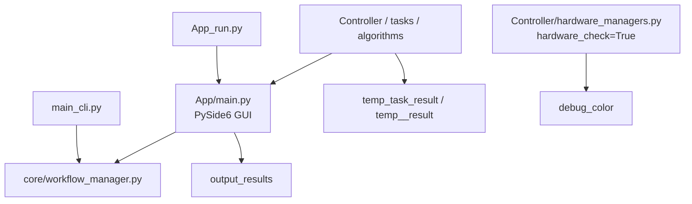

|                      |     |
| -------------------- | --- |
| [[#### 一些不清楚的資料夾檔案]] |     |
|                      |     |
|                      |     |
|                      |     |
|                      |     |


#### 一些不清楚的資料夾檔案
這個 repo 的主要入口有三個；真正的 App 主程式是 `App/main.py`，不是根目錄的 `main.py`。

````

````

根目錄重要檔案：

| 檔案                     | 作用                                                                       | 與 App 的關係                                         |
| ---------------------- | ------------------------------------------------------------------------ | ------------------------------------------------- |
| AGENTS.md              | 開發規範與本次「一個 watch point 支援多張影像＋可選 HDR」重構目標。                               | 不會被程式執行，是給開發者／代理人看的。                              |
| App_run.py             | GUI 正式啟動器；設定 Qt 高 DPI，建立 `QApplication`，載入 `App/main.py` 的 `MainWindow`。 | 執行 GUI 時應優先使用它。                                   |
| App/main.py            | PySide6 主視窗、UI 互動、拍攝流程協調、部分分析／輸出功能。                                      | App 的核心。它與 `core/workflow_manager.py` 共用工作流能力。    |
| main_cli.py            | 命令列入口；支援 `run_routine`、`manual_capture`、`create_template`、同步等。           | 不啟動 GUI，但同樣呼叫 `WorkflowManager`；可視為 App 的無介面操作路徑。 |
| remote_run.py          | 根據設定作為 AWS IoT agent 或遠端控制 client。                                       | 與 App 平行，主要供遠端控制／硬體端部署使用。                         |
| stitch_frontwatch.py   | 獨立 OpenCV 影像拼接實驗／工具。                                                     | 不由 `App/main.py` 直接呼叫。適合移入 `tools/` 或 `scripts/`。 |
| setup_global_admins.py | 管理員資料初始化／設定工具。                                                           | App 的支援腳本。                                        |
| ui_object_finder.py]   | 協助檢查 Qt `.ui` 與產生的 `ui_main.py` 控件名稱。                                    | 開發工具，不是正式執行期依賴。                                   |

重要目錄大致分工：

- `App/`：GUI、Qt Designer UI、視覺資產與 App 模組。
- `core/`：共用業務流程；`WorkflowManager` 是 GUI 和 CLI 的共同核心。
- `Controller/`：相機、Zaber 等硬體控制，以及不少硬體測試 UI。
- `DB/`、`data_manager/`：SQLite、模板、雲端資料存取與同步。
- `tasks/`、`algorithms/`：分析任務的 CLI wrapper 與影像演算法。
- `config/`：系統、硬體、CLI、報表等 YAML 設定。
- `cloud_relay/`：AWS IoT／雲端命令中繼。
- `tests/`：自動化測試。
- `assets/`、`checkpoints/`、`Local_Data/`：大型資產、模型、在地資料；目前多數被 `.gitignore` 排除。

你特別問的資料夾：

|資料夾|實際用途|與 `App/main.py` 關係|建議|
|---|---|---|---|
|`debug_color/`|硬體相機 Bayer 解碼後的除錯截圖。目前有 `macro_cam_1_after_decode.png`。|間接相關：[`Controller/hardware_managers.py:1305`](D:\Provenance Project\ImagingLibWatch\Controller\hardware_managers.py:1305) 在 `checking.hardware_check=True` 時會寫入。|可清空舊圖，但不要直接移除目錄或改名，除非同步修改寫入路徑。建議移為 `artifacts/debug/color/`，並加入 gitignore。|
|`helper/`|開發輔助工具。`collectCode.py` 依 `collect_file.yaml` 合併指定原始碼成 `code.txt`，通常為交付／人工審閱用途。|無執行期關係。|保留，但建議改名／移到 `tools/dev/`；`code.txt` 是產物，應忽略或不納入版本控制。|
|`output_results/`|較偏「可保留結果」：元件辨識 JSON、材料分析資料、Keyence map、Strap Macro1 測試 run manifest。|有直接關係：[`App/main.py:10686`](D:\Provenance Project\ImagingLibWatch\App\main.py:10686) 的材料分析 fallback 會寫入 `material_db`；[`App/main.py:25814`](D:\Provenance Project\ImagingLibWatch\App\main.py:25814) 會寫入 component results。其他子目錄多來自 `Controller/test_hardware` 工具。|不建議直接刪除或整個移走。可改為 `artifacts/results/`，但需要先把 App 和測試工具中的硬編碼路徑一起改掉。也應明確決定哪些結果是測試 fixture、哪些只是歷史產物。|
|`temp__result/`|注意實際名稱是 `temp__result`，不是 `temp__results`。目前為 features 分析的 heatmap、overlay、JSON 等暫存結果。|非 App 主程式直接使用；[`tasks/cli_wrappers/run_features_cli.py:97`](D:\Provenance Project\ImagingLibWatch\tasks\cli_wrappers\run_features_cli.py:97) 預設寫入此處。|可安全清理內容；目錄被 `.gitignore` 排除。建議修正命名為 `temp_task_result/features/`，但這是需改程式路徑的相容性變更。|
|`temp_task_result/`|各分析 CLI 的預設工作目錄，例如 OCR、拼接、dial、lume、movement 等。現有資料約數百 MB，主要是 `stitched_band`。|間接相關：App 若以 subprocess／任務 wrapper 執行分析，任務會寫這裡；`App/main.py` 本身沒有直接寫入這個根路徑。|可以清理舊執行結果；保留目錄與命名，因為至少二十個 task wrapper 以它作預設輸出。已被 `.gitignore` 排除，方向正確。|

結論：

- `debug_color/`、`temp__result/`、`temp_task_result/` 都是可再生成的執行／除錯產物；可清理其內容。
- `output_results/` 是混合型資料夾：部分是 App 產出，部分是硬體測試結果。先分類再移動，不宜直接刪除。
- `helper/` 是開發工具，與正式 App 無關，適合移到 `tools/dev/`。
- `temp__result` 的雙底線命名明顯不一致；長期應合併到 `temp_task_result`。
- `debug_color` 和 `output_results` 目前有已追蹤檔案；若改成純 runtime artifacts，應先確認不需要保留作測試樣本，再調整 `.gitignore` 與路徑。