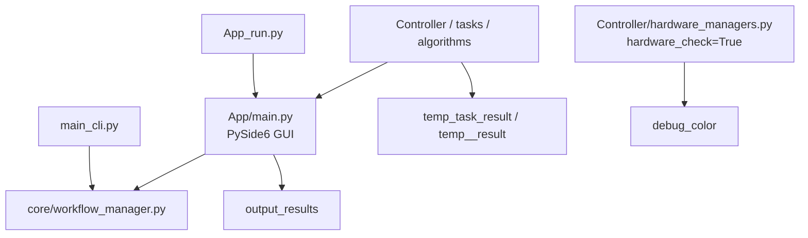

|                                                       |     |
| ----------------------------------------------------- | --- |
| [[#### 一些不清楚的資料夾檔案]]                                  |     |
| [[#### 整理目前App main.py如果有儲存images or 其他files的功能有哪幾種]] |     |
|                                                       |     |
|                                                       |     |
|                                                       |     |


```
請介紹在repo folder的files(譬如AGENTS.md, main_cli.py等..), 以及這幾個folder  
debug_color, helper, output_results, temp__results, temp_task_result的作用是甚麼? 跟App main.py有甚麼關係, 或是否建議移除或移動到其他folder
```
#### 一些不清楚的資料夾檔案
這個 repo 的主要入口有三個；真正的 App 主程式是 `App/main.py`，不是根目錄的 `main.py`。

````

````


根目錄重要檔案：

| 檔案                     | 作用                                                                       | 與 App 的關係                                         |
| ---------------------- | ------------------------------------------------------------------------ | ------------------------------------------------- |
| AGENTS.md              | 開發規範與本次「一個 watch point 支援多張影像＋可選 HDR」重構目標。                               | 不會被程式執行，是給開發者／代理人看的。                              |
| App_run.py             | GUI 正式啟動器；設定 Qt 高 DPI，建立 `QApplication`，載入 `App/main.py` 的 `MainWindow`。 | 執行 GUI 時應優先使用它。                                   |
| App/main.py            | PySide6 主視窗、UI 互動、拍攝流程協調、部分分析／輸出功能。                                      | App 的核心。它與 `core/workflow_manager.py` 共用工作流能力。    |
| main_cli.py            | 命令列入口；支援 `run_routine`、`manual_capture`、`create_template`、同步等。           | 不啟動 GUI，但同樣呼叫 `WorkflowManager`；可視為 App 的無介面操作路徑。 |
| remote_run.py          | 根據設定作為 AWS IoT agent 或遠端控制 client。                                       | 與 App 平行，主要供遠端控制／硬體端部署使用。                         |
| stitch_frontwatch.py   | 獨立 OpenCV 影像拼接實驗／工具。                                                     | 不由 `App/main.py` 直接呼叫。適合移入 `tools/` 或 `scripts/`。 |
| setup_global_admins.py | 管理員資料初始化／設定工具。                                                           | App 的支援腳本。                                        |
| ui_object_finder.py]   | 協助檢查 Qt `.ui` 與產生的 `ui_main.py` 控件名稱。                                    | 開發工具，不是正式執行期依賴。                                   |

重要目錄大致分工：

- `App/`：GUI、Qt Designer UI、視覺資產與 App 模組。
- `core/`：共用業務流程；`WorkflowManager` 是 GUI 和 CLI 的共同核心。
- `Controller/`：相機、Zaber 等硬體控制，以及不少硬體測試 UI。
- `DB/`、`data_manager/`：SQLite、模板、雲端資料存取與同步。
- `tasks/`、`algorithms/`：分析任務的 CLI wrapper 與影像演算法。
- `config/`：系統、硬體、CLI、報表等 YAML 設定。
- `cloud_relay/`：AWS IoT／雲端命令中繼。
- `tests/`：自動化測試。
- `assets/`、`checkpoints/`、`Local_Data/`：大型資產、模型、在地資料；目前多數被 `.gitignore` 排除。

你特別問的資料夾：

|資料夾|實際用途|與 `App/main.py` 關係|建議|
|---|---|---|---|
|`debug_color/`|硬體相機 Bayer 解碼後的除錯截圖。目前有 `macro_cam_1_after_decode.png`。|間接相關：[`Controller/hardware_managers.py:1305`](D:\Provenance Project\ImagingLibWatch\Controller\hardware_managers.py:1305) 在 `checking.hardware_check=True` 時會寫入。|可清空舊圖，但不要直接移除目錄或改名，除非同步修改寫入路徑。建議移為 `artifacts/debug/color/`，並加入 gitignore。|
|`helper/`|開發輔助工具。`collectCode.py` 依 `collect_file.yaml` 合併指定原始碼成 `code.txt`，通常為交付／人工審閱用途。|無執行期關係。|保留，但建議改名／移到 `tools/dev/`；`code.txt` 是產物，應忽略或不納入版本控制。|
|`output_results/`|較偏「可保留結果」：元件辨識 JSON、材料分析資料、Keyence map、Strap Macro1 測試 run manifest。|有直接關係：[`App/main.py:10686`](D:\Provenance Project\ImagingLibWatch\App\main.py:10686) 的材料分析 fallback 會寫入 `material_db`；[`App/main.py:25814`](D:\Provenance Project\ImagingLibWatch\App\main.py:25814) 會寫入 component results。其他子目錄多來自 `Controller/test_hardware` 工具。|不建議直接刪除或整個移走。可改為 `artifacts/results/`，但需要先把 App 和測試工具中的硬編碼路徑一起改掉。也應明確決定哪些結果是測試 fixture、哪些只是歷史產物。|
|`temp__result/`|注意實際名稱是 `temp__result`，不是 `temp__results`。目前為 features 分析的 heatmap、overlay、JSON 等暫存結果。|非 App 主程式直接使用；[`tasks/cli_wrappers/run_features_cli.py:97`](D:\Provenance Project\ImagingLibWatch\tasks\cli_wrappers\run_features_cli.py:97) 預設寫入此處。|可安全清理內容；目錄被 `.gitignore` 排除。建議修正命名為 `temp_task_result/features/`，但這是需改程式路徑的相容性變更。|
|`temp_task_result/`|各分析 CLI 的預設工作目錄，例如 OCR、拼接、dial、lume、movement 等。現有資料約數百 MB，主要是 `stitched_band`。|間接相關：App 若以 subprocess／任務 wrapper 執行分析，任務會寫這裡；`App/main.py` 本身沒有直接寫入這個根路徑。|可以清理舊執行結果；保留目錄與命名，因為至少二十個 task wrapper 以它作預設輸出。已被 `.gitignore` 排除，方向正確。|

結論：

- `debug_color/`、`temp__result/`、`temp_task_result/` 都是可再生成的執行／除錯產物；可清理其內容。
- `output_results/` 是混合型資料夾：部分是 App 產出，部分是硬體測試結果。先分類再移動，不宜直接刪除。
- `helper/` 是開發工具，與正式 App 無關，適合移到 `tools/dev/`。
- `temp__result` 的雙底線命名明顯不一致；長期應合併到 `temp_task_result`。
- `debug_color` 和 `output_results` 目前有已追蹤檔案；若改成純 runtime artifacts，應先確認不需要保留作測試樣本，再調整 `.gitignore` 與路徑。


#### 整理目前App main.py如果有儲存images or 其他files的功能有哪幾種
```
請幫我整理目前App main.py如果有儲存images or 其他files的功能有哪幾種? 是存到哪個folder? 那其他的yaml or txt or log檔案是儲存到哪個檔案? 或者還有甚麼其他files是存到哪裡呢?
```

已完成盤點。以目前設定來看，App 的主要資料根目錄是：

`D:\Provenance Project\ImagingLibWatch\Local_Data`

來源是 [system_config.yaml (line 85)](D:/Provenance Project/ImagingLibWatch/config/system_config.yaml:85) 的：

```
paths:
  base_data_dir: ./Local_Data
```

相對路徑會固定從專案根目錄解析，不受啟動 App 時的 working directory 影響。

## 1. 正式拍攝影像

|功能|實際儲存位置|備註|
|---|---|---|
|Standard capture|`Local_Data\<WatchID>\Raw\<UUID>.png`|檔名會改成 32 字元 UUID|
|HDR 融合結果|`Local_Data\<WatchID>\Raw\<UUID>.png`|DB metadata 的 `asset_role=hdr_fused`|
|Sidepoint 額外角度原圖|`Local_Data\<WatchID>\Raw\<UUID>.png`|每個角度各自存檔|
|Remote manual capture 下載|`Local_Data\<WatchID>\Raw\<S3檔名>`|從 S3 下載至 Raw|
|Capture 暫存|`Local_Data\temp\tmp_<id>.png`|正式儲存時會被搬到 Raw，正常情況不會保留|

主要路徑定義在 [local_storage.py (line 224)](D:/Provenance Project/ImagingLibWatch/data_manager/local_storage.py:224)，App 寫入流程在 [main.py (line 27096)](D:/Provenance Project/ImagingLibWatch/App/main.py:27096)。

也就是目前一個 Watch Point 如果有多個 Standard capture 或 HDR capture，每個 capture 都會成為一個獨立的 UUID 影像檔，不會使用 Watch Point 名稱當實體檔名；Watch Point、Capture ID、Standard/HDR 等資料存在 SQLite metadata 中。

另一套 Core Workflow 的 V3 asset 路徑是：

```
Local_Data\<WatchID>\runs\<RunID>\
  views\<ViewName>\
  points\<PointName>\
  captures\<CaptureID>\
  <UUID>.png
```

定義在 [local_storage.py (line 365)](D:/Provenance Project/ImagingLibWatch/data_manager/local_storage.py:365)。

## 2. 分析結果

每次 App 執行分析會建立：

```
Local_Data\<WatchID>\Analysis\
  Exp_YYYYMMDD_HHMMSS_<8字元ID>\
```

定義在 [local_storage.py (line 231)](D:/Provenance Project/ImagingLibWatch/data_manager/local_storage.py:231)。

這個資料夾內可能包含：

- 演算法輸出的 `.json`
- 演算法報告 `.yaml` / `.yml`
- Mask、overlay、crop、stitched image 等 `.png` / `.jpg`
- `watchshift_<ViewName>.json`
- `material_records.json`
- `report_identifiers_<WatchID>.json`
- `front_template_suggestion_ocr_report.json`
- `front_stitch_report.json`
- Sidepoint 子資料夾，例如：

```
sidepoint_sidepoint1_std_1\
  angle_inputs\
  sidepoint_report.json
  <overlay / stitched / analysis images>
```

因為實際輸出檔名由各個 analysis task 決定，所以不是只有一組固定檔名。App 會掃描新增的檔案，將路徑、task、S3 key 註冊進 SQLite，流程在 [main.py (line 22494)](D:/Provenance Project/ImagingLibWatch/App/main.py:22494)。

## 3. Camera pipeline TXT 報告

每張正式影像拍完後，App 還會存一份實際 Camera、Exposure、Autofocus、HDR、XYZ、燈光與輸出路徑紀錄：

```
Local_Data\<WatchID>\CameraPipelineReports\
  <timestamp>_app_main_camera_pipeline_<View>_<Point>_<Capture>_standard.txt
  <timestamp>_app_main_camera_pipeline_<View>_<Point>_<Capture>_hdr.txt
```

路徑定義在 [main.py (line 25055)](D:/Provenance Project/ImagingLibWatch/App/main.py:25055)，TXT 寫入在 [camera_pipeline_report.py (line 116)](D:/Provenance Project/ImagingLibWatch/core/camera_pipeline_report.py:116)。

## 4. Template 建立影像

### 一般 TemplateScratch

Template 建立過程確認保存的 top view、point image 等會存到：

```
Local_Data\<TemplateName>\TemplateScratch\
  <View>_<PointName>_<CaptureID>.png
```

例如：

```
Local_Data\Rolex_116610_Black_Dial\TemplateScratch\
  Front_toppoint1_std_1.png
  Front_micropoint1_std_1.png
```

定義在 [main.py (line 5250)](D:/Provenance Project/ImagingLibWatch/App/main.py:5250)。

### Template 五面預拍暫存

Front、Side1～Side4 等預拍會先存：

```
Local_Data\create_template_img\
  template_create_front.jpg
  template_create_side1.jpg
  template_create_side2.jpg
  template_create_side3.jpg
  template_create_side4.jpg
```

這整個資料夾會在正常關閉 App 時刪除，見 [main.py (line 3087)](D:/Provenance Project/ImagingLibWatch/App/main.py:3087)。

### Strap pre-capture／stitch

Strap 213 → 217 流程先建立臨時 session：

```
Local_Data\temp\strap_precapture\
  <timestamp>_<sessionID>\
```

其中可能包含：

```
macro_cam_1_raw_scan\
  front\
    front_tile_001_x_....png
    macro_cam_1_front_contact_sheet.png
    macro_cam_1_front_stitched.png
    front_manifest.yaml
    watchband_stitch_..._report.json
  side\
  back\
  9clock\

strap_stitch\
  StrapRightSide_front_stitched.png
  StrapRightSide_side_stitched.png
  StrapRightSide_back_stitched.png
  watchband_stitch_<group>_report.json

StrapRightSide_stitched_overview_stitched.png
StrapRightSide_stitched_overview_stitched_metadata.json
<processID>_take_image_autofocus_stitch_process.yaml
```

若 Template 完整保存，整個 session 會被搬到：

```
Local_Data\<TemplateName>\TemplateScratch
```

若流程沒有完成，session 會留在 `Local_Data\temp\strap_precapture`，不會自動刪除，以避免拍攝資料遺失。相關邏輯在 [main.py (line 5285)](D:/Provenance Project/ImagingLibWatch/App/main.py:5285)。

`template_create_config.yaml` 裡另有 fallback：

```
Local_Data\StrapPreCapture\TemplateScratch
```

但目前正常的 213 → 217 session 會優先寫入上述 session folder。

## 5. WatchShift 參考影像

每個 Template、View 的 WatchShift 基準圖存到：

```
DB\watchshift\<TemplateID>\
  Front.toppoint1.png
  Back.toppoint1.png
  OpenBack.toppoint1.png
  OpenBackCrown.toppoint1.png
  StrapRightSide.toppoint1.png
  Box.toppoint1.png
```

定義在 [internalnum_config.py (line 1704)](D:/Provenance Project/ImagingLibWatch/DB/templates/internalnum_config.py:1704)。

每次 WatchEntry 的校正結果則存到當次 Analysis：

```
Local_Data\<WatchID>\Analysis\<ExpID>\watchshift_<View>.json
```

## 6. Material／XRF 檔案

### 外部 XRF CSV

App 只讀取使用者選取的 XRF folder；如果未選擇，預設是：

```
D:\Moonlight\xrf_data\Vanta\exports
```

原始 CSV 不會被搬走或複製。

### Material session JSON

正常有 WatchEntry 時：

```
Local_Data\<WatchID>\Analysis\<ExpID>\material_records.json
```

沒有 WatchEntry／Analysis session 時才 fallback 到：

```
output_results\material_db\material_records.json
```

路徑邏輯在 [main.py (line 9505)](D:/Provenance Project/ImagingLibWatch/App/main.py:9505)。

### Material marker 圖片

目前設定是：

```
Local_Data\material_markers\
  material_marker_<internalnum1>.jpg
```

來自 [template_create_config.yaml (line 532)](D:/Provenance Project/ImagingLibWatch/config/template_create_config.yaml:532)。

## 7. PDF 與報告檔

|功能|儲存位置|
|---|---|
|Finish Watch Entry 自動 PDF|`Local_Data\<WatchID>\Reports\PDF\Moonlight_Inspection_<WatchID>_<timestamp>_<id>.pdf`|
|手動 Export PDF|由使用者在 Save dialog 自選位置|
|PDF identifier JSON|最新的 `Analysis\<ExpID>\report_identifiers_<WatchID>.json`|
|PDF 暫時壓縮圖片|Windows `%TEMP%`，PDF 完成後刪除|

自動 PDF 路徑在 [main.py (line 24314)](D:/Provenance Project/ImagingLibWatch/App/main.py:24314)。

## 8. SQLite 資料庫

App 的主要本地資料庫是：

[DB/watchDB.db](D:/Provenance Project/ImagingLibWatch/DB/watchDB.db)

目前檔案約 359 MB。裡面包含：

- Template JSON payload
- WatchEntry／Final Report metadata
- Watch metadata
- Raw image index與 metadata
- Experiment result 路徑
- UI asset registry
- Run、Point instance、Capture instance
- 多張 image asset 資料
- Account／同步狀態

重要的是：目前 Template 不是另存成 YAML；按 Save Template 時是存進 `watchDB.db`，並嘗試同步 DynamoDB。程式在 [main.py (line 10830)](D:/Provenance Project/ImagingLibWatch/App/main.py:10830)。

## 9. Log 與稽核檔案

|類型|儲存位置|
|---|---|
|Audit log|`Local_Data\audit_logs\audit_YYYY-MM-DD.jsonl`|
|Runtime performance|`Local_Data\runtime_logs\runtime_performance_YYYYMMDD.jsonl`|
|Strap motion safety log|`DB\strap_motion_logs\strap_motion_<timestamp>_<id>.yaml`|
|Console／UI Hardware、Data、DB、AWS 訊息|只輸出到 console/UI，沒有一般 `.log` 檔|

Audit log 定義在 [audit_logger.py (line 22)](D:/Provenance Project/ImagingLibWatch/logging_system/audit_logger.py:22)；runtime log 定義在 [workflow_manager.py (line 62)](D:/Provenance Project/ImagingLibWatch/core/workflow_manager.py:62)。

Audit log 的簽章 key 位於：

```
config\keys\hmac.key
```

目前設定未開啟 audit field encryption，所以 `fernet.key` 不會被使用或自動產生。

## 10. 其他零散輸出與快取

|功能|儲存位置|
|---|---|
|Component 判斷結果|`output_results\component_results_<timestamp>.json`|
|Component gallery 縮圖快取|`Local_Data\component_thumbnails\<SHA256>.jpg`|
|Remote preview 暫存|`Local_Data\temp_preview.jpg`，重複覆寫|
|Gold standard identifiers|`DB\goldstand_identifiers.json`|
|舊版 Gold standard metrics|`DB\goldstand_result.json`|
|加密圖片檢視暫存|Windows `%TEMP%`，使用完刪除|

## YAML 設定檔是否會被 App 修改？

目前 `main.py` 對 `config` 下的 YAML 基本上只有讀取，沒有把操作結果寫回這些設定檔，例如：

- `config/system_config.yaml`
- `config/App_config.yaml`
- `config/hardware_config.yaml`
- `config/internalnum_config.yaml`
- `config/template_create_config.yaml`
- `config/strap_macro_cam1_scan.yaml`
- `config/watchband_stitch.yaml`
- `config/pdf_config.yaml`
- 各 analysis task 的 `*_config.yaml`

動態產生的 YAML 主要只有：

- Strap process YAML
- Strap view manifest YAML
- Strap motion audit YAML
- 部分 analysis task report YAML

它們會存到 `TemplateScratch`、Strap session、`DB\strap_motion_logs` 或當次 `Analysis\Exp_...`，不會存回 `config`。

最後一個值得注意的地方：大部分資料會跟著 `base_data_dir`，但 `DB\watchDB.db`、`DB\watchshift`、`DB\strap_motion_logs`、`output_results`，以及目前 hard-code 的 component thumbnail folder 不受 `base_data_dir` 控制。因此如果未來把 `base_data_dir` 改到別的硬碟，資料仍會分散在這幾個位置。

